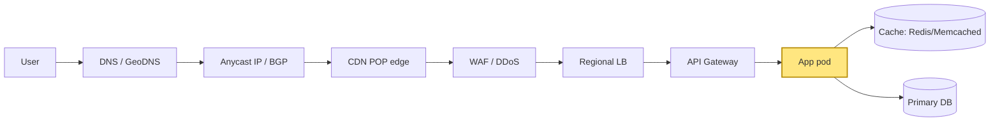
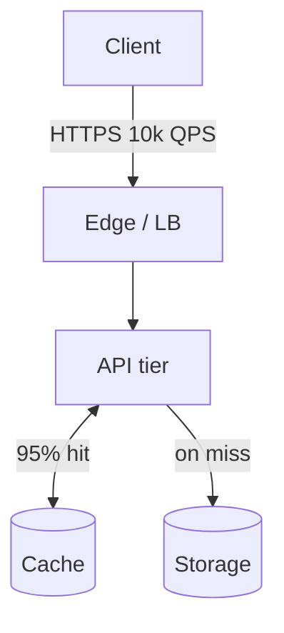

# HLD Note Entry Template

Every entry in `Notes/hld-notes.md` follows this structure. **New entries are inserted at the top of the file, immediately after the file header** — the newest entry is always the first thing you see. Prior entries are append-only (never edited); they scroll downward as new ones land.

Sections are **all mandatory** unless explicitly marked conditional. The depth contract for the Deep-dive section is non-negotiable — see `docs/superpowers/specs/2026-05-22-design-skills-architecture.md` §8.

Total target length: **~350 lines per entry** (250 lines in 2 Deep dives, ~100 lines in surrounding sections).

---

## [YYYY-MM-DD] {ID} · {Short Title} · {company-tags}

- {Deep-dive 1 topic — short phrase}
- {Deep-dive 2 topic — short phrase}
- {Headline bottleneck or trade-off}

### Problem (as asked)

Quote the catalog `ask` field verbatim — this is what the interviewer says, not your paraphrase.

**Clarifying questions to ask back before drawing anything** (numbered list of 5):
1. {Question about scale: QPS, payload, retention}
2. {Question about consistency vs availability bias}
3. {Question about access pattern: read-heavy, write-heavy, mixed}
4. {Question about multi-tenancy / isolation}
5. {Question about failure tolerance: region-level, AZ-level}

### Back-of-envelope

Show the arithmetic. This section filters mid-tier from staff-tier candidates.

```
QPS:         {derivation}
Payload:     {derivation}
Storage/yr:  {derivation}
Memory:      {derivation}
Bandwidth:   {derivation}
Cost ballpark: {derivation}
```

### Functional / Non-functional requirements

Two-column table. NFRs are the trade-off levers for everything that follows.

| Functional | Non-functional |
|---|---|
| {must-have feature 1} | {p99 latency target} |
| {must-have feature 2} | {availability target} |
| {must-have feature 3} | {consistency model} |
| {must-have feature 4} | {durability guarantee} |

### API contract

Sketch the external interface — the boundary the rest of your design sits behind.

```
POST /resource           { idempotency_key, payload } -> { id, status }
GET  /resource/:id                                    -> { resource | 404 }
GET  /resource?cursor=…&limit=…                      -> { items[], next_cursor }
```

Notes on idempotency, streaming, batching, auth — only if they shape the rest of the design.

### Data model

What persists, what's ephemeral. Schema sketch (table form for relational, struct/document form for NoSQL).

```
Primary table: resource
  id          (uuid, PK)
  owner_id    (uuid, FK, index)
  created_at  (timestamp, index for time-range queries)
  payload     (jsonb)

Secondary index: by_owner_created (owner_id, created_at desc)
```

Call out the access patterns this schema serves and which it doesn't.

### Request-path layering (where this component lives)

The **first diagram** of every HLD note. Draw the full request path and highlight the component this note is about. Reader must always be able to point at a box and say "this is the layer we're discussing."



**Where this concern lives** (the 2–4 viable enforcement points + trade-off):

| Layer | Sees | Latency cost | Blast radius | Best for |
|---|---|---|---|---|
| {Edge / CDN} | {IP, SNI, JA3} | {<1ms} | {global} | {coarse abuse} |
| {API gateway} | {+ user_id, route} | {1-3ms} | {regional} | {cross-cutting tenant limits} |
| {App middleware} | {+ payload, business ctx} | {2-5ms} | {per-service} | {per-endpoint business rules} |
| {DB / downstream} | {+ row-level intent} | {5-15ms} | {per-table} | {last-line cost protection} |

### Architecture

ONE Mermaid diagram, ≤8 boxes, every arrow labeled with what flows and at what rate. **ASCII boxes-and-arrows are banned** — Obsidian renders Mermaid natively.



Annotate where each NFR is satisfied (or punted).

### Deep dive — 2 mechanisms, ~120 lines each

Pick the 2 mechanisms most likely to be drilled. For each, follow the **6-subsection depth contract** — no skipping, no abbreviation.

#### Deep dive 1: {mechanism name}

**1. Why does this mechanism exist?**
Problem before. The alternative that was rejected. The constraint that forced this design.

**2. Walk it concretely.**
A **Mermaid state diagram or sequence diagram** + numbered steps with a specific scenario (named nodes, values, timestamps). No abstract descriptions, no ASCII boxes.

For algorithmic mechanisms, the state diagram MUST show the data structure mutating across at least 3 successive requests (the integers / bytes / pointers visibly changing). Big-O claims must name the data-structure operation: "O(log N) — skip-list insert", not bare "O(log N)".

```mermaid
{state or sequence diagram showing the mechanism's data evolving}
```

```
{worked scenario with named entities — integers/bytes changing step by step}
```

**3. The cost you're accepting.**

| Property gained | Cost paid |
|---|---|
| {what this gives you} | {what it gives up} |
| ... | ... |
| ... | ... |

**4. Failure modes the interviewer will drill into.**

| Failure | What goes wrong | Mitigation |
|---|---|---|
| {Q1: what if X crashes?} | {what breaks} | {what saves you} |
| {Q2: what if partition lasts longer than ...} | ... | ... |
| {Q3: ...} | ... | ... |
| {Q4: ...} | ... | ... |

**5. How to derive it in an interview from first principles.**

1. State the trade-off.
2. {next step}
3. {next step}
4. {next step}
5. {next step}
6. You've derived {mechanism} without quoting the paper.

**6. Where this shows up in production.**

- **{Named system 1}**: {specific behavior + numbers}
- **{Named system 2}**: {specific behavior + numbers}
- **{Named system 3}**: {specific behavior + numbers}

#### Deep dive 2: {mechanism name}

[Same 6-subsection structure as Deep dive 1.]

### Bottlenecks + scaling levers

Where does this system break at 10x? 100x? What's the lever for each?

| Scale point | First bottleneck | Lever |
|---|---|---|
| 10x QPS | {component} | {what you'd do} |
| 100x QPS | {component} | {what you'd do} |
| 10x data | {component} | {what you'd do} |

### Trade-off matrix

3×N table for the key design decision in this problem.

| Option | Latency | Cost | Complexity | Consistency |
|---|---|---|---|---|
| {Option A} | ✅ | ❌ | ✅ | ❌ |
| {Option B} | ❌ | ✅ | ✅ | ✅ |
| {Option C — chosen} | ✅ | ✅ | ❌ | ✅ |

Mark which you'd choose and why.

### Common follow-ups

The 5 "what if" questions you should pre-empt — answer each in 2–3 lines.

1. **{Follow-up 1}** — {answer}
2. **{Follow-up 2}** — {answer}
3. **{Follow-up 3}** — {answer}
4. **{Follow-up 4}** — {answer}
5. **{Follow-up 5}** — {answer}

### What top-tier looks for

The signal an L5+ interviewer is grading on, vs the mid-tier baseline.

- **Mid-tier says**: {generic answer pattern}
- **Staff-tier says**: {derivation-based answer + named alternative + named cost}

Why the difference: {one-paragraph synthesis of what depth means here}.

### Diagnostic questions (self-quiz)

5 questions you should be able to answer cold. Each has a one-line wrong-answer interpretation — the thing a weak answer would say.

1. **{Q}** — wrong: {weak answer pattern}
2. **{Q}** — wrong: {weak answer pattern}
3. **{Q}** — wrong: {weak answer pattern}
4. **{Q}** — wrong: {weak answer pattern}
5. **{Q}** — wrong: {weak answer pattern}

---

## Title format

```
## [YYYY-MM-DD] {ID} · {Short Title} · {company-tags}
```

- **ID**: `H01` through `H45` — immutable; the row identifier in `Problems/hld.json`
- **Short Title**: 2–6 words. A handle, not a sentence.
- **Company-tags**: bold the **signature** company if one exists. Format: `Anthropic, Google` or `**Anthropic** · Google`.

## Visual + depth contract (carried forward from /study-today)

- Tables and diagrams over prose wherever a comparison/structure/flow is being explained.
- **All diagrams are Mermaid blocks**. ASCII boxes/arrows are banned (Obsidian renders Mermaid natively). Reserved exception: byte-layout / Redis key schema / wire-format *data* stays as fenced code.
- When a low-level concept appears (KV cache memory layout, packet header format, syscall path, bytes-on-wire, lock implementation), **stop and teach it in detail**.
- Deep-dive Mechanics sections look like: short framing → diagram → short interpretation → table → worked example → short synthesis. Walls of prose in Mechanics are a regression.

## Property-claim contract

Every property assertion ("Redis is single-threaded", "Lua is atomic", "Anycast routes to nearest POP", "TCP is reliable") needs three parts:

1. **Mechanism** — why true at the implementation level (event loop, kernel queue, BGP path selection, sliding window + retransmit).
2. **Upside** — what this property buys you (atomic ops, no locks, predictable p99).
3. **Downside** — when this property bites (slow command HoL-blocks, no SMP scaling, hot key saturates one core).

One-sided assertions ("Redis is single-threaded so it's fast") are mid-tier. Both faces is staff-tier.

## Cross-cutting concern framing

For notes covering rate limiting, auth, caching, retries, timeouts, back-pressure: open the deep dive with the cost-of-service / unit-economics framing — these limits encode business cost per call, not arbitrary engineering choices. The variability is economic.

## Sections removed (do not reintroduce)

- ~~TL;DR~~ — the 3-bullet preview list under the title replaces it.
- ~~See also~~ — cross-references go inline in prose when load-bearing (e.g., "this is the same fan-out pattern from DDIA Ch.11").
