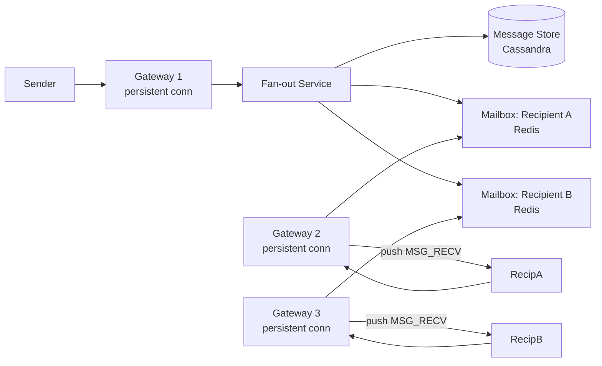
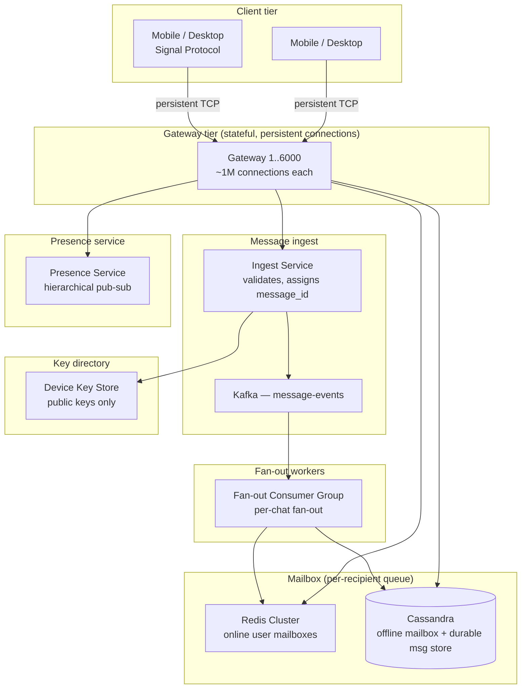
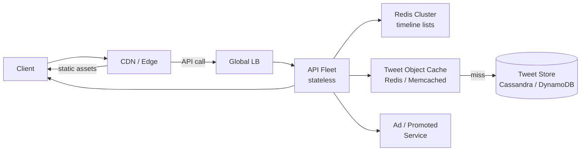
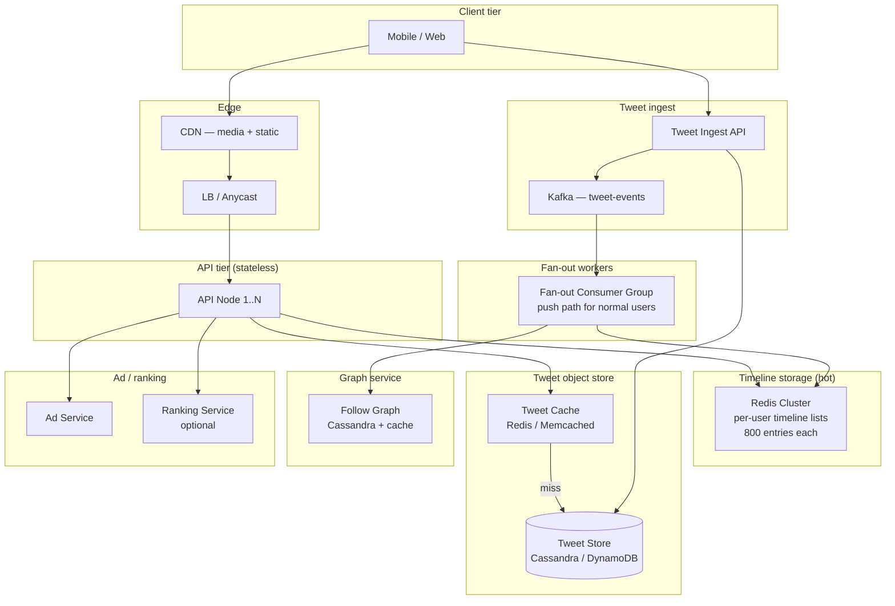
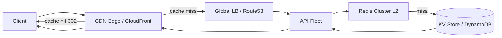
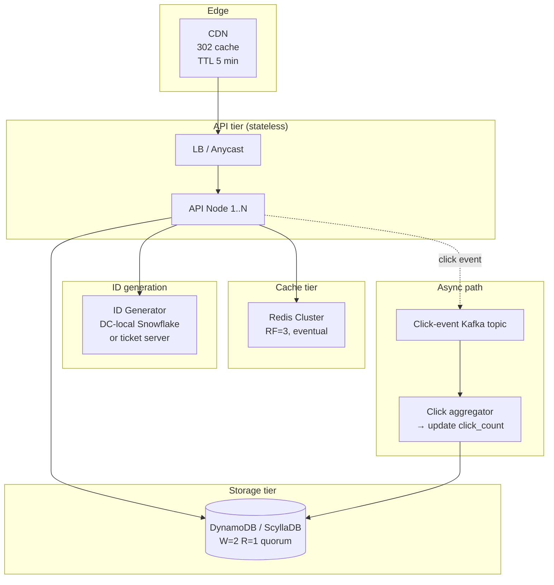

# HLD Reference Notes

---

## [2026-08-07] H03 · WhatsApp Messaging

### Problem as asked

> Design WhatsApp. 2B users, 100B messages/day, p99 delivery latency under 1s. Support 1-to-1 and group chats up to 1024 members. Online/offline presence, read receipts, and end-to-end encryption.

### Clarifying questions

| # | Question | Assumed answer |
|---|---|---|
| 1 | Protocol? | Custom binary over persistent TCP (XMPP-inspired but proprietary); mobile clients use long-lived sockets, web clients use WebSocket |
| 2 | Message types? | Text, image, video, voice note, document, location, contact — all encrypted payloads; media uploaded separately to object store, message carries reference |
| 3 | Delivery semantics? | At-least-once to recipient's device; server marks "delivered" when device ACKs; "read" when user opens chat |
| 4 | Offline delivery? | Server stores undelivered messages (encrypted) for up to 30 days; on reconnect, device pulls pending messages in order |
| 5 | Group chat fan-out? | Server fan-out: sender pushes once, server replicates to each group member's mailbox (up to 1024 members) |
| 6 | E2E encryption model? | Signal Protocol: per-device Curve25511 identity keys + per-conversation Double Ratchet session keys; server never sees plaintext |
| 7 | Presence granularity? | Online / offline / last-seen timestamp; no typing indicators in scope |
| 8 | Multi-device? | Yes — a user has N devices (phone + desktop); each has its own device key; message encrypted to all active devices |
| 9 | Message size limit? | 16 KB text; media up to 100 MB (uploaded out-of-band) |
| 10 | Ordering guarantee? | Per-conversation total order: messages in a 1-to-1 chat or group chat must be displayed in the order the sender(s) sent them, even across multiple senders |

### Back-of-envelope estimates

```
Users:             2B
Messages:          100B / day ≈ 1.16M /s avg; peak 3× → ~3.5M /s
Fan-out (groups):  assume 30% of messages are to groups, avg group size 20
                   30B msgs/day × 20 recipients = 600B fan-out deliveries/day ≈ 6.9M /s
                   This is the dominant load — 6× the ingest rate.

Persistent connections:
  2B users × avg 1.5 devices = 3B concurrent connections
  Each server handles ~1M connections (Erlang/Go with epoll/kqueue)
  → 3,000 gateway servers minimum; 2× headroom → 6,000

Storage growth:
  100B msgs/day × 200 bytes/msg (encrypted ciphertext + metadata) = 20 TB/day
  30-day retention for offline delivery → 600 TB hot store
  After 30 days: archived or deleted (WhatsApp deletes after delivery + retention)

Read path (message delivery to online recipient):
  1. Sender → gateway: 1 RTT, ~50 ms (mobile uplink)
  2. Gateway → fan-out → recipient's mailbox (in-memory or Redis): ~5 ms
  3. Gateway → recipient's persistent connection: push, ~50 ms (mobile downlink)
  Total: ~100-200 ms one-way; well under 1 s p99.

Write path (persist + fan-out):
  1. Persist to message store: ~5 ms
  2. Fan-out to N recipients' mailboxes: N × ~1 ms (pipelined)
  For group of 1024: ~1 s fan-out — acceptable since async, sender doesn't wait.

Presence:
  2B users × status change ~5×/day = 10B presence events/day ≈ 115k /s
  Fan-out to followers: assume avg 50 contacts watching → 500B presence deliveries/day
  Solution: hierarchical pub-sub, not broadcast.
```

### Functional requirements

- `CONNECT` — client opens persistent connection, authenticates (Noise handshake + account token), registers device key.
- `SEND_MESSAGE` — client sends encrypted payload to a chat (1-to-1 or group). Server assigns monotonic message ID, persists, fan-out to recipients.
- `RECEIVE_MESSAGE` — server pushes to recipient's active connection; if offline, queues in mailbox.
- `ACK_DELIVERY` — recipient's device ACKs receipt; server marks "delivered" (two grey ticks).
- `ACK_READ` — recipient opens chat; client sends read receipt; server marks "read" (blue ticks).
- `SYNC` — on reconnect, client requests messages since last-seen message ID; server delivers in order.
- `SET_PRESENCE` — client sends online/offline; server propagates to contacts.
- `GET_PRESENCE` — client subscribes to contact's presence updates.

### Non-functional requirements

| Requirement | Target | Mechanism |
|---|---|---|
| Delivery latency p99 (online→online) | < 1 s | Persistent connections; in-memory mailbox; push-based |
| Connection density | 3B concurrent | Erlang/Go gateway; epoll/kqueue; minimal per-connection memory |
| Message durability | No lost messages | Write-ahead log; synchronous replication to 1 follower before ACK to sender |
| Ordering | Per-conversation total order | Monotonic message IDs per chat; server-assigned, not client-assigned |
| E2E encryption | Server never sees plaintext | Signal Protocol; server routes ciphertext only |
| Availability | 99.99% | Multi-AZ gateways; replicated message store; connection migration on gateway failure |
| Group fan-out | 1024 members × 3.5M msgs/s × 30% = ~1B deliveries/s | Async fan-out workers; batched mailbox writes |

### API / protocol contract

```
Protocol: persistent binary TCP (port 443, TLS-wrapped Noise handshake)

Frame format:
  [ 4-byte length | 1-byte type | payload ]

Types:
  0x01  HELLO        → client authenticates, registers device key
  0x02  HELLO_ACK    → server returns session token, pending message count
  0x03  MSG_SEND     → { chat_id, encrypted_payload, sender_device_id, client_timestamp }
  0x04  MSG_RECV     → { chat_id, message_id, encrypted_payload, sender_id, server_timestamp }
  0x05  MSG_ACK      → { chat_id, message_id }  (delivery receipt)
  0x06  MSG_READ     → { chat_id, message_id }  (read receipt)
  0x07  PRESENCE_SET → { status: online|offline, last_seen? }
  0x08  PRESENCE_UPDATE → { user_id, status, last_seen? }
  0x09  SYNC_REQUEST → { chat_id, after_message_id }
  0x0A  SYNC_RESPONSE → [ { message_id, encrypted_payload, ... } ]
  0x0B  PING/PONG    → keepalive every 30 s

Media flow (out-of-band):
  1. Client uploads media to object store (HTTPS) → gets media_id + encryption key
  2. Client sends MSG_SEND with payload = { media_id, encrypted_key, thumbnail }
  3. Recipient receives MSG_RECV → downloads media from object store → decrypts with embedded key
```

### Data model

```
┌──────────────────────────────────────────────────────────────┐
│ Table: messages                                              │
├──────────────────┬───────────────────────────────────────────┤
│ chat_id (PK)     │ BYTES  (hash of participant set for 1:1)  │
│ message_id (CK)  │ BIGINT  (monotonic per chat, server-assign│
│ sender_id        │ BIGINT                                    │
│ sender_device_id │ BIGINT                                    │
│ encrypted_payload│ BYTES  (Signal-encrypted, ≤16 KB)         │
│ server_timestamp │ TIMESTAMP                                 │
│ media_ref        │ NULLABLE → object store                   │
│ ttl              │ INT  (30 days default)                    │
└──────────────────┴───────────────────────────────────────────┘
Partition key: chat_id (hash)
Clustering: message_id ASC → range scan for SYNC is efficient.
Storage: Cassandra / ScyllaDB; 600 TB at 30-day retention.

┌──────────────────────────────────────────────────────────────┐
│ Table: mailbox (per-recipient undelivered queue)             │
├──────────────────┬───────────────────────────────────────────┤
│ recipient_id (PK)│ BIGINT                                    │
│ chat_id          │ BIGINT                                    │
│ message_id       │ BIGINT                                    │
│ delivered        │ BOOLEAN                                   │
│ created_at       │ TIMESTAMP                                 │
└──────────────────┴───────────────────────────────────────────┘
Storage: Redis (hot, online users) + Cassandra (cold, offline).
Key schema: "mb:<recipient_id>" → sorted set, score = message_id.
Max entries per user: unbounded until delivery or 30-day TTL.

┌──────────────────────────────────────────────────────────────┐
│ Table: chats                                                 │
├──────────────────┬───────────────────────────────────────────┤
│ chat_id (PK)     │ BYTES                                     │
│ chat_type        │ ENUM (one_to_one, group)                  │
│ members          │ SET<BIGINT>  (user_ids)                   │
│ group_name       │ NULLABLE VARCHAR                          │
│ last_message_id  │ BIGINT                                    │
│ created_at       │ TIMESTAMP                                 │
└──────────────────┴───────────────────────────────────────────┘

┌──────────────────────────────────────────────────────────────┐
│ Table: device_keys (for E2E encryption)                      │
├──────────────────┬───────────────────────────────────────────┤
│ user_id (PK)     │ BIGINT                                    │
│ device_id        │ BIGINT                                    │
│ identity_key     │ BYTES  (Curve25519 public key)            │
│ signed_prekey    │ BYTES                                     │
│ one_time_prekeys │ LIST<BYTES>  (batch of 100, replenished)  │
│ last_seen        │ TIMESTAMP                                 │
└──────────────────┴───────────────────────────────────────────┘
Server stores ONLY public keys; private keys never leave device.
```

### Request-path layering (message send)



### Architecture diagram



### Deep dive 1 — Message ordering across multiple senders to the same recipient

#### 1. Why does this mechanism exist?

A recipient's mailbox receives messages from multiple senders (1-to-1 chats, group chats). The client must display messages in a **per-conversation total order** that all participants agree on. If Alice and Bob both send messages to Charlie's group chat simultaneously, Charlie must see them in a consistent order — and so must every other group member.

The naive approach — let each sender assign their own sequence number — fails because:
- Alice sends msg A with seq=1; Bob sends msg B with seq=1 (in parallel).
- Charlie receives A then B → sees order [A, B].
- Diana receives B then A → sees order [B, A].
- **Divergence.** Group chat is broken.

The fix: **server-assigned monotonic message IDs per chat.** The server serializes all writes to a chat, assigning IDs from a per-chat counter. All recipients see the same order because the server is the single writer per chat.

#### 2. Concrete walk-through

```
Actors:
  Group chat G = {Alice, Bob, Charlie, Diana}
  Server assigns message_ids per chat: G.counter starts at 0.

t=0   Alice sends msg A to G.
      Gateway → Ingest service:
        1. Acquire per-chat lock (or use CAS on G.counter).
        2. G.counter++ → message_id = 1.
        3. Persist (chat_id=G, message_id=1, sender=Alice, payload=encrypted_A).
        4. Fan-out to mailbox of Bob, Charlie, Diana.
      All recipients see message_id=1 as the first message.

t=0.001  Bob sends msg B to G (concurrent with Alice's send).
         Gateway → Ingest:
           1. Acquire per-chat lock (blocks until Alice's write completes, ~5 ms).
           2. G.counter++ → message_id = 2.
           3. Persist (chat_id=G, message_id=2, sender=Bob, payload=encrypted_B).
           4. Fan-out.
         All recipients see message_id=2 after message_id=1.

t=1   Charlie opens app → SYNC_REQUEST(chat_id=G, after_message_id=0).
      Server: SELECT * FROM messages WHERE chat_id=G AND message_id > 0 ORDER BY message_id ASC.
      Returns: [msg_id=1 (Alice), msg_id=2 (Bob)].
      Charlie displays in order: Alice, then Bob.

t=2   Diana (who was offline) reconnects → SYNC_REQUEST(chat_id=G, after_message_id=0).
      Same query → same order: Alice, then Bob.
      No divergence.
```

**Per-chat serialization:** The Ingest service uses a **per-chat partition** in Kafka (partition key = chat_id). Kafka guarantees that messages within a partition are processed in order by a single consumer. The fan-out consumer for partition P assigns message_ids sequentially. This eliminates the need for distributed locks — Kafka's partition-level ordering is the serialization mechanism.

**Alternative: Cassandra lightweight transactions (LWT).** If not using Kafka, use `UPDATE chats SET counter = counter + 1 IF counter = <expected>` (Paxos under the hood). Latency: ~10 ms per LWT. At 3.5M msgs/s, this is 3.5M Paxos rounds/s — expensive but feasible with a dedicated Cassandra cluster.

#### 3. Trade-off table

| Property | Client-assigned sequence | Server-assigned (Kafka partition) | Server-assigned (Cassandra LWT) |
|---|---|---|---|
| Ordering guarantee | None (divergence across recipients) | Total order per chat | Total order per chat |
| Write latency | 0 ms (no coordination) | ~5 ms (Kafka produce + consumer) | ~10 ms (Paxos round) |
| Throughput | Unlimited | 3.5M msgs/s (Kafka partition count) | 500k msgs/s (Cassandra LWT bottleneck) |
| Failure mode | Divergent views | Kafka partition leader fail → brief stall | Cassandra partition leader fail → brief stall |
| Multi-device sender | Client must dedup | Server dedup via idempotency key | Server dedup via idempotency key |

#### 4. Failure modes interviewers drill into

- **Kafka partition leader failover:** Leader for chat_id=G crashes → new leader elected (5-10 s). During this window, messages to chat G are queued at the gateway. Sender sees "sending..." for up to 10 s. Mitigation: gateways buffer sends for 10 s; if partition not back, return error to sender.
- **Duplicate message_id assignment:** Two Ingest nodes somehow assign message_id=5 to two different messages in the same chat. Detection: recipient sees duplicate message_id → client dedup by (chat_id, message_id). Mitigation: Kafka partition ensures single writer; if using Cassandra LWT, the CAS ensures uniqueness.
- **Out-of-order delivery to recipient:** Gateway pushes message_id=2 before message_id=1 (network reorder). Client buffers: if received message_id > expected_next, hold in a reordering buffer; when message_id=1 arrives, flush buffer. Timeout: 2 s → if message_id=1 doesn't arrive, request SYNC.

#### 5. First-principles derivation

1. Requirement: per-conversation total order, agreed upon by all participants.
2. Total order requires a single writer per chat (or a consensus protocol among writers).
3. Single writer = server. Clients cannot self-order because they don't see each other's sends in real time.
4. Server must assign IDs from a monotonic counter per chat.
5. Implementation options: (a) Kafka partition (single consumer per partition → implicit serialization), (b) Cassandra LWT (explicit Paxos), (c) dedicated sequencer service (single node per chat → SPOF).
6. (a) Kafka: natural fit, partition by chat_id, consumer assigns IDs. Throughput limited by partition count (e.g., 10k partitions → 10k chats serialized independently).
7. (b) Cassandra LWT: works but 3× latency; use only if Kafka not available.
8. (c) Dedicated sequencer: simple but SPOF per chat; not used in production.
9. WhatsApp uses a Kafka-like log (reportedly a custom system called "Mango" for message ordering, later migrated to a Kafka-inspired system).

#### 6. Production evidence

- **WhatsApp (2016, Erlang-based):** Used a custom message store with per-chat monotonic IDs. Server assigned IDs; clients never reordered. Reported in WhatsApp engineering blog.
- **Facebook Messenger:** Uses a central message sequencer (TAO-based) that assigns monotonic IDs per thread. Server is the single writer.
- **Signal:** Server assigns message IDs; clients display in server-assigned order. Signal's server is a single-region PostgreSQL cluster with per-thread sequence numbers.

---

### Deep dive 2 — Connection management at 2B concurrent persistent connections

#### 1. Why does this mechanism exist?

WhatsApp has 2B users × 1.5 devices avg = 3B concurrent persistent TCP connections. Each connection must:
- Stay open for hours/days (mobile clients reconnect infrequently).
- Receive push messages in real time (no polling).
- Consume minimal server memory (can't afford 1 MB per connection → 3 PB RAM).

The design question: how to multiplex 3B long-lived connections across a fleet of gateway servers, tolerate gateway failures without dropping messages, and handle mobile network churn (clients go offline/online frequently)?

Options:
- **HTTP polling:** Client polls every 5 s → 3B × 12 polls/min = 36B requests/min → impossible.
- **WebSocket per connection:** Standard, but 3B WebSocket connections at ~10 KB/socket overhead = 30 TB RAM → too much.
- **Erlang/Go with epoll/kqueue:** Lightweight processes (Erlang) or goroutines (Go) per connection; ~2-5 KB per connection → 6-15 TB RAM → feasible with 6000 servers × 256 GB = 1.5 PB.

The answer: **stateful gateway servers, each handling ~1M connections, using an event-driven concurrency model (Erlang BEAM VM or Go netpoll).**

#### 2. Concrete walk-through

```
Gateway server (Go, epoll-based):
  - 64-core machine, 256 GB RAM.
  - 1M persistent TCP connections.
  - Per-connection state: 2 KB (socket buffer + user_id + device_id + last_seen).
  - Total memory: 1M × 2 KB = 2 GB (plus Go runtime overhead → ~10 GB).

Connection lifecycle:
  t=0   Mobile client opens TCP connection to gateway G1.
        TLS handshake (1 RTT, ~50 ms).
        Noise handshake (1 RTT, ~50 ms) → mutual authentication, session key established.
        Client sends HELLO { user_id, device_id, auth_token }.
        G1 validates token, registers connection in local map: conn_map[user_id:device_id] = conn.
        G1 sends HELLO_ACK { session_token, pending_count }.

  t=1   Message arrives for user U from fan-out service.
        Fan-out → G1 (via internal RPC or Kafka): { user_id, device_id, encrypted_payload }.
        G1 looks up conn_map[U:device_id] → finds connection.
        G1 writes MSG_RECV frame to socket → client receives in ~1 ms.

  t=2   Mobile goes offline (network switch, airplane mode).
        TCP connection times out (keepalive failure after 60 s).
        G1 removes conn_map[U:device_id].
        Subsequent messages for U → fan-out writes to Cassandra mailbox (offline path).

  t=3   Mobile reconnects (network back).
        Client opens new connection to gateway G2 (load balancer may route to different server).
        Client sends HELLO → G2 registers connection.
        Client sends SYNC_REQUEST → G2 fetches pending messages from Cassandra mailbox.
        G2 pushes pending messages → client ACKs each → G2 marks delivered.

Gateway failure:
  t=4   Gateway G1 crashes (OOM, network partition).
        1M connections drop simultaneously.
        Clients detect (TCP timeout, ~60 s) → reconnect to other gateways.
        Messages in-flight (not yet ACKed) → fan-out retries delivery.
        No message loss: server persists before ACKing to sender.
```

**Connection migration:** When a client reconnects to a different gateway, the new gateway must know the client's pending messages. Solution: **mailbox is the source of truth, not the gateway's in-memory state.** Gateway is stateless w.r.t. message content; it only holds the TCP socket. On reconnect, client SYNCs from the mailbox.

**Load balancing connections:** 3B connections across 6000 gateways → 500k connections per gateway avg. But gateways have different capacities (some older machines). Use **weighted round-robin** at the LB: newer machines get more connections. Monitor per-gateway connection count; alert if > 1.2M.

#### 3. Trade-off table

| Property | HTTP polling | WebSocket (Node.js) | Erlang/Go gateway |
|---|---|---|---|
| Connections per server | N/A (stateless) | ~50k (event loop limit) | ~1M (epoll + lightweight processes) |
| Memory per connection | 0 (stateless) | ~50 KB | ~2-5 KB |
| Push latency | 5 s (poll interval) | ~1 ms | ~1 ms |
| Failure mode | Server crash → no state lost | Server crash → 50k reconnects | Server crash → 1M reconnects |
| Mobile churn handling | Poor (polling wastes battery) | Good (persistent) | Good (persistent) |
| Op complexity | Low | Medium | High (Erlang VM tuning or Go netpoll) |

#### 4. Failure modes interviewers drill into

- **Gateway OOM:** Connection count grows beyond capacity → OOM kill → 1M connections drop. Detection: per-gateway connection count > 1.1M. Mitigation: LB stops routing new connections to that gateway; existing connections drain; auto-restart.
- **Mobile network churn:** Client switches WiFi → cellular → IP changes → TCP breaks → reconnect. At 2B users, ~10% reconnect per minute = 200M reconnects/min = 3.3M reconnects/s. Gateways must handle 3.3M HELLO/s. Mitigation: HELLO validation is fast (token lookup in Redis, ~1 ms); batch HELLO_ACK if multiple devices reconnect simultaneously.
- **Fan-out to offline gateway:** Fan-out service tries to push to gateway G1, but G1 is down. Fan-out detects (RPC timeout) → writes to Cassandra mailbox instead. When client reconnects to G2, G2 serves from mailbox. No message loss.

#### 5. First-principles derivation

1. Requirement: 3B persistent connections, push-based, low memory per connection.
2. HTTP polling: 3B × 12 polls/min = 36B requests/min → impossible. Rejected.
3. WebSocket (Node.js): single-threaded event loop, ~50k connections per server (libuv limit). Need 60k servers → too many. Rejected.
4. Erlang BEAM VM: lightweight processes (2 KB each), message-passing, fault-tolerant. 1M connections per server → 3000 servers. WhatsApp's original choice (2012-2016).
5. Go netpoll: goroutines (2 KB stack), epoll-based netpoller. Similar density to Erlang. WhatsApp migrated to a Go-based system (reportedly) around 2016-2018 for operational simplicity.
6. Key insight: **gateway is stateless w.r.t. message content.** Mailbox (Redis + Cassandra) is the durable queue. Gateway only holds TCP sockets. This allows gateway failures without message loss.
7. Connection migration: client reconnects to any gateway → SYNC from mailbox. No need to route client to the same gateway.
8. Load balancing: weighted round-robin at LB; monitor per-gateway connection count; shed load by rejecting new connections if > 1.2M.

#### 6. Production evidence

- **WhatsApp (2012, Erlang):** Reported 1M connections per Erlang node, 2000+ nodes handling 2B connections. BEAM VM's lightweight processes and message-passing model enabled this density.
- **Discord (2020, Elixir/Erlang):** Migrated from Go to Elixir for gateway tier; reported 5M concurrent WebSocket connections on 100+ Elixir nodes (~50k per node, lower density than WhatsApp due to richer per-connection state).
- **Telegram (2021, custom C++):** Custom event-driven gateway in C++; reported 1B+ concurrent connections. Used epoll + custom memory allocator to minimize per-connection overhead.

### Failure table

| Failure | Impact | Detection | Mitigation |
|---|---|---|---|
| Gateway crash (1M connections drop) | Clients reconnect over 60 s; messages in-flight buffered at fan-out | Per-gateway connection count drops to 0 | LB sheds load; auto-restart; fan-out retries |
| Cassandra write latency spike | Message persist slow → sender sees "sending..." > 5 s | p99 latency alert | Circuit breaker → queue at Kafka; degrade to async ACK |
| Redis mailbox partition | Online users can't receive push → fall back to Cassandra mailbox | Cache-hit-ratio drop | Serve from Cassandra; accept 10× latency |
| Fan-out Kafka consumer lag | Mailbox updates delayed → recipients see messages late | Consumer-lag metric > 100k | Auto-scale fan-out workers; shed low-priority (group > 500 members) |
| Key store unavailable | Can't fetch recipient's public key → can't encrypt → message stuck | Error rate > 0.1% | Serve from read-replica; cache keys at gateway |
| Mobile network churn (3.3M reconnects/s) | Gateway HELLO validation overload | HELLO latency p99 > 50 ms | Batch HELLO_ACK; rate-limit reconnects per user (1/s) |
| Group fan-out storm (1024 members) | Single message → 1024 mailbox writes → fan-out worker slow | Per-group fan-out latency > 1 s | Async fan-out; sender ACKed immediately; recipients see "sending..." |

### Observability

- **Golden signals per tier:** latency histogram (gateway, fan-out, Cassandra, Redis), error rate, saturation (CPU, connections, consumer lag).
- **Business metrics:** messages/min, delivery latency p50/p95/p99, connection count per gateway, mailbox depth (undelivered messages per user), presence update rate.
- **Request-id tracing:** every message gets a message_id; trace from sender → gateway → fan-out → recipient's mailbox → recipient's gateway → recipient's device. Sample 1% of messages in Datadog.
- **Connection health:** per-gateway connection count, reconnect rate, HELLO latency; alert if reconnect rate > 5%/min.

### Evolution path

| Day | Scale | Change |
|---|---|---|
| 30 | 1M users, 10k msgs/s | Single-region, Erlang gateway, MySQL for messages, no group fan-out |
| 100 | 100M users, 1M msgs/s | Add Kafka for fan-out; Cassandra for messages; Redis for online mailbox |
| 1000 | 1B users, 3.5M msgs/s | Multi-region active-active; per-region gateway clusters; hierarchical presence |
| 10000 | 2B users, 10M msgs/s | Edge gateways (CDN POPs); E2E encryption with post-quantum key exchange; AI-based spam detection |

### Interview follow-ups

1. How do you guarantee in-order delivery when client reconnects after going offline?
2. How does end-to-end encryption interact with group chat membership changes?
3. How do you handle a group chat with 1024 active members typing simultaneously?
4. What happens when the same message is sent twice (duplicate at gateway)?
5. How do you support multi-device (phone + desktop) without duplicating messages?
6. How do you detect and prevent spam/abuse at 100B messages/day?

### Sources

- Discord — how we store billions of messages (Cassandra/ScyllaDB tradeoffs, partition key design for messages)
- DDIA Ch.11 — stream processing (message ordering guarantees, stream-table duality)
- WhatsApp — million connections per server (Erlang) (BEAM VM concurrency model, TCP connection density)

---

## [2026-08-03] H02 · Twitter Home Timeline

### Problem as asked

> Design Twitter's home timeline. A user logs in and sees a feed of tweets from people they follow, ranked by recency. 500M users, average 200 follows, 1B tweets/day, p99 timeline load under 200ms.

### Clarifying questions

| # | Question | Assumed answer |
|---|---|---|
| 1 | Fan-out model? | Hybrid — push for normal users, pull for celebrities (see deep dive 1) |
| 2 | Timeline depth? | 800 tweets per user materialized; older tweets fetched on scroll via pagination |
| 3 | Media attachments? | Tweets can contain images/video; media served from separate CDN, not in timeline payload |
| 4 | Ranking? | Recency-only per prompt; in production, relevance ranking layer sits on top — out of scope here |
| 5 | Promoted tweets? | Yes, interleaved; separate ad-serving path, not on the critical read path |
| 6 | Read-after-write consistency? | Author posts → author sees own tweet immediately; followers see within fan-out latency (seconds) |
| 7 | Delete / edit? | Delete propagates as a tombstone; edit not supported (Twitter semantics at time of prompt) |
| 8 | Follow graph size? | 500M users × 200 follows avg = 100B follow edges; stored in a dedicated graph service |
| 9 | Celebrity threshold? | Followers > 5000 → pull-on-read path (configurable) |

### Back-of-envelope estimates

```
Users:          500M
Tweets:         1B / day ≈ 11,600 /s avg; peak 3× → ~35,000 /s
Follow graph:   500M × 200 = 100B edges (directed)
Timeline reads: assume each user opens app 5×/day → 2.5B timeline loads/day
                ≈ 29,000 /s avg; peak 3× → ~87,000 /s

Fan-out write amplification (push path, normal users):
  Assume 95% of users are "normal" (followers < 5000, avg ~200 followers)
  950M tweets/day × avg 200 followers = 190B fan-out writes/day ≈ 2.2M /s
  This is the dominant write load — 60× the tweet-ingest rate.

Fan-out read amplification (pull path, celebrities):
  Assume 5% of tweets are from celebrities (50M tweets/day)
  Celebrity tweets NOT pre-fanned-out; read path fetches followed-celebrity IDs
  + merges with pushed timeline at read time.

Storage growth:
  Per-user materialized timeline: 800 tweets × ~200 bytes/tweet-ID = 160 KB
  500M users × 160 KB = 80 TB — too large to hold all in RAM.
  Solution: hold hot 800 IDs per user in Redis (or similar); cold pages in Cassandra/DynamoDB.
  500M users × 160 KB = 80 TB total; Redis cluster for hot 10% = 8 TB (feasible).

Read path per request:
  1. Fetch user's 800-tweet ID list from Redis: 1 RTT, ~1 ms
  2. Hydrate tweet objects (batch GET from cache/DB): 1 RTT, ~10-50 ms
  3. Merge with pull-path celebrity tweets: ~5 ms
  4. Interleave promoted tweets: ~5 ms
  Total: ~30-70 ms, well under 200 ms p99.

Write path per tweet (normal user):
  1. Persist tweet to tweet-store: ~5 ms
  2. Fan-out to 200 followers' timeline lists (batched): ~10-50 ms
  Total: ~20-60 ms per tweet; async, not on user's POST response.
```

### Functional requirements

- `POST /tweets` — author creates a tweet (text + optional media refs). Returns tweet ID.
- `GET /home?cursor=<opaque>` — returns up to 100 tweets from followed accounts, recency-ranked, paginated.
- `GET /home/updates?since_id=<id>` — poll or long-poll for new tweets since last seen.
- `DELETE /tweets/:id` — soft-delete; tombstone propagated to timelines.
- Follow/unfollow APIs (separate service; this system consumes the follow graph).

### Non-functional requirements

| Requirement | Target | Mechanism |
|---|---|---|
| Timeline load p99 | < 200 ms | Pre-materialized per-user list in Redis; batched hydration |
| Tweet visibility (follower) | < 5 s from author POST | Async fan-out via Kafka; push to follower timeline lists |
| Availability | 99.99% | Multi-AZ Redis + Cassandra; read replicas; CDN for media |
| Write throughput | 35k tweets/s peak | Async fan-out; batched timeline-list updates |
| Read throughput | 87k timeline loads/s peak | Redis-served timeline lists; stateless API tier |
| Fan-out write amplification | 2.2M timeline-list writes/s | Batched multi-destination writes; sharded by follower ID |

### API contract

```
POST /v1/tweets
Request:
  { "text": "...", "media_ids": ["m1","m2"]?, "reply_to_tweet_id": null? }
  Authorization: Bearer <user-token>
Response (201):
  { "tweet_id": "1837....", "created_at": "...", "author_id": "u42" }

GET /v1/home?count=100&cursor=<opaque>
Response (200):
  {
    "tweets": [ { "tweet_id": "...", "author_id": "...", "text": "...", "created_at": "...", "media": [...] }, ... ],
    "next_cursor": "...",
    "promotedInterstitials": [ ... ]
  }
  Headers: X-Poll-Interval: 30 (for mobile clients)

DELETE /v1/tweets/:id
Response (200): { "deleted": true }
```

### Data model

```
┌──────────────────────────────────────────────────────────────┐
│ Table: tweets                                                │
├──────────────────┬───────────────────────────────────────────┤
│ tweet_id (PK)    │ BIGINT  (Snowflake-style, time-sortable)  │
│ author_id        │ BIGINT                                    │
│ text             │ VARCHAR(280)                              │
│ media_ids        │ LIST<BIGINT>                              │
│ created_at       │ TIMESTAMP  (derived from tweet_id)        │
│ reply_to         │ BIGINT NULLABLE                           │
│ tombstone        │ BOOLEAN  (soft delete)                    │
└──────────────────┴───────────────────────────────────────────┘
Partition key: tweet_id (range-partitioned by time)
Clustering: none needed; tweet_id is already time-ordered.

┌──────────────────────────────────────────────────────────────┐
│ Table: timeline_lists  (per-user materialized feed)          │
├──────────────────┬───────────────────────────────────────────┤
│ user_id (PK)     │ BIGINT                                    │
│ tweet_ids        │ LIST<BIGINT>  max 800, newest-first       │
│ updated_at       │ TIMESTAMP                                 │
└──────────────────┴───────────────────────────────────────────┘
Storage: Redis (hot) + Cassandra (cold/warm).
Redis key: "tl:<user_id>" → sorted set, score = tweet_id (time-ordered).
Capacity: 800 entries × ~16 bytes/entry = ~12.8 KB per user.

┌──────────────────────────────────────────────────────────────┐
│ Table: follow_graph                                          │
├──────────────────┬───────────────────────────────────────────┤
│ follower_id (PK) │ BIGINT                                    │
│ following_ids    │ SET<BIGINT>  (or separate edge table)     │
└──────────────────┴───────────────────────────────────────────┘
Alternative: edge table (follower_id, following_id) for scalable writes.
For fan-out, we need "given author_id, who follows them?" → reverse index:
  following_id (PK) → SET<follower_id>  (the "fans" set)
```

### Request-path layering (timeline load)



### Architecture diagram



### Deep dive 1 — Fan-out on write vs fan-out on read (the hybrid)

#### 1. Why does this mechanism exist?

The timeline is a **materialized view** of the join `tweets ⋈ follow_graph`, filtered to `author_id IN (user's followees)`, sorted by `created_at DESC`. The question is *when* to compute that join:

- **Fan-out on write (push):** When Alice posts a tweet, immediately append the tweet ID to every follower's timeline list. Read path is O(1) — just fetch the pre-computed list.
- **Fan-out on read (pull):** When Alice opens her timeline, query "all tweets from everyone I follow" at read time. Write path is O(1) — just persist the tweet.

Neither is correct alone at Twitter scale. The trade-off is a function of **follower count**:

| Follower count | Push cost per tweet | Pull cost per read |
|---|---|---|
| 50 (normal) | 50 timeline-list appends | Scan 200 followees' tweet streams, merge |
| 5,000 (micro-celebrity) | 5,000 appends | Scan 200 followees — still OK |
| 10M (celebrity) | 10M appends — **catastrophic** | Scan 200 followees, one of which is the celebrity → pull their tweet stream directly |

At 10M followers, push writes 10M timeline-list entries per tweet. At 35k tweets/s peak, if even 1% are from celebrities, that's 350 × 10M = 3.5B writes/s — impossible. Pull avoids this but makes reads expensive for users who follow many celebrities.

#### 2. Concrete walk-through

```
Actors:
  Alice (normal user, 200 followers)
  Barack (celebrity, 100M followers, threshold = 5000)
  Charlie (follows both Alice and Barack, 200 total followees)

t=0  Alice posts tweet A1.
     Fan-out worker: fetch Alice's 200 followers from graph service.
     Batch-append A1 to 200 Redis sorted sets (tl:<follower_id>).
     Cost: 200 Redis ZADDs, ~10 ms total. Done.

t=1  Barack posts tweet B1.
     Fan-out worker: sees Barack.follower_count = 100M > 5000 → SKIP push.
     Instead: write B1 to tweet store only. Tag as "celebrity tweet, not pushed."
     Cost: 1 write. Done.

t=2  Charlie opens app → GET /home.
     API node:
       1. Fetch tl:charlie from Redis → [A1, ...other pushed tweets...] (800 entries).
       2. Fetch charlie's follow list → {Alice, Barack, ...198 others...}.
       3. Partition followees: normal={Alice, ...} vs celebrity={Barack, ...}.
       4. For each celebrity followee, fetch their latest N tweets from tweet store
          (or a dedicated "celebrity tweet stream" cache).
       5. Merge the pushed list (step 1) with celebrity tweets (step 4) by tweet_id DESC.
       6. Take top 100, hydrate tweet objects, interleave ads, return.
     Cost: 1 Redis GET + ~5 celebrity-stream fetches + merge = ~30 ms.
```

The **threshold** (5000 followers) is a tunable knob. Twitter's production threshold was reportedly ~5000-10000. Below threshold → push; above → pull.

#### 3. Trade-off table

| Property | Pure push | Pure pull | Hybrid |
|---|---|---|---|
| Write amplification | O(followers) per tweet | O(1) per tweet | O(min(followers, threshold)) per tweet |
| Read latency | O(1) — fetch pre-computed list | O(followees × scan) — merge at read | O(1) + O(celebrity_followees) |
| Freshness (follower sees tweet) | Seconds (fan-out latency) | Immediate (if tweet exists) | Seconds for normal; immediate for celebrity |
| Storage cost | 800 entries × 500M users = 80 TB | Zero (compute on read) | ~80 TB (push path dominates) |
| Failure mode | Fan-out backlog → stale timelines | Read spike → timeout | Celebrity-stream cache miss → degraded |
| Celebrity handling | Collapses at 10M followers | Works fine | Works fine (pull path) |

#### 4. Failure modes interviewers drill into

- **Fan-out backlog:** Kafka consumer lag grows (e.g., Redis slow → consumers back up). Timeline staleness increases. Detection: consumer-lag metric. Mitigation: auto-scale fan-out workers; shed load by skipping push for low-priority tweets (e.g., replies) under extreme lag.
- **Celebrity-stream cache miss:** The dedicated cache for celebrity tweets (separate from per-user timeline lists) goes down. Reads fall back to tweet-store directly → latency jumps from 30 ms to 200 ms. Mitigation: circuit breaker → serve stale celebrity tweets from a secondary cache; or temporarily promote celebrity to push-path (expensive but correct).
- **Follow graph inconsistency:** User follows Barack, but graph service hasn't propagated → Charlie doesn't see Barack's tweets. Detection: user reports "I follow X but don't see their tweets." Mitigation: read-repair on timeline load — if a followed user's recent tweets are missing from timeline, backfill.

#### 5. First-principles derivation

1. Timeline = materialized join of `tweets` and `follow_graph`. Question: when to evaluate the join?
2. Evaluate at write time (push): read is O(1), write is O(followers). Good when followers are few.
3. Evaluate at read time (pull): write is O(1), read is O(followees × scan). Good when followers are many.
4. Follower distribution is a power law: 95% of users have < 5000 followers; 0.01% have > 1M.
5. Pure push: 10M-follower celebrity × 35k tweets/s = 350B writes/s — impossible.
6. Pure pull: user follows 200 people, each with 1000 recent tweets → scan 200k tweets, merge → too slow for 200 ms p99.
7. Hybrid: push for the 95% (bounded write amplification: 200 × 1B = 200B writes/day), pull for the 0.01% (celebrity tweet stream is small and hot → cacheable).
8. The threshold is the crossover point where push cost = pull cost. At 5000 followers, push = 5000 writes; pull = scan 5000 followees' streams (but only 1-2 are celebrities, so pull is cheap). Threshold is tunable.

#### 6. Production evidence

- **Twitter (2012-2014):** Reported hybrid fan-out with a threshold of ~5000 followers. Normal users' tweets pushed to follower timelines; celebrities' tweets pulled at read time from a dedicated cache.
- **LinkedIn feed (2018):** Hybrid push/pull. Push for connections (< 5000); pull for influencers and company pages. Published in LinkedIn engineering blog.
- **Instagram (2016):** Initially pure push; moved to hybrid when celebrity accounts (e.g., Kardashian) caused fan-out storms. Threshold reportedly ~10k followers.

---

### Deep dive 2 — Timeline cache structure (per-user materialized list)

#### 1. Why does this mechanism exist?

Each user's timeline is a **sorted list of tweet IDs** (newest-first, max 800). At 500M users, this is 500M × 12.8 KB = 6.4 TB of materialized state. The design question: where to store it, and how to serve 87k reads/s with p99 < 200 ms?

Options:
- **Compute on every read:** Too slow (see deep dive 1).
- **Store in RDBMS:** Too slow for 87k reads/s; row-scan of 800 IDs per user.
- **Store in Redis sorted set:** O(log N) ZADD for push, O(N) ZRANGE for read. N=800 → fast.
- **Store in Cassandra:** Wide-column, fast reads, but higher latency than Redis.

The answer: **Redis for hot users (top 10-20%), Cassandra for warm/cold users.** The API tier checks Redis first; on miss, loads from Cassandra into Redis (read-through cache).

#### 2. Concrete walk-through

```
Redis key schema:
  tl:<user_id>  →  sorted set
    member: tweet_id (BIGINT)
    score:  tweet_id (same value; time-sortable because Snowflake IDs are monotonic)
    cardinality: max 800

Push path (fan-out worker):
  For each follower_id in batch:
    ZADD tl:<follower_id> <tweet_id> <tweet_id>
    ZREMRANGEBYRANK tl:<follower_id> 0 -(801)  // trim to 800

  Optimization: pipeline 50 ZADDs in one Redis round-trip.
  At 2.2M writes/s, with 50-pipelining → 44k Redis ops/s → ~5-10 Redis nodes.

Read path (API node):
  1. ZREVRANGE tl:<user_id> 0 99  →  top 100 tweet IDs, newest first.
     Latency: ~1 ms (800-entry sorted set, in-memory).
  2. Batch-fetch tweet objects:
     MGET tweet:<id1> tweet:<id2> ... tweet:<id100>
     Latency: ~5-10 ms (100 keys, pipelined).
  3. For any misses in step 2, fetch from Cassandra:
     SELECT * FROM tweets WHERE tweet_id IN (...)
     Latency: ~10-20 ms.
  4. Merge, hydrate, return.
  Total: ~20-40 ms.

Eviction / capacity:
  Redis cluster: 8 TB for hot 10% of users (50M users × 12.8 KB + overhead).
  Cassandra: full 80 TB for all 500M users.
  Redis eviction policy: allkeys-lfu — least-frequently-used evicted first.
  On Redis miss: API loads from Cassandra, writes to Redis with TTL=1h.
```

**Tombstone handling:** When a tweet is deleted, the fan-out worker emits a `DELETE` event. Workers execute `ZREM tl:<follower_id> <tweet_id>` for all followers. For celebrity tweets (pull path), the tweet-store marks `tombstone=true`; the read path filters tombstones during merge.

#### 3. Trade-off table

| Property | Redis-only | Cassandra-only | Redis + Cassandra (hybrid) |
|---|---|---|---|
| Read p99 | 1-5 ms | 10-50 ms | 5-20 ms (Redis hit) / 20-50 ms (Cassandra fallback) |
| Write throughput | 100k ops/s per node | 10k writes/s per node | Redis absorbs hot writes; Cassandra durable |
| Storage cost | $80k/mo (8 TB Redis) | $10k/mo (80 TB Cassandra) | $50k/mo (8 TB Redis + 80 TB Cassandra) |
| Failure mode | Redis down → all reads hit Cassandra | Cassandra slow → p99 blows out | Redis down → degraded to Cassandra (2× latency) |
| Data loss risk | Redis eviction → cold users lose timeline | None (durable) | None (Cassandra is source of truth) |

#### 4. Failure modes interviewers drill into

- **Redis cluster partition:** 50% of timeline lists unreachable. API falls back to Cassandra for those users. Latency jumps from 20 ms to 50 ms. Detection: per-AZ latency spike. Mitigation: circuit breaker → if Redis error rate > 5%, bypass Redis for 60s, serve all from Cassandra.
- **Fan-out worker crash mid-batch:** Some followers' timelines not updated. Detection: user reports "I don't see my friend's tweet." Mitigation: fan-out workers are idempotent (ZADD is idempotent); on restart, re-process from last-committed Kafka offset. For users who missed the push, a background "timeline repair" job periodically checks for missing tweets (expensive, runs at low priority).
- **Cassandra compaction storm:** Large writes (e.g., celebrity tweet fan-out to 10M users) cause compaction lag → read latency spikes. Mitigation: separate Cassandra cluster for timeline lists vs tweet store; tune compaction throughput.

#### 5. First-principles derivation

1. Timeline list = sorted set of tweet IDs, max 800 entries, per user.
2. 500M users × 12.8 KB = 6.4 TB. Redis can hold this, but expensive ($80k/mo).
3. Access distribution: top 10% of users generate 80% of reads (power law).
4. Store hot 10% in Redis (640 GB), cold 90% in Cassandra (5.76 TB).
5. Read path: check Redis → miss → load from Cassandra → populate Redis (read-through).
6. Write path: fan-out workers write to Redis (fast); async replication to Cassandra (durable).
7. On Redis miss (eviction or failure): serve from Cassandra, accept 2× latency.
8. This is the standard **hot-cold tiering** pattern: expensive fast storage for hot data, cheap slow storage for cold data.

#### 6. Production evidence

- **Twitter (2014):** Used Redis for timeline lists (reportedly the largest Redis deployment at the time, ~300+ nodes). Cassandra for tweet storage and durable timeline backup.
- **Instagram (2017):** Redis for feed caching; DynamoDB for durable storage. Reported 100+ TB of Redis across clusters.
- **Facebook (2013):** Memcached for timeline caching (Memcached@FB paper); MySQL for durable storage. Similar tiering pattern.

### Failure table

| Failure | Impact | Detection | Mitigation |
|---|---|---|---|
| Redis cluster partition | 50% of timeline reads fall back to Cassandra (2× latency) | Per-AZ latency spike, cache-hit-ratio drop | Circuit breaker → bypass Redis for 60s; alert on-call |
| Fan-out Kafka consumer lag | Timelines stale by minutes | Consumer-lag metric > 10k | Auto-scale fan-out workers; shed low-priority tweets |
| Cassandra write hotspot | Celebrity tweet writes saturate one partition | Per-node CPU > 80% | Partition by tweet_id hash, not range; pre-split tokens |
| Tweet-store read latency spike | Timeline hydration slow → p99 > 200 ms | p99 latency alert | Serve stale tweet objects from cache; degrade media quality |
| Follow graph inconsistency | User doesn't see tweets from new followee | User reports | Read-repair on timeline load; backfill missing tweets |
| Ad service timeout | Promoted tweets missing | Ad-interleave rate drop | Serve timeline without ads; alert ad team |
| Celebrity-stream cache miss | Celebrity tweets missing from timeline | User reports | Fall back to tweet-store directly; accept 200 ms latency |

### Observability

- **Golden signals per tier:** latency histogram (API, Redis, Cassandra, tweet-store, fan-out workers), error rate, saturation (CPU, connections, consumer lag).
- **Business metrics:** tweets/min, timeline loads/min, fan-out writes/min, cache-hit ratio (Redis must be > 85%), timeline staleness (time since newest tweet vs current time).
- **Request-id tracing:** every timeline load gets an X-Request-ID propagated API → Redis → tweet-store → ad service; trace 1% of requests in Datadog.
- **Fan-out lag:** per-consumer-group lag in Kafka; alert if > 10k messages.

### Evolution path

| Day | Scale | Change |
|---|---|---|
| 30 | 1M users, 1k tweets/s | Single-region, MySQL for tweets + timelines, no fan-out workers (sync) |
| 100 | 10M users, 10k tweets/s | Add Redis for timeline lists; async fan-out via Kafka; Cassandra for tweets |
| 1000 | 100M users, 35k tweets/s | Hybrid fan-out (push/pull); multi-AZ Redis + Cassandra; CDN for media |
| 10000 | 500M users, 100k tweets/s | Multi-region active-active; per-region fan-out workers; ranking layer on top of timeline |

### Interview follow-ups

1. How do you handle a user with 100M followers (Obama)?
2. How do you mix in promoted tweets without blocking the read path?
3. How do you backfill timelines when a user follows someone new?
4. What happens when the same tweet is fan-out twice (duplicate Kafka message)?
5. How do you support "show me tweets from before this cursor" (pagination)?
6. How do you handle a viral tweet that gets 1M likes/min — does the timeline update?

### Sources

- DDIA Ch.1 (Twitter case study) — fan-out write vs read, celebrity problem framing
- Twitter — Manhattan, the real-time storage stack — distributed KV design, denormalization
- LinkedIn — feed mixer architecture — hybrid fan-out (push for normal, pull for celebrities)

---

## [2026-07-31] H01 · URL Shortener

### Problem as asked

> Design a URL shortener like bit.ly. Support 100M new URLs/day, 10B redirects/day, with sub-100ms p99 redirect latency. URLs never expire.

### Clarifying questions

| # | Question | Assumed answer |
|---|---|---|
| 1 | Write vs read ratio? | 100M writes/day, 10B reads/day → 1 : 100, read-dominated |
| 2 | Short-ID length? | 7 chars base62 → 62⁷ ≈ 3.5 × 10¹² namespace, safe for 100M/day × 365 × 100yr ≈ 3.6T |
| 3 | Custom aliases? | Yes, opt-in; collides with counter scheme → separate path |
| 4 | Analytics required? | Click counts, not real-time; eventual OK |
| 5 | URL expiry? | Prompt says never → no TTL, no GC |
| 6 | Read-after-write consistency? | Yes — user shortens, then immediately clicks; must resolve on first hop |
| 7 | Auth model? | Anonymous shortening + optional accounts for analytics dashboard |

### Back-of-envelope estimates

```
Writes:     100M / day ≈ 1,160 /s avg; peak 3× → ~3,500 /s
Reads:      10B  / day ≈ 115,740 /s avg; peak 3× → ~350,000 /s
Value size: ~256 B (short-url metadata + long URL)
Key size:   7 B (base62 short-ID)

Storage growth:
  100M × 256 B/day = 25.6 GB/day
  365 days = 9.3 TB/year
  5-year horizon = 47 TB working set → fits in SSD fleet

Read QPS per node (stateless API, behind LB):
  Target 350k QPS, each node handles ~20k QPS → 18 nodes minimum
  2× headroom → 36 API nodes

Cache hit rate assumption: 80% of reads hit Redis → backend sees 20% of 350k = 70k QPS
KV nodes: 70k QPS / ~10k per node = 7 nodes; with replication (RF=3) → 21 storage nodes
```

### Functional requirements

- `POST /shorten` accepts a long URL, returns a short URL.
- `GET /{short_id}` returns HTTP 301 (permanent) or 302 (temporary) redirect to the long URL.
- Custom alias support (`POST /shorten` with `alias` field).
- Click counting per short URL (eventual).
- Optional account-bound URLs with analytics dashboard.

### Non-functional requirements

| Requirement | Target | Mechanism |
|---|---|---|
| Redirect latency p99 | < 100 ms | CDN edge cache + Redis L2 |
| Availability | 99.99% | Multi-AZ, read replicas, CDN fallback |
| Write throughput | 3,500/s peak | Async write path, batched ID gen |
| Read-after-write | Immediate | Write to leader, replicate synchronously to 1 follower |
| Durability | No lost URLs | RF=3 with sync-quorum (W=2, R=1 for reads) |

### API contract

```
POST /v1/shorten
Request:
  { "long_url": "https://...", "alias": "my-link"?, "ttl_seconds": null }
Response (201):
  { "short_url": "https://sho.rt/abc1234", "short_id": "abc1234", "created_at": "..." }
Errors:
  409 — alias taken
  400 — invalid URL / alias format
  429 — rate limited (per IP or per account)

GET /{short_id}
Response:
  301 Moved Permanently  Location: https://original-long-url/...
  (or 302 for analytics-friendly temporary redirects)
  404 — unknown short_id
```

### Data model

```
┌─────────────────────────────────────────────────────┐
│ Table: urls                                         │
├──────────────────┬──────────────────────────────────┤
│ short_id (PK)    │ CHAR(7)  base62 encoded counter  │
│ long_url         │ VARCHAR(2048)                    │
│ created_at       │ TIMESTAMP                        │
│ owner_id (FK)    │ NULLABLE, anonymous = NULL       │
│ click_count      │ BIGINT, incremented async        │
│ alias            │ UNIQUE INDEX, NULLABLE           │
└──────────────────┴──────────────────────────────────┘

┌─────────────────────────────────────────────────────┐
│ Table: id_counter                                   │
├──────────────────┬──────────────────────────────────┤
│ datacenter_id    │ SMALLINT (0..N)                  │
│ current_counter  │ BIGINT  atomically incremented   │
└──────────────────┴──────────────────────────────────┘
```

### Request-path layering (redirect)



### Architecture diagram



### Deep dive 1 — ID generation strategy

#### 1. Why does this mechanism exist?

Every shortened URL needs a unique, short, stable identifier. The ID must be:
- **Globally unique** — no collisions across datacenters.
- **Compact** — 7 chars base62 for human-shareability.
- **Fast to generate** — no round-trip to a central coordinator on the write path.
- **Monotonic (nice-to-have)** — sequential IDs are cache-friendly for range scans and analytics.

A naive `MD5(long_url)` fails because (a) collisions force retry logic, (b) the same URL shortened twice returns different IDs only by accident (salt), and (c) you lose idempotency — retry of `POST /shorten` with same long URL now creates two entries.

#### 2. Concrete walk-through

**Scheme A — DC-local ticket server (the boring answer):**

```
Datacenter "us-east-1" runs a ticket server with atomic counter.
Each API node needs N IDs → requests a batch [base, base+N) in one RPC.

Timeline:
  t=0  ticket server counter = 10,000,000
  t=1  API-node-A fetches batch [10,000,000 .. 10,000,999]
  t=2  API-node-B fetches batch [10,001,000 .. 10,001,999]
  t=3  API-node-A encodes 10,000,000 → base62 → "bU2nQ0"
  t=3  DC "eu-west-1" runs independent counter starting at 50,000,000
       → its IDs never collide with us-east-1 because counter ranges disjoint
```

The DC offset is statically partitioned: DC-0 gets counter ≡ 0 (mod N_dc), or each DC gets a non-overlapping high-order range (e.g., DC-0 = [0, 10¹²), DC-1 = [10¹², 2×10¹²)).

**Scheme B — Snowflake-style (zero coordination):**

```
64-bit ID layout:
  [ 0 | 41-bit timestamp | 10-bit machine-id | 12-bit sequence ]
       ms since epoch      datacenter+pod     per-ms counter

Decode 10,000,000 → base62 → "bU2nQ0" (truncated to 7 chars, top bits of timestamp)
```

Each machine generates IDs locally; no RPC needed. 41-bit timestamp → 69 years. 12-bit sequence → 4096 IDs/ms per machine → 4M IDs/s, far exceeding 3,500/s peak.

#### 3. Trade-off table

| Property | Ticket server | Snowflake |
|---|---|---|
| Coordination on write | Batch RPC every ~1000 writes | None (local) |
| Collision risk | Zero (server serializes) | Zero (machine-id partitioned) |
| Monotonicity | Strict within DC | Strict within machine |
| ID length | Variable (encode counter) | Fixed 64 bits |
| Failure mode | Ticket server down → batch exhaustion | Clock rollback → duplicate IDs |
| Op complexity | Low (one stateful service) | Medium (machine-id registry) |

#### 4. Failure modes interviewers drill into

- **Ticket server partition:** Batches run out → writes block. Mitigation: each API node holds a batch (e.g., 1000 IDs); can serve writes for ~1 second at 1000 QPS before needing a refill.
- **Snowflake clock drift backwards:** Machine reboots with stale NTP → re-issues same timestamp → duplicate IDs. Mitigation: panic / refuse to generate for 10ms if clock < last-used; or use hybrid logical clocks.
- **Namespace exhaustion:** 62⁷ ≈ 3.5T. At 100M/day, exhausted in ~96 years. Safe. But an attacker could enumerate — mitigate with rate limiting and no directory-listing endpoint.

#### 5. First-principles derivation

1. We need a function `f: write → unique_id`. Deterministic for dedup (same long_url → same id) OR non-deterministic with idempotency key (POST body includes `idempotency_key`).
2. Deterministic `f` = `hash(long_url)` → collisions break uniqueness. Rejected.
3. Non-deterministic: assign monotonically increasing integer per partition. "Partition" can be (a) central server, (b) time-bucketed, or (c) machine-id-bucketed.
4. (a) Central server: single point of failure. Mitigate with batching — one RPC amortizes RTT across K writes.
5. (c) Machine-bucketed (Snowflake): eliminates central server. Cost = clock synchronization; risk = clock rollback creates duplicates.
6. For URL shortener throughput (3,500/s peak), either works. Ticket server is simpler to operate; Snowflake eliminates the last coordination point. Production URL shorteners (bit.ly historical) used ticket servers.

#### 6. Production evidence

- **bit.ly (original):** Used a MySQL-backed atomic counter per shard; base62 encoded the integer. Shard count fixed at deploy time.
- **Twitter t.co:** Uses a variant of Snowflake for tweet IDs; URL resolution is a separate service that maps t.co ID → destination URL.
- **YouTube video IDs:** 11-char base64 from an encoded internal ID that includes machine + timestamp (similar to Snowflake).

---

### Deep dive 2 — Cache topology (CDN edge + Redis L2)

#### 1. Why does this mechanism exist?

10B redirects/day at p99 < 100ms means the hot path cannot hit a backend database on every request. The access distribution is extremely skewed — the top 1% of URLs receive ~50% of traffic (Powerball distribution). A multi-tier cache exploits this skew:
- **CDN edge** (CloudFront, Cloudflare): serves 302 redirects for hot URLs without hitting your infrastructure. TTL = 5 minutes means a viral URL gets ~300k hits served from edge per 5-min window.
- **Redis L2**: catches medium-hot URLs, serves sub-1ms lookups, absorbs thundering-herd spikes on cache miss.

Without a CDN tier, every redirect hits your API fleet; at 350k QPS peak, you need ~100 API nodes. With CDN caching of hot 10%, API fleet drops to ~90 nodes — not a huge win alone. But CDN caching absorbs DDoS and flash-crowd spikes without autoscaling lag.

#### 2. Concrete walk-through

```
t=0    Popular tweet goes viral. Short URL "aB3xK9" → 100k clicks/minute.
t=0    CDN edge has no entry for "aB3xK9" → cache miss → forwards to LB.
t=0+20ms  LB → API node → Redis → hit (or miss → KV). Returns 302. CDN caches 302 with TTL=300s.
t=0+1s to t=0+300s: all requests for "aB3xK9" served from CDN edge. 100k clicks/min × 5 min = 500k CDN-served redirects.
t=5min CDN entry expires → one miss → repopulate → next 5 min same pattern.

KV save rate: 1 request / 5 min instead of 100k / min → 100,000× amplification reduction.
```

**Cache key:** the short_id (7 bytes). **Cache value:** 302 response headers (Location + Cache-Control). CDN stores the raw HTTP response.

**Stampede protection at Redis:** On cache miss, 1000 concurrent requests for the same cold key arrive at Redis. If Redis also misses, all 1000 hit KV. Mitigation: **lease tokens** (à la Facebook Memcached paper).

```
Request arrives at Redis for key K, miss:
  1. Try SET NX "lock:K" with value = random_token, TTL = 10s → success?
  2. If NX succeeded (you hold the lease): fetch from KV, SET K = value, DEL lock:K.
  3. If NX failed (someone else holds lease): sleep 5ms, retry GET K up to 5 times; if still miss, serve stale or fetch directly from KV (graceful degradation).
```

#### 3. Trade-off table

| Property | CDN only | CDN + Redis | Redis only |
|---|---|---|---|
| p99 latency for hot key | 5-20ms | 5-20ms | 1-5ms |
| p99 latency for cold key | 50-200ms (CDN miss → origin) | 50-200ms | 10-30ms |
| KV QPS under viral spike | ~10k/s (CDN absorbs) | ~1k/s (CDN + Redis absorb) | ~1k/s (Redis absorbs) |
| Cost at 10B req/day | CDN $50k/mo (egress) | CDN $30k + Redis $10k | Redis $60k (huge cluster) |
| Flash-crowd resilience | Excellent | Excellent | Moderate (Redis can saturate) |

#### 4. Failure modes interviewers drill into

- **Redis cluster partition:** Half the keys become unreachable. Reads for those keys go to KV directly; latency jumps from 1ms to 10ms. API fleet sees 10× latency spike. Mitigation: circuit breaker → when Redis error rate > 5%, bypass Redis entirely for 60s, serve all from KV with degraded TTL.
- **CDN misconfiguration:** TTL accidentally set to 0 → all 350k QPS hits API. Alert: CDN cache-hit ratio drops below 70%. Runbook: emergency TTL=300 push via CDN API.
- **Stale long URL:** Owner updates long_url (not in scope here since URLs never expire, but analogous for bit.ly paid tier). CDN serves stale 302 for up to 5 min. Mitigation: purge API on update: `PURGE /aB3xK9` invalidates CDN edge; for multi-CDN, use cache tags.

#### 5. First-principles derivation

1. Read load = 10B/day = 115k QPS avg. Skew: top 1% keys take 50% of load.
2. Single KV can serve ~10k-50k QPS (DynamoDB with hot partitions saturates; ScyllaDB with good partition key can do ~100k).
3. Without cache: need KV sized for peak 350k QPS → 7-35 nodes minimum, expensive.
4. With one cache tier (Redis, ~10 nodes): absorbs 80% → KV sees 70k QPS → 1-7 nodes. 10× cost reduction.
5. With CDN: absorbs another 50% of remaining → KV sees 35k QPS. CDN is cheaper per QPS than Redis (edge POPs are distributed, no single hot-key problem).
6. Two tiers are justified when (a) skew is high (Powerball), (b) read:write ratio > 10:1, (c) latency SLO is strict. This workload satisfies all three.

#### 6. Production evidence

- **bit.ly:** Used MySQL backend + Memcached L2. CDN caching handled by upstream DNS providers and browser cache (301 = permanent cache, 302 = not cached without explicit headers).
- **Facebook Memcached (Nishtala 2013):** Regional pools, lease tokens for stampede protection. This architecture is the canonical reference for Redis/Memcached at scale.
- **Netflix EVCache:** Multi-region Memcached with warmup strategies; replication across regions for cold-start avoidance.

### Failure table

| Failure | Impact | Detection | Mitigation |
|---|---|---|---|
| KV leader down (1 AZ) | Writes stall 5-15s until failover | Replica lag alert | Automatic failover to standby; writes queued at API for 10s |
| Redis cluster split-brain | Half of cache unreachable | Cache-hit-ratio drop | Circuit breaker → bypass Redis for 60s |
| CDN origin misroute | All requests hit one AZ | Per-AZ latency spike | DNS-based geo-routing + health-based failover |
| ID generator batch exhaustion | Writes block | Queue depth metric | Pre-fetch larger batch; secondary ticket server on standby |
| Viral URL stampedes KV | KV overload | KV QPS > 2× baseline | Lease tokens at Redis; emergency CDN purge |
| Long-URL DB corruption (bad deploy) | Users get 500 on redirect | Error rate > 0.1% | Rollback + serve from read-replica |

### Observability

- **Golden signals per tier:** latency histogram (CDN, API, Redis, KV), error rate, saturation (CPU, connections, cache eviction rate).
- **Business metrics:** shortens/min, redirects/min, cache-hit ratio (must be > 75% at CDN, > 80% at Redis), 404 rate (unknown short_id).
- **Request-id tracing:** every redirect gets an X-Request-ID propagated CDN → API → Redis → KV; trace 1% of requests in Datadog.

### Evolution path

| Day | Scale | Change |
|---|---|---|
| 30 | 1M URLs, 10k QPS | Single-region, MySQL + Redis, no CDN |
| 100 | 100M URLs, 100k QPS | Add CDN, move to DynamoDB, multi-AZ |
| 1000 | 10B URLs, 350k QPS | Multi-region active-active, per-DC ticket server, click analytics pipeline |
| 10000 | 100B URLs, 3.5M QPS | Edge compute (Cloudflare Workers) for redirect at edge, KV sharded by geo |

### Interview follow-ups

1. Custom aliases — how do you prevent collision while keeping the counter approach?
2. Analytics on clicks — how do you not block the redirect path?
3. Abuse detection — phishing URLs at scale?
4. What happens when the same long URL is shortened twice?
5. Rate limiting — per-IP? per-account? how do you prevent abuse of the shorten endpoint?

### Sources

- DDIA Ch.5 — replication (read-replica scaling, leader-follower)
- Alex Xu Vol.1 Ch.8 (base62 encoding, ID generation strategies)
- bit.ly engineering — original design notes (counter-based ID generation, shard distribution)
