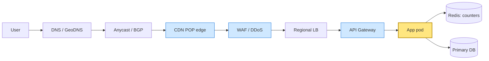
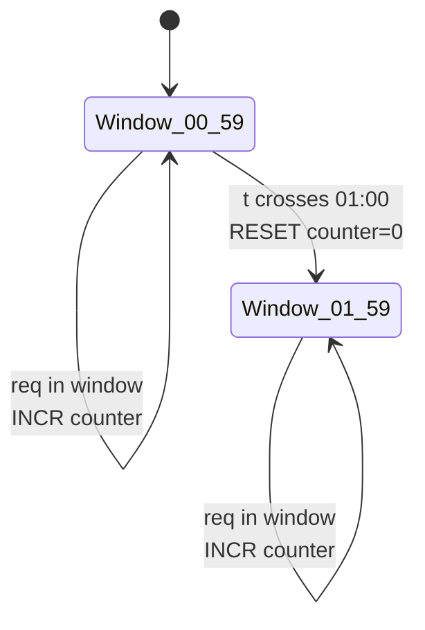
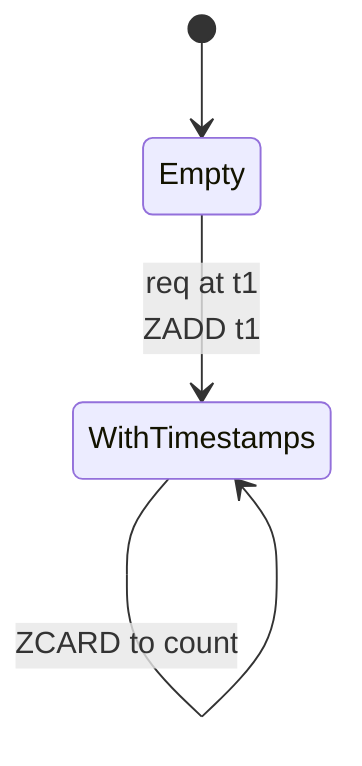
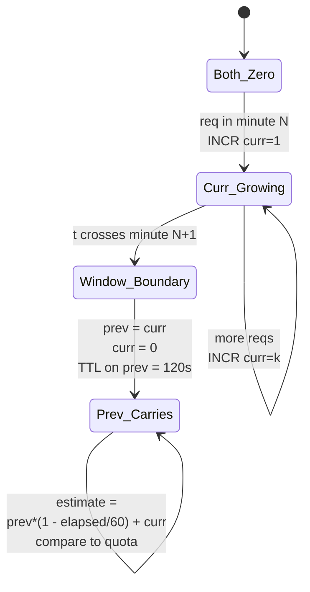
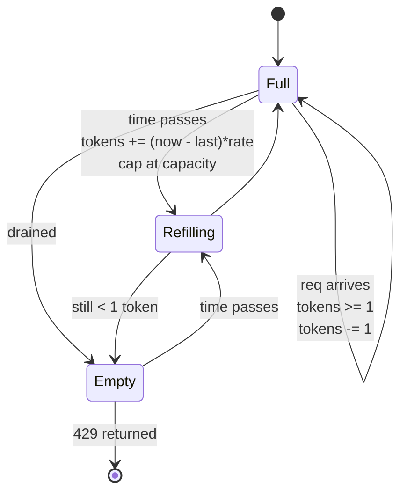
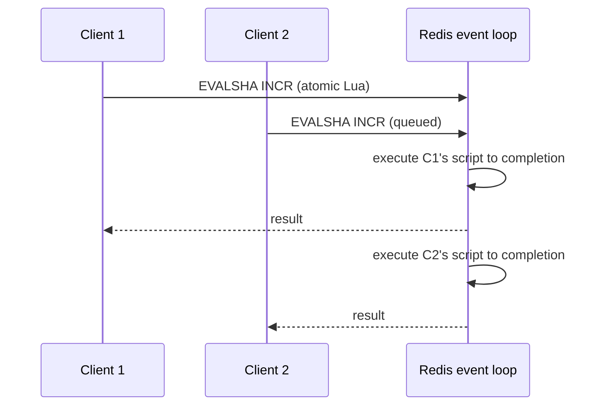
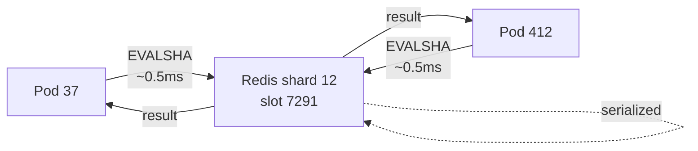
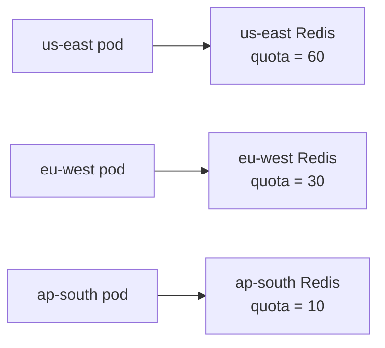
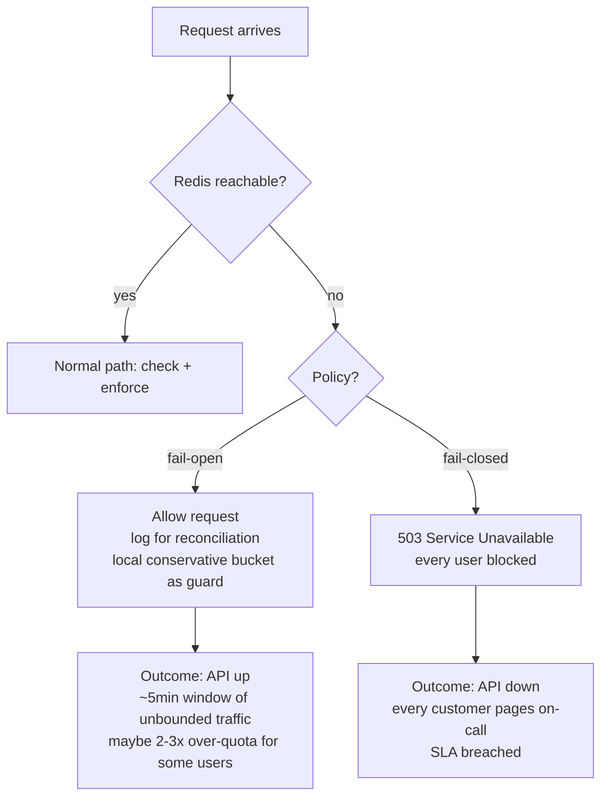

# HLD Notes

_Entries follow the template at `Notes/HLD-TEMPLATE.md`. Append-only. **Newest entry at top**, immediately after this header._

_Each entry is one interview-grade design problem, ~350 lines, with 2 mandatory Deep dives (~120 lines each) following the 6-subsection depth contract in `docs/superpowers/specs/2026-05-22-design-skills-architecture.md` §8._

_Generated by `/design-today`. State tracked in `Schedule/design_state.json`._

---

## [2026-05-26] H99 · CDN architecture · **Cloudflare** · Akamai · Fastly

- Anycast + BGP routing: how one IP address reaches the nearest POP
- Tiered cache hierarchy (RAM → SSD → tier-2 → origin shield) per POP
- The real failure mode: cache stampede on TTL expiry, and origin shielding fixes it

### Problem (as asked)

> "Design a CDN like Cloudflare. Serve static and dynamic content to users worldwide with <50ms p99 latency. Support cache invalidation in under 1 minute globally. Handle 100M+ requests/sec at peak, ~10 PB of cached objects across the network."

**Clarifying questions to ask back before drawing anything:**

1. Static-only (images, JS, CSS) or also dynamic (HTML, API responses)? Dynamic changes cache-key normalization rules.
2. What's the object size distribution — median and p99? Sizes RAM vs SSD tier decisions.
3. Purge SLA — best-effort (~5min) or guaranteed (<1s)? Decides whether we need active invalidation or just TTL.
4. Origin protection scope — are we protecting one origin (single tenant) or 10M origins (multi-tenant Cloudflare)?
5. TLS termination at edge — do we hold customer private keys, or use Keyless SSL (origin holds key, edge proxies handshake)?

### Back-of-envelope

```
Traffic:
  Peak QPS:    100M req/sec global
  POPs:        ~300 POPs worldwide (Cloudflare scale)
  Per-POP avg: 100M / 300 = ~330k QPS per POP
  Top-10 POPs: 10× avg = ~3.3M QPS each (NYC, FRA, SIN, LAX, ...)

Object payload:
  Median:      ~30 KB (JS bundle, small image)
  p99:         ~5 MB (video segment, large image)
  Avg:         ~80 KB

Cached set:
  Total:       10 PB across network
  Per POP:     10 PB / 300 = ~33 TB working set per POP
  Hot tier (RAM):  top 1% by access freq = ~330 GB → fits in 512 GB RAM/server
  Warm tier (SSD): next 30%             = ~10 TB → 24× 512 GB NVMe SSDs

Bandwidth:
  Per-POP egress: 330k QPS × 80 KB avg = ~26 GB/sec = ~210 Gbps
  Network NICs:   4× 100 Gbps NICs per cache server, ~30 servers/POP

Origin protection (cache hit rate at 95%):
  Origin sees:    100M × 0.05 = 5M QPS
  With tiered cache hit rate 99%+ via origin shield:
  Origin sees:    100M × 0.01 = 1M QPS (target)

Cost ballpark (Cloudflare-scale):
  Servers:        ~10k cache servers × $5k/yr capex amortized = ~$50M/yr
  Bandwidth:      ~$200M/yr (transit + peering)
  POPs (real estate, power, cooling): ~$100M/yr
  Total:          ~$500M/yr infra → ~$15/yr per 1M req
```

### Functional / Non-functional requirements

| Functional | Non-functional |
|---|---|
| Cache GET responses by URL + headers | p99 cache-hit latency < 50ms anywhere globally |
| Purge by URL or cache-tag | 99.99% availability per POP (whole-POP failure tolerated) |
| Cache-Control header honored (max-age, s-maxage) | Cache hit rate ≥ 95% (origin protection NFR) |
| TLS termination at edge | Purge propagation < 30s p50, < 5min p99 |
| Origin failover (multi-origin) | DDoS absorption: 100× normal traffic without origin impact |

### API contract

```
# User-facing (the hot path — 100M QPS)
GET /<path>
Host: customer.example.com
  → 200/304 cached response       (CDN edge — 5-15ms)
  → 200 origin response (on miss) (CDN proxies to origin)

# Cache control headers honored:
  Cache-Control: public, max-age=31536000, s-maxage=86400
  Cache-Tag: product-page,sku-12345           # custom — for tag-based purge
  Vary: Accept-Encoding, Accept-Language       # cache key includes these

# Operator-facing — purge API
POST /api/v4/zones/{zone_id}/purge_cache
  Body: { "files": ["https://example.com/img.jpg"] }
  Body: { "tags": ["product-page"] }
  Body: { "purge_everything": true }
  → 200 { "id": "purge-batch-uuid", "estimated_propagation_seconds": 30 }
```

### Data model

```
Per-POP cache store (NOT a relational DB):
  Cache key:    hash(scheme + host + path + normalized_query + vary_headers)
  Value:        full HTTP response (status + headers + body)
  Metadata:     ttl_expires_at, last_accessed_at, size_bytes, cache_tags[]
  Tier:         RAM (top 1%) / SSD (next 30%) / disk (overflow)

Global control plane (centralized, NOT per-POP):
  zones table:        zone_id, owner_id, origin_url, cache_rules[]
  purges log:         purge_id, zone_id, target (url|tag), submitted_at, propagated_at
  configs:            per-zone TLS certs, WAF rules, page rules

POP-local state:
  cache:              key → response (LRU, on-disk index)
  origin_health:      origin_url → {last_check, latency_ms, status}
  peering_table:      ASN → cost (BGP routing decisions)
```

Access patterns: 99% are point lookups by cache key (the hot path). Purges are by URL or tag (the cold path — needs index from tag → key list). Config changes go through control plane → push to POPs via gossip.

### Architecture

```
                User in Frankfurt
                       │ DNS lookup
                       │ → Anycast IP 104.16.0.5
                       │ → BGP routes to NEAREST POP
                       ▼
        ┌──────────────────────────────────┐
        │  CLOUDFLARE-FRA POP (Frankfurt)  │
        │  (Anycast IP shared by 300 POPs) │
        └──────────────┬───────────────────┘
                       │ TLS terminate
                       ▼
        ┌──────────────────────────────────┐
        │  L4 LB → L7 router (per-POP)     │
        └──────────────┬───────────────────┘
                       │
            ┌──────────┴──────────┐
            ▼                     ▼
      ┌──────────┐         ┌──────────┐
      │ Cache    │         │ WAF /    │
      │ tier     │◄────────┤ Workers  │
      │ (~30     │         │ (edge    │
      │ servers) │         │  compute)│
      └─────┬────┘         └──────────┘
            │ miss
            ▼
      ┌─────────────────────────┐
      │ Tier-2 cache (regional) │  ← origin shield: ONE designated POP
      │ (cloudflare-fra-tier2)  │     per zone aggregates misses
      └─────────┬───────────────┘
                │ miss
                ▼
        ┌──────────────────────┐
        │  Customer origin     │ (e.g., us-east-1 — 80ms cross-Atlantic)
        │  (rate-limited)       │
        └──────────────────────┘
```

NFR landing points:
- **<50ms p99** → 95% served from edge POP RAM/SSD (5-15ms). 4% from tier-2 in-region (~20-30ms). 1% from origin (50ms cross-region).
- **95% hit rate** → tiered cache absorbs hot working set; origin shield prevents tier-1 misses from multiplying.
- **Purge <30s** → control plane fans out purge to all POPs via pub/sub (Kafka-like).
- **DDoS absorption** → Anycast spreads attack across 300 POPs; each absorbs 1/300th naturally.

### Deep dive 1: Anycast IP + BGP routing — how one IP reaches the nearest POP

**1. Why does this mechanism exist?**

The naive approach: each POP has its own IP, and DNS returns the IP of the geographically-nearest POP (GeoDNS). This is what CDNs did in the 1990s.

Three problems killed it:
- **DNS caching defeats locality.** A user's resolver caches the DNS response for the TTL (5-60 min). If the user moves between cell towers or the nearest POP changes, they keep hitting the old IP until the TTL expires.
- **GeoIP databases lie.** Mapping a public IP → physical location is ~80% accurate. Mobile carriers especially: a user in Munich can appear to be in Berlin because the carrier's NAT egress is in Berlin.
- **Failover is slow.** If the Frankfurt POP dies, GeoDNS must propagate a new response. With TTL=300s, ~half your users are stuck on the dead POP for 5 minutes.

The mechanism: **Anycast.** One IP address (`104.16.0.5`) is announced by *every* POP via BGP. The Internet's routing protocol *itself* decides which POP each user reaches — based on AS-path distance and ISP peering, not on IP geolocation.

**2. Walk it concretely.**

```
SETUP — Cloudflare owns IP 104.16.0.5
  Every Cloudflare POP runs a BGP router that advertises:
    "I have a path to 104.16.0.5, AS-path = [13335]"
  to its ISP neighbors via BGP peering sessions.

  300 POPs advertise the SAME IP to their LOCAL ISPs simultaneously.

PROPAGATION — BGP routing tables across the Internet
  Every backbone router on the Internet learns multiple paths to 104.16.0.5:
    Via Deutsche Telekom (Frankfurt POP):  AS-path length 2
    Via Comcast (NYC POP):                 AS-path length 4
    Via Telstra (Sydney POP):              AS-path length 6
  Each router picks the SHORTEST path (BGP best-path selection).

USER REQUEST — Frankfurt user types https://example.com
  1. DNS:    example.com → CNAME to customer.cdn.example.com → A record 104.16.0.5
             (DNS gives the SAME IP to every user globally — that's the whole point)
  2. TCP:    User's machine sends SYN to 104.16.0.5
             Routed via:
               User's ISP (Deutsche Telekom) → DT's backbone router
               DT's router has BGP path: 104.16.0.5 via Cloudflare-FRA
               Packet arrives at cloudflare-fra POP. ~5ms RTT.
  3. POP:    Cloudflare-FRA's edge LB receives SYN, completes 3-way handshake,
             terminates TLS, serves response.

FAILOVER — Cloudflare-FRA POP goes down (power outage)
  1. Cloudflare-FRA's BGP router stops sending keepalives.
  2. Within ~30s, DT's router withdraws the route via Cloudflare-FRA.
  3. DT now picks the next-shortest path: Cloudflare-AMS (Amsterdam).
  4. NEW user requests automatically reach Amsterdam.
  5. Existing TCP connections to Frankfurt → broken; clients reconnect.

  Total user-visible failover: ~30-60 seconds, NO DNS change needed.
```

**3. The cost you're accepting.**

| Property gained | Cost paid |
|---|---|
| Locality via Internet routing (more accurate than GeoIP) | TCP connection can "drift" to a different POP mid-session if BGP path changes — kills long-lived connections |
| Failover in 30-60s without DNS TTL waiting | You don't control which POP a user reaches — Internet routing does |
| Natural DDoS absorption — attacker traffic also spreads across POPs | Need BGP relationship with ~10,000+ ASNs to advertise globally; small CDNs can't do this |
| ONE IP serves the entire planet — simple operationally | Stateful protocols (long TCP, WebSocket) need ECMP/flow-pinning to avoid mid-flow re-routing |

**4. Failure modes the interviewer will drill into.**

| Failure | What goes wrong | Mitigation |
|---|---|---|
| BGP route hijack — bad actor announces 104.16.0.5 from a hostile AS | Traffic is misrouted to attacker → MITM, traffic blackhole | RPKI (Resource Public Key Infrastructure) cryptographically signs route announcements; peers reject unsigned/wrong-key routes. Cloudflare's 2018 Pakistan/YouTube incident is the classic example. |
| Mid-flow BGP convergence — user's path changes during an active TCP connection | Packets land at a different POP than the one holding TCP state → RST | Edge LBs use ECMP with consistent hashing on (src_ip, src_port) so packets from one flow always land on the same backend. POP-level drift is rare (<1% of flows). |
| Anycast-asymmetric routing — packet goes via POP-A, return via POP-B | TCP state mismatch → broken connection | Tunneling within Cloudflare's backbone (Argo) re-routes return packets to the entry POP. |
| POP overloaded but BGP still healthy | Traffic keeps arriving at a saturated POP | POP withdraws its BGP announcement when CPU/memory crosses threshold ("graceful drain"). Adjacent POPs absorb the load within ~30s. |
| New POP brought online — cold cache | New POP serves 100% misses → its tier-2 / origin shield is hammered | Pre-warm: replay top-1M URLs against new POP before announcing the BGP route. |

**5. How to derive it in an interview from first principles.**

1. State the constraint: one logical service, hundreds of POPs, users worldwide must reach the nearest one with <50ms latency.
2. DNS-based routing (GeoDNS) suffers from DNS caching (TTL window stuck on dead POP) and GeoIP inaccuracy (~80%).
3. We need the routing decision to live *below* DNS — in the network layer itself.
4. BGP is the Internet's routing protocol. Every backbone router already does shortest-path selection.
5. If multiple POPs advertise the *same* IP, BGP routers automatically pick the shortest path to that IP. This is the definition of Anycast.
6. Anycast piggybacks on routing infrastructure we don't own and don't pay for. Failover is automatic when BGP withdraws a route.
7. The trade-off: we give up explicit control over which POP serves which user. The Internet decides. For stateless HTTP this is fine; for stateful protocols we need flow-pinning.
8. You've derived Anycast without citing the RFC. RFC 4786 (Operation of Anycast Services) is the formal spec — but you don't need it.

**6. Where this shows up in production.**

- **Cloudflare**: ~13335 AS, ~310 POPs, all announcing the same /24 prefixes (e.g., 104.16.0.0/13). Their 2018 RPKI rollout (blog: "RPKI - the required cryptographic upgrade to BGP routing") came after the Pakistan YouTube BGP hijack of 2008 and the Amazon Route53 hijack of 2018. They publish their BGP communities publicly so peers can tune traffic.
- **Google**: uses Anycast for `8.8.8.8` (public DNS) and for `www.google.com` frontends. Their 2017 paper "Taking the Edge off with Espresso" describes how they extended their software-defined BGP control plane to optimize POP selection beyond what vanilla BGP does — they actively measure RTT and adjust BGP announcements to steer users away from suboptimal paths.
- **Fastly**: ~80 POPs, also fully Anycast. Their 2021 outage (single config change took down 85% of POPs) is the cautionary tale — Anycast means one config bug propagates everywhere. They've since added staged rollouts (canary POPs first).
- **Facebook (Meta)**: 2021 outage — accidentally withdrew their BGP announcements globally. Facebook's authoritative DNS was *also* behind their own Anycast IPs, so even DNS stopped resolving. The lesson: don't host your DNS infrastructure behind the same Anycast routing you're trying to debug.

### Deep dive 2: Tiered cache hierarchy + origin shielding

**1. Why does this mechanism exist?**

At 100M QPS across 300 POPs (~330k QPS per POP avg), three constraints collide:

- **RAM is fast but expensive.** A single 512 GB DDR5 server holds ~0.5% of a POP's 33 TB working set. Pure RAM cache would cost 200× more.
- **SSD is cheap and big but slower.** NVMe reads at ~80μs vs RAM at ~80ns — 1000× slower. Acceptable for warm content, terrible for hot.
- **Origin must be protected.** If each POP independently fetches from origin on a miss, a popular-but-uncached URL causes 300 simultaneous origin requests (one per POP). At 100k QPS post-cache-miss, origin gets DDoSed.

The mechanism: a **multi-tier cache** at each POP (RAM → SSD → cold disk) AND a **per-zone "origin shield"** — one designated POP that aggregates all cache misses for that zone before going to origin.

**2. Walk it concretely.**

```
A user in Frankfurt requests https://shop.example.com/banner.jpg

cloudflare-fra POP:
  Tier 0 (per-server RAM, ~512 GB):
    LOOKUP key=hash("shop.example.com/banner.jpg")
    HIT (last accessed 30s ago, lives in RAM)
    → return 200 OK, 30 KB body, 8μs total
    Latency from user: ~5ms (network) + 8μs (cache) = ~5ms

If RAM MISS:
  Tier 1 (per-POP SSD, ~33 TB):
    LOOKUP same key on local NVMe
    HIT → read 30 KB at ~80μs → return
    Promote to RAM if it gets a 2nd hit in 60s (LFU-with-aging)
    Latency from user: ~5ms + 0.1ms = ~5.1ms

If TIER-1 MISS:
  Tier 2 (regional, "origin shield"):
    Each zone is assigned to ONE shield POP — e.g., shop.example.com → cloudflare-fra-shield
    cloudflare-fra forwards to cloudflare-fra-shield (~1ms intra-region RTT)

    Shield POP checks ITS RAM+SSD:
      HIT (shield aggregates all FRA-region misses): return → cache at cloudflare-fra
      Latency from user: ~5ms + 1ms (shield) = ~6ms

If SHIELD MISS:
  Origin fetch (the only path that reaches customer's origin):
    cloudflare-fra-shield → https://shop.example.com (origin in us-east-1)
    Latency: ~80ms cross-Atlantic
    Response cached at shield, then propagated back to cloudflare-fra, then to user.
    Latency from user: ~5ms + 1ms + 80ms = ~86ms (first user only)

THE NEXT USER anywhere in Frankfurt region:
  Their POP misses → forwards to cloudflare-fra-shield → HIT → ~6ms
  → No origin contact.
```

The key insight: **without origin shield**, if 30 different cloudflare-fra-region servers all miss simultaneously (cold object, viral event), each would independently call origin → 30 origin requests for one object. **With origin shield**, all 30 misses converge on one shield POP, which deduplicates: only the first request hits origin; the other 29 wait for it ("request coalescing").

**3. The cost you're accepting.**

| Property gained | Cost paid |
|---|---|
| 95%+ cache hit ratio with mixed RAM+SSD economics | Tier promotion logic is complex — wrong heuristic = thrashing |
| Origin sees 1-5% of total traffic (massive protection) | One extra network hop on tier-1 miss adds ~1ms |
| Request coalescing — viral cold object causes 1 origin fetch, not 30 | Shield POP is a SPoF for that zone — must have backup shield |
| Storage cost ~$0.01/GB/mo on NVMe vs $0.5/GB/mo on RAM (50× cheaper) | SSD wear-out: cache writes ~1 PB/day per POP, ~3-year SSD lifetime |

**4. Failure modes the interviewer will drill into.**

| Failure | What goes wrong | Mitigation |
|---|---|---|
| Cache stampede on TTL expiry — all POPs simultaneously refetch | At T=expiry, 300 POPs all miss → 300 origin requests for one object | (a) Jittered TTLs (TTL × random(0.8, 1.2)); (b) stale-while-revalidate (serve stale + async refresh in background); (c) origin shield deduplicates the 300 requests into 1. |
| Hot object on one shard — all RAM hits hash to one server | Single server CPU saturates, p99 spikes | Consistent hash + replicate hot keys to 3 shards; promote ultra-hot keys to every server's RAM (broadcast) |
| Cache poisoning — bad response cached and served to all users | Malicious or accidental bad response propagates | Cache only on response code in {200, 301, 304, 404}; respect `Cache-Control: no-store`; validate response signature for premium tier |
| Tier-2 shield down | Tier-1 falls back to direct-to-origin → origin sees full traffic | Each zone has primary + backup shield POP; failover within ~10s via gossip |
| SSD failure mid-stream | Partial response, corrupted cache entry | Per-object CRC; on mismatch, treat as miss and refetch; rotate SSDs proactively at 80% lifetime |

**5. How to derive it in an interview from first principles.**

1. Constraint: serve 100M QPS at <50ms p99 with finite RAM budget per POP.
2. RAM is fast (~80ns) but expensive ($5/GB). SSD is slow (~80μs) but cheap ($0.10/GB). Pure RAM = unaffordable; pure SSD = too slow for top 1% of traffic.
3. Two-tier cache (RAM + SSD) gives you both: hot objects in RAM, warm in SSD. Promotion based on access frequency.
4. But across 300 POPs, each independently fetching from origin on miss = origin gets 300× amplified miss traffic. Unacceptable.
5. Introduce a third tier: per-region "shield" POP that aggregates all regional misses. Request coalescing ensures duplicate misses become one origin fetch.
6. Trade-off: extra ~1ms hop on tier-1 miss, plus shield is a SPoF (mitigated with backup shield).
7. Add jittered TTLs + stale-while-revalidate to handle TTL-boundary stampedes.
8. You've derived a 4-level cache hierarchy (RAM → SSD → shield → origin). Each tier exists because the one above can't economically satisfy the next constraint.

**6. Where this shows up in production.**

- **Cloudflare**: 3-tier per POP (RAM via Lua/nginx → SSD via custom userspace store → tier-2 "Argo Tiered Cache"). Their 2019 blog "Speed Up Your Website with Tiered Cache" reported cache hit ratio rising from 89% to 96% just by enabling tier-2 — origin traffic dropped by ~60%.
- **Fastly**: "Origin Shield" feature lets customers designate a specific POP as the consolidation point. Their docs cite a real customer (Vimeo) reducing origin requests from 50M/day to 2M/day after enabling shield — a 25× reduction.
- **Netflix Open Connect**: extreme tiering — content pre-positioned on appliances inside ISPs ("Open Connect Appliances"), with cloud-based origin fetch only for cold/long-tail content. ~95% of Netflix bytes are served from inside the user's ISP. Their 2017 paper "Network Operations Center" describes the fill algorithm that pre-positions content based on ML predictions of regional demand.
- **AWS CloudFront**: 3-tier (edge POP → regional edge cache → origin). The regional edge cache is automatically inserted; no customer configuration needed. AWS docs cite hit ratio improvements of "up to 30 percentage points" for customers with many edge POPs hitting one origin.

### Bottlenecks + scaling levers

| Scale point | First bottleneck | Lever |
|---|---|---|
| 10× QPS (1B/sec) | Per-server NIC bandwidth saturated | Add more cache servers per POP; upgrade to 400 Gbps NICs |
| 10× POPs (3000) | BGP table size; control-plane fan-out latency | Hierarchical BGP (regional aggregation routers); push purges via tree, not fan-out |
| 10× objects (100 PB) | SSD count per POP; cold-tier disk required | Add cold tier on HDD for long-tail; or evict aggressively and rely on origin |
| Multi-tenant scale (10M zones) | Cache key cardinality; per-zone config push | Per-tenant cache namespace; lazy-load config on first request |

### Trade-off matrix

| Option | Latency | Cost | Complexity | Hit rate |
|---|---|---|---|---|
| Pure RAM cache | ✅ <1ms | ❌ 50× more | ✅ simple | ⚠️ small working set |
| Pure SSD cache | ⚠️ ~0.1ms | ✅ cheap | ✅ simple | ⚠️ no hot-path optimization |
| **3-tier (RAM + SSD + shield)** | ✅ ~5-10ms | ✅ balanced | ❌ complex | ✅ 95%+ |
| Edge-only (no shield) | ✅ fast | ✅ cheap | ✅ simple | ❌ origin amplification |

Chose **3-tier** for the combination of hit rate, cost, and origin protection. The complexity cost is real (tier promotion, shield routing, coalescing logic) but unavoidable at 100M QPS scale.

### Common follow-ups

1. **How do you invalidate a single URL globally in under 30s?** — Control plane pub/sub: purge request hits API → published to a Kafka-like fanout → 300 POPs subscribe → each POP processes purge from RAM+SSD. Cloudflare uses a custom system called "Quicksilver" (~150ms global propagation for config; ~30s for cache purge by tag).
2. **How do you cache POST requests?** — You don't, by default — POST is non-idempotent. Exception: GraphQL "POST" queries with identical bodies. Cache key includes hash of body; cache-control headers must explicitly opt-in. Complexity rarely worth it.
3. **How do you handle HTTPS at the edge?** — TLS termination at POP (CDN holds customer's private key, in HSM). Alternative: "Keyless SSL" (Cloudflare) — origin holds private key, edge proxies the TLS handshake to origin. Adds 50-100ms to first request but keeps key private.
4. **What about dynamic content (HTML personalized per user)?** — Edge compute (Cloudflare Workers, Fastly Compute@Edge): code runs at POP, generates response with per-user data, caches fragments. Trade-off: compute cost shifts to edge.
5. **How do you bill customers fairly across tenants?** — Sampled request logs from each POP → aggregated centrally → metered per-zone (bandwidth, request count). Real-time exact billing is too expensive; CDNs accept ~1% sampling error.

### What top-tier looks for

- **Mid-tier says**: "CDN caches content at edge servers around the world. Users connect to the nearest one."
- **Staff-tier says**: "The interesting question isn't 'how does caching work' — it's how *one IP* reaches the nearest of 300 POPs. Anycast + BGP means Internet routing itself picks the path; we don't need GeoDNS. The cost: we lose explicit control of POP selection. The second interesting question is origin protection: at 100M QPS across 300 POPs, if every POP independently fetches on miss, origin sees a 300× amplification of cache misses. The fix is a per-zone origin shield POP that does request coalescing. Most candidates know there's a cache; few can explain *why a third tier exists*."

The difference: mid-tier describes the outcome (fast content delivery). Staff-tier names the **mechanisms** (Anycast for routing, origin shield for coalescing) and the **failure modes they prevent** (DNS-cache lock-in, origin DDoS via miss amplification).

### Diagnostic questions (self-quiz)

1. **Why Anycast instead of GeoDNS?** — wrong: "Anycast is faster." Right: GeoDNS suffers from DNS cache TTL lock-in (users stuck on dead POP for 5+ min) and GeoIP inaccuracy (~80%). Anycast pushes routing into BGP, where failover is ~30s without any DNS change.
2. **What happens to a TCP connection if BGP re-routes mid-flow?** — wrong: "It continues." Right: packets land at a different POP that has no TCP state → RST. Mitigation: ECMP with consistent hashing pins flows to entry POP; backbone tunneling (Cloudflare Argo) re-routes return packets.
3. **Why have a per-zone origin shield POP?** — wrong: "For redundancy." Right: to coalesce cache misses across regions. Without it, 300 POPs missing the same object = 300 origin requests. With it, all 300 misses converge on one shield POP → 1 origin request.
4. **What's the typical RAM:SSD:origin hit ratio per POP?** — wrong: "Doesn't matter." Right: ~80% RAM / 15% SSD / 4% shield / 1% origin is a healthy distribution. If shield+origin is >5%, your tier-1 is undersized or your TTLs are too short.
5. **Why jitter TTLs?** — wrong: "For randomness." Right: without jitter, all POPs cache an object at the same time → all expire at the same time → 300 simultaneous misses (cache stampede). Jittering TTL by ±20% spreads the expiry over a window, smoothing origin load.

---


## [2026-05-25] H10 · Rate Limiter · **Cloudflare** · Stripe · Anthropic

- Where rate limiting lives — 4 enforcement layers with different visibility and cost
- Four algorithms (fixed / log / sliding-counter / token-bucket) drawn as state machines
- Redis single-threaded — the strength AND the weakness, derived from the event loop
- Fail-open at 3am: what the user actually experiences when Redis dies

### Problem (as asked)

> "Design a distributed rate limiter. 10M users, each with their own quotas (e.g. 100 req/min). Decisions must be made in under 5ms p99. Quotas must hold even under burst traffic across multiple API servers."

**Clarifying questions to ask back before drawing anything:**

1. Is this **CDN-edge** (Cloudflare-style, anonymous abuse prevention) or **app-layer** (per-authenticated-user business quota)? They are different systems with different visibility.
2. Are quotas uniform (100 req/min for all) or per-tier × per-endpoint? Tiered = quota config lives in a control plane.
3. Fail-open or fail-closed when Redis is unreachable? This question alone separates mid from staff.
4. Multi-region? If yes, is the quota global or per-region? Cross-DC RTT blows the 5ms budget.
5. Do clients need accurate `X-RateLimit-Remaining` + `Retry-After`, or just a `429`?

### Cost-of-service framing (read this first)

The reason quotas are *variable* — different for different endpoints, different for different users, different for authenticated vs anonymous — is not engineering taste. It is **unit economics**.

| Endpoint class | Server cost / call | Reasonable quota |
|---|---|---|
| Static GET (cached) | ~10 µs CPU, ~0 $ | 10,000 / min |
| Auth check / login | ~5 ms CPU, ~negligible $ | 60 / min (also blocks credential stuffing) |
| Search / DB-heavy read | ~50 ms CPU, ~0.0001 $ | 600 / min |
| LLM inference (Claude Opus) | ~5 s GPU, ~$0.05 / call | 5 / min on free tier, 1000 / min on enterprise |
| Image generation | ~10 s GPU, ~$0.10 / call | 5 / hour on free tier |

**Quota = f(caller_identity × endpoint × tier × per-call cost).** The rate limiter is the mechanism that *enforces* the cost model. Pick a quota that lets paid users get value and that bounds the platform's loss to a single abuser.

Authentication is the input to this function:
- **Anonymous traffic** is keyed by IP (+ TLS fingerprint for NAT/proxy resilience) and gets the *small* quota — you can't bill them, so you can't subsidize them.
- **Authenticated traffic** is keyed by `user_id` and gets the tier-dependent quota.
- Docker Hub canonical example: 100 pulls / 6h anonymous, 200 / 6h authenticated free, unlimited paid. The quota difference *is* the business model.

### Request-path layering — where this component lives



Rate limiting CAN be enforced at four highlighted layers. The **app-pod + Redis** design (yellow) is what this note builds; the others are listed below so you know what each gives up.

**Where this concern lives — the 4 enforcement points:**

| Layer | What it sees | Latency cost | Blast radius | Best for |
|---|---|---|---|---|
| **CDN edge** (Cloudflare Rules) | IP, SNI, JA3, path | <1 ms (already at POP) | Global — one rule = 300 POPs | Coarse abuse, DDoS, anonymous |
| **WAF / API gateway** (Kong, Envoy, AWS API GW) | + user_id (after JWT), route, headers | 1–3 ms | Per gateway region | Cross-cutting tenant quotas |
| **App middleware** (this note) | + payload, business context, downstream cost | 2–5 ms | Per microservice | Per-endpoint business rules, per-cost limits |
| **Downstream / DB** (Postgres, S3 quota) | + row-level intent | 5–15 ms | Per resource | Last-line cost protection, fairness across queries |

These layers compose; production systems run several at once (defense in depth). When the note says "API pod → Redis", that's the app-middleware layer — *not* the CDN. The CDN already filtered the obvious garbage before the request reached us.

### Back-of-envelope

```
Users:          10M active
Quota:          100 req/min per user (baseline)
Peak QPS:       10M × 0.2 active × 100 / 60 = ~3.3M QPS at peak
                (but most are ALLOWED; only ~1% hit the limit)

State per user: token-bucket    = 2 ints (tokens, last_refill) = 16B
                sliding-window  = 2 ints (prev_count, curr)    = 16B
Total state:    10M × 16B = 160 MB. With Redis overhead: ~1 GB.
                Fits in ONE 8 GB Redis instance.

Redis ops:      ~3.3M ops/sec at peak
                Single Redis: ~100k ops/sec → need ~33 shards
                40-shard Cluster handles this with headroom

Latency budget: 5ms p99
                Intra-DC Redis RTT: 0.5ms p50, 2ms p99
                Lua script:         0.1ms
                Total:              ~2.1ms p99 — comfortable margin

Bandwidth:      3.3M QPS × 100B = 330 MB/s — a single 10 Gbps NIC
```

### Functional / Non-functional requirements

| Functional | Non-functional |
|---|---|
| Decide allow/deny for each request | p99 decision latency < 5 ms |
| Per-user × per-endpoint × per-tier quotas | 99.99 % availability — never the cause of an API outage |
| Return `429` + `Retry-After` | Accuracy: ±5% overshoot OK (this is not billing) |
| Headers: `X-RateLimit-{Limit,Remaining,Reset}` | Horizontally scalable to 10M+ users |
| Ops: grant emergency quota to a single user without restart | Quota config changes propagate < 30 s |

### API contract

```
# Internal middleware (not user-facing)
RATE_CHECK(user_id, endpoint, quota_config)
  → { allowed: bool, remaining: int, retry_after_ms: int }

# Response headers on EVERY response:
X-RateLimit-Limit:     100
X-RateLimit-Remaining: 73
X-RateLimit-Reset:     1716400060        # unix ts when window resets

# On rejection:
HTTP 429 Too Many Requests
Retry-After: 12

# Operator API (control plane):
PATCH /admin/quota
  { user_id, endpoint, new_limit, ttl_seconds }
  → applies on next window boundary; quota_config in app config / DB
```

### Data model

```
Redis key schema (sliding window counter):
  Key:    rl:{user_id}:{endpoint}:{window_minute}
  Value:  integer counter
  TTL:    120s (2× window — current + previous overlap)

Example:
  rl:{usr_abc123}:chat:27609321  →  47       # current minute
  rl:{usr_abc123}:chat:27609320  →  91       # previous minute

Quota config (NOT in Redis — Redis stores counters, not limits):
  Table: quota_rules (control plane DB)
    tier         varchar  PK
    endpoint     varchar  PK
    max_requests int
    window_sec   int
    burst_mult   float
  Pushed to app pods on change via config service (pull every 30s).
```

The `{user_id}` hash tag is load-bearing: it forces both window keys onto the **same Redis shard** so a single Lua script can atomically touch both.

### Architecture

```mermaid
flowchart TB
    R[Incoming request 3.3M QPS] --> LB[Edge / LB no rate logic]
    LB --> P1[API pod 1]
    LB --> P2[API pod 2]
    LB --> P3[API pod ... 500]
    P1 -.EVALSHA Lua, 0.5ms p50.-> RC[Redis Cluster - 40 shards]
    P2 -.EVALSHA.-> RC
    P3 -.EVALSHA.-> RC
    RC -- atomic decision --> P1
    P1 -- 429 deny / forward allow --> APP[Application handler]
```

NFR landing:
- **p99 < 5 ms** → intra-DC Redis RTT ~2 ms + Lua ~0.1 ms = ~2.1 ms.
- **99.99% availability** → fail-open: Redis-down does not equal API-down (mechanism in Deep dive 2).
- **Accuracy** → sliding-window counter at ±5% (proven below).

### Deep dive 1: Four algorithms — fixed window, sliding log, sliding counter, token bucket

**1. Why does this mechanism exist?**

Counting "how many requests in the last 60 s" sounds trivial; doing it at 3.3 M QPS, ±5% accurate, in O(1) state and O(1) per check is not. Four algorithms attack the problem differently. Each gets a state diagram, a walk-through, and a derivation of its complexity from the data structure it uses.

| Algorithm | State / user | Per-check cost | Burst-boundary behavior |
|---|---|---|---|
| Fixed window | 1 counter + reset_ts | O(1) — integer INCR | Broken — 2× burst across boundary |
| Sliding window log | sorted set of timestamps | O(log N) — skip-list insert | Exact, but storage explodes |
| **Sliding window counter** | 2 counters (prev, curr) | O(1) — 2 GETs + 1 INCR | Approximate, ±5% bound |
| Token bucket | (tokens, last_refill) | O(1) — CAS read-modify-write | Smooth, allows configured burst |

#### Algorithm A — Fixed window (the exploit)



User sends 100 at 00:59:59, counter hits 100. At 01:00:00 the window resets. User sends 100 more at 01:00:01. **200 requests in 2 seconds**, never exceeded the per-minute limit. The window boundary is an exploitable seam. **Big-O:** O(1) — single integer INCR (hash-table lookup + atomic ADD).

#### Algorithm B — Sliding window log (the exact-but-expensive one)



Every request appends a timestamp to a Redis sorted set. Before counting, prune entries older than 60 s. Count = `ZCARD`. Exact. **Big-O:** O(log N) per check — `ZADD` and `ZREMRANGEBYSCORE` both walk the **skip-list** that backs Redis sorted sets (skip-list insert / delete is log N in the number of entries). **Cost at scale:** 100 req/min × 10M users = 1 billion sorted-set entries at peak = ~60 GB Redis memory for timestamps alone. Dead on arrival.

#### Algorithm C — Sliding window counter (the chosen one)



Walked concretely — user has 100 req/min quota, current minute = 27609321, 40 s into it:

```
Redis state before request:
  rl:{usr_abc123}:api:27609321  =  62    (current window)
  rl:{usr_abc123}:api:27609320  =  88    (previous window)

Lua script executes atomically on the Redis server:
  1. now        = TIME[0]                 → Redis-side clock
  2. elapsed    = now % 60                → 40
  3. curr       = GET curr_key            → 62
  4. prev       = GET prev_key            → 88
  5. weight     = 1 - (40 / 60)           → 0.333
  6. effective  = 88 × 0.333 + 62         → 91.3
  7. effective < 100 → INCR curr_key      → 63
     EXPIRE curr_key 120 (idempotent)
     return {allowed: true, remaining: 8}

Redis state after:
  rl:{usr_abc123}:api:27609321  =  63
  rl:{usr_abc123}:api:27609320  =  88   (TTL ticking)
```

**Big-O:** O(1) — two `GET`s + one `INCR`, all integer hash-table ops. The ±5% error bound holds when requests are roughly uniformly distributed within a window; adversarial clustering at boundaries can push it to ~10%.

#### Algorithm D — Token bucket (the textbook one)



A bucket holds up to *capacity* tokens. Refill rate = *quota / window*. Each request takes one token. Burst capacity = full bucket. Lua atomically: read tokens + last_refill, refill, decrement, write back. **Big-O:** O(1). **Cost:** the CAS read-modify-write in Lua is slightly more code than the counter (the refill arithmetic) — and Stripe's reason for choosing it anyway is that *burst allowance* is a first-class concept their merchants understand.

**3. The cost you're accepting (sliding window counter, chosen):**

| Property gained | Cost paid |
|---|---|
| O(1) state per user (2 ints vs N timestamps) | ±5% accuracy under uniform load; ~10% adversarial |
| No sorted-set scans — pure GET / INCR | Approximation assumes uniform within-window distribution |
| TTL-based cleanup — no background GC | Cannot give *exact* `remaining` count |
| 6-line Lua script — auditable | Loses the "natural burst" concept that token bucket provides |

**4. Failure modes the interviewer will drill into.**

| Failure | What goes wrong | Mitigation |
|---|---|---|
| Clock skew between pods | Different pods compute different `elapsed` for the same instant | Use Redis-side `TIME` inside the Lua script. One clock. |
| Hot user (10k req/s) | All requests hash to one shard → that shard saturates | Replicate hot keys across 3 shards (read-any-write-all), or short-circuit at the pod once flagged |
| Shard failure | State for ~250k users lost | Fail-open + log-for-reconciliation; alert on sustained outage |
| Lua bug (TTL not set) | Keys accumulate → Redis OOM | `EXPIRE` on every INCR (idempotent); monitor `used_memory` |
| Quota config change mid-window | User at 80/100 when limit drops to 50 — limit now? | Apply new quota on next window boundary, not mid-stream |

**5. How to derive it in an interview from first principles.**

1. Constraint: count requests per user per rolling window, O(1) per check, distributed.
2. Fixed window is simplest, but the boundary exploit kills it (2× burst).
3. Exact sliding window = sorted set of timestamps, O(log N) and ~60 GB at scale. Rejected.
4. Observation: ±5% accuracy is fine for abuse prevention.
5. Insight: if you know the *total* of the previous fixed window and the *partial* of the current one, **interpolate** by the elapsed fraction.
6. This is O(1) state (2 ints), O(1) check (1 multiply + 1 add), and the error is bounded by the within-window distribution non-uniformity.
7. You've derived sliding-window-counter without citing Cloudflare. They proved the ±5% bound at scale; you derived the algorithm.

**6. Where this shows up in production.**

- **Cloudflare**: sliding-window-counter at the edge across millions of domains. The `prev × (1 - overlap) + curr` formula is quoted verbatim in their 2017 engineering blog. Chosen because the 2-counter form maps cleanly to atomic Redis ops.
- **Stripe**: token bucket — burst allowance is a business requirement (batch charges should burst). Their "Scaling your API with rate limiters" blog documents the choice.
- **Anthropic**: per-model × per-tier quota in front of the Claude inference queue. Hybrid — edge approximate check + centralized Redis authoritative. <5 ms decision because it sits before the GPU queue.
- **GitHub**: 5,000 req/h authenticated, 60 req/h anonymous. `X-RateLimit-*` headers on every response — the sliding-window-counter's approximate `remaining` is good enough for the header.

### Deep dive 2: Edge-local vs centralized Redis — and why Redis being single-threaded is both faces

**1. Why does this mechanism exist?**

The 5 ms budget creates a tension: **accuracy wants centralization** (one source of truth), **latency wants locality** (every hop is ~0.5 ms intra-DC, ~50 ms cross-DC). The choice between centralized Redis, per-region Redis, and edge-local-with-sync is a latency/accuracy trade — and it is settled by Redis's single-threaded execution model.

#### Redis single-threaded — both faces (derive, don't assert)

**Mechanism.** Redis runs an event loop: one thread reads from sockets, dispatches commands, writes responses. A single command (or Lua script) runs to completion before the next one starts. No locks. No condition variables. Redis 6 added I/O threads — those parallelize *socket read/write*, not command execution.



**Upside (the strength).**
- **Atomic Lua = free serializability.** No CAS retry loop, no optimistic-concurrency reasoning. The script sees a frozen instant of the keyspace.
- **No lock contention.** Throughput scales with command latency, not lock contention. Tail latency is predictable.
- **Simpler client semantics.** Pipelining works because order is preserved.

**Downside (the weakness).**
- **One slow command head-of-lines everything.** A `KEYS *` on a 10M-key DB blocks every other client for seconds. A 100 ms Lua script freezes the *entire shard* for 100 ms.
- **No SMP scaling.** A 64-core box runs Redis on 1 core; the other 63 idle. Saturate one core, you're done — even though the host has capacity.
- **Hot key = one CPU.** All traffic for `usr_abc123` hashes to one shard → one core. A celebrity user can saturate one Redis process while other shards idle.

This is the trade you accept by choosing Redis. Mitigations live above: keep Lua short (<1 ms), shard by hash tag, replicate hot keys, alert on `slowlog`.

**2. Walk it concretely.**

**Single-region (the common case):**



Both pods talk to the same shard (`{usr_abc123}` hash tag forces colocation). Redis serializes the two scripts; no race possible.

**Multi-region with per-region quota:**



Global quota 100 split proportionally. User sends 100 all to eu-west → 70 rejected even though global headroom exists. This is the cost of avoiding cross-DC RTT.

**Hybrid edge-local + sync (for <1 ms budgets, e.g. CDN Workers):**

```
Each pod keeps a local token bucket (5 tokens). Decision is local, <0.1ms.
Every 3 seconds, pod syncs to Redis:
  pod → Redis: "used 12 since last sync, give 15 more"
  Redis:       checks global remaining, grants min(15, fair_share)
Worst-case overshoot = active_pods × bucket_size = 50 × 5 = 250 over quota
At 100/min quota → 3.5× overshoot in worst case.
```

**3. The cost you're accepting.**

| Approach | Latency | Accuracy | Complexity | Failure mode |
|---|---|---|---|---|
| **Centralized Redis (single-region)** | ~1–2 ms | Exact (serialized) | Low | Redis down = unlimited |
| Per-region Redis (split quota) | ~1–2 ms | Per-region exact, global imprecise | Medium | Regional imbalance |
| Hybrid local + Redis | <0.1 ms | ±250 % worst case | High | Pod crash loses local |
| Pure local | <0.1 ms | Useless | Low | No global enforcement |

**4. Failure modes the interviewer will drill into.**

| Failure | What goes wrong | Mitigation |
|---|---|---|
| Redis cluster fully down | No state → fail-open or fail-closed (walked below) | Fail-open + per-pod conservative fallback bucket + reconciliation log |
| Network partition | Some pods reach Redis, others don't → inconsistent enforcement | Unreachable pods fail-open with local bucket; on heal, Redis is authoritative |
| Hot shard (celebrity user) | One core saturates while others idle | Replicate hot key across 3 shards (read-any-write-all); or detect-and-throttle at pod |
| Long Lua script | Entire shard frozen for the script's duration | Keep Lua <1 ms; review every script; alert on `slowlog` |
| Quota grant mid-window | Ops gives user +100 right now — but limiter has them at 80/100 already | Write override key `rl_override:{user}:{endpoint}` with new limit + TTL; Lua honors override before quota |

#### Fail-open vs fail-closed — the 3am scenario

**It's 3am Sunday. Redis cluster goes down (config push corrupted the AOF on all replicas).** What do users experience?



**Pick fail-open** for a rate limiter — its job is *protection*, not *correctness*. Letting it cascade into an API outage turns a degradation into a disaster. The exceptions: financial APIs where overshoot has dollar cost (Stripe leans fail-closed-with-degraded-mode), inference APIs where unbounded usage burns real GPU $$$ (Anthropic uses fail-closed with a generous local fallback).

**5. How to derive it in an interview from first principles.**

1. Constraint: 5 ms p99, 10M users, N pods. Decision must be consistent across pods.
2. Consistency across pods → shared state. Options: shared DB (too slow), gossip (too slow to converge), shared in-memory cache.
3. Redis fits: in-memory, single-threaded (no locks needed), Lua for atomicity, intra-DC RTT ~0.5 ms.
4. Centralized Redis works for single-region. Multi-region → cross-DC RTT (50 ms) blows the budget.
5. Multi-region answer: per-region Redis with proportional quota split. Cost: regional imbalance.
6. For sub-millisecond (edge compute): add local token bucket, sync every N seconds. Cost: overshoot ≈ pods × bucket_size.
7. Fail-open policy: rate limiter is a *protection mechanism*, not a *correctness requirement*. Don't cascade limiter failure into API outage.
8. Quota grants without restart: override key (`rl_override:*`) with TTL, honored before normal quota in Lua. Audit log written to control plane DB on every grant.

**6. Where this shows up in production.**

- **Cloudflare**: edge-local across 300+ POPs, periodic regional sync. Accepts ~10% edge overshoot for <1 ms enforcement. Documented in their 2017 rate-limiting blog.
- **Stripe**: centralized Redis token bucket. Billing accuracy > latency. Fail-closed-with-degraded-mode (read-only endpoints stay up, write endpoints block).
- **AWS API Gateway**: per-region token bucket, no cross-region coordination. Customers with 10k req/sec global can get 20k by splitting traffic — documented as known behavior, not a bug.
- **Envoy proxy**: composable — `local_ratelimit` filter for per-pod short-circuit, `ratelimit` filter calling external Redis-backed service for global enforcement. Defense in depth.

### Bottlenecks + scaling levers

| Scale point | First bottleneck | Lever |
|---|---|---|
| 10× users (100M) | Redis memory: 1.6 GB — still fits | No action |
| 10× QPS (33M) | Redis cluster throughput | Add shards; or per-pod L1 bucket reduces Redis load ~80% |
| Multi-region | Cross-DC RTT blows budget | Per-region Redis + proportional quota |
| 100× users (1B) | Key count = 100 GB | Shard across multiple Redis clusters; or tiered (hot in Redis, cold local) |
| Single hot user (10k QPS) | One Redis core saturates | Replicate hot key across 3 shards; pod-level pre-deny once flagged |

### Trade-off matrix

| Option | Latency | Accuracy | Cost | Complexity | Failure mode |
|---|---|---|---|---|---|
| Fixed window | ✅ <1 ms | ❌ 2× burst | ✅ minimal | ✅ trivial | ⚠️ exploitable |
| Sliding window log | ✅ <2 ms | ✅ exact | ❌ 60 GB | ❌ O(log N) | ⚠️ OOM |
| **Sliding window counter** | ✅ <2 ms | ⚠️ ±5 % | ✅ 1 GB | ✅ 6-line Lua | ⚠️ fail-open |
| Token bucket (Redis) | ✅ <2 ms | ✅ exact | ✅ minimal | ⚠️ CAS loop | ⚠️ fail-open |

Chose **sliding window counter** for the combination of O(1) state, O(1) check, no CAS retry, proven at scale. Token bucket is the runner-up — equally valid; the interview signal is *explaining* the choice, not which one.

### Common follow-ups

1. **What if Redis is unavailable?** — Fail-open + per-pod conservative local bucket (quota / expected_pod_count). Log every allow for post-recovery reconciliation. Alert on Redis downtime. The API must not go down because the limiter went down.
2. **100 requests hit 50 pods simultaneously — race?** — All hash to one shard via `{user_id}`. Redis serializes the 50 `EVALSHA` calls. No race.
3. **Centralized state mandatory?** — No, but accuracy degrades. Per-pod bucket with `quota / num_pods` allocation needs periodic redistribution. Only worth it for sub-0.5 ms budgets (edge compute).
4. **Different quotas per endpoint?** — Separate key `rl:{user}:{endpoint}:{window}`. Lua takes endpoint as input. Quota config in app config / control plane DB, pushed to pods.
5. **Rate-limit anonymous (no user_id)?** — Key by IP + TLS fingerprint (JA3). Higher per-IP quota because NAT/proxy means many users share one IP. Cloudflare uses JA3 for finer granularity. Docker Hub's anonymous tier is the canonical example.

### What top-tier looks for

- **Mid-tier says**: "Token bucket in Redis, return 429 when empty."
- **Staff-tier says**: "Sliding window counter and token bucket are both valid — pick by whether you need burst allowance (token bucket) or simpler distributed implementation (counter). I'd default to sliding window counter because two atomic GETs + one INCR has no CAS retry. The real design question isn't the algorithm — it's the **fail-open policy** when Redis dies, and the *unit-economics framing* that decides which endpoints get which quota. Rate limiting enforces the cost model; the algorithm is incidental."

The difference: mid-tier names the algorithm. Staff-tier names the **operational decision** (fail-open policy) and the **business framing** (quotas as cost-of-service) that determine real behavior.

### Diagnostic questions (self-quiz)

1. **Why not fixed-window counters?** — wrong: "Too simple." Right: the boundary exploit — 100 at :59 + 100 at :01 = 200 in 2 s while never exceeding per-minute.
2. **Why fail-open by default?** — wrong: "We don't want to block users." Right: the limiter is a *protection mechanism*; its failure must not cascade into API unavailability. Exceptions: financial / GPU-cost APIs.
3. **Why is `{user_id}` in `{}` braces in the Redis key?** — wrong: "Organization." Right: Redis Cluster hashes only the substring inside `{}` for slot routing — forces both window keys onto the same shard so the Lua script can atomically touch both.
4. **Is Redis single-threaded a strength or a weakness?** — wrong: "Strength, that's why it's fast." Right: both. Strength = atomic Lua, no lock contention, predictable p99. Weakness = one slow command HoL-blocks the shard, no SMP scaling, hot key saturates one core.
5. **At what point does centralized Redis stop working?** — wrong: "Too many users." Right: when you go multi-region and cross-DC RTT (50–80 ms) blows the 5 ms budget. The fix is per-region Redis with proportional quota split, not a bigger cluster.

---

## [2026-05-22] H01 · URL shortener · Amazon · Google · Stripe

- ID generation: base62-encoded sharded counter beats hash and Snowflake on width
- 3-tier cache (CDN edge → Redis L2 → sharded DB) absorbs 99% of reads off the DB
- Hot key on viral URLs is the real failure mode — and the CDN solves most of it

### Problem (as asked)

> "Design a URL shortener like bit.ly. Support 100M new URLs/day, 10B redirects/day, with sub-100ms p99 redirect latency. URLs never expire."

**Clarifying questions to ask back BEFORE drawing anything:**

1. Read/write ratio confirmation? (Implied 100:1 — confirm.)
2. URL length distribution — median and p99? (Sizes DB rows and CDN cache cost.)
3. Custom alias support? (Changes ID strategy; requires collision check on user-chosen IDs.)
4. Analytics requirement (click counts)? (Must be off-hot-path or you blow the 100ms p99.)
5. Geographic distribution of redirects? (Decides multi-region cache vs single-region origin.)

### Back-of-envelope

```
QPS:
  Writes:     100M / 86_400  = ~1.2k/sec avg;   ~3k/sec peak  (3x peak factor)
  Reads:      10B  / 86_400  = ~115k/sec avg;  ~300k/sec peak
  Ratio:      ~100:1 reads:writes

Payload:
  Long URL:   ~200B median; ~2KB p99 (browser URL cap)
  Short ID:   7 chars base62  →  62^7 = 3.5 × 10^12 slots
  Row size:   ~500B per link record (id + url + created_at + owner + counter)

Storage (10-year, never expire):
  Records:    100M/day × 365 × 10 = 365B URLs
  Raw:        365B × 500B          ≈ 183 TB
  Replicated: × 3                  ≈ 550 TB

Working set (hot 5% of URLs serve 95% of redirects, Pareto):
  Hot rows:   18B × 500B ≈ 9 TB    →   fits across ~100 Redis nodes @ ~100GB
  CDN edge:   only top ~1M URLs need to live at edge → ~500MB per POP

Bandwidth (redirect = 301 + ~300B header):
  300k QPS × 300B = ~90 MB/sec egress at origin — trivial

Cost ballpark:
  DB:    ~$30k/mo  (32 PG nodes × ~$1k/mo)
  Cache: ~$10k/mo  (Redis cluster, ~100 nodes)
  CDN:   ~$5k/mo   (variable with egress)
```

### Functional / Non-functional requirements

| Functional | Non-functional |
|---|---|
| `POST /shorten` → 7-char short ID | p99 redirect < 100ms over network |
| `GET /:id` → 301 to original URL | 99.99% availability (52 min/yr downtime budget) |
| URLs never expire | Read-latency-critical, write-throughput-critical |
| Out of scope (for now): custom alias, analytics | Horizontally sharded — no global locks on hot path |

### API contract

```
POST /api/shorten
  Body:     { "url": "https://example.com/very/long/path" }
  Headers:  Idempotency-Key: <uuid>          # same key + same url → same id
  → 201:    { "short_url": "https://srt.ly/aB3xK9z", "id": "aB3xK9z" }

GET /:id                                    # the hot path (10B/day)
  → 301:    Location: https://example.com/very/long/path
            Cache-Control: public, max-age=31536000        # 1y; CDN-cacheable
```

Idempotency: same `(Idempotency-Key, url)` returns the same `id` without re-allocating a counter slot — keeps ID space dense even under client retries.

### Data model

```
links  (sharded by id_range; 32 shards total)
  id          char(7)     PRIMARY KEY        -- base62-encoded counter value
  long_url    text        NOT NULL
  created_at  timestamp   INDEX              -- range queries (admin only)
  owner_id    uuid        INDEX, NULL OK     -- "my links" (cold path)
  shard_id    smallint    NOT NULL           -- denormalized for routing

counter_state  (one row per shard, lives on that shard)
  shard_id    smallint    PRIMARY KEY
  next_id     bigint      NOT NULL           -- next counter value
```

**Access patterns served:**
- `GET /:id` → point lookup by PK (the hot path). 99% of traffic.
- `POST /shorten` → counter increment + insert (a write transaction per request).
- "My links" → secondary index on `owner_id`. Off the hot path; cold.

**NOT served by this schema:** per-URL click analytics. Lives in a separate Kafka → columnar pipeline.

### Architecture

```
                 GET /:id  (115k QPS avg · 300k peak)
                            │
                            ▼
                 ┌────────────────────────┐
                 │  CDN edge (200+ POPs)  │ ◄─── 95% hit · 5-20ms (geo)
                 │  Akamai / Cloudflare   │
                 └───────────┬────────────┘
                             │ miss → origin
                             ▼
                     ┌───────────────┐
                     │   Edge LB     │
                     └───────┬───────┘
                             │
                    ┌────────┴────────┐
                    ▼                 ▼
                ┌────────┐       ┌────────┐
                │ API    │ ────► │ Redis  │ ◄── 4% (post-CDN-miss) · ~1ms
                │ pods   │       │ cluster│
                │ (~200) │       └────────┘
                └────┬───┘
                     │ Redis miss → DB
                     ▼
                ┌──────────────────────┐
                │ Postgres × 32 shards │ ◄── 1% of original · ~5-15ms
                │  sharded by id_range │
                └──────────────────────┘

                 POST /shorten  (1.2k QPS avg)
                            │
                            ▼
                 ┌────────────────────────────┐
                 │ API → ID allocator         │ ◄── block of 1k IDs per pod
                 │      → INSERT link row     │      (cuts counter contention 1000x)
                 │      → async warm CDN+Redis│      (so first redirect is fast)
                 └────────────────────────────┘
```

NFR landing points:
- **p99 < 100ms** → CDN absorbs 95% in 5-20ms; Redis covers 4% in ~5-30ms total; only 1% takes the full 30-50ms DB path. p99 of the *mix* sits comfortably under 100ms.
- **99.99% availability** → CDN multi-POP, Redis Sentinel, DB primary-replica per shard.
- **Sharded** → counters per shard mean no global write coordinator.

### Deep dive 1: ID generation — base62 counter vs hash vs Snowflake

**1. Why does this mechanism exist?**

The system must mint a unique short ID for each new URL. Three properties matter:
**(a)** uniqueness — no two URLs share an ID,
**(b)** URL-safety — ID survives copy-paste through Slack, SMS, QR codes (no `+`, `/`, `?`, `#`),
**(c)** compactness — shortening is literally the product.

A naive auto-incrementing integer satisfies (a) and (b) but gives you `srt.ly/100000000` — 9 digits — and **defeats (c)**. You need a denser encoding of the integer space.

The decision space:

| Approach | Idea |
|---|---|
| Hash of URL | `base62(MD5(url)[:7])` — deterministic, idempotent on same URL |
| Distributed counter | A monotonic integer, encoded base62 |
| Snowflake | 64-bit ID = timestamp + machine_id + sequence; encoded base62 |

The constraint that decides the answer: **365B URLs total over 10 years.** At 7-char base62 (62⁷ = 3.5 × 10¹² slots), you have ~10× headroom — fine. At 6-char base62 (62⁶ = 5.7 × 10¹⁰ slots), you'd burn 365B / 57B = ~6.4× the space; collision-retry under hash would make this catastrophic. **So minimum ID width = 7 chars; counter approach uses the slot space densely; hash approach wastes ~60% of it to avoid collisions.**

**2. Walk it concretely.**

**Counter approach (sharded + pre-allocation).** Shard 0 has `counter_state.next_id = 14_276_804_201`. Two concurrent shortens land at two API pods:

```
Pod A startup:
  UPDATE counter_state SET next_id = next_id + 1000 WHERE shard_id = 0 RETURNING next_id - 1000;
  -- returns 14_276_804_201; Pod A now owns IDs 14_276_804_201 .. 14_276_805_200
  -- Pod A serves 1000 shortens locally with NO further DB round-trips for ID allocation.

POST /shorten   url=https://example.com/path-1   (lands on Pod A)
  → next local ID = 14_276_804_201
  → base62(14_276_804_201) = "vG3a8N0"           (7 chars)
  → INSERT INTO links (id, long_url, shard_id) VALUES ('vG3a8N0', ..., 0);
  → 201 { short_url: "srt.ly/vG3a8N0" }

POST /shorten   url=https://example.com/path-2   (lands on Pod B, also shard 0)
  → Pod B has its own block (14_276_805_201 .. 14_276_806_200)
  → next local ID = 14_276_805_201 → base62 = "vG3aFa1"
  → No collision possible — Pod A and Pod B own disjoint ranges.
```

The atomic `UPDATE … RETURNING` is the only coordination cost; with 32 shards × 1000-ID blocks, the counter row sees ~1 update/sec per shard at peak — Postgres handles it in single-digit ms with no contention.

**Snowflake approach (distributed).**

```
64-bit ID layout:  | 41 bits timestamp_ms | 10 bits machine_id | 12 bits seq |
                          (until 2079)            (1024 nodes)    (4096 IDs/ms/node)

machine_id = 7;  timestamp_ms = 1_716_400_000_000;  seq = 0
ID = (1_716_400_000_000 << 22) | (7 << 12) | 0
   = 7_198_787_829_563_817_984
base62(ID) = "1A9bF3kP"     -- 11 chars (the 64-bit integer)
```

Two problems immediately:
- **ID width is ~11 chars in base62** — 4 chars longer than counter approach for the same uniqueness guarantee. For a service whose product is "short URL," that's a 60% regression on the headline metric.
- **Clock skew** between machines breaks uniqueness if two nodes share a `machine_id` by mistake or if NTP slips backward.

**3. The cost you're accepting.**

| Approach | Gains | Pays |
|---|---|---|
| **Counter (sharded + pre-alloc)** | Tightest ID width (7 chars); no clock dep; dense slot use | Lost IDs on pod crash (mitigated by 10× headroom); per-shard SPoF (mitigated by PG replication) |
| **Snowflake** | Fully distributed; no DB round-trip per ID; time-sortable | ~60% wider IDs; clock-skew failure mode; ID leaks creation timestamp (privacy/abuse) |
| **Hash** | Idempotent on URL (free dedup); fully distributed; trivial code | Collisions are guaranteed at scale (birthday paradox); retry loop = variable insert latency |

The "ID is sortable by time" property of Snowflake matters occasionally (range queries by creation time) but here `created_at` is already a separate column — no need for the ID to encode time.

**4. Failure modes the interviewer will drill into.**

| Failure | What goes wrong | Mitigation |
|---|---|---|
| Counter row hot-spot (writes funnel into one Postgres tuple → row lock contention) | UPDATE latency spikes; tail latency on shortens | Pre-allocate blocks of 1k IDs per pod (cuts contention 1000×); or use `SEQUENCE … CACHE 1000` |
| Pod crashes with 700 reserved IDs unused | Those 700 IDs are wasted | Accept: ID space has 10× headroom; alternatively, persist block reservation and recover on restart |
| Two pods claim the same `machine_id` (Snowflake) | Duplicate IDs across pods → INSERT conflict OR silent overwrite | Lease `machine_id` from ZooKeeper/etcd at startup; reject duplicates with TTL renewal |
| NTP slip — clock goes backward in Snowflake | Same `(timestamp, seq)` issued twice → duplicate ID | Block ID generation until wall clock passes `last_issued_timestamp`; alarm if drift > 1s |
| Hash collision under load | Two URLs get same short ID → second INSERT fails on unique constraint OR overwrites | Check-then-insert with unique constraint; on conflict, salt the hash and retry — adds variable latency to write path |

**5. How to derive it in an interview from first principles.**

1. State the constraint: 365B unique IDs over 10 years; URL-safe; compact.
2. Encoding: base62 is URL-safe (`a-zA-Z0-9` — no escaping per RFC 3986) and dense. Minimum width: 62⁷ = 3.5T slots > 365B. So width = **7 chars**.
3. Need to assign 365B unique values to URLs over time. Options for assignment:
4. **Hash** — function of input, no coordination. Rejected: birthday paradox forces retry-on-collision; insert latency becomes unbounded under load.
5. **Single monotonic counter** — perfect uniqueness, dense slot use. Rejected: one row owns the global counter — not horizontally scalable.
6. **Sharded counter** — counter per shard; each pod pre-allocates a block. Coordination cost = one UPDATE per block (~1k IDs). Slot use dense; no clock dep. **Chosen.**
7. Mention Snowflake as the alternative the interviewer might push: distributed, no DB, but ID width regresses to ~11 chars. Not worth the trade for a product whose name is "short."

**6. Where this shows up in production.**

- **bit.ly**: counter-based ID generation, sharded by ID range. 2009 engineering blog described their "shard router" mapping ID prefix → Cassandra cluster. Migrated to sharded counters circa 2012.
- **Twitter Snowflake (2010)**: 64-bit ID = 41 bits timestamp + 10 bits worker + 12 bits sequence. ~600 IDs/ms per worker. Powers tweet IDs, media IDs. Open-sourced; the canonical reference for "distributed time-based ID."
- **Stripe**: prefixed-time-sortable IDs (`cus_1234abcd`, `ch_5xyz`). 9-char base62 random suffix with collision retry; prefix is the resource type. Chose human-readability over slot density.
- **YouTube**: 11-char base64url IDs; pseudo-random with collision check. ~64¹¹ ≈ 7 × 10¹⁹ slots — vastly oversized; they trade slot waste for **unpredictability** (don't want IDs to leak upload order).
- **Discord**: Snowflake variant — worker ID = process counter, not machine ID; 4096 IDs/ms/process gives them ~4M new IDs/sec/process. Trade: more workers per host, more lease-coordination cost.

### Deep dive 2: Cache topology — 3-tier (CDN edge + Redis L2 + sharded DB)

**1. Why does this mechanism exist?**

The p99 budget is **100ms over network**. Network RTT alone is 30-80ms for a cross-region request, leaving <70ms for everything else (TLS handshake, processing, DB I/O). A DB round-trip is 5-15ms intra-DC + the same RTT back to user; you cannot hit the DB on every redirect and stay under 100ms p99.

The mechanism: a **multi-tier cache where the vast majority of requests terminate close to the user**, with the DB as a cold-path last resort.

| Tier | Where | Latency contribution | Traffic share (steady-state) |
|---|---|---|---|
| CDN edge | 200+ POPs globally | 5-20ms (geo) | 95% |
| Redis L2 | Same region as origin | ~1ms intra-DC | 4% (post-CDN-miss) |
| DB shards | Same region as origin | 5-15ms intra-DC | 1% (cold IDs only) |

The 95/4/1 split is **Pareto's law applied to URL traffic**. A small set of viral URLs dominates QPS; demand-driven cache fill naturally places hot URLs at every edge POP.

**2. Walk it concretely.**

A new URL `srt.ly/aB3xK9z` is created at T+0. Twitter shares it. Within 30 min:

```
T+0      First user (us-east) requests /aB3xK9z:
         → CDN POP us-east — MISS (URL is fresh)
         → forwards to origin (us-east region API)
         → API checks Redis — MISS (cold key)
         → API hits DB shard — INSERT happened ~30s ago — HIT, returns long_url
         → API responds 301 + Cache-Control: max-age=31536000
         → CDN POP us-east caches the response
         → API writes to Redis on the way back (write-through populate)

T+10s    Second user (us-east, different city) → CDN POP us-east — HIT — 8ms response

T+1m     User in eu-west → CDN POP eu-west — MISS (different POP)
         → forwards to origin (us-east) — cross-Atlantic ~80ms RTT
         → Origin Redis — HIT — 1ms
         → 301 returned; CDN POP eu-west caches it
         → eu-west users from now on get 5-15ms

T+30m    URL has propagated to all 200 POPs.
         CDN hit rate at edge → ~99%
         Origin sees <1% of total traffic
         Redis hit rate (conditional on origin-traffic) → ~95%
         DB sees ~0.05% of total
```

The conditional arithmetic matters in interviews: of 100 requests, CDN serves 95 and forwards 5 to origin; of those 5, Redis serves 4 and forwards 1 to DB. So Redis hit rate **conditional on origin-traffic = 80%; unconditional = 4%**. Candidates routinely confuse the two.

**3. The cost you're accepting.**

| Property gained | Cost paid |
|---|---|
| p99 < 100ms (CDN-served are <20ms) | Cache invalidation is hard — 200 POPs × ≥5min TTL = stale URL served for ~5 min after takedown |
| Reduces DB load ~100× (1% of original) | Redis sized for ~9 TB hot working set → ~$10k/mo |
| Geographic locality (US user → US POP) | CDN egress at scale → ~$5k/mo at 300k QPS peak |
| CDN handles read DDoS naturally | Read-after-write delay — new short URLs have ~30s edge-warmup before they're geographically fast everywhere |

The painful trade-off is **stale URLs after takedown**. If a malicious URL is reported, the edge cache holds it for up to the TTL. Mitigations: short TTL (e.g. 1h instead of 1y for high-risk URLs) + active CDN purge API call on takedown + DB-side `deleted` flag so cold reads return 410 Gone.

**4. Failure modes the interviewer will drill into.**

| Failure | What goes wrong | Mitigation |
|---|---|---|
| Single Redis instance failure | 4% of requests fall through to DB; DB sees 4× normal load briefly | Redis Sentinel for auto-failover; cluster mode with RF=2 |
| Hot key — one URL goes viral, lands on one Redis shard at 100k QPS | Single Redis node CPU saturates → tail latency spike → cascade to API tier timeouts | (a) Replicate hot keys across shards via promotion; (b) per-pod LRU L1.5 cache in front of Redis; (c) CDN should absorb this anyway — if it doesn't, the URL is *new* and edge hasn't warmed |
| CDN POP cold start (new POP added) | New POP serves 100% misses to origin for hours | Pre-warm: at deploy, replay top-1M URLs through new POP from a synthetic-load job |
| Cache stampede on hot URL expiry | All POPs simultaneously refetch when TTL expires → origin spike | Jitter TTLs (TTL × random(0.8, 1.2)); or use stale-while-revalidate semantics (serve stale + async refresh) |
| Stale URL after takedown | User gets redirected to URL we know is malicious | Short TTL on high-risk URLs + active CDN purge API + DB soft-delete returns 410 Gone on cold reads |

**5. How to derive it in an interview from first principles.**

1. State the constraint: p99 < 100ms over network → can't hit the DB every request (DB I/O + RTT alone exceeds budget for cross-region users).
2. Workload: 100:1 reads:writes; reads are point-lookups by ID; URLs are immutable post-creation.
3. **Immutable + high read ratio = cacheable.** Caching tier is mandatory.
4. Where to cache: closest to user (CDN edge) handles geographic latency for the 95% Pareto on hot URLs.
5. CDN misses (cold or evicted URLs) still need <100ms → second tier (Redis intra-DC) catches them.
6. Redis misses → DB. DB is sharded anyway (write throughput), so cold reads distribute evenly across shards.
7. Cache invalidation is the price — for URL shortener, soft eventual consistency on takedown is acceptable (a stale redirect is a soft failure unless the URL was redirected away from phishing — which is why high-risk URLs get short TTLs + active purge).
8. You've derived a 3-tier cache. Each tier exists because the one above can't satisfy a specific constraint alone (geo, intra-DC latency, persistence).

**6. Where this shows up in production.**

- **bit.ly**: 3-tier topology — Akamai CDN at edge + Membase-derived Couchbase L2 + Cassandra primary. 2012 "10 billion clicks" engineering post cited ~95% edge hit / ~80% L2 hit rates.
- **Cloudflare R2**: 3-tier — edge cache at 285+ POPs + regional cache + origin object store. "Zero egress fees" was made economically viable by the 90%+ edge hit rate; egress to other clouds would otherwise cost ~$0.09/GB.
- **Wikipedia (MediaWiki + Varnish)**: 4-tier — Varnish at edge POPs + application cache + memcached + MariaDB. Wikimedia engineering posts cite ~95% Varnish hit / ~3% memcached / ~2% MariaDB on Article reads.
- **Netflix EVCache**: Multi-region cache layer in front of Cassandra. 30+ trillion ops/day at peak. Multi-region replication is a *stream of invalidations via Kafka*, not a replicated store — same trade-off pattern.
- **YouTube watch-page metadata**: Edge cache for `/watch?v=X` metadata; Bigtable as origin. Documented in Google SRE Book Ch.27 — they explicitly call out the 95% edge-hit assumption as load-bearing for capacity planning.

### Bottlenecks + scaling levers

| Scale point | First bottleneck | Lever |
|---|---|---|
| 10× reads (3M QPS peak) | CDN POP cache capacity per region during viral spikes | Pre-warm hot URLs across all POPs at write time |
| 100× reads (30M QPS peak) | Origin API tier on the residual CDN-miss traffic | Add L1.5 cache (per-pod LRU) in front of Redis; targets repeat misses |
| 10× writes (12k QPS peak) | Counter-row contention per shard | Counter pre-allocation — each pod reserves 1k IDs at a time (cuts contention 1000×) |
| 10× storage (~1.8 PB) | Shard count for write throughput | Add shards; rehash using doubling with incremental rebalance |

### Trade-off matrix

| Option | Latency | Cost | Complexity | Consistency |
|---|---|---|---|---|
| Single DB, no cache | ❌ | ✅ | ✅ | ✅ |
| Single Redis cache, no CDN | ⚠️ (network RTT dominates) | ⚠️ | ⚠️ | ⚠️ |
| **3-tier CDN + Redis + sharded DB (chosen)** | ✅ | ❌ | ❌ | ⚠️ (eventual on edge invalidation) |
| CDN-only (edge as primary store) | ✅ | ✅ | ❌ | ❌ (no durability story) |

Chose 3-tier for the **latency/cost balance** within the durability constraint. The eventual-consistency window on invalidation (~5 min worst case) is acceptable for URL shortener — a stale redirect is a soft failure, *unless* the URL was redirected away from a phishing target, which is why high-risk URLs get short TTLs + active CDN purge.

### Common follow-ups

1. **Custom aliases (`/my-vacation-pics`)** — Add a `custom_aliases` table with UNIQUE constraint on the alias string. Check-before-insert on the write path; the redirect path doesn't change (alias and counter-generated IDs share the lookup table). Cost: write latency rises ~5ms for the uniqueness check.
2. **Analytics on clicks** — Must be off-hot-path. Redirect handler fires-and-forgets a click event to Kafka; downstream pipeline aggregates offline (hourly rollups). The redirect itself adds **0ms** for analytics.
3. **Abuse / phishing URLs** — Async scan at write time + maintain a deny-list cache at the CDN tier (Cloudflare Workers can do this). Block-scan latency ~100ms is hidden behind a "verifying URL" UX before the short URL is returned.
4. **URL deletion / takedown** — Mark `deleted=true` in DB; issue CDN purge for that path; Redis `DEL`. Edge POPs without active purge fall back to TTL expiry — bounded window ~5 min. Cold reads hit DB and return 410 Gone.
5. **Multi-region** — Counter ranges become region-prefixed (`us:counter`, `eu:counter`) — non-overlapping by construction. CDN POPs are naturally local. DB cross-region replication is async leader → follower; clients in the secondary region read from the local replica with bounded staleness.

### What top-tier looks for

- **Mid-tier says**: "Use a hash of the URL. Cache in Redis. Sharded DB."
- **Staff-tier says**: "Hash collides at scale — birthday paradox kicks in at 7-char base62 around 100K collisions/day; retry breaks predictable insert latency. So: sharded counter + base62, pre-allocated in 1k blocks per pod to kill counter-row contention. For reads, the 95/4/1 Pareto split decides the cache topology: CDN for the 95%, Redis for the 4% (with consistent hashing + replicated hot keys), DB for the 1%. The interesting failure mode isn't capacity — it's stale-after-takedown, which is why high-risk URLs get short TTLs + active CDN purge."

The difference: mid-tier names patterns. Staff-tier names the **failure mode that decides each pattern** (birthday paradox decides counter; Pareto decides cache topology; takedown decides invalidation strategy), then derives.

### Diagnostic questions (self-quiz)

1. **Why not just hash the URL for the short ID?** — wrong: "MD5 is fast and deterministic." Right: at 7-char base62 (62⁷ = 3.5T slots), 100M new URLs/day puts collision rate ~1 per 30 days (birthday paradox at √N collision threshold ≈ 1.86M). Retry-on-collision breaks idempotent insert semantics.
2. **What's your cache invalidation strategy when a URL is taken down?** — wrong: "Short TTL." Right: TTL + active purge to CDN (e.g. Cloudflare's `/purge` API) + Redis `DEL` + DB soft-delete returning 410 on cold reads. Window bounded by CDN propagation (~30s typical).
3. **Why is the redirect cacheable but the shortening request isn't?** — wrong: "Reads are cacheable." Right: the redirect response is a *pure function* of the short ID (immutable post-creation); the shortening request creates new state, and a "cached" response would mean returning a previously-allocated ID for a new URL — which is incorrect.
4. **At 10× scale (30M QPS peak redirects), what fails first?** — wrong: "The DB." Right: the DB is already off the hot path. What fails first is CDN POP cache capacity in a single region during a hot-URL spike (viral link in one geography). Mitigation: pre-warm to all POPs at write time + cross-POP origin cache for warm-cold transitions.
5. **Why base62 and not base64 (URL-safe variant)?** — wrong: "Looks cleaner." Right: standard base64 includes `+` and `/`, both URL-unsafe per RFC 3986 (require percent-encoding). Base64url is fine but uses `-` and `_`, which look less like a "premium" short URL. Base62 (`a-zA-Z0-9`) is URL-safe with zero escaping needed.

---
