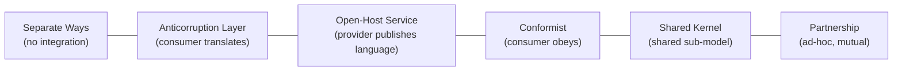
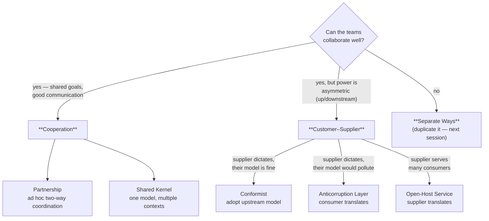
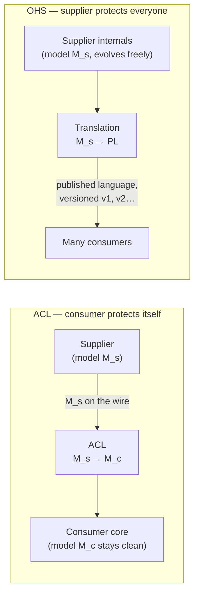

# LDDD Notes

_Entries follow the template at `Notes/TEMPLATE.md`. Append-only. **Newest entry at top**, immediately after this header._

---

## [2026-06-10] Separate Ways & the Context Map · pp.82–90 · Ch.4 §Separate Ways → Ch.5 §Transaction Script

- **Separate Ways**: when *not* integrating is the cheaper option — and the one case it's forbidden
- The **Context Map**: a visual of bounded contexts + integrations that doubles as an org X-ray
- A first tactical pattern: **Transaction Script**, and the one thing it's easy to get wrong

### History — "why does this exist?"
Part I of *Learning DDD* (Khononov, 2021) builds the integration-pattern catalog — partnership, shared kernel, conformist, anticorruption layer (ACL), open-host service (OHS). This chunk closes that catalog with its **null option** and a synthesis tool, then pivots to Part II ("how"). The Context Map idea comes straight from Eric Evans' 2003 *Domain-Driven Design* — it existed because large systems kept failing at the *seams between teams*, not inside any one module.

### Intuition — "this is like…"
**Separate Ways** is the *"just copy the function"* decision every monorepo team eventually makes: two services each ship their own tiny logging shim rather than stand up a shared logging *service*, because the integration tax exceeds the duplication tax. The **Context Map** is the **AWS architecture diagram** of your domain — but where the arrows encode not just data flow but *team relationships* (who trusts whom, who's defending against whom).

### Mechanics
**Separate Ways — deliberately not integrating.** Three triggers, all reducing to "collaboration costs more than duplication":

| Trigger | Why duplicate instead | 
|---|---|
| **Communication friction** | org size / politics make agreement too costly |
| **Generic subdomain** | e.g. a logging framework — local integration is trivial, a shared service is overkill |
| **Model differences** | models so divergent that even an ACL is pricier than duplicating |

> **The hard rule:** *never* use Separate Ways for a **core subdomain**. Duplicating your competitive-advantage logic in two contexts defeats the entire reason you invested in it — you'd fork the thing you most need to keep coherent and optimized.

**The full integration spectrum** (this chunk's recap — ordered loose→tight coupling):



| Pattern | Who adapts | Coupling | One-liner |
|---|---|---|---|
| Separate Ways | nobody | none | duplicate, don't talk |
| ACL | consumer | low | consumer translates provider's model into its own |
| Open-Host Service | provider | low | provider exposes a **published language** for all |
| Conformist | consumer | high | consumer swallows provider's model as-is |
| Shared Kernel | both | high | a small overlapping model jointly owned |
| Partnership | both | high | ad-hoc, two-way coordination |

**The Context Map** plots these onto one diagram, and it reads on three levels:
- **High-level design** — what components exist and which models they implement.
- **Communication patterns** — which teams collaborate vs. keep "less intimate" relations (ACL, Separate Ways).
- **Organizational X-ray** — *patterns of patterns*: if **every** downstream of one team builds an ACL, that team's model is a liability; if all the Separate Ways cluster around one team, that team can't collaborate.

Limits: a single bounded context spanning several subdomains can have *multiple* integration patterns at once (e.g. partnership *and* ACL on the same map). Best maintained **as code** (tool: Context Mapper), with each team owning its own edges.

**Pivot to tactics — Transaction Script** (Ch.5, Fowler's term). Organize business logic as **procedures, one per request** from the presentation layer. The public operations *are* the encapsulation boundary.

```csharp
DB.StartTransaction();
var job = DB.LoadNextJob();
var json = LoadFile(job.Source);
var xml  = ConvertJsonToXml(json);
WriteFile(job.Destination, xml.ToString());
DB.MarkJobAsCompleted(job);
DB.Commit();
```

> **The one thing it's easy to get wrong:** the *transactional* guarantee in the name. Every script must wholly succeed or wholly fail — never leave an invalid state. The snippet above has a trap: the file is written *before* `Commit()`, so a crash between `WriteFile` and `MarkJobAsCompleted` leaves a written file with the job un-marked — a partial effect a DB rollback can't undo. Real transaction scripts need **idempotency or compensating actions** for non-transactional resources (files, network). Khononov notes most production bugs he debugged "boiled down to a misimplementation of the transactional behavior."

### Where this shows up in real systems
- **Stripe / Twilio** are textbook **Open-Host Services**: a versioned public API (the "published language") that thousands of consumers integrate against without the providers ever conforming to *them*.
- A microservice copying a shared `enum`/validation snippet rather than calling a `common-config` service is **Separate Ways** in the wild — the duplication tax beats the network+ownership tax.
- **Outbox pattern** is exactly the Transaction Script fix: write the side-effect (a message row) *inside* the DB transaction, then a relay publishes it — turning a non-transactional resource into a transactional one.

### Diagnostic questions
1. Why is Separate Ways banned for a core subdomain? — "it isn't" misses that forking core logic defeats the whole point of investing in it.
2. On a context map, every consumer of Team A builds an ACL — what does that signal? — "good isolation" is the rosy read; it actually flags Team A's model as a shared liability.
3. The JSON→XML script crashes after `WriteFile` but before `Commit` — is state consistent? — "yes, the DB rolls back" forgets the *file* already exists; the rollback can't unwrite it.
4. ACL vs. Conformist — who absorbs the pain? — swapping them means you've inverted who adapts: ACL = consumer defends; Conformist = consumer surrenders.

---

## [2026-06-07] Bounded context integration patterns · pp.75–81 · Ch.4 §Cooperation → §Customer–Supplier

- Contracts: why independent models still need coordinated touchpoints, and whose language wins
- Cooperation patterns — partnership (ad hoc, two-way) vs shared kernel (one model, multiple owners)
- Customer–supplier patterns — conformist, anticorruption layer, open-host service: three answers to power imbalance

### History — "why does this exist?"

**Evans's DDD book (2003)** introduced bounded contexts but spent most of its pages inside one; the integration patterns (context maps, ACL, conformist, shared kernel) were its underdeveloped strategic chapter. The gap became urgent when **microservices (Fowler/Lewis, 2014)** turned every context boundary into a network boundary and an org boundary at once — suddenly "whose model crosses the wire?" was a daily production question, not a modeling nicety. **Conway's law (1968)** is the load-bearing ancestor: communication structure determines system structure, so Vernon (2013) and Khononov reorganized Evans's patterns explicitly around *team relationships* — the pattern you can use is determined by the quality and symmetry of collaboration between the two teams, not by what's architecturally elegant.

### Intuition — "this is like…"

The customer–supplier patterns are the three ways your service can relate to the **Stripe API**. If you embed Stripe's objects (`PaymentIntent`, `Charge`) directly through your codebase, you're a **conformist** — cheap, and fine because Stripe's model is industry-grade. If you wrap Stripe behind your own `PaymentGateway` interface that speaks *your* domain language (`CollectDeposit`, `RefundBooking`), that wrapper is an **anticorruption layer** — you pay a translation tax to keep foreign concepts out of your core. And Stripe's own public API is an **open-host service**: their internal ledger model evolves weekly, but the published API (with `/v1/`, versioned, backwards-compatible) is a deliberately decoupled **published language** — supplier-side translation so thousands of consumers don't need ACLs. Power decides which seat you sit in: with Stripe you have none; with a sister team you might negotiate a partnership instead.

### Mechanics

#### The organizing axis: collaboration type → pattern family



**Contracts** exist because two contexts by definition speak different ubiquitous languages — so every touchpoint forces the question *which language crosses the boundary?* Each pattern is a different answer:

| Pattern | Whose model crosses | Who pays translation | Coupling | Precondition |
|---|---|---|---|---|
| Partnership | negotiated per change | both, ad hoc | medium | frequent sync, high commitment, co-located-ish |
| Shared kernel | a jointly-owned overlap | both, continuously | **highest** | shared repo/library + integration tests on every change |
| Conformist | upstream's, wholesale | nobody (downstream absorbs) | high, one-way | upstream model is good enough / industry standard |
| Anticorruption layer | upstream's → translated at edge | **downstream** | low (for the core) | translation worth the effort |
| Open-host service | published language (≠ internal model) | **upstream** | low (for everyone) | supplier motivated to protect consumers |

#### Shared kernel — the deliberate rule-break

The shared kernel violates the previous chapter's core principle (one team owns one bounded context): the overlapping model is owned by *multiple* teams simultaneously. The book justifies it with one inequality:

```
use shared kernel  ⇔  cost(duplication) > cost(coordination)
```

- Both costs scale with **model volatility** — the more it changes, the more expensive both duplication-drift and coordination become, but integration cost grows faster. Hence the paradox: the shared kernel fits best for **core subdomains**, the most volatile code you have (e.g., one permissions/authorization model that every context must enforce identically — divergence there is a security bug, not an inconvenience).
- Containment rules: keep the kernel as thin as possible — ideally just **integration contracts + data structures that cross boundaries**; every kernel change triggers integration tests in *all* participating contexts; mono-repo shared sources or a linked library, but never lagging copies (stale kernels → data corruption).
- Legitimate uses: (1) substitute for partnership when geography/politics blocks ad hoc coordination, (2) **temporary scaffolding while decomposing a legacy monolith**, (3) same-team contexts, where an explicit kernel stops a partnership from "washing out" the boundary over time.

#### Anticorruption layer vs open-host service — mirror images

The two are the *same translation*, placed on opposite sides of the boundary, paid for by whoever has the motivation:



When to reach for an **ACL** (downstream is weak but unwilling to conform):
1. Downstream contains a **core subdomain** — conforming to a foreign model would warp the model that *is* your competitive advantage
2. Upstream model is a mess (typical: legacy integration) — "conform to a mess and you become a mess"
3. Upstream contract churns — the ACL converts N upstream changes into N translator patches, zero core changes

When **OHS** appears (upstream cares about consumers): the public interface is decoupled from the implementation model *on purpose*, expressed in an integration-oriented **published language**. Decoupling buys two freedoms: internals evolve without breaking anyone (as long as they still translate to the PL), and the supplier can expose **multiple PL versions simultaneously** for gradual consumer migration — exactly the `/v1/`–`/v2/` API versioning discipline, derived from first principles rather than REST folklore.

Conformist is the do-nothing baseline that makes both visible as *choices*: it's correct when the upstream model is an industry standard (you don't ACL-wrap ISO currency codes) or simply good enough — autonomy isn't free, and an ACL guarding a model with no special semantics is pure overhead.

### If you were the downstream architect…

Your booking context consumes a 15-year-old mainframe inventory system, and your team has zero leverage over its COBOL-shaped exports (`ITM-MSTR-REC` with 47 fields, 9 of which matter). Conform, or build an ACL? The mechanical test from the chapter: is your context a **core subdomain** (yes — availability search is the product), is the upstream model inconvenient (extremely), does it change often (rarely, actually). Two of three point to ACL — and the book's sharper point is *where the benefit lands*: the translation isolates your ubiquitous language, so "availability" in your context means what your domain experts mean, not what a 1998 batch job encoded. The ACL is a vocabulary firewall before it's a technical adapter.

Follow-up the chapter forces: who maintains the ACL when the mainframe team ships a field rename? You do — that's the deal. ACL converts "upstream change breaks my core" into "upstream change patches my translator," it never converts it into "not my problem." If that maintenance tax exceeds what boundary purity buys you, you've re-derived the conformist condition.

### Where this shows up in real systems

- **Stripe/Twilio/AWS APIs are open-host services**: versioned published languages (`/v1/`, API date-pinning in Stripe's case) explicitly decoupled from internals, with multiple versions live simultaneously for gradual migration — the chapter's Figure 4-7 is literally Stripe's `Stripe-Version` header mechanism.
- **Kafka schema registry + canonical event schemas** are a shared kernel in stream form: the event types are jointly-owned data structures that cross context boundaries, every producer/consumer must integrate against the same registry, and a schema change triggers compatibility checks across all of them — the "integration tests on every kernel change" rule, automated.
- **Strangler-fig migrations** (e.g., wrapping a monolith's order tables behind a façade while extracting services) run the chapter's playbook: an ACL guards each new service from the legacy model, while a *temporary* shared kernel (the still-shared database) holds things together until decomposition completes.

### Diagnostic questions

1. **Your two teams sit in one office, ship together, trust each other. Why might you still formalize a shared kernel instead of relying on partnership?** — "Partnership is enough" misses the long game: ad hoc integration between friendly teams erodes the boundary itself; an explicit kernel pins down *what* is shared so everything else can diverge safely.
2. **A teammate proposes an ACL in front of the ISO-4217 currency-code feed "for decoupling." What's wrong?** — Reflexive ACL-wrapping ignores the applicability test: the upstream model is an industry standard with no impedance mismatch; the layer adds maintenance cost and translates nothing.
3. **The shared kernel should be as small as possible — what failure mode grows with its size?** — "More code to maintain" is shallow; the real cost is the **cascading-change blast radius**: every kernel word is coupled to every participating context's release cycle.
4. **OHS and ACL both translate models. What single question decides which side of the boundary the translator lives on?** — If you answer "architecture," wrong axis: it's *motivation/power* — a supplier with many consumers internalizes the cost once (OHS); an indifferent supplier externalizes it to each consumer (ACL).
5. **Why does a conformist relationship deserve an entry in your context map even though you built nothing?** — Treating it as "no integration work" hides a strategic fact: your model's evolution is now chained to a foreign team's roadmap — that dependency must be visible when someone asks why the domain model has Salesforce-shaped corners.

---

## [2026-05-27] Bounded context boundaries · pp.65–73 · Ch.3 §Interplay Between Subdomains and BCs → §Boundaries → §BCs in Real Life → §Conclusion

- Subdomains are discovered (business strategy); bounded contexts are designed (software decision)
- Physical boundaries (separate services) vs ownership boundaries (one team per BC)
- Real-life bounded contexts: semantic domains, science models, the refrigerator cardboard

### History — "why does this exist?"

The term **bounded context** was coined by **Eric Evans in *Domain-Driven Design* (2003)**, but the underlying idea — that a model should have an explicit scope — has older roots. **Fred Brooks's *Mythical Man Month* (1975)** argued that conceptual integrity requires one mind (or a small group) to own each subsystem's design, which is the ownership-boundary idea before it had a name. **Conway's Law (1967)** — "organizations produce designs which are copies of their communication structures" — is the empirical observation that bounded contexts codify into a design principle. The **microservices movement (2011–2014, Fowler & Lewis)** made bounded contexts operational by mapping each BC to a deployable service, but the DDD community insists the *logical* boundary matters more than the *physical* one — you can have bounded contexts inside a monolith.

### Intuition — "this is like…"

A bounded context is a **Git repository boundary**. Inside one repo, everyone shares the same naming conventions, the same CI pipeline, the same `main` branch. Across repos, the same word can mean different things — `User` in the auth repo is a credential holder; `User` in the billing repo is a payment method owner. The repo boundary forces explicit communication (APIs, published events) instead of implicit coupling (shared database tables). Subdomains are like the business units that *need* these repos; bounded contexts are how *you* chose to draw the repo lines.

### Mechanics

#### Subdomains vs bounded contexts — the fundamental asymmetry

| | Subdomains | Bounded contexts |
|---|---|---|
| **Origin** | Discovered from business strategy | Designed as software architecture |
| **Who decides** | The business (domain experts) | The engineering team |
| **Granularity** | Fixed by the problem domain | Flexible — you choose the scope |
| **Relationship** | One subdomain can span multiple BCs | One BC can contain multiple subdomains |
| **Analogy** | The terrain | The map you draw of the terrain |

The textbook's key sentence: *"Subdomains are discovered and bounded contexts are designed."* This is the load-bearing distinction. You don't get to choose whether marketing and sales are separate subdomains — the business decided that. But you *do* get to choose whether they're one bounded context (shared model, one team) or two (separate models, separate teams).

**Why the one-to-one mapping isn't always right:**

```
┌─────────────────────────────────────────────────┐
│  One-to-one (BC per subdomain)                   │
│  + Maximum model isolation                       │
│  + Each team owns exactly one domain concept     │
│  – More integration overhead (APIs between BCs)   │
│  – Overhead may not pay for small subdomains      │
│                                                   │
│  Many-to-one (multiple subdomains in one BC)     │
│  + Less integration code                          │
│  + Simpler deployment                             │
│  – Models may conflict as the subdomains grow     │
│  – One team must understand multiple domains      │
└─────────────────────────────────────────────────┘
```

The choice depends on **team size, rate of change, and model complexity**. A startup with 5 engineers and 3 subdomains should probably use 1–2 bounded contexts (monolith with clear modules). A company with 50 engineers and 10 subdomains should lean toward more BCs to reduce cross-team coupling.

#### Physical boundaries

Each bounded context should be **implemented as an independent service/project** — its own repository, its own build pipeline, its own deployment. This is the operational meaning of "bounded."

```
┌──────────────────────────────────────────────────────────────┐
│  Bounded Context A (Marketing)    Bounded Context B (Sales)  │
│  ┌────────────────────────────┐  ┌────────────────────────┐  │
│  │ repo: marketing-svc        │  │ repo: sales-svc         │  │
│  │ lang: Python               │  │ lang: Go                │  │
│  │ db:   Postgres             │  │ db:   MongoDB           │  │
│  │ deploy: K8s namespace      │  │ deploy: K8s namespace   │  │
│  └────────────────────────────┘  └────────────────────────┘  │
│                                                              │
│  Communication: API calls or domain events (never shared DB) │
└──────────────────────────────────────────────────────────────┘
```

Physical boundaries enable **technology heterogeneity** — each BC picks the stack that fits its problem. Marketing might need Python for ML pipelines; Sales might need Go for high-throughput event processing. This is impossible if they share a codebase.

When a bounded context contains multiple subdomains, the subdomains become **logical boundaries** — namespaces, modules, or packages within the service. The BC is the deployment unit; the subdomains are the organization units within it.

#### Ownership boundaries

**One team per bounded context.** No two teams work on the same BC. This eliminates implicit assumptions: if team A owns the Marketing BC and team B owns Sales, they *must* define explicit contracts (APIs, events, schemas) to integrate.

The reverse is allowed: **one team can own multiple bounded contexts** — but each BC has exactly one owner.

```
  Team 1 ─── owns ──► Marketing BC
         └── owns ──► Optimization BC

  Team 2 ─── owns ──► Sales BC

  ✗ INVALID: Team 1 + Team 2 ──► same BC
```

This is Conway's Law applied deliberately: you're shaping the software boundaries to match the team structure you *want*, not the one you happen to have. The DDD community calls this the **Inverse Conway Manoeuvre** — design the org structure to produce the architecture you need.

#### Real-life bounded contexts (the chapter's examples)

**Semantic domains — the tomato:** In botany (grows from a flower, bears seeds) → fruit. In culinary arts (tough, bland, requires cooking) → vegetable. In US tax law (1893 Supreme Court ruling to close a tariff loophole) → vegetable. In theatrical performance → feedback mechanism. Four bounded contexts, four definitions of the same entity — and each is correct *within its context*.

**Science — Newton vs Einstein:** Newton's gravity model (absolute space and time, force = GMm/r²) and Einstein's (spacetime curvature, E = mc²) are contradictory, but both are useful in their bounded contexts. You use Newton for bridge engineering; Einstein for GPS satellite corrections. Applying the wrong model in the wrong context produces wrong answers.

**The refrigerator cardboard (the chapter's best example):**

```
Problem: Will this Siemens fridge fit through the kitchen door?

Model 1: Cardboard cutout (width × depth)
  ✓ Solves: can the base pass through?
  ✗ Omits: height, colour, features

Model 2: Tape measure (height only)
  ✓ Solves: is it too tall for the doorway?
  ✗ Omits: everything else

"Building a 3D model of the fridge would be gross overengineering."
```

Two models of the same entity, each optimized for a specific problem. This is the DDD principle in physical form: **a model should omit information irrelevant to its task**. A bounded context scopes what's relevant; everything else is noise.

### Where this shows up in real systems

- **Amazon's "two-pizza teams"** are bounded-context ownership made operational. Each team owns a service (BC), communicates with others via APIs, and can deploy independently. The famous 2002 Bezos mandate — "all teams will henceforth expose their data and functionality through service interfaces" — is the physical-boundary rule in corporate memo form.
- **Stripe's API versioning** is bounded-context evolution: each API version is effectively a snapshot of the model at a point in time. When Stripe introduces a breaking change to `PaymentIntent`, old versions keep working because the bounded context's contract is versioned, not its implementation.
- **Postgres schemas** are logical boundaries within a physical boundary (one database). A `marketing` schema and a `sales` schema can define their own `users` table with different columns — the schema is the namespace that prevents model collision, exactly like subdomains within a single bounded context.

### Diagnostic questions

1. **Q:** A startup has 3 engineers and 4 subdomains. Should they create 4 bounded contexts?
   *Wrong-answer trap:* "Yes, one per subdomain." Probably not — 4 BCs means 4 services, 4 deployments, 4 API contracts, for 3 people. The integration overhead would dominate. Better: 1–2 BCs with subdomains as modules, splitting later when team size justifies it.

2. **Q:** Two teams want to work on the same bounded context. What does DDD say?
   *Wrong-answer trap:* "It's fine if they coordinate." DDD says no — one BC, one team. If two teams need to modify the same model, either split the BC or reorganize the teams. Shared ownership produces implicit assumptions that corrupt the ubiquitous language.

3. **Q:** Is a microservice always a bounded context?
   *Wrong-answer trap:* "Yes." Not necessarily. A microservice is a deployment unit. A bounded context is a model boundary. You can have a bounded context implemented as a monolith module, or a microservice that's too granular to represent a meaningful BC (anemic microservice). The boundaries should align, but they're conceptually independent.

4. **Q:** The tomato is a fruit in botany and a vegetable in culinary arts. In DDD terms, what went wrong when the US taxed it as a vegetable?
   *Wrong-answer trap:* "They picked the wrong model." Nothing went wrong — they *chose* a bounded context (taxation) and applied its model consistently. The 1893 Supreme Court ruling is a deliberate design decision, not a mistake. This is the whole point: the same entity has different correct models in different contexts.

---

## [2026-05-26] Bounded contexts · pp.56–64 · Ch.2 §Challenges (end) → Ch.3 *Managing Domain Complexity* (Inconsistent Models → What Is a Bounded Context → Model Boundaries → Scope → vs Subdomains intro)

- Why a single "ubiquitous language" cannot span an organisation
- The lead-in-sales vs lead-in-marketing canonical example
- Bounded-context size as a strategic trade — and what *not* to split

### History — "why does this exist?"
**Eric Evans' *Domain-Driven Design* (2003)** coined "bounded context" as the answer to a recurring failure: companies that tried to build "the enterprise data model" — one canonical schema for `Customer`, `Order`, `Product` across all departments — found that the model collapsed under the weight of every department's edge cases. Evans' insight: stop trying. Different departments *do* mean different things by `Customer`, and that's not a defect to standardise away — it's a structural property of the business. Vernon's *Implementing DDD* (2013) and Khononov's *Learning DDD* (2021, this book) industrialised the pattern into the standard microservices boundary-finder of the 2020s. Today, "one bounded context per service" is the default microservice-decomposition heuristic — see Sam Newman's *Building Microservices* (2015, 2nd ed. 2021).

### Intuition — "this is like…"
A bounded context is a **PostgreSQL schema, not a database**. Two schemas in the same DB can each have a `customer` table that means subtly different things (`marketing.customer` is a lead with email + UTM tags; `billing.customer` is an entity with a tax ID and credit terms). Cross-schema queries are allowed but explicit — `SELECT … FROM billing.customer JOIN marketing.customer ON …` — exactly the way DDD insists cross-context references be explicit (via context mapping). The schema namespace is the bounded context; the table is the model; the prefix `billing.` is the context-resolving prefix that humans drop in conversation because *context disambiguates*.

### Mechanics

**The inconsistent-models problem, visualised.**

```
Telemarketing company

 ┌─────────────────────────┐    ┌─────────────────────────┐
 │ Marketing department    │    │ Sales department        │
 │                         │    │                         │
 │ "lead"                  │    │ "lead"                  │
 │   = a notification      │    │   = the whole lifecycle │
 │     event               │    │     of a sales process  │
 │   ↳ {name, email, src}  │    │   ↳ state machine:      │
 │   (one row, immutable)  │    │     new → contacted →   │
 │                         │    │     qualified → won/    │
 │                         │    │     lost                │
 └─────────────────────────┘    └─────────────────────────┘
            │                            │
            │  same word                 │  same word
            │  different model           │  different model
            ▼                            ▼
       ❌ One "lead" table forced to serve both
          → brittle, over- AND under-specified at the same time
```

**Three failed responses** (the book walks through these as antipatterns):

| Attempt | Why it fails |
|---|---|
| One canonical Lead model serving both departments | Enterprise ER diagrams that "span office walls" — model is jack-of-all-trades, master-of-none. Filtering complexity *and* state-consistency complexity both blow up. |
| Prefix all conflicting terms: `MarketingLead` vs `SalesLead` | Adds cognitive load — devs must always remember which one. Worse, *humans don't say the prefix in conversation* — the code drifts from the ubiquitous language. |
| Build only one and force the other dept to use it | The forced department gets either a too-simple model that breaks their workflow, or a too-complex one that drowns them in irrelevant fields. |

**The DDD answer — bounded context:**

```
 ┌─ Marketing BC ──────────┐   ┌─ Sales BC ─────────────┐
 │ ubiquitous language:    │   │ ubiquitous language:   │
 │   lead = event          │   │   lead = lifecycle obj │
 │   campaign, channel,    │   │   funnel stage, owner, │
 │   conversion rate       │   │   close date, revenue  │
 │                         │   │                        │
 │ model: Lead { name,     │   │ model: Lead { stage,   │
 │   email, source }       │   │   activities[], owner, │
 │                         │   │   estimatedClose }     │
 └─────────────────────────┘   └────────────────────────┘
              │  interaction across boundary is EXPLICIT
              └─────► (context-mapping pattern, Ch.4)
```

Each context's language is consistent **inside** its boundary; conflicts only exist **across** boundaries, where they are managed by explicit context-mapping (Open Host Service, ACL, Shared Kernel — all next chapter).

**Defining the boundary — strategic decision, not technical.** Khononov breaks the size choice into two pulls:

```
Pull WIDER                                Pull NARROWER
─────────────                              ─────────────
+ Fewer integrations to design             + Easier to keep language consistent
+ Less deployment coordination overhead    + Smaller team can own it end-to-end
+ Simpler context map                      + Independent scaling/deployment
                                           + Independent release cadence

– Harder to keep ubiquitous language       – Combinatorial integration cost
  consistent as scope grows                – Synchronous cross-context calls
– Multiple teams trip over the model       – Distributed-transaction headaches
```

**The hard rule the book gives:** *"avoid splitting a coherent functionality into multiple bounded contexts."* If two pieces of behaviour operate on the same data and change together, splitting them just couples them across a network boundary instead of inside a process — strictly worse.

**Worked example — sizing a context.** WolfDesk (the running example): tickets, agents, billing, knowledge base.

```
Candidate decomposition A — by domain-experts' inherent boundaries:
  • Ticketing  (tickets, comments, attachments)
  • Identity   (agents, customers, auth)
  • Billing    (subscriptions, invoices)
  • KB         (articles, search)

  → 4 contexts. Each has a clear ubiquitous language. Independent teams plausible.

Candidate decomposition B — split Ticketing further:
  • Ticket Intake (creation, classification)
  • Ticket Workflow (assignment, escalation)
  • Ticket Resolution (closure, satisfaction surveys)

  → 6 contexts. Each is tiny. But ticket-state changes flow across all three;
     a single "agent closes a ticket" use case now requires distributed
     transactions or eventual consistency. **Almost certainly over-decomposed.**
```

Decomposition A respects domain inherent boundaries (different experts, different vocabularies). Decomposition B violates the "coherent functionality stays together" rule.

**Bounded context ≠ subdomain — preview of the next section.** Subdomains (Ch.1) are *discovered* — they exist in the business whether you model them or not (Core, Supporting, Generic). Bounded contexts are *designed* — they are your modelling choice. The mapping is often 1-to-1 for core subdomains, but supporting/generic subdomains may share or merge contexts. The book unpacks this in the very next section.

### If you were the domain modeller…

You walk into WolfDesk and notice the same word `customer` used by both billing and support, with subtly different meanings — billing cares about payment method and currency; support cares about contact channel and language. Two engineers propose: (a) one `Customer` entity shared across both, (b) two separate `Customer` entities in two bounded contexts.

**Option (b) — separate contexts — almost always wins**, and the diagnostic is: *do the two interpretations evolve together?* If billing adds a new payment field, does support also need to know? If support adds a preferred language, does billing care? If the answers are no, the two `Customer`s have independent change reasons (the Single Responsibility Principle at the model level) — the *same noun* describing two *different things*. Force them into one entity and every change to either side will ripple through both.

### Cross-language view
*(n/a — bounded context is a design-time concept; there's no code form. The closest code-level analogue: package boundaries with **no cross-package imports** of internal types, e.g., Java module-info `requires`/`exports`, or Go's lowercase identifiers as the only enforced visibility boundary. See Where this shows up below.)*

### Where this shows up in real systems

- **Microservices boundaries.** Sam Newman's "one bounded context per service" heuristic is now the default microservice-decomposition heuristic — when the heuristic is followed, services deploy independently; when it's violated (e.g., two services sharing a database table), the deployment story collapses and you have a distributed monolith.
- **Postgres schemas and Snowflake databases.** A real-world implementation of "name the context explicitly" — `marketing.lead` and `sales.lead` can coexist, queries that cross schemas are explicit, and migrations are scoped to a schema. The schema *is* the bounded context's deployment artefact.
- **Stripe's API surface separation.** Stripe has distinct REST namespaces for `customers`, `subscriptions`, `invoices` — but the *Connect* product separates a Stripe account's customers from a platform's customers via a different bounded context entirely (`connected accounts`). What looks like Stripe-specific complexity is bounded-context discipline applied at API design time.
- **Slack's Channels vs DM models.** Internally these started as the same model and were split into bounded contexts as their behavioural divergence (retention, federation, threading) exceeded what one model could carry — the classic over-shared-model failure mode applied at platform scale.

### Diagnostic questions

1. **Q:** Why is "prefix the ambiguous term with the department name" considered an antipattern?
   *Wrong-answer trap:* "Because it makes the code uglier." It does, but the deeper reason: **humans drop the prefix in conversation**, so the code's ubiquitous language drifts from the actual spoken language — the failure DDD set out to fix.

2. **Q:** When is it correct to *not* split into multiple bounded contexts even though two teams use the term differently?
   *Wrong-answer trap:* "Never — always split." Wrong: if the two interpretations evolve together (every change to one needs an identical change to the other), splitting just adds integration overhead with no decoupling benefit.

3. **Q:** What's the cost of making bounded contexts *too small*?
   *Wrong-answer trap:* "Slower performance." Performance is incidental. The real cost: **integration overhead — every cross-context call is now a synchronous network hop or a distributed transaction**, and a single coherent business operation requires coordination across N services.

4. **Q:** Is bounded context a design decision or a discovery?
   *Wrong-answer trap:* "Discovery — it follows the business." Half right — subdomains are discovered; bounded contexts are *designed* atop them. You pick which subdomain(s) a bounded context covers.

5. **Q:** Two domain experts insist that `Policy` has the same meaning in their respective contexts. You're told to use a single model. What evidence would change your mind?
   *Wrong-answer trap:* "They said it's the same — trust them." The diagnostic: ask each expert to walk through five edge cases (cancellation, renewal, dispute, lapse, audit). If their answers diverge at any one, you have two `Policy` models pretending to be one — split them.

---

## [2026-05-25] Ubiquitous language · pp.47–55 · Ch.2 *Discovering Domain Knowledge* — Business Problems → Communication → What Is a Ubiquitous Language → Language of the Business → Model of the Business Domain

- Why translation chains kill projects (the Telephone game of requirements)
- One vocabulary used by **everyone** — engineers, PMs, domain experts, legal
- The two decay modes to police: **ambiguous terms** and **synonymous terms**

### History — "why does this exist?"
**Eric Evans coined "ubiquitous language" in *Domain-Driven Design* (2003)** — the original "blue book." The setting was the late-1990s peak of UML-driven development (Booch, Rumbaugh, Jacobson) where the canonical pipeline went **domain expert → business analyst → requirements doc → design doc → code → schema → support runbook**. Every stage was a separate model with its own terminology, and every translation lost information. Evans's insight wasn't new linguistics — it was that the *translation itself* was the bug, not the artifact quality. Khononov's 2022 restatement (this book) sharpens two things: (1) it names the **Telephone game** as the explicit failure mode, and (2) it gives operational rules for catching language decay — **ambiguous terms** and **synonymous terms**, with worked examples. Brandolini's footnote epigraph captures the whole DDD ethos: "It's developers' (mis)understanding, not domain experts' knowledge, that gets released in production."

### Intuition — "this is like…"
A ubiquitous language is **Stripe's API surface**. When Stripe shipped `Charge`, `Refund`, `Dispute`, `PaymentIntent`, `Customer`, and `Source` as the only words on the dashboard, in the API responses, in the support tickets, and in the legal terms-of-service, **engineers and finance teams stopped translating**. A finance analyst saying "we need to reconcile the disputes from last week" maps 1:1 onto an API call (`stripe.disputes.list(...)`), a database table (`disputes`), and a customer-facing email ("Your dispute has been resolved"). One word, one meaning, every layer.

Contrast: a company where engineers say *transaction*, finance says *settlement*, support says *purchase*, ops says *event*, and legal says *obligation* — all referring to the same domain concept. Every cross-team Slack thread now contains an implicit translation table, every spec needs a glossary, every onboarding doc starts with "wait, what do we call this thing?" The cost is invisible in any one conversation and crushing across a year.

The Telephone-game framing is the failure shape: the message starts as *"sales commission is computed on approved transactions where the agent's tier matches"* and ends up as `tier_a_sales_v2.commission_calc()` reading a flag named `is_final` from a table named `txns` — and somewhere along the chain, "approved" got conflated with "settled," producing a $200K rounding error that took six months to find.

### Mechanics

#### The pipeline that doesn't work — and the one that does

```
WRONG (UML-era pipeline, ~1995)        RIGHT (DDD pipeline, ~2003)

  domain expert                          domain expert ◄─┐
       │                                       │         │ ubiquitous
       ▼ "translation"                         │         │ language
  business analyst                             ▼         │
       │                                  engineer  ◄────┤
       ▼ "analysis model"                      │         │
  requirements doc                             ▼         │
       │                                  source code ◄──┘
       ▼ "design model"                  (same vocabulary)
  software design doc
       │
       ▼ "implementation"
  source code  ── 4 translations, ~30% info loss per hop
```

The "right" side is **not** a hierarchy. It's a closed loop where the same words appear at every stop. The model in the engineer's head, the names in the source code, the labels in the UI, and the terms the domain expert uses in conversation **are the same words**.

#### The two language-decay modes — police these obsessively

| Mode | What it looks like | Real example | Fix |
|---|---|---|---|
| **Ambiguous term** (1 word, 2 meanings) | One word used for two distinct concepts | Insurance domain: "policy" = regulatory rule **OR** customer contract | Split into two terms: `RegulatoryRule` + `InsuranceContract` |
| **Synonymous terms** (2 words, *apparent* 1 meaning) | Multiple words used interchangeably that secretly denote different concepts | E-commerce: "user" = `visitor` (unregistered) **OR** `account` (registered, can buy) | Keep both terms; assign each to its real concept |

The asymmetry matters: **ambiguity is solved by splitting; false synonymy is solved by keeping distinct**. Most teams instinctively *merge* synonyms ("let's just standardize on `user`") which destroys the very distinction the domain experts were tracking.

#### Where to deploy the language — everywhere, with no exceptions

```
ubiquitous language must appear consistently in:

  ▸ Source code identifiers      class InsuranceContract { ... }
  ▸ Database schema              CREATE TABLE insurance_contracts (...)
  ▸ API endpoints                POST /v1/insurance_contracts
  ▸ UI labels                    "Cancel insurance contract"
  ▸ Internal docs / wikis        # How to renew an InsuranceContract
  ▸ Test names                   test_InsuranceContract_expires_on_renewal_failure
  ▸ Tickets / Slack threads      "the InsuranceContract.cancel flow is broken"
  ▸ Commit messages              "fix InsuranceContract.premium calculation"
  ▸ Conversations with domain experts
```

If the language is right on 8 of 9 surfaces but the database table is named `policy_v2` because of a 2019 migration, the **inconsistency itself is the bug**. Schema renames are cheap compared to the cumulative translation cost.

#### Two clarifying definitions from the chapter

> **Model** (Rebecca Wirfs-Brock, paraphrased): a simplified representation of a thing that intentionally emphasizes certain aspects while ignoring others. *Abstraction with a specific use in mind.*
>
> **Useful model** (George Box): "All models are wrong, but some are useful."

The ubiquitous language **is** the model — not a separate artifact. The names you choose, the distinctions you make explicit, the synonyms you refuse to collapse: that vocabulary is the abstraction the team operates inside. There's no "the language" and "the model" as separate things to keep aligned.

#### Worked failure — the cost of getting it wrong

Imagine an ad-tech startup. The domain has three real concepts:

- **Campaign**: a marketing initiative with a budget and a date range
- **Placement**: a specific ad slot the campaign is targeting (an iframe on a partner site)
- **Creative**: the actual image/video/text shown to a user

The team ships v1 with code that says:

```python
class Ad:                           # ← ambiguous: this is sometimes a Placement,
    campaign_id: int                #    sometimes a Creative
    placement_id: int               #    depending on context
    creative_url: str
```

Six months later, the engineering team is having weekly fights with the ad ops team. "Pause the ad" sometimes means *pause the campaign* (stops spending), sometimes *pause the placement* (skip this slot), sometimes *pause the creative* (don't show this image). The bug-tracking ticket says "ads not pausing"; the fix takes 4 engineer-days because three different systems each interpret "ad" differently.

The fix is **not** more careful coding — it's renaming `Ad` everywhere into `Campaign | Placement | Creative` with no overlap, propagating the rename through the API, the UI, the docs, and the spoken vocabulary. After the rename, "pause the campaign" is unambiguous; the ticket goes from 4 engineer-days to 4 minutes.

This is the entire chapter's argument in one example: **language errors compound into engineering costs**, and the only fix is the vocabulary, not the code.

#### The glossary tooling sidebar

Modern enablers Khononov mentions or implies:

| Tool | Captures | Limitation |
|---|---|---|
| Confluence/Notion glossary wiki | Noun definitions, ownership | Goes stale; people stop checking |
| OpenAPI / Stripe-style API reference | Object names + their fields | Verbs/behavior leak into method names only |
| Gherkin / Cucumber scenarios | Behavior in user language ("Given... When... Then...") | Verbose; needs maintenance |
| Type system (Rust newtypes, TypeScript branded types) | Prevents accidental cross-use (`UserId` ≠ `AccountId`) | Compile-time only |
| Linear/Jira custom fields | Domain attribution on tickets | Only as good as the field discipline |

The right answer is usually **glossary + types + tests** — a wiki for definitions, a type system that catches misuse, and Gherkin tests that exercise the language live.

### Where this shows up in real systems
- **Stripe** built `Charge`, `Refund`, `Dispute`, `PaymentIntent`, `Source`, `Customer`, `Subscription`, `Invoice` as the only nouns in the API and refuses to add overloaded terms. Watch what Stripe *doesn't* call things: there's no generic "transaction" object — because *transaction* is ambiguous (a card swipe? a settlement? a refund?). Naming discipline is the API design.
- **Linear** chose `Cycle` over "sprint" deliberately. Sprint had baggage from Scrum; Cycle is *their* word for *their* concept. Same for `Triage` instead of "backlog grooming." This is ubiquitous-language thinking applied to a tool's UX.
- **Kubernetes** invented `Pod`, `Deployment`, `ReplicaSet`, `Service`, `Ingress`, `ConfigMap`, `Secret` rather than overloading "container," "node," "app." Pod is famously *not* a container — a Pod is a shared-IP-namespace group of containers. The naming forced a distinction the technology required.
- **Git's** vocabulary (commit, branch, HEAD, refspec, fast-forward, rebase) is now universal but was Linus's invention. The community no longer says "checkpoint" or "snapshot version" — there's one word.
- **Failure example**: in microservices, "service" is overloaded across deployments, network endpoints, owning teams, and Kubernetes Service objects. Every kubernetes-or-microservices conversation contains an implicit disambiguation step. This is exactly the ambiguous-term decay the chapter warns against — and the industry never recovered from it.

### Diagnostic questions
1. **Your team's database has a `users` table containing both anonymous shoppers and registered customers. The product team complains that "user count" is misleading. Which decay mode is this?** *Wrong:* "ambiguous term." *Right:* **synonymous-terms decay** — the team merged what should have been two distinct concepts (`Visitor` and `Customer`) into one. Fix: split into two tables (or two role types) and refuse to collapse them.
2. **The word "order" appears in your codebase referring to (a) a customer purchase, (b) an engineering work-tracking ticket, (c) sort order in a query. Which decay mode?** *Wrong:* "all three." *Right:* **ambiguous-term decay** — one word, three concepts. Split into `PurchaseOrder`, `WorkItem`, and `SortDirection`. The third is so different that no one confuses it in code, but the first two get mixed up constantly in Slack.
3. **Stripe deliberately uses `Charge` instead of `Payment`. Why?** *Wrong:* "marketing." *Right:* **Payment is ambiguous in finance** — a payment can be a customer-initiated transfer, an invoice payoff, a subscription debit, a refund disbursement. *Charge* is the specific moment money moves *from* a card *to* a merchant, which is unambiguous in card-network terminology. The narrower word eliminates whole categories of misunderstanding.
4. **A domain expert says "I'd never put it that way" about a term in your code review. What's the right reaction?** *Wrong:* "It's just an internal name, doesn't matter." *Right:* **the language is wrong, fix it.** If the domain expert doesn't use the term, it's leaked engineering jargon (e.g., calling something `TaskScheduler` when the business calls it a `Roster`). The ubiquitous language is what *the expert* uses; the engineer's job is to listen.
5. **Why is "all models are wrong" load-bearing for the chapter's argument?** *Wrong:* "humility." *Right:* **it permits the deliberate simplification the ubiquitous language requires.** If your model had to capture *every* nuance, you couldn't have a small vocabulary. The fact that all models discard detail is exactly why a 30-word ubiquitous language can describe a complex business: the language captures *the parts that matter for the software*, and accepts that other aspects of the domain are out of scope.

---

## [2026-05-24] Distilling Subdomains in Practice — Use-Case Boundaries, Asymmetric Drill-Down, and the Domain Expert · pp.38–46 · Ch.1 *Analyzing Business Domains* — Identifying Subdomain Boundaries → Domain Analysis Examples (Gigmaster, BusVNext) → Domain Experts → Conclusion

### TL;DR
Subdomain *classification* (yesterday's entry) tells you what to do once you know which subdomain is which; subdomain *distillation* tells you **how to find the boundaries in the first place**. The chapter offers three operational rules: (1) **use coherent sets of use cases as the natural subdomain boundary** — the same actor manipulating closely-related data is one subdomain; (2) **drill down asymmetrically** — keep distilling core subdomains until you've isolated the precise differentiator, stop distilling generic and supporting subdomains once finer granularity stops revealing strategic differences; (3) **focus on the essentials** — many activities a company does aren't software at all, and identifying them as out-of-scope is itself a design decision. Two worked examples (**Gigmaster**, a ticket-recommendation app, and **BusVNext**, an algorithmic bus-routing company) demonstrate the full distillation pipeline ending in concrete build/buy/outsource decisions. Finally, the chapter introduces **domain experts** — the human knowledge source DDD's whole stack depends on; without them, the next ten chapters (ubiquitous language, event storming, bounded contexts) are unmoored.

### Intuition — "this is like…"
Subdomain distillation is like **using a magnifying glass at different strengths depending on what you're looking at**. For your core differentiator (your moat), you switch to the strongest lens — find the *specific algorithm*, the *specific data transformation*, the precise capability that competitors can't copy. For commodity work (auth, billing), the magnifying glass adds noise; you stop at "we'll use Auth0" because zooming in just shows you Auth0's internals which are not your problem. The asymmetric drill-down rule is the manager's equivalent of "spend your attention proportionally to leverage" — the fraud-detection company on p.31 has its core moat in *the analysts' judgment*, supporting work in *the case-management UI*, and zero competitive interest in *the help-desk phone system*. Treating all three with the same level of design rigor wastes everyone's time on two of them.

### Mechanics

#### What the chunk actually covers
- §End of *Identifying Subdomain Boundaries*: the customer-service department example continues — coarse "customer service" decomposes into help desk (generic) + shift management (supporting) + incident routing algorithm (**core** — the surprise)
- **Subdomains as coherent use cases** — the formal boundary rule
- **Asymmetric distillation rule** — distill core deeply, stop early for generic/supporting
- **Focus on essentials** — non-software business activities are out of scope
- **Two worked examples**: Gigmaster (ticket recommendations) and BusVNext (algorithmic bus routing)
- **Domain experts** — who they are, who they aren't, and why they matter
- Chapter conclusion + 7 exercises

#### Boundary rule: a subdomain ≈ a coherent set of use cases

```
   subdomain boundary heuristic
   ────────────────────────────
   actors ─┐
   data    ├── all closely related?  ─── YES ──► one subdomain
   verbs   ─┘                          NO ──► split further
```

The chapter's example: a *credit card payment* subdomain contains use cases like "authorize charge," "capture authorization," "issue refund," "void transaction" — same actor (the payment processor), same data (transactions, cards), same business invariants (auth windows, settlement rules). These form **one** subdomain. Add "send marketing email after purchase" and you've left the boundary — different actor (marketing system), different data (customer profile, campaign), even though it's triggered by the same event.

This use-case clustering is the **stopping criterion** for distillation. You stop drilling down when further granularity would split one coherent use-case bundle into pieces that share state and actors.

#### The asymmetric distillation rule (the chapter's most actionable heuristic)

```
        depth of distillation
              │
   ████████████  ← CORE: drill until you find the precise differentiator
   ██████        ← SUPPORTING: stop when use cases are clearly CRUD
   ███           ← GENERIC: stop once you've named the vendor category
              │
              └───────────────────────────────────────►
```

**Why asymmetric?** Because the *cost of misclassifying down a level* is asymmetric:
- A core subdomain misidentified as "this whole department" loses you the chance to isolate the *specific* moat (the routing algorithm) from the surrounding commodity work (case management, telephony). You'll over-invest in the commodity and under-invest in the moat.
- A generic subdomain misidentified as "twelve sub-features" wastes design effort on internal Auth0/Stripe details that don't affect your codebase. You'll under-deliver on the things that matter because you're optimizing the things that don't.

The customer-service example on p.38 (continued from yesterday) is the chapter's proof: surface-level "customer service is supporting" is *wrong* because it hides a core routing algorithm. Only the drill-down revealed it. **The drill-down is the work** — surface classification by department name will miss every real moat.

#### Worked Example 1 — Gigmaster (ticket recommendations)

```
   Business domain: ticket sales
   ─────────────────────────────

                CORE                    GENERIC              SUPPORTING
   ─────────────────────────  ───────────────────  ──────────────────────────
   Recommendation engine      Encryption          Streaming service integration
   Data anonymization         Accounting          Social network integration
   Mobile app UX              Clearing            Attended-gigs module
                              Authentication
```

The reasoning:
- **Core**: recommendation engine (the company's actual product); data anonymization (the company's stated *competitive* commitment to privacy — "your guilty pleasures won't leak"); mobile app UX (where users actually engage — bad UX = no users, regardless of algorithm quality)
- **Generic**: encryption, accounting, clearing, auth — every company needs them, vendors do them better, integrate don't build
- **Supporting**: integrations with Spotify/Apple Music/Facebook (CRUD-shaped ETL — fetch data, normalize, store); attended-gigs module (CRUD — log a gig)

Resulting design decisions (p.41):
1. Recommendation + anonymization + mobile = **in-house, advanced techniques, senior engineers, expect continuous evolution**
2. Encryption / accounting / clearing / auth = **off-the-shelf or open source**
3. Integrations + attended-gigs = **safe to outsource**

The non-obvious classification: **mobile app UX as core.** This is contextual to the business — for a B2B database vendor, the mobile app would be supporting or non-existent. For a consumer recommendation product, the app *is* the product surface; bad UX nullifies the algorithm. Classification depends on **what the customer is buying.**

#### Worked Example 2 — BusVNext (algorithmic bus routing)

```
   Business domain: public transportation (specifically: comfortable bus rides)
   ──────────────────────────────────────────────────────────────────────────

                CORE                         GENERIC             SUPPORTING
   ─────────────────────────────────  ───────────────────  ──────────────────
   Routing algorithm                  Traffic conditions   Promotions / coupons
   Data analysis (ride insights)      Accounting           management
   Mobile app UX                      Billing
   Fleet management                   Authorization
```

The routing algorithm is *explicitly* "a variant of the traveling salesman problem" optimized for shifting business priorities (the chapter notes the company recently re-tuned to prioritize pickup latency over total ride length after data showed long waits drove cancellations). This is the textbook core-subdomain profile: **complex + volatile + continuously optimized + differentiating**.

Fleet management is core because — non-obviously — the company's competitive advantage in operational reliability hinges on it. Compare to Uber, which doesn't own vehicles; for BusVNext, "the bus is broken" is a competitive event, not a vendor problem.

Promotions/coupons is supporting because it's a CRUD UI over a discount-code table — necessary, low-volatility, no algorithmic differentiation.

#### Same software, different classification depending on company

Both Gigmaster and BusVNext use:
- **Mobile app** — core in both (but for different reasons: recommendation surface vs. ride-ordering surface)
- **Authentication** — generic in both
- **Accounting** — generic in both

But the *routing algorithm* in BusVNext maps to the *recommendation engine* in Gigmaster — both are the company's specific intellectual property. **The same technical category (an algorithm doing customer-facing computation) can be core for company X and irrelevant for company Y.** Auth0 is generic for everyone; routing is core for BusVNext and would be generic (or non-existent) for a static-site CMS.

#### Focus on the essentials — the non-software subdomain trap

Many companies have **core subdomains that aren't software at all**. The jewelry maker's design (yesterday's example) is core — but it doesn't live in code. The fraud-detection company's analyst training is core — but no software captures it. When doing domain analysis, the chapter warns: **acknowledge non-software cores explicitly and exclude them from the design exercise.** Trying to model human expertise in software is one of the classic over-reach failures of "AI for X" projects.

The output of this step is a **scope statement**: "the routing algorithm is in scope; the customer-service rep's interpersonal skills are not." Without this discipline, projects keep expanding into territory where software can't deliver value.

#### Domain experts — who they are

```
   Domain expert  ≠  business analyst
   Domain expert  ≠  product manager
   Domain expert  ≠  engineer who "knows the business"

   Domain expert  =  the person from whom the knowledge ORIGINATES
                  =  the one who identified the business problem first
                  =  typically the requirement-giver OR the end user
```

The asymmetry: analysts and engineers *translate* business knowledge into requirements and code. Domain experts *are* the knowledge source. Mistaking analysts for domain experts is a chronic failure mode — analysts already filtered the knowledge through their understanding, and that filter is lossy. The next chapter (Ch.2 — *Discovering Domain Knowledge*) will be entirely about extracting knowledge directly from experts using **ubiquitous language** — but it presupposes you've correctly identified who they are.

For a single business domain there are typically **multiple experts with overlapping but non-identical knowledge** — the credit-card processor has compliance experts (PCI rules), risk experts (fraud patterns), settlement experts (clearing-window timing). Each is the source of truth for one slice; no single human knows the whole.

### If you were a new architect at BusVNext on day one…
You'd start by interviewing whoever invented the routing algorithm and whoever sets pickup-latency targets — those are your domain experts. You'd map their use cases ("dispatch the nearest bus", "re-route mid-trip when traffic alert fires", "cancel scheduled pickup when bus breaks down") and let the use-case clusters define subdomain boundaries — routing + fleet management + ride-analytics will fall out naturally as separate coherent clusters. You'd resist the instinct to model accounting in detail; that's generic, hand it to Stripe/Adyen. You'd resist the instinct to put promotions in the same module as routing because "they both affect rides" — they don't share state or actors, so they're separate subdomains regardless of UX adjacency. **Subdomain boundaries are about coherent business meaning, not screen adjacency.**

The trap to avoid: spending Q1 on the promotions admin UI because it has clear requirements and visible deliverables, while the routing algorithm — your actual moat — gets two weeks at end of quarter. The classification exercise exists to prevent exactly that allocation.

### Cross-language view *(n/a — this entry has no code form; classification is a modeling activity)*

### Where this shows up in real systems
- **Uber's engineering reorgs** are public case studies in distillation: the "Marketplace" team owns the matching algorithm (core); "Payments" was historically generic-with-supporting-glue (use Braintree + thin wrapper) until international expansion forced parts of it into core (per-country regulatory compliance). The reorg followed the classification, not the org chart.
- **Stripe's Atlas product** is a literal commercialization of the "auth/accounting/billing/clearing should be generic" insight from Gigmaster — Stripe noticed every YC company was rebuilding the same generic subdomains and packaged them as a service. The classification chart in this chapter is the market they're selling into.
- **AWS service decomposition** mirrors subdomain types — IAM/STS/billing are explicitly designed as generic foundations for all customer workloads; S3 is the generic storage primitive; Lambda's runtime is generic compute; *what runs in Lambda* is your core. The platform's organizing principle is "we'll be excellent at the generic; you focus on your core." This is yesterday's classification, scaled to a trillion-dollar business model.
- **Domain-expert capture in regulated industries** — Epic Systems (electronic health records) and Bloomberg (financial data) employ thousands of *domain experts* (clinicians, traders) in product roles specifically because the knowledge can't be sourced from engineers. Their org charts encode this chapter's insight: domain experts are first-class organizational citizens, not requirements donors.

### Diagnostic questions
1. **A team says "we identified 47 subdomains in our domain analysis." Should you be alarmed?** *Yes — over-distillation. 47 is almost certainly drilling past coherent use-case boundaries into single-screen granularity. The rule of thumb: subdomains should align with team-sized ownership, typically 5–15 for a mid-sized company. 47 means you're confusing UI features with strategic categories.*
2. **The CEO insists the company's "people" are its core subdomain. How do you respond as architect?** *Acknowledge it's true — and exclude it from the software model. The "Focus on the essentials" rule applies: if people skills are core, no software will replicate them. Your job is to build software that *supports* the people in the high-leverage tasks, not to model their expertise. The software's relationship to the core is amplification, not substitution.*
3. **Why is the use-case-cluster boundary stronger than the org-chart boundary?** *Org charts reflect historical accidents (acquisitions, manager preferences, headcount budgets). Use-case clusters reflect intrinsic structure (shared actors, shared data, shared invariants). When the two disagree, follow the use cases — the org chart will eventually be redrawn to match the work.*
4. **Both Gigmaster and BusVNext classify the mobile app as core. Is that a contradiction with "mobile apps are mostly UI scaffolding"?** *No — what's core is the **app UX specific to the company's product**, not the platform-level Swift/Kotlin/React-Native plumbing. The plumbing is generic (use frameworks). The user flows that map customer intent to product capabilities (gig-discovery flow for Gigmaster, ride-ordering flow for BusVNext) are core. Same word, different layer.*
5. **How does the asymmetric drill-down rule interact with limited engineering time?** *It's the primary justification: you have limited budget; spend it where granularity reveals leverage. The rule operationalizes "10x the effort on the 10% that matters" — but only after distillation has identified that 10%.*

### See also
- LDDD 2026-05-23 entry — the **classification taxonomy** (core/supporting/generic) that today's entry shows how to apply.
- LDDD Ch.2 (next) — *Discovering Domain Knowledge*, ubiquitous language, event storming — the techniques for extracting knowledge from the domain experts identified today.
- Wardley Mapping — finer-grained classification using the Genesis → Custom → Product → Commodity axis; maps onto LDDD's three types with more evolutionary nuance.
- WELC 2026-05-24 entry — *sensing and separation* applies the same asymmetric-effort principle at the code level: invest in seams where leverage is highest (commonly-changed core), tolerate poorer ergonomics in stable supporting code.
- *Team Topologies* (Skelton/Pais) — the org-design counterpart; "stream-aligned teams" map directly onto core subdomains, "platform teams" onto generic.

---

## [2026-05-23] Core, Supporting, Generic — Classifying Subdomains So Strategy Drives Software Design · pp.29–37 · Ch.1 *Analyzing Business Domains* (What Is a Business Domain? → Subdomains → Three Types → Comparing → Identifying Boundaries)

### TL;DR
Before you write any code, DDD asks you to **classify each subdomain of the business by its strategic value**, because that classification is the single most predictive input to the right implementation strategy. Three types exist: **core** (competitive advantage; complex; volatile; build in-house with your best engineers), **generic** (universal hard problems with battle-tested solutions; buy or adopt), and **supporting** (necessary but undifferentiated; CRUD-shaped; in-house but cheap, outsourceable). Misclassification is expensive in both directions: outsourcing a core subdomain hands competitors your moat; building a generic subdomain in-house burns runway on a solved problem. The chapter's quiet thesis is that **"what kind of subdomain is this?" is a more important question than "what language should we use?"** — the answer to the first determines the answer to the second.

### Intuition — "this is like…"
A restaurant has a kitchen (core — *this* chef's recipes are why you came), a payment terminal (generic — Stripe/Square, identical across every restaurant), and a reservation log (supporting — necessary, but writing your own from scratch when OpenTable exists is the same idea expressed worse). Vernon's claim is that pretending the kitchen is generic (using a franchised menu) destroys the restaurant's identity, and pretending the payment terminal is core (building a custom card-reader) burns six months on a problem Stripe solved. The art is **matching the energy you spend to the strategic payoff** — and the three-type taxonomy is the lens that makes the payoff visible *before* you've committed engineers.

### Mechanics

#### The two-level hierarchy: domain → subdomains
- **Business domain** = the service the company provides to customers (Starbucks: coffee; FedEx: courier delivery; Amazon: retail *and* cloud — companies can have multiple).
- **Subdomain** = a fine-grained area of activity the company *must* operate in to succeed in its business domain. Starbucks needs real-estate selection, hiring, finance, supply chain, *and* coffee-making — all subdomains. None alone is the business; together they compose it.

The relationship is **compositional but not symmetric**: you cannot succeed by being excellent in one subdomain and absent in another, but you do not need to be excellent in *every* subdomain. That asymmetry is what the three-type classification exploits.

#### The three subdomain types, side-by-side

| Aspect | **Core** | **Supporting** | **Generic** |
|---|---|---|---|
| **Competitive advantage** | Yes — this is the moat | No | No |
| **Business-logic complexity** | High | Low (CRUD, ETL) | High |
| **Volatility (rate of change)** | High — continuous evolution | Low | Low (patches only) |
| **Knowledge availability** | Proprietary / emergent | Obvious | "Known unknowns" — solved publicly |
| **Implementation strategy** | **Build in-house**, advanced techniques, best engineers | In-house *or* outsource; simple frameworks; train juniors here | **Buy** off-the-shelf / adopt open source |
| **Problem shape** | Interesting (unsolved) | Obvious | Solved |
| **Example** | Uber's matching algorithm; Google's PageRank | Online ad company's creative-asset catalog | Auth/SSO; payment processing; encryption |

The chart on p.35 (Figure 1-1) plots these on two axes — **business differentiation × business-logic complexity** — and core lives in the upper-right, supporting in the lower-left, generic in the upper-left.

```
                    business differentiation
                              ↑
                              │
                              │     [ CORE ]
                              │      hard + differentiating
                              │
              [ GENERIC ]     │
              hard but solved │
                              │
              [ SUPPORTING ]  │
              easy + boring   │
                              └──────────────────► complexity
```

#### The discriminating questions (the chapter's most actionable tool)

When you can't tell which type a subdomain is, Vernon offers two thought experiments:

1. **Core vs. supporting?** *"Could this subdomain be turned into a side business? Would someone pay for it on its own?"* If yes → core. The jewelry maker's design could be licensed; the analyst's fraud-detection work could be sold as a service; the help-desk software likely could not.
2. **Supporting vs. generic?** *"Is it simpler/cheaper to hack our own implementation than to integrate an existing one?"* If yes → supporting. If integrating Auth0 is easier than rolling your own user table with bcrypt + JWT + email-verification flows, then auth is generic; if you're a tiny CRUD admin that just needs a username column, you might roll it yourself and stay supporting.

These are not perfect tests, but they translate strategic abstraction into engineering-tractable questions.

#### Why volatility falls out of competitive position
Core subdomains *must* change continuously, because the moment a competitor copies your solution, you lose advantage. This is why core code is **the worst place for technical debt**: the code that needs to evolve fastest is also the code that punishes brittleness most severely. Supporting subdomains can stagnate without harm — there's nothing for competitors to copy. Generic subdomains evolve only via security patches and ecosystem upgrades — your job is to apply the patches, not invent.

The implication for **architecture choice** is direct:

| Subdomain type | Architecture |
|---|---|
| Core | Rich domain model; CQRS / event sourcing where it pays; aggregates with invariants; lots of automated tests |
| Supporting | Transaction Script or Active Record; rapid-app frameworks (Rails/Django/Laravel scaffolding); don't gold-plate |
| Generic | **No architecture** — you're consuming a service, not building one |

This is why Vernon's later chapters (especially Ch.10 *Design Heuristics*) tie pattern choice directly to subdomain type: tactical DDD patterns like Aggregates and Domain Events are **only worth their overhead in core subdomains**.

#### The "is your CRM core?" trap
Most companies' CRM is supporting — it tracks customers but doesn't differentiate. Salesforce is the generic option. But for a *sales-training company* whose product is "we teach sales teams," their internal CRM might be core because they dogfood it as a differentiator. **The same software function can be core in one company and generic in another** — classification is contextual to the business strategy, not intrinsic to the technology.

The fraud-detection example on p.31 is the clearest version: the *analysts' work* is the core subdomain; the *software that tracks the analysts' work* is supporting. The instinct to call "anything fraud-related" core is wrong — the moat is the human expertise, not its case-management UI.

#### Distilling subdomains from departments (p.37, just starting)
Departments are the *starting point*, not the answer. A customer-service department breaks down into help desk + shift management + telephony + escalation routing — and these can each have different types. The book's worked example of customer service ends with: help desk and telephony are generic, but the *specific* escalation logic for a high-stakes industry (legal, medical) might be supporting or even core. **Coarse classification at the department level hides the granularity where the real design decisions live.**

### If you were the engineering lead picking what to build vs. buy this quarter…
Start with the question *"What does the business compete on?"* — that names the core subdomains, and those are where your senior engineers go and where you accept the cost of bespoke tooling. Then ask *"What does every company in our industry need?"* — those are generic, and the right move is almost always Stripe / Auth0 / Datadog / Postgres / S3, not a homegrown equivalent. Everything left is supporting: spend the minimum that works, use Rails-scale frameworks, hire juniors who'll grow on them, and resist the urge to over-architect because there's no payoff. The deepest mistake Vernon is warning against is **uniform engineering quality across all subdomains** — that's how startups burn 18 months building a custom auth system and a custom payment integration while their core differentiator stagnates.

### Where this shows up in real systems
- **AWS's S-tier services (Lambda, S3, DynamoDB) are the generic-subdomain commoditization play, weaponized.** Their value proposition to you is: "your storage/compute/queue is generic, stop building it." When startups still build their own object stores in 2026, it's almost always misclassification — they convinced themselves it's core when it's generic.
- **Netflix's recommendation engine is the textbook core subdomain** — proprietary, continuously evolved, billions invested, never outsourced. Their billing system is generic (they use third-party processors). Their content metadata catalog is supporting. Three subdomains, three completely different engineering strategies, one company.
- **Stripe's entire business model is "payments are generic for everyone except us."** They turned what every company treated as supporting/generic into Stripe's core, then sold the commoditized result back. This is the classification game inverted: when a company can convince the market that a "generic" subdomain is hard enough to outsource, they create a new industry.

### Diagnostic questions
1. **Why is "build vs. buy" a downstream question of subdomain classification, not an independent decision?** *Because the classification *is* the build/buy framework. Core → build. Generic → buy. Supporting → cheapest path. Treating build/buy as a separate axis means you're guessing without the strategic input that determines the answer.*
2. **Can a subdomain change type over time?** *Yes — Vernon flags this for Ch.11. A core subdomain commoditizes (became generic — payment processing once was core for retailers, now it's Stripe). A supporting one can become core (the help-desk software at a customer-experience-focused company). Classifications need re-examination as the market evolves.*
3. **The CTO says "our auth system is core because security is critical to us." How do you respond?** *Criticality ≠ competitive advantage. Auth is critical for everyone, which is exactly why it's generic — every company has the same need, and Auth0/Okta have solved it better than you will. The CTO is conflating "important to keep working" with "differentiating in the market."*
4. **Why is supporting-subdomain code a good place to train juniors?** *Low complexity, low volatility, low business-risk-per-bug, simple frameworks. Juniors get to ship real production code, see end-to-end CRUD, and make mistakes the company can absorb. Core code is the opposite on every axis.*
5. **A company outsources its core subdomain to a vendor. What's the foreseeable failure?** *Vendor accumulates the domain expertise; competitors can hire that vendor too; differentiation evaporates. The company has rented its moat and given the landlord the deed. Classic failure: airlines outsourcing reservation systems in the '70s — Sabre became more valuable than American Airlines for a while.*

### See also
- LDDD Ch.2 (next) — *Discovering Domain Knowledge* (ubiquitous language, event storming).
- LDDD Ch.11 (forward link) — *Evolving Design Decisions*, where subdomain type changes are addressed head-on.
- Wardley Mapping — independent framework that classifies components along an evolution axis (Genesis → Custom → Product → Commodity); maps almost 1:1 to Vernon's core/supporting/generic with finer gradations.
- DDIA Ch.1 (Reliable, Scalable, Maintainable) — orthogonal lens but compatible: a core subdomain demands all three; generic subdomains inherit them from the vendor.
- WELC 2026-05-23 entry — the Cover-and-Modify discipline is *most valuable in core subdomains* because that's where change velocity is highest and behavior preservation is most critical.

---
