# LLD Notes

_Entries follow the template at `Notes/LLD-TEMPLATE.md`. Append-only. **Newest entry at top**, immediately after this header._

_Each entry is one interview-grade design problem, ~350 lines, with 2 mandatory Deep dives (~120 lines each) following the 6-subsection depth contract in `docs/superpowers/specs/2026-05-22-design-skills-architecture.md` §8._

_Code skeletons in Go (matches DSG + LGO in the reading list). Generated by `/design-today`. State tracked in `Schedule/design_state.json`._

---

## [2026-06-17] L15 · Token-aware rate limiter for an agent fleet · **Anthropic** · OpenAI · Stripe

- **Strategy for the limiting algorithm** — `Limiter` interface; token-bucket / sliding-window / leaky-bucket swap in behind it without the caller knowing which is live.
- **Decorator for the middleware seam** — the limiter wraps the inference handler; the handler never imports the limiter, so it's testable in isolation and removable per-route.
- **Reserve-then-reconcile accounting** — the unit being limited is *tokens*, and output token count is unknown until generation finishes, so admission reserves an estimate and a deferred reconcile refunds/charges the delta.
- **Concurrency: sharded buckets + atomic counters**, one coordinator-free fast path; fairness across sub-agents via deficit round-robin under the parent's quota.

### Problem (as asked)

> Design a thread-safe rate limiter for an inference API consumed by a tool-calling agent that fans out into thousands of concurrent sub-agents. Limit on BOTH tokens-per-minute (TPM) and requests-per-minute (RPM), keyed by (caller_identity × endpoint × tier). It must be FAIR — one runaway sub-agent cannot starve the rest of the fleet. On reject, return a 429 with a correct Retry-After. Start single-process, then make it distributed.

**This limit is not an arbitrary number.** Before any algorithm: a rate limit is a function of `(caller_identity × endpoint × tier × per-call cost)`. For an LLM endpoint the per-call cost is *GPU-seconds*, and GPU-seconds scale with **tokens**, not requests — one 200k-token prompt costs more than a thousand 50-token calls. So the quota is denominated in tokens, and the limiter is really a **cost governor** standing in front of a finite, expensive, shared resource (the GPU fleet).

**Clarifying questions to ask back:**
1. Scope: do we enforce TPM, RPM, *and* concurrent-request limits, or is TPM the binding one? (They protect different resources — memory vs admission vs queue depth.)
2. Scale: how many distinct callers, and what's the fan-out per caller? "Thousands of sub-agents under one parent" is a very different problem from "thousands of independent tenants."
3. Identity: do sub-agents authenticate as themselves or inherit the parent's API key? (Determines whether fairness is *across keys* or *within one key*.)
4. Accounting: input tokens are known at admission; output tokens aren't. Do we pre-charge worst-case `max_tokens`, or reserve-then-reconcile after streaming completes?
5. Failure: when the shared counter store is unreachable, do we fail-open (allow) or fail-closed (reject)? What's the business cost of each?

### Requirements teardown

| Functional | Non-functional |
|---|---|
| Admit/reject per (caller × endpoint × tier) | Thread-safe under thousands of concurrent goroutines |
| Limit on tokens (TPM) and requests (RPM) | O(1) per decision — the limiter is on the hot path |
| Fairness across sub-agents of one caller | No single sub-agent can starve siblings |
| 429 + accurate `Retry-After` on reject | Decision latency ≪ inference latency (µs, not ms) |
| Reserve-then-reconcile token accounting | Distributed-ready (single-process → Redis) without API change |

### Actor & entity inventory

| Entity | Responsibility (single sentence) |
|---|---|
| `Limiter` | Interface: `Allow(key, cost) (Decision, error)` — the swappable algorithm. |
| `TokenBucket` | One bucket's state: capacity, refill rate, current level, last-refill timestamp. |
| `Key` | The composite limit identity `(caller, endpoint, tier)` plus the sub-agent flow id. |
| `Reservation` | Handle returned at admission; `Reconcile(actualTokens)` settles the estimate. |
| `Registry` | Maps `Key → *shard`; owns the sharded bucket table and its lifecycle/GC. |
| `FairQueue` | Deficit-round-robin arbiter that splits one caller's quota across sub-agents. |
| `Decision` | Result value: `Allowed bool`, `RetryAfter time.Duration`, `Remaining int`. |
| `Middleware` | Decorator that wraps the inference handler, calls `Allow`, emits 429s. |

### Class diagram

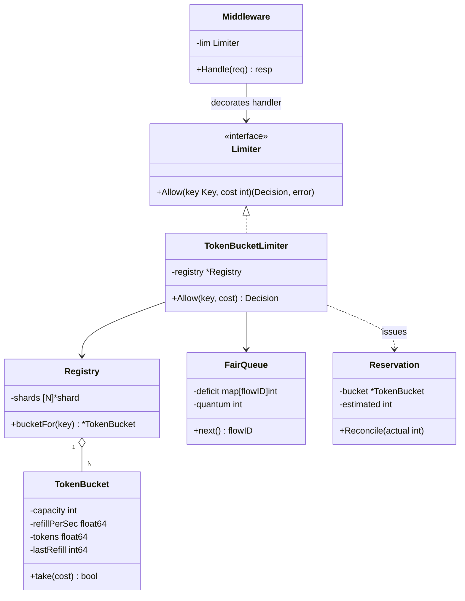

### Patterns applied + alternatives rejected

| Pattern | Where | Why this over alternatives |
|---|---|---|
| Strategy | `Limiter` interface + bucket/window impls | The algorithm changes (token bucket → sliding window) far more often than the call site; Strategy isolates that churn. |
| Decorator | `Middleware` wrapping the handler | Keeps limiting orthogonal to business logic; can stack auth → limit → handler and remove any layer per-route. |
| Object Pool / Registry | `Registry` of sharded buckets | Buckets are created lazily per key and GC'd when idle; avoids a global map + global lock. |
| Lazy refill | `TokenBucket.take` | No background ticker goroutine per bucket (that's N goroutines for N keys); compute refill from elapsed time on read. |

**Rejected patterns:**
- **One background goroutine per bucket** ticking refills — at 100k keys that's 100k goroutines and 100k timers. Lazy refill on read is O(1) and goroutine-free.
- **Singleton global limiter with one mutex** — correct but a fleet-wide serialization point (derived in Deep dive 2).
- **Leaky-bucket-as-queue** (hold requests, drain at fixed rate) — adds latency to the hot path; inference callers want a fast *reject*, not a slow *admit*.

### Code skeleton (Go)

```go
package ratelimit

import (
	"sync"
	"sync/atomic"
	"time"
)

// Key is the composite limit identity. Flow is the sub-agent within a caller.
type Key struct {
	Caller   string
	Endpoint string
	Tier     string
	Flow     string // sub-agent id; "" = caller-level
}

// Decision is the result of an admission check.
type Decision struct {
	Allowed    bool
	RetryAfter time.Duration
	Remaining  int
}

// Limiter is the swappable algorithm (Strategy).
type Limiter interface {
	// Allow attempts to admit `cost` tokens for key; cost is the *reserved* estimate.
	Allow(key Key, cost int) (Decision, *Reservation)
}

// TokenBucket holds one bucket's state. take() is the O(1) hot path.
type TokenBucket struct {
	mu           sync.Mutex
	capacity     float64
	refillPerSec float64
	tokens       float64
	lastRefillNs int64
}

// take refills lazily from elapsed time, then deducts cost if available.
func (b *TokenBucket) take(cost float64, nowNs int64) (ok bool, retryAfter time.Duration) {
	b.mu.Lock()
	defer b.mu.Unlock()
	elapsed := float64(nowNs-b.lastRefillNs) / 1e9
	b.tokens = min(b.capacity, b.tokens+elapsed*b.refillPerSec)
	b.lastRefillNs = nowNs
	if b.tokens >= cost {
		b.tokens -= cost
		return true, 0
	}
	deficit := cost - b.tokens
	return false, time.Duration(deficit/b.refillPerSec*1e9) * time.Nanosecond
}

// Reservation settles the gap between estimated and actual token usage.
type Reservation struct {
	bucket    *TokenBucket
	estimated int
}

// Reconcile refunds over-reservation (or charges overage) once output length is known.
func (r *Reservation) Reconcile(actual int) {
	delta := float64(r.estimated - actual) // >0 means we reserved too much
	r.bucket.mu.Lock()
	r.bucket.tokens = min(r.bucket.capacity, r.bucket.tokens+delta)
	r.bucket.mu.Unlock()
}

// Registry shards buckets to avoid a single global lock (see Deep dive 2).
type Registry struct {
	shards [256]struct {
		mu      sync.RWMutex
		buckets map[Key]*TokenBucket
	}
}

func (r *Registry) bucketFor(k Key, cfg Config) *TokenBucket { /* hash k → shard; lazy create */ return nil }
```

### Deep dive — 2 mechanisms

#### Deep dive 1: token bucket on *tokens*, with reserve-then-reconcile

**1. Why does this mechanism exist?**
A normal API rate limiter counts *requests*: each call costs exactly 1, you know the cost at admission, you deduct and move on. LLM inference breaks both halves of that assumption. (a) The cost is **variable and large** — a request consumes `input_tokens + output_tokens` of GPU work, ranging from ~50 to ~200,000. Counting requests would let a caller issue a handful of giant prompts and consume the whole fleet while staying "under 10 RPM." (b) The cost is **partially unknown at admission** — you know the prompt length, but output length is decided *during* generation. So you cannot simply "deduct the cost" up front. The mechanism that resolves both: a token bucket denominated in tokens, where admission **reserves** an estimate (`input + max_tokens`) and a deferred **reconcile** refunds the unused reservation once streaming ends.

**2. Walk it concretely.**
Config for a `tier=standard` caller: TPM = 60,000 → `refillPerSec = 1000`, `capacity = 60,000` (one minute of burst). Bucket starts full.

```
t=0.000s  tokens=60000
  R1 arrives: prompt=2000, max_tokens=4000 → reserve 6000
  take(6000): 60000 >= 6000 → tokens=54000, ALLOW, Reservation{est=6000}
  R1 actually generates 800 output tokens → actual = 2000+800 = 2800
  Reconcile(2800): refund 6000-2800 = 3200 → tokens = 54000+3200 = 57200

t=0.010s  (10ms later, refill = 0.010*1000 = 10)
  tokens = min(60000, 57200+10) = 57210
  R2 arrives: prompt=50000, max_tokens=20000 → reserve 70000
  take(70000): 57210 >= 70000? NO.
  deficit = 70000-57210 = 12790 → RetryAfter = 12790/1000 = 12.79s
  REJECT 429, Retry-After: 13s
```

Two things to notice: the **refund** (R1 returned tokens it didn't use, so a well-behaved caller is barely throttled), and the **honest Retry-After** (derived from the refill rate, not a guessed constant).

**3. The cost you're accepting.**

| Property gained | Cost paid |
|---|---|
| Bursts allowed up to `capacity`, smoothed to `refillPerSec` long-run | A full bucket lets a caller spike the GPU fleet for one `capacity`-sized burst before throttling engages |
| Reserve-then-reconcile keeps well-behaved callers near their true usage | A request that reserves `max_tokens` but errors *before* reconcile leaks the reservation until a timeout sweep refunds it |
| O(1), lock-held-briefly, no background goroutines | Lazy refill means a bucket untouched for an hour does one big `min(capacity, …)` clamp — correct, but you must store `lastRefill` as a monotonic timestamp or clock skew corrupts it |
| Honest `Retry-After` from refill math | Assumes a stable refill rate; tiered/burst-credit schemes make the formula non-trivial |

**4. Failure modes the interviewer will drill into.**

| Failure | What goes wrong | Mitigation |
|---|---|---|
| Q1: prompt larger than `capacity` (200k vs 60k) | `take` can *never* succeed; caller loops on 429 forever | Reject up front with a permanent error (`413`-style "exceeds max quota"), not a retryable 429 |
| Q2: request dies after reserve, before reconcile | Reserved tokens never refunded → slow leak shrinks effective quota | Reservations carry a TTL; a sweeper refunds any reservation older than the max generation time |
| Q3: estimate too low (`max_tokens` unset, model runs long) | Actual ≫ reserved → caller silently exceeds TPM | Reconcile can go negative (charge overage), pushing `tokens` below zero so the *next* request waits longer |
| Q4: clock moves backward (NTP step) | `nowNs - lastRefill < 0` → negative refill, tokens shrink wrongly | Use `time.Now()` monotonic clock (Go's monotonic reading is immune to wall-clock steps) |
| Q5: thousands of microbursts each reserving `max_tokens` | Over-reservation rejects callers who would have fit on actual usage | Smaller default reservation + aggressive reconcile; or admission on input-only with post-hoc decode accounting |

**5. How to derive it from first principles.**
1. The scarce resource is GPU-seconds; GPU-seconds ≈ tokens processed. So **denominate the quota in tokens.**
2. We want a *long-run rate* (TPM) but tolerate short bursts → a reservoir that fills at a constant rate and has a cap. That's a **token bucket**: `refillPerSec = TPM/60`, `capacity = burst budget`.
3. Refilling needs no timer: on each access, `tokens += elapsed × refillPerSec`, clamped to `capacity`. **Lazy refill** → O(1), no per-bucket goroutine.
4. Admission cost = `input + output`, but output is unknown → **reserve** `input + max_tokens` at admit time.
5. After generation, true cost is known → **reconcile**: `tokens += (reserved − actual)`. Well-behaved callers get their over-reservation back.
6. On reject, the caller deserves a truthful wait: `RetryAfter = (cost − tokens) / refillPerSec`.
7. Guard the two-statement critical section (`refill; deduct`) so it's atomic — a brief per-bucket lock, *not* a global one (Deep dive 2).
8. Edge: `cost > capacity` is unsatisfiable → fail fast and permanently, don't emit a retryable 429.

**6. Where this shows up in production.**
- **Stripe — "Scaling your API with rate limiters"**: runs *layered* limiters (request-rate, concurrency, fleet-usage, per-endpoint "load shedder"); the token bucket is their primary, and they explicitly treat the `429 + Retry-After` contract as part of the API surface.
- **Cloudflare — "How we built rate limiting…"**: uses a sliding-window-counter approximation (weighted blend of the current and previous fixed window) to get near-exact accuracy at a fraction of the memory of a true log — the alternative to the bucket when you need precise windows over billions of keys.
- **OpenAI / Anthropic public APIs**: both publish **TPM and RPM** limits per model and tier and return `429` with `retry-after` plus `x-ratelimit-remaining-tokens` headers — the productionized form of the reserve-and-report bucket described here.

#### Deep dive 2: fairness across sub-agents + the single-mutex trap

**1. Why does this mechanism exist?**
The whole fleet shares **one parent's API key**: a planner agent spawns 5,000 sub-agents that all authenticate as the same caller. A single bucket keyed on `caller` gives *no isolation between siblings* — one buggy sub-agent in a tight retry loop drains the shared bucket and every other sub-agent starves. We need fairness *within* a single quota. And the obvious correctness fix — one global mutex around the shared bucket — quietly becomes a fleet-wide serialization point. This dive derives both: the fairness arbiter (deficit round-robin) and why the naive lock fails at scale.

**2. Walk it concretely.**
Parent quota = 9,000 tokens available right now, shared by sub-agents A, B, C. DRR quantum = 1,000 tokens/round. Pending costs: A wants 500-token calls (cheap, many), C wants one 8,000-token call (expensive).

```
deficit: A=0 B=0 C=0
round 1: +1000 each → A=1000 B=1000 C=1000
  A: serve 500 (def 1000>=500) → A=500 ; serve 500 → A=0 ; next call 500>0? def 0<500 stop
  B: idle, no demand
  C: wants 8000, def 1000 < 8000 → cannot serve, carry deficit
round 2: +1000 each → A=1000 B=1000 C=2000
  A: serve 500,500 → A=0
  C: 8000 > 2000 → carry
... C accumulates 1000/round; after 8 rounds C.def=8000 → C served once.
```

A (many cheap calls) gets steady throughput; C (one huge call) waits its fair share of rounds instead of grabbing the whole bucket — **no flow starves another**, and the expensive flow can't jump the queue.

**3. The cost you're accepting.**

| Property gained | Cost paid |
|---|---|
| Per-flow isolation: one runaway sub-agent throttles only itself | Must track per-flow deficit state → memory grows with active sub-agents |
| DRR is O(1) amortized per admission | Strict fairness needs a round cursor; a flow that goes idle and returns may wait one quantum |
| Sharded buckets remove the global lock | The parent's *shared* quota now spans shards → exact global count needs coordination (approximate per-shard sub-quotas instead) |
| Lock-free atomic counter (alternative) scales to all cores | CAS retries under heavy contention; loses the exact refill-then-deduct atomicity unless done carefully |

**4. Failure modes the interviewer will drill into.**

| Failure | What goes wrong | Mitigation |
|---|---|---|
| Q1: single global mutex, 5,000 sub-agents | Every `Allow` serializes on one lock; the mutex + counter cache-line ping-pong across cores → throughput collapses though work is O(1) | **Lock striping**: shard buckets by key hash; each shard its own mutex (derivation below) |
| Q2: sub-agent count unbounded | Per-flow deficit map grows without limit | Cap tracked flows; un-tracked flows fall back to a shared "overflow" bucket (degraded fairness, bounded memory) |
| Q3: distributed — quota split across 8 nodes | Each node enforces TPM/8; a caller hot on one node gets throttled early while others sit idle | Periodic quota rebalancing, or a central Redis token bucket via an atomic Lua script |
| Q4: one flow always submits at round boundary | Can get slightly more than fair share | DRR's deficit carry bounds unfairness to one quantum — document the bound, don't chase perfection |

**5. How to derive it from first principles.**
1. Threat model: siblings share one key, so the unit of fairness is the **sub-agent flow**, not the key.
2. Naive: one bucket per key → no inter-flow isolation. Reject.
3. Fair scheduling primitive: give each flow a **deficit counter**; each round credit a **quantum**; serve a flow's next request only while `deficit ≥ cost`, decrementing as you go. That's **DRR** — O(1) amortized, no sorting (vs Weighted Fair Queuing's O(log N) virtual-time heap).
4. Now correctness under concurrency: the `refill; check; deduct` trio must be atomic per bucket → a lock.
5. **Don't make it one lock.** Derive why: with a global mutex, every one of P cores doing `Allow` must acquire the same lock; even if the critical section is O(1), the *serialized* throughput ceiling is `1 / critical_section_time`, and the lock's cache line bounces between cores (MESI invalidations) on every acquire. Mechanism = single contended cache line; upside = trivially correct; downside = it caps you at one core's worth of admissions.
6. Fix: **lock striping** — `shard = hash(key) % 256`, a mutex per shard. Two different keys almost never contend; the contended cache line is now 1/256 as hot.
7. Residual problem: a *single* hot key still maps to one shard. For that, drop to a **lock-free atomic** counter (`atomic.AddInt64` / CAS loop) on that bucket's token count, accepting slightly looser refill atomicity.
8. Distributed: replace the in-process counter with a Redis token bucket mutated by **one Lua script** (atomic on Redis's single-threaded executor), keyed identically — the Strategy interface is unchanged, so callers never know.

**6. Where this shows up in production.**
- **Linux network stack — DRR (`sch_drr`)**: deficit round-robin is a real Linux qdisc; the same quantum-and-deficit math here originated as a packet scheduler (Shreedhar & Varghese, 1995).
- **Envoy / Istio rate limiting**: global rate limits go through a shared service backed by Redis with atomic increments — the distributed form of step 8; local limiters per-proxy handle the fast path.
- **Go runtime `sync.Mutex` + the sharding folklore**: high-throughput Go services (e.g. `golang.org/x/time/rate` users, and caches like `hashicorp/golang-lru`) shard precisely to dodge the single-cache-line contention derived in step 5.

### Concurrency model

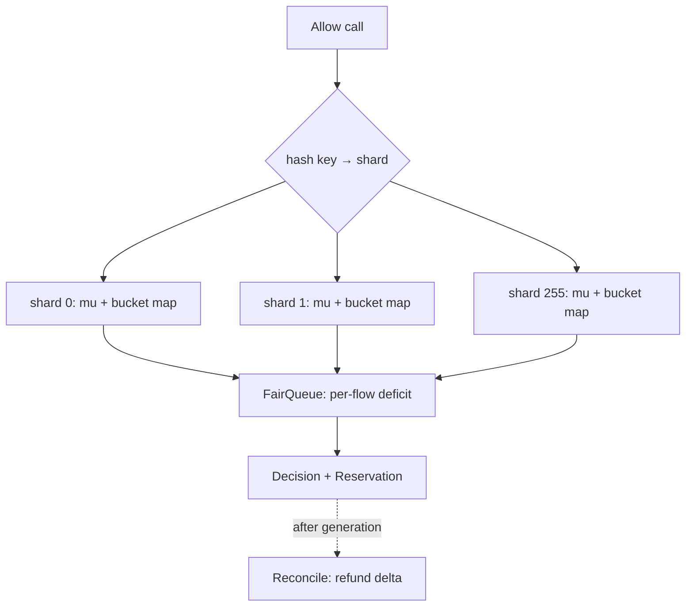

**Race-freedom argument:** each bucket's `refill→check→deduct` runs under that bucket's shard mutex, so the read-modify-write is atomic. Distinct keys hash to distinct shards and never block each other. `Reconcile` re-locks the same shard, so the refund is serialized against concurrent `take`s. No goroutine holds two shard locks at once → no lock-ordering cycle → no deadlock.

### Fail-mode walkthrough (the 3am scenario)

It's **3:02am**. The Redis cluster backing the *distributed* limiter loses its primary and `Allow` starts timing out after 50ms.

- **Fail-open** (on store error, allow the request): every agent sails through unmetered. By 3:05am the GPU fleet is saturated by a few heavy callers, KV cache OOMs, latency for *everyone* spikes, and the bill runs uncontrolled. The limiter existed precisely to prevent this — failing open defeats its purpose.
- **Fail-closed** (on store error, reject everything with 429): correct on cost, catastrophic on availability — a Redis blip becomes a total inference outage; every customer's agent halts.
- **Right answer for this business**: **fail to a stricter local limiter.** Each pod keeps an in-process token bucket sized to `globalTPM / podCount × safetyFactor(0.7)`. When Redis is unreachable, fall back to the local bucket: the fleet is protected (no melt), most traffic still flows (no full outage), and you trade a little global precision for survival. Page on the fallback, restore Redis, resume global accounting.

### Extension points

| Extension | Where it lands | What doesn't change |
|---|---|---|
| Distributed limits | Swap `Registry` for a Redis-backed `Limiter` impl (Lua atomic) | `Limiter` interface, `Middleware`, callers |
| Burst credits / tiers | Per-tier `Config` (capacity, refill) in `Registry.bucketFor` | bucket math, sharding |
| Priority lanes (interactive > batch) | Add a second DRR class with a larger quantum | token bucket, reconcile |
| Concurrency limit (in-flight cap) | New `Limiter` decorator counting active reservations | token/RPM logic |

### SOLID self-audit

| Principle | Obeyed? | Why |
|---|---|---|
| Single Responsibility | ✅ | `TokenBucket` does refill math; `FairQueue` does arbitration; `Registry` does lifecycle; `Middleware` does HTTP. |
| Open/Closed | ✅ | New algorithms (sliding window, Redis) slot in via `Limiter`; no call-site edits. |
| Liskov | ✅ | Every `Limiter` honors `Allow(key, cost) (Decision, *Reservation)`, including the no-op limiter used in tests. |
| Interface Segregation | ✅ | `Limiter` is one method; reconcile lives on the returned `Reservation`, not bolted onto the interface. |
| Dependency Inversion | ✅ | `Middleware` depends on `Limiter`, never on `TokenBucket` or Redis. |

### Where this shows up in production

- **Stripe**: layered limiters (rate / concurrency / fleet-usage / load-shedder) with token bucket as the workhorse.
- **Cloudflare**: sliding-window-counter approximation across billions of keys — the memory-efficient alternative to a true window log.
- **Anthropic & OpenAI public APIs**: per-model TPM + RPM, `429` with `retry-after` and `x-ratelimit-remaining-tokens` — the reserve-and-report bucket, productized.

### Common follow-ups

1. **Now make it distributed** — Redis token bucket mutated by one Lua script (atomic on Redis's single thread); local per-pod buckets as the fail-closed fallback. Interface unchanged.
2. **Output token count unknown at admission** — reserve `input + max_tokens`, reconcile the refund after streaming; TTL-sweep abandoned reservations.
3. **Caller exceeds quota via long generations** — let `Reconcile` charge overage (tokens go negative), so the next call waits proportionally.
4. **5,000 sub-agents wake at once (thundering herd)** — shard by key to kill the single-cache-line contention; DRR keeps any one flow from monopolizing the shared quota.
5. **Different costs per endpoint** — `cost` is passed by the caller per `Allow`; the bucket is endpoint-agnostic, the *config* is per `(endpoint, tier)`.

### Diagnostic questions

1. **Why tokens and not requests?** — wrong: "requests are simpler." Misses that GPU cost scales with tokens; request-counting lets one giant prompt melt the fleet.
2. **Why lazy refill instead of a ticker per bucket?** — wrong: "a goroutine per bucket is cleaner." That's N goroutines + N timers; lazy refill is O(1) and goroutine-free.
3. **What's wrong with one global mutex?** — wrong: "nothing, it's O(1)." The O(1) work is *serialized* on one contended cache line; throughput caps at one core. Shard it.
4. **Fail-open or fail-closed when the store dies?** — wrong: pick one absolutely. Right: degrade to a stricter *local* limiter — protect the fleet without a full outage.
5. **How is Retry-After computed?** — wrong: a fixed constant. Right: `(cost − available) / refillPerSec` — derived from the bucket's own refill rate.

---

## [2026-06-07] L02 · Elevator bank scheduler · **Amazon** · Microsoft · Atlassian

- **State machine per car** (`Idle` / `Moving` / `DoorsOpen`) — transition rules live inside `State`, never as nested `if/else` scattered across the elevator loop.
- **Strategy for the scheduling algorithm** — the *bank* picks which car serves a request; FCFS / SCAN / LOOK / nearest-car swap in behind one interface without touching `Elevator` or `ElevatorBank`.
- **One coordinator goroutine + one channel per elevator** — assignment is serialized through a single reader, so there is no shared mutable scheduler state and no lock around `Assign`.

### Problem (as asked)

> Design the system that controls a bank of 4 elevators in a 20-floor building. Riders press call buttons; elevators pick up and drop off. Write the classes, the scheduling algorithm, and make it thread-safe.

**Clarifying questions to ask back:**
1. **Scope** — call buttons only (up/down at a floor), or destination dispatch (rider enters target in the lobby)? The two change *where* scheduling happens.
2. **Scale** — 4 cars × 20 floors is small; is the design expected to scale to a 100-floor tower with 16 cars (changes whether O(N) scan per request is acceptable)?
3. **Concurrency** — multiple riders press buttons concurrently from different floors; is the controller multi-threaded, or a single event loop? (Decides mutex-vs-channel.)
4. **Extensibility** — which axis changes most: the *algorithm* (energy-saving vs throughput), or *car behavior* (express cars, freight)? Strategy vs State is the answer.
5. **Persistence** — must in-flight requests survive a controller restart, or is in-memory acceptable (lose the queue on crash)?

### Requirements teardown

| Functional | Non-functional |
|---|---|
| Accept hall calls (floor + direction) and car calls (destination) | Thread-safe under concurrent submissions from N floors |
| Bank assigns each request to exactly one car | Assignment latency O(#cars), not O(#floors × #cars) |
| Car moves, opens doors, services stops in path order | Algorithm swappable without recompiling car logic |
| Report car position / direction for UI | Deterministically testable with a fake clock |

### Actor & entity inventory

| Entity | Responsibility (single sentence) |
|---|---|
| `ElevatorBank` | Aggregate root: owns all cars + the scheduler, receives every request, routes it to one car. |
| `Elevator` | One physical car: owns its floor, direction, and the sorted set of stops it must service. |
| `State` | Behavioral state of a car (`Idle`/`Moving`/`DoorsOpen`); encodes legal transitions. |
| `Scheduler` | Strategy: given a request and the cars, returns the car that should serve it. |
| `Request` | Value object: origin floor, direction (hall call) or destination (car call), submit time. |
| `Clock` | Seam over wall-time so movement/door timing is deterministic in tests. |

### Class diagram

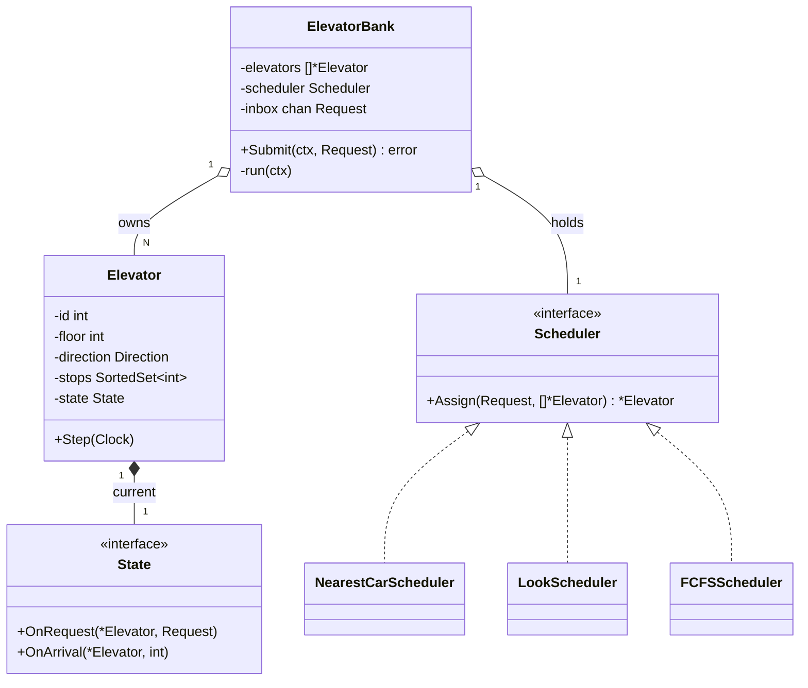

The **aggregate-root boundary** (LDDD Ch.4): the outside world only ever calls `ElevatorBank.Submit`. `Elevator`, `State`, `Request` live *inside* the boundary — no caller reaches in and pokes a car directly. This is exactly the trap juniors fall into: if a hall call hits a random car, you get N cars each making a local O(N) decision and fighting each other. The bank seeing **every** request is the whole design.

### Patterns applied + alternatives rejected

| Pattern | Where | Why this over alternatives |
|---|---|---|
| Strategy | `Scheduler` interface + 3 impls | The *algorithm* changes more often than callers; swapping LOOK→nearest-car must not touch `Elevator`. Visitor would couple algorithms to car internals. |
| State | `Elevator` internal `State` machine | Door/motion transitions have rules (can't open doors while moving); a State machine makes illegal transitions unrepresentable vs. a tangle of booleans. |
| Observer | Floor button → bank notification | Decouples the (eventual) UI / hardware button layer from the scheduler. |

**Rejected patterns:**
- **Singleton scheduler** — kills testability; instance-per-bank lets a test spin up a 2-car bank with a fake clock.
- **Visitor for movement logic** — overkill; the 3-state enum covers every legal car transition.

### Code skeleton (Go)

Skeleton lives at [`labs/lld-projects/L02-elevator/`](../labs/lld-projects/L02-elevator/) — the `Elevator`, `Scheduler`, `ElevatorBank` types plus the single-coordinator `run` loop. The interesting bodies (scoring function, per-car `State` machine, `sortedSet` for next-stop lookup) are derived in the Deep dives below.

### Deep dive — 2 mechanisms

#### Deep dive 1: The scheduling algorithm (FCFS → SCAN → LOOK → nearest-car)

**1. Why does this mechanism exist?**
A naive controller serves requests first-come-first-served: a rider on floor 2 going up, then a rider on floor 19, makes the car go 2 → 19 → 2 even though it passed floor 10 twice empty. FCFS optimizes *fairness of arrival order* and pessimizes *total travel*. The disk-scheduling literature solved this decades ago: treat the car like a disk head sweeping a platter. **SCAN** sweeps to the top floor then reverses; **LOOK** is SCAN that reverses as soon as there are no further stops in the current direction (doesn't waste a trip to floor 20 if the highest stop is 14). **Nearest-car** generalizes LOOK to *multiple* cars by scoring each car's cost to serve and assigning the cheapest. We pick nearest-car-over-LOOK because the bank has N cars and the real question is *assignment*, not single-head ordering.

**2. Walk it concretely.**
The per-car data structure is a **sorted set of pending stop floors**. Servicing in the current direction = walk the set from the current floor toward the direction bound.

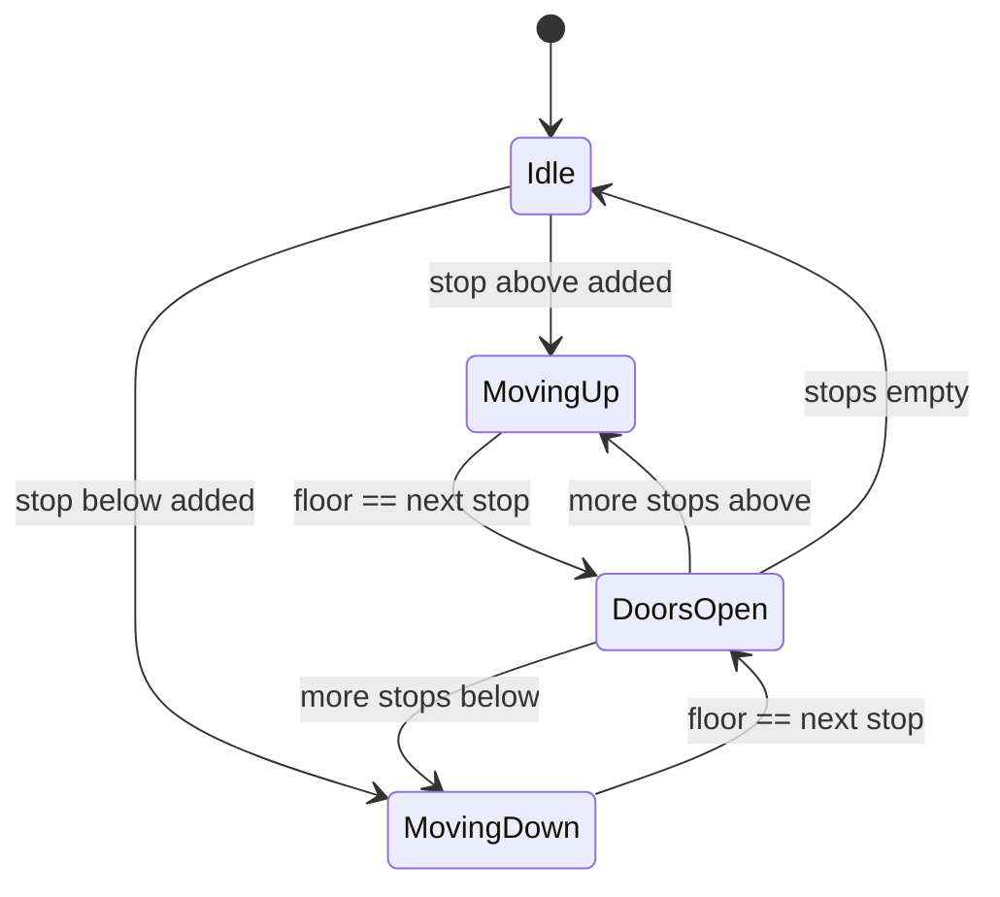

Integer trace of the sorted-set mutating (one car, LOOK):

```
stops = {}            floor=1  dir=Idle
+ req 1→9 (up)        stops={9}        dir=Up    (insert 9)
+ req 4→7 (up)        stops={7,9}      dir=Up    (insert 7, sorted)
move to 4 ... arrive 4 → doors open, drop 4's rider's dest 7 already in set
move to 7 ... arrive 7 → doors, stops={9}        (remove 7)
+ req 6→2 (down)      stops={9}, pending_down={2 via 6}   (opposite dir: deferred)
move to 9 ... arrive 9 → doors, stops={}          (remove 9)
no up stops → LOOK reverses → dir=Down, pull deferred → stops={6}, then 2
```

The key op is `stops.insert(floor)` keeping order, and `stops.next(floor, dir)` = the successor (going up) or predecessor (going down).

**3. The cost you're accepting.**

| Property gained | Cost paid |
|---|---|
| Minimizes total travel + mean wait for typical mixed load | Pathological "everyone wants floor 20" starves cars idling low |
| Sorted-set next-stop is O(log n), not O(n) scan | Insertions cost O(log n) and need a balanced tree / skip list, not a slice |
| Nearest-car spreads load across N cars | Greedy per-request assignment is not globally optimal (no look-ahead at the *future* request stream) |
| Direction-aware scoring avoids U-turns | Adds tunable magic numbers (idle penalty, same-dir bonus) that need calibration |

**4. Failure modes the interviewer will drill into.**

| Q | What goes wrong | Mitigation |
|---|---|---|
| All requests at floor 20 | One car keeps winning the score; others idle | Add an **idle-time penalty** that decays a car's score the longer it sits — load spreads |
| Two requests submitted in the same instant | Race in `Assign` reading car state mid-update | Single coordinator goroutine serializes `Assign` (Deep dive 2) — no lock needed |
| Car called down while moving up past the floor | Greedy assigns to the passing car, rider waits a full sweep | Defer opposite-direction stops into a second set, serviced on reversal (the LOOK invariant) |
| SCAN vs LOOK — when each? | SCAN always rides to the end | LOOK for residential (reverse early, lower mean wait); SCAN where the extreme floors are common (lobby/penthouse) |
| Starvation of a low-priority floor | Score never favors it | Age requests: add `wait_time` to the score so old requests eventually dominate |

**5. How to derive it from first principles.**
1. Model the request stream as a set of (floor, direction) points on a 1-D line (the shaft).
2. Observe a single car is a *head* moving on that line — this is literally the disk-arm scheduling problem.
3. FCFS = serve in arrival order → unbounded total travel; reject.
4. Shortest-seek-time-first (always nearest) → starves far floors; reject.
5. SCAN (sweep end-to-end, reverse) bounds worst-case wait to 2×shaft-length; accept the *shape*.
6. LOOK refines SCAN: reverse when no further same-direction stops exist → strictly fewer wasted floors.
7. Generalize to N cars: each request must pick a car. Define `score(car, req)` = directional distance ± direction bonus ± idle penalty.
8. Assign to `argmin score`. This is nearest-car; it degrades gracefully to LOOK when N=1.

**Big-O:** `Assign` scans all cars once = **O(C)** where C = #cars (4 here). Each car's `score` reads `floor`, `direction`, and `stops.next()`; with `stops` a balanced BST / skip list, `next()` is **O(log S)** where S = pending stops on that car. So one assignment is **O(C · log S)** — the `log` comes from the *successor query on the ordered set*, not from any sort. Adding a stop is `stops.insert` = **O(log S)** (skip-list insert: expected O(log S) levels, one pointer splice per level). **Adversarial input:** a request whose direction flips the car (call down while the car races up) forces a deferred-set insert plus a full sweep before service — worst-case wait ≈ 2×shaft regardless of how clever the score is.

**6. Where this shows up in production.**
- **Linux CFS / EEVDF scheduler** — picks the next runnable task from a red-black tree keyed by virtual runtime; "nearest" = smallest vruntime. Same shape: ordered set + successor query, O(log n) pick.
- **Kubernetes scheduler scoring framework** — each node gets a score from pluggable plugins; pod lands on argmax. Structurally identical to pluggable `Scheduler.Assign` over cars.
- **Otis Compass / KONE destination dispatch** — riders enter destination at the lobby; the group controller assigns a car *before* boarding using exactly this directional cost model, reported to cut average wait 20–30% and bunching in towers >15 floors.

#### Deep dive 2: Concurrency model — one channel per car vs one central mutex

**1. Why does this mechanism exist?**
Requests arrive concurrently from 20 floors; meanwhile 4 cars are mutating their own `floor`/`stops` as they move. The shared state is: each car's stop set + position, and the scheduler reading all of them to assign. The naive fix is one big `sync.Mutex` around the bank — every `Submit`, every car `Step`, every `Assign` takes it. That serializes everything, including 4 cars that share nothing. The Go-idiomatic alternative: **don't share memory, communicate.** A single coordinator goroutine owns assignment (so `Assign` needs no lock), and each car owns a goroutine + inbox channel (so a car's stop set is only ever touched by *its own* goroutine).

**2. Walk it concretely.**

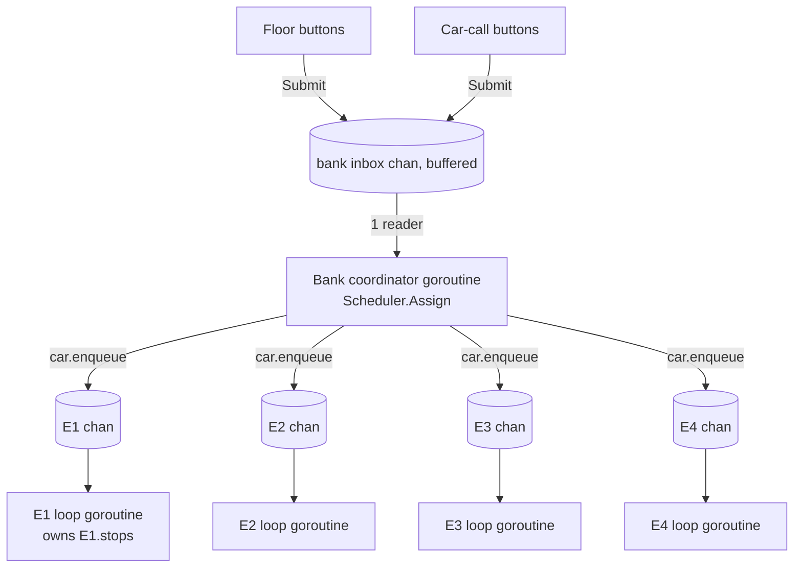

Concurrent submit, step-by-step: two riders press buttons at t=0.
```
t0: Submit(1→9) and Submit(18→3) race into inbox  → buffered, both accepted
t0: coordinator reads (1→9) first (channel = FIFO), Assign → E1, E1.chan <- req
t0: coordinator reads (18→3), Assign reads E2.floor=17 → E2, E2.chan <- req
    (Assign saw a CONSISTENT snapshot: only the coordinator reads car summaries,
     and cars publish floor via atomic, never mid-write structs)
t1: E1 loop pops its chan, inserts 9 into E1.stops  (only E1 touches E1.stops)
t1: E2 loop pops its chan, inserts 3 into E2.stops
```

**3. The cost you're accepting.**

| Property gained | Cost paid |
|---|---|
| `Assign` runs lock-free (single reader) | Coordinator is a throughput ceiling — one goroutine assigns all requests |
| Each car's `stops` has zero contention | Cross-car rebalancing (move a stop from E1→E2) is awkward; needs a message, not a shared write |
| Deadlock-free by construction (acyclic message flow) | More goroutines + channels = more memory and harder stack traces than one mutex |
| Backpressure is explicit (bounded inbox) | A full inbox blocks `Submit` unless ctx cancels — must size the buffer |

**4. Failure modes the interviewer will drill into.**

| Q | What goes wrong | Mitigation |
|---|---|---|
| Coordinator goroutine panics | All assignment stops; cars finish current stops then idle forever | `recover` + supervisor that restarts the loop; requests buffered in inbox survive |
| Inbox full under burst | `Submit` blocks | Bound the buffer and honor `ctx.Done()`; shed/queue at the edge |
| `Assign` reads a car mid-move | Stale floor → slightly suboptimal pick | Acceptable: scoring tolerates ±1 floor; publish floor via `atomic.Int64` so reads never tear |
| Need to cancel a request (rider stepped out) | Already enqueued in a car chan | Send a tombstone message to that car; car drops the stop on pop |
| Test needs determinism | Real goroutine timing is nondeterministic | Inject `Clock`; drive `Step` manually in tests — no `time.Sleep` |

**5. How to derive it from first principles.**
1. Enumerate shared mutable state: per-car `floor`/`stops`, and the scheduler's read of all cars.
2. Option A: one mutex over everything → correct but serializes independent cars; reject for contention.
3. Option B: one mutex per car → `Assign` must lock all N to get a snapshot → lock-ordering hazard.
4. Reframe: who *needs* to write each piece? Only car i writes car i's `stops`.
5. Give each car a goroutine that exclusively owns its `stops`; mutation arrives as a message → no lock on `stops`.
6. Who writes the assignment decision? Only the coordinator → make it a single goroutine reading one inbox → no lock on `Assign`.
7. Check for cycles: floors→inbox→coordinator→car chans→car loops. No edge points backward → acyclic → deadlock-free.
8. Publish each car's `floor` via `atomic` so the coordinator's read is cheap and tear-free.

**Big-O / memory:** N cars = N goroutines + N channels; each goroutine ~8 KB initial stack, so 4 cars ≈ 32 KB — negligible. Per request: one channel send to inbox (O(1)), one send to a car chan (O(1)). The cost is *latency through one coordinator*, not per-op complexity. **Adversarial input:** a sustained burst exceeding coordinator throughput fills the inbox and turns `Submit` into a blocking call — the system degrades to the coordinator's single-goroutine rate, the deliberate trade for lock-free assignment.

### Concurrency model

The deadlock-freedom argument restated: the coordinator reads **one** inbox and writes **N** car channels; car goroutines read **only** their own channel and never write back to the bank. The message graph is a DAG (floors → inbox → coordinator → car chans → car loops), so there is no circular wait — Coffman's fourth condition is structurally impossible.

### Extension points

| Extension | Where it lands | What doesn't change |
|---|---|---|
| Emergency stop | New `State`: `EmergencyState`; a high-priority signal channel per car preempts the loop | `Scheduler`, request flow, bank |
| VIP rider <30s SLA | Wrap the scheduler: `DeadlineScheduler` adds wait-time to score | `Elevator`, `State`, channels |
| Express car (skips floors) | New `Scheduler` impl that filters eligible cars | Car internals, coordinator |
| Destination dispatch | New entry point `SubmitWithDestination`; pre-assign before boarding | Internal LOOK ordering unchanged |

### SOLID self-audit

| Principle | Obeyed? | Why |
|---|---|---|
| Single Responsibility | ✅ | `Elevator` owns motion, `Scheduler` owns assignment, `ElevatorBank` owns coordination |
| Open/Closed | ✅ | New schedulers slot in via `Scheduler`; zero `Elevator` edits |
| Liskov | ✅ | Every `Scheduler` honors `Assign(Request, []*Elevator) *Elevator`, never returns nil for N≥1 |
| Interface Segregation | ✅ | `Scheduler` is 1-method, `State` is 2-method — both narrow |
| Dependency Inversion | ✅ | `ElevatorBank` depends on the `Scheduler` interface, not a concrete algorithm |

### Where this shows up in production

- **Linux I/O scheduler (mq-deadline)** — the literal SCAN/LOOK ("elevator") algorithm for disk requests; the kernel names its sysfs knob `elevator`.
- **Kubernetes scheduler** — pluggable scoring → argmax node, mirroring pluggable `Scheduler.Assign`.
- **KONE / Otis destination dispatch** — directional cost assignment before boarding, ~20–30% lower average wait in tall buildings.

### Common follow-ups

1. **Emergency stop that preempts all motion** — add a separate high-priority signal channel per car; the car loop `select`s it before the normal inbox, transitions to `EmergencyState`, flushes `stops`. Bank stops assigning to a car in that state.
2. **VIP rider, guaranteed <30s wait** — wrap the scheduler in `DeadlineScheduler`; it folds `wait_time` into the score so an aging VIP request dominates and grabs the next eligible car.
3. **Deterministic testing (no wall-clock)** — inject a `Clock` seam; tests advance time manually and call `Elevator.Step(clock)` directly, asserting state transitions with zero real `Sleep`.

### Diagnostic questions

1. **Why does the bank, not the car, receive the request?** — wrong: per-car queues → N cars each making local O(N) decisions, fighting over the same rider (the junior trap).
2. **Why a sorted set for stops instead of a slice?** — wrong: slice → O(n) scan for the next stop; sorted set gives O(log n) successor.
3. **Why one coordinator goroutine instead of a mutex?** — wrong: one big mutex serializes 4 independent cars that share nothing.
4. **When does LOOK beat SCAN?** — wrong: claiming they're identical; LOOK reverses early, SCAN always rides to the shaft end.
5. **What makes the design deadlock-free?** — wrong: "we use channels"; the real reason is the acyclic message graph (no car writes back to the bank).

---

## [2026-06-06] L10 · Splitwise expense splitter · **Microsoft** · fintech · Indian-product-cos

- **Expense is the event, Balance is a projection** — the ledger is append-only; `Balance` and `Settlement` are derived views you can throw away and rebuild from the expense log, which is the whole reason audits, currency-correction reruns, and "undo this split" all become trivial.
- **Strategy seam over the split rule** (`EqualSplit` / `PercentageSplit` / `ExactSplit` / `ShareSplit`) — adding a new split type touches one file and never the ledger, the balance projection, or the simplification engine.
- **Debt simplification as a min-cost-flow over a signed-net graph** — collapse the N² pairwise edges into ≤N-1 settlement edges by netting each user to a single signed balance, then greedily matching largest creditor to largest debtor; not optimal in the general MCMF sense but provably ≤N-1 transactions, which is the user-visible promise.

### Problem (as asked)

> Design Splitwise. Users add expenses with arbitrary split (equal, percentage, exact). The system shows simplified balances ('A owes B $X') across many transactions. Support 'settle up' to reset two users' debt.

**Clarifying questions to ask back:**
1. **Scope** — personal pairs only, or *groups* (Goa trip, flatmates) where the simplification must run group-scoped? (Assumed: both; group is the simplification boundary, pair settlements ignore the group.)
2. **Scale** — typical group is 4–8 people but worst case 50 (large trip); pairwise edges are O(N²)=2500, do we need on-the-fly simplification or background? (Assumed: on-write incremental balance, on-read simplification, recomputed lazily and cached per group.)
3. **Concurrency** — two users add expenses to the same group within the same second; do we need strict serial order or is eventual consistency on the balance projection acceptable? (Assumed: per-group serial via a Postgres advisory lock or a single writer goroutine per group; balance is eventually consistent within ~100ms.)
4. **Extensibility** — what changes most: the *split rule* (new percentage modes), the *currency model* (FX), or the *settlement* (Venmo/UPI integration)? (Assumed: split rule and currency; FX is a follow-up.)
5. **Persistence & audit** — must every expense be reconstructible 7 years later (tax)? (Assumed: yes — expense log is the source of truth, never mutated, only superseded by a reversal expense.)

### Requirements teardown

| Functional | Non-functional |
|---|---|
| Add expense with `payer`, `participants`, `amount`, `split strategy` | Per-group serial write; cross-group lock-free |
| Show per-pair balance ("you owe Asha ₹430") | Balance read p99 < 50ms for groups ≤ 50 |
| Simplify group balances into ≤ N-1 settlements | Simplification deterministic and idempotent on identical input |
| Settle up: zero out a specific pair's debt | Expense log append-only and auditable |
| Reverse / edit an expense | Edit = reversal-expense + new expense (never UPDATE the original) |

### Actor & entity inventory

| Entity | Responsibility (single sentence) |
|---|---|
| `User` | Identity + display info; participates in groups and expenses. |
| `Group` | Aggregate root for a set of users sharing a ledger; owns the expense log and the cached balance projection. |
| `Expense` | Immutable event: who paid, total amount, participant shares, currency, timestamp, optional reversal-of pointer. |
| `SplitStrategy` | Strategy interface: turns an `amount` + participant list into a `map[UserID]int64` of cents owed. |
| `BalanceProjection` | Derived view: `map[Pair]int64` net balance per directed user pair, rebuildable from the expense log. |
| `Settlement` | Special expense subtype representing money actually changing hands (Venmo/UPI/cash). |
| `Simplifier` | Pure function over `BalanceProjection` → ordered list of `(debtor, creditor, amount)` transfers. |
| `LedgerStore` | Persistence seam: append expense, stream expenses by group, snapshot balance. |

### Class diagram

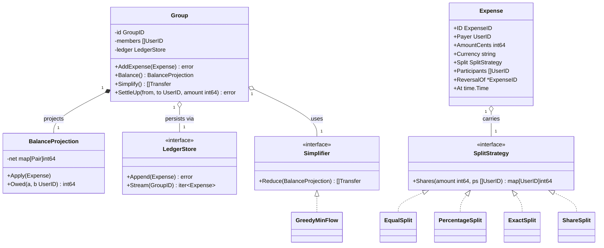

The **aggregate-root rule** (LDDD Ch.4): only `Group` accepts writes. The outside world never constructs a `BalanceProjection` directly — that's the trap the juniors fall into. They mutate `balance[A][B] += 100` on every expense and then can't answer "what if this expense gets reversed?" — because they've lost the *reason* the number is what it is.

### Patterns applied + alternatives rejected

| Pattern | Where | Why this over alternatives |
|---|---|---|
| Strategy | `SplitStrategy` on each `Expense` | Split rules multiply (equal, %, exact, shares, by-item); new ones must not touch the ledger or projection. Inheritance hierarchy `EqualExpense extends Expense` would explode the `Expense` table schema. |
| Event Sourcing | `Expense` log = source of truth; `BalanceProjection` is derived | Audit + reversibility + rebuilds for free. Storing balances directly = data loss the first time FX rates change retroactively. |
| Visitor | Settlement engine walks expenses to build per-user net | The walk is *fixed* (sum participant shares); the operation (project, simplify, audit-export) varies. Visitor lets a new operation slot in without touching `Expense`. |
| Projection / CQRS | Write path = append expense; read path = serve balance | Reads are 100× writes (every app open shows balance); pre-computing the projection in-memory and lazily-invalidating beats joining the log on every render. |

**Rejected patterns:**
- **Inheritance over `Expense`** (`EqualExpense`/`PercentageExpense`) — every new rule changes the base; can't mix two rules in one expense (e.g., partial-equal + partial-exact).
- **Doubly-linked balance entries** (a credit on A, a debit on B, stored as rows) — duplicates state; one row can update and the other not on partial-failure. Single signed net per pair + the expense log as truth is cleaner.
- **Optimal min-cost-flow simplification** — adds an O(V·E²) Edmonds-Karp pass for at most 1–2 fewer transactions vs greedy; not worth the complexity for ≤50-person groups.

### Code skeleton (Go)

Skeleton lives at [`labs/lld-projects/L10-splitwise/`](../labs/lld-projects/L10-splitwise/) — the `Expense`, `SplitStrategy` (with `EqualSplit` / `PercentageSplit` / `ExactSplit`), `Group` aggregate root, `Simplifier`, and `LedgerStore` seams. The `EqualSplit.Shares` implementation (payer eats the rounding residue) is the one body worth reading; the rest are stubs to be filled in along the Deep dives.

### Deep dive 1: Debt simplification — netting + greedy min-cash-flow

**1. Why does this mechanism exist?**

| Before | Pain |
|---|---|
| Show every pairwise edge ("A owes B ₹120, B owes A ₹80, A owes C ₹50, C owes B ₹30") | The UI is a forest; users can't act on it. |
| Show *netted* pair balances ("A owes B ₹40, A owes C ₹50, C owes B ₹30") | Better, but still up to N(N-1)/2 edges in a 10-person group = 45 transactions to settle. |
| Show *minimum settlement* ("A pays B ₹70, A pays C ₹20") | Bounded by ≤ N-1 transactions — the user-visible promise Splitwise actually makes. |

The **rejected alternative** is exact MCMF (min-cost max-flow with Edmonds-Karp): polynomial but O(V·E²), and for V=50 the constant factor and complexity outweigh the 1–2 transactions you'd save. The greedy "largest-debtor pays largest-creditor" produces ≤ N-1 edges always, runs in O(N log N), and is what Splitwise's "simplify debts" toggle actually does in production.

**2. Walk it concretely.**

5 users in a Goa group, balances after 8 expenses already netted per pair:

| User | Net (signed cents; +ve = is owed) |
|---|---|
| Asha | +₹500 |
| Bina | +₹200 |
| Chand | −₹100 |
| Dev | −₹300 |
| Esha | −₹300 |

Greedy iteration (max-heap of creditors, max-heap of debtors):

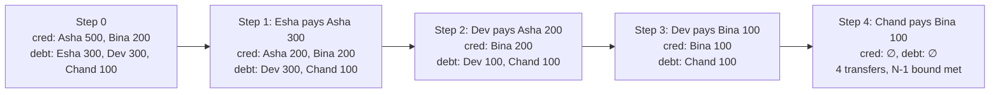

4 transfers for 5 users — exactly N-1, the worst case.

**3. The cost you're accepting.**

| Property gained | Cost paid |
|---|---|
| ≤ N-1 transactions, always | Specific pair history is destroyed in the UI — "I never owed Bina anything directly!" complaints |
| O(N log N) per simplification | Recompute on every read unless cached; cache invalidation on every expense |
| Greedy is deterministic | Not optimal in transaction count — adversarial inputs cost +1 vs MCMF |
| No dependency on graph libraries | Hard to extend with constraints ("Dev hates Venmo'ing Asha") — would need MCMF after all |

**4. Failure modes the interviewer will drill into.**

| Q | A |
|---|---|
| Two users add expenses concurrently — does the simplification race? | Simplification is a *pure function* of `net`. Race is only on `net` itself; serialize that via per-group writer goroutine. |
| Floating-point currency drift | All amounts are `int64` cents; rounding residue is assigned to payer at split time, never lost. |
| User wants "show me the chain — why do I owe Bina?" | Simplified output is a *view*, not the truth; keep pairwise-netted view available as a second projection. |
| One user belongs to two overlapping groups | Simplification scope = group. Cross-group netting is explicitly *not* offered. |
| Settle-up partial payment | Settlement is itself an `Expense` with negative split for the payer; balance projection re-applies it. |

**5. How to derive it from first principles.**

1. Per-pair balance is `sum(expense.shares[debtor]) - sum(expense.shares[creditor])` over the log → that's the N×N matrix.
2. The matrix is anti-symmetric (`M[a][b] = -M[b][a]`); only the upper triangle matters.
3. Collapse each user to a **signed net**: `net[u] = sum over all pairs of M[u][*]`. Sum of all `net[u]` is zero by construction.
4. Now the problem is: produce a set of transfers that zero out the `net` vector. Equivalent to: find a minimal edge set in a bipartite (debtor, creditor) graph that zeros both sides.
5. Lower bound is the number of distinct nonzero balances minus the largest "matchable" subset of equal pairs. Worst case = N-1 edges.
6. Greedy: pick max debtor and max creditor, settle `min(|debt|, credit)`, push the residue back into its heap. Each step zeros at least one vertex → at most N-1 steps total.
7. Two heaps + N pushes/pops = O(N log N).
8. Optimal MCMF on the same graph gets the true minimum, but the gap is small for typical Splitwise group sizes.

**6. Where this shows up in production.**

- **Splitwise itself**: "Simplify debts" toggle uses the greedy algorithm; the bound is N-1 and the toggle is per-group because cross-group netting violates user mental model.
- **Stripe Connect transfer batching**: when paying out N sellers from M charges, Stripe nets the routing graph so each seller gets one batched payout — same signed-net + greedy structure, at fintech scale (millions of edges/day).
- **Interbank settlement (CHIPS, India RTGS net-settlement window)**: end-of-day netting collapses thousands of inter-bank obligations to a handful of central-counterparty transfers; same MCMF problem with regulatory capacity constraints.
- **Kubernetes scheduler bin-packing** (analogous): debtor-side = pods needing capacity, creditor-side = nodes with capacity; greedy "largest pod → largest free node" is the default scoring.

### Deep dive 2: Domain model — Expense vs Balance vs Settlement (which is the source of truth?)

**1. Why does this mechanism exist?**

The junior trap from the catalog: *"Storing balances directly and mutating them. Expenses are the source of truth — balance is a projection."* Why does this matter?

| Mutate-balance design | Event-sourced design |
|---|---|
| `balance[A][B] += 100` on each expense | `expenses.append(e)`; `balance` is `fold(expenses)` |
| Edit an expense = ??? — you don't know what to subtract | Edit = append a `ReversalOf` expense + a new one; balance rebuilds |
| FX rate corrected retroactively = ??? | Reproject with new rates |
| Audit "why does A owe B ₹430?" = no answer | `expenses.filter(involves=A,B)` returns the proof |
| Crash mid-write = balance corrupted | Append-only log is atomic per row |

This is exactly LDDD Ch.6 (domain events) and the CQRS read/write split: writes flow into an immutable log; reads are served from a projection that can be rebuilt at any time.

**2. Walk it concretely.**

5-expense Goa trip, Asha & Bina:

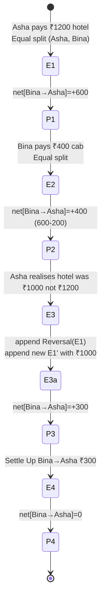

Critically, in step **E3**, we *never UPDATE* E1. We append a reversal (which is just an expense with `ReversalOf=E1.ID` and `Split` flipped — Asha owes herself ₹600, Bina is owed ₹600), then append a corrected E1'. Tax-auditable. Rebuildable.

The projection is just a fold:

```go
func project(expenses []Expense) map[Pair]int64 {
    net := map[Pair]int64{}
    for _, e := range expenses {
        shares, _ := e.Split.Shares(e.AmountCents, e.Participants)
        for u, owed := range shares {
            if u == e.Payer { continue }
            net[Pair{From: u, To: e.Payer}] += owed
            net[Pair{From: e.Payer, To: u}] -= owed
        }
    }
    return net
}
```

**3. The cost you're accepting.**

| Gained | Paid |
|---|---|
| Source of truth is small, immutable, copy-able | Storage grows with #expenses, never shrinks |
| Any projection (per-pair, simplified, per-currency) rebuildable | Cold-read = O(#expenses); need a balance cache + snapshot mechanism |
| Audit + reversal trivially expressible | Code is 2× the size of mutate-balance; harder to onboard junior devs |
| CQRS-friendly: write-path & read-path scale independently | Eventual consistency on the projection; UI may briefly show stale balance |
| Determinism across replays = test fixture goldmine | Schema migration of `Expense` is *catastrophic* — every reversal references old shape |

**4. Failure modes the interviewer will drill into.**

| Q | A |
|---|---|
| Group with 10k expenses — recompute balance on every app-open? | No: keep a snapshot every K expenses (Kafka-style log compaction). Balance = snapshot + fold(expenses since snapshot). |
| Two users add expenses concurrently to the same group | Per-group single writer (goroutine or Postgres advisory lock keyed by GroupID). |
| User wants to delete an expense | Soft-delete only — append a reversal. Hard-delete breaks reversibility for downstream rows. |
| FX correction (USD/INR rate changed retroactively) | Reproject with the new rate-resolver. The log is currency-tagged, not rupee-tagged. |
| Expense involves a user who later left the group | Expense is immutable; user leaving is a *new event* `MemberRemoved`. Their balance remains until settled. |

**5. How to derive it from first principles.**

1. State = facts you cannot reconstruct. Derived data = facts you *can* reconstruct. Audit-grade systems store only state.
2. A balance is reconstructible from expenses (sum the shares). Therefore balance is *not* state — it is a projection.
3. If balance is a projection, mutating it is a denormalization; mutate without the source = unsynchronizable.
4. The expense log must therefore be append-only. Edits = compensating events, not mutations.
5. Reads on a projection are hot (every app open) → cache; cache must be invalidatable on every append in the same group.
6. The cache's TTL is effectively "until next append in this group".
7. Snapshots bound the rebuild cost: every K expenses, freeze the balance into a `Snapshot{GroupID, AsOfExpenseID, Net}` row.
8. The settle-up operation is *also* an expense (special type) — otherwise you have two write paths and the projection has to know about both.

**6. Where this shows up in production.**

- **Kafka log compaction**: source-of-truth is the topic; compacted view is the cached projection. Consumer rebuilds state by replaying the topic from earliest.
- **Git**: commits are immutable expenses; the working tree is the projection. `git reset --hard` is "rebuild projection from log".
- **Event Store / EventStoreDB**: aggregate (`Group`) emits events (`Expense`), projections (`BalanceProjection`) live elsewhere and are rebuildable. Used in banks and fintechs for the same audit reason.
- **Postgres WAL**: page contents are the projection, the WAL is the log of truth. Crash recovery replays WAL onto a checkpoint snapshot.
- **Stripe's `BalanceTransaction` model**: every cent moving through a Stripe account is a `BalanceTransaction` (an immutable event) and the account's `available_balance` is a derived field. Hundreds of millions of events/day.

### Concurrency model

Splitwise is **not** a concurrency-heavy problem per the catalog — single-writer per group is sufficient and correct. But the *seam* must exist, because two members of the same group adding expenses simultaneously is the realistic case.

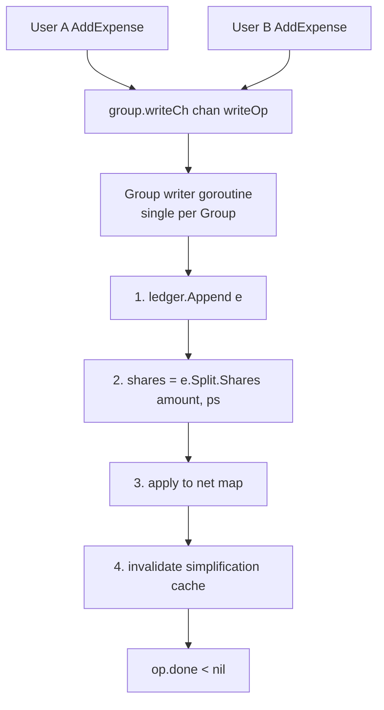

Why single-writer-per-group beats both alternatives:

| Option | Why rejected |
|---|---|
| Mutex on `Group.net` | Works, but read-path also takes the lock → readers block on writes. With a single-writer + atomic pointer swap of the projection, reads are lock-free. |
| Distributed lock per group (Redis) | Required for multi-process deployments; for a single-process service the goroutine is simpler. Redis lock is the *upgrade path*, not the starting point. |
| Lock-free CRDT counter per pair | Loses audit trail — back to mutate-balance trap. Settle-up needs a globally consistent view. |

**Deadlock-freedom argument:** one writer goroutine per group reads from one channel, writes to no other channel. No cycle exists. Cross-group operations must go through a higher-level coordinator that locks both groups in canonical GroupID order.

### Extension points

| Extension | Where it lands | What doesn't change |
|---|---|---|
| Multiple currencies | `Expense.Currency` field already there; add `FXResolver` injected into `BalanceProjection`; project per-currency *then* convert at read time | Ledger, split strategies, simplifier |
| Group with 50 members | Net per user is O(N); greedy MCMF is O(N log N). Cache the simplification result; invalidate on append. | Domain model, persistence |
| Concurrent adds → double-counting on settlement | Per-group writer goroutine; upgrade to Postgres advisory lock when multi-process | Strategy, simplifier |
| Recurring expenses (monthly rent) | New `RecurrenceSpec` on `Expense`; cron materializes children expenses | Split strategy, projection |
| Receipt OCR / item-level split | New `SplitStrategy: ItemizedSplit` consuming OCR output | Ledger, projection, simplifier |

### SOLID self-audit

| Principle | Obeyed? | Why / why not |
|---|---|---|
| Single Responsibility | yes | `Expense` records facts; `Split` computes shares; `Projection` folds; `Simplifier` reduces; `Group` orchestrates. |
| Open/Closed | yes | New `SplitStrategy` or `Simplifier` slots in without touching `Group` or `Expense`. |
| Liskov | yes | All `SplitStrategy` impls satisfy `Shares(amount, participants) → map` with the invariant that the returned map sums to `amount`. |
| Interface Segregation | yes | `Simplifier` is 1-method; `SplitStrategy` is 1-method; `LedgerStore` is 2-method. |
| Dependency Inversion | yes | `Group` depends on `LedgerStore` and `Simplifier` interfaces, never on Postgres or greedy-impl concretely. |

### Where this shows up in production

- **Stripe `BalanceTransaction` ledger**: every cent is an immutable event; account balance is derived; reversals are compensating events.
- **Splitwise mobile app**: per-group greedy simplification, optional settle-up via Venmo/PayPal/UPI integration.
- **QuickBooks / Xero double-entry accounting**: journal entries (immutable events) → trial balance (projection) → reports. Exactly the CQRS shape.
- **CHIPS / India RTGS net settlement**: end-of-day netting of interbank obligations into MCMF transfers — same simplification problem at central-bank scale.

### Common follow-ups

1. **Multiple currencies — when do you convert?** Store every expense in its original currency on the ledger. Convert at *projection* time using a per-day FX snapshot stored alongside the projection cache. If FX is corrected retroactively, reproject.
2. **Group with 50 members; simplification gets quadratic.** Per-pair `net` map is O(N²) worst case, but most pairs are zero — store sparsely. Simplification operates on the *signed net per user* (O(N)) not pairs, so greedy is O(N log N). Cache; invalidate on `AddExpense`.
3. **Concurrent expense additions — how to avoid double-counting on settlement?** Per-group single-writer (channel-fed goroutine, or Postgres advisory lock keyed by GroupID). The writer is the only mutator of `net`.
4. **How do you handle a user disputing a 6-month-old expense?** Don't delete it. Append a reversal-expense referencing the original via `ReversalOf`, then optionally a corrected new expense. Projection reflects the change; audit log shows the timeline.
5. **How do you bound storage if the group is years old?** Snapshot every K expenses (e.g., K=500). `Balance(group) = latestSnapshot.Net + fold(expenses since snapshot.AsOfExpenseID)`. Snapshots are a cache, never the source of truth.

### Diagnostic questions

1. **"If a user edits an expense from ₹1200 to ₹1000, what gets written?"** — Right: append a `Reversal` + a new corrected expense. **Wrong: UPDATE the row.** Tells you the candidate doesn't grok event sourcing.
2. **"Is `Balance` or `Expense` the source of truth?"** — Right: `Expense`; `Balance` is a projection. **Wrong: "Balance, because that's what users see."** The *exact* `trap_for_juniors` from the catalog.
3. **"How does your simplification guarantee ≤ N-1 transactions?"** — Right: greedy iterates a max-heap; each step zeros at least one vertex → ≤ N-1 iterations. **Wrong: "It's optimal."** Optimal would require MCMF.
4. **"Two users add expenses simultaneously to the same group — how is `net` consistent?"** — Right: per-group single-writer serializes the append. **Wrong: "Locks on `net`"** — blocks readers; **wrong: "Atomic counters"** — loses the expense log.
5. **"What if you need to add a new split type — say, 'split by item' from a receipt OCR?"** — Right: new `SplitStrategy` impl. Zero changes to `Expense`, `Group`, `LedgerStore`, `BalanceProjection`. **Wrong: "Add a `splitType` enum and a switch in `Expense.compute()`"** — closed for extension.

---

## [2026-06-05] L05 · Tic-Tac-Toe (N×N) · **Amazon** · Microsoft · universal

- **Win-check is a *counter increment*, not a scan** — the row/col/diag tallies live inside `Board` and mutate by exactly four `int++` per move. The whole design's soul is keeping that O(1).
- **Two interfaces, never collapsed: `MoveValidator` (where can you place?) and `WinChecker` (did that placement win?)** — fusing them is the trap that makes Connect-4 a rewrite instead of a swap.
- **Engine knows nothing about gravity, K-in-a-row, or board size** — `N`, `K`, gravity rule, and tie detection all live in injected strategies; `Game.Play` is the same 12 lines for tic-tac-toe, Connect-4, and Gomoku.

### Problem (as asked)

> Design Tic-Tac-Toe. Two players, 3×3 grid. Now extend to N×N where you need K-in-a-row to win. Keep the win-check efficient as N grows.

**Clarifying questions to ask back:**
1. **Scope** — is this just the rules engine, or also matchmaking / persistence / replay? (Assume rules engine only.)
2. **Scale parameters** — what bounds on `N` and `K`? Gomoku is 15×15 with K=5; if N can be 100, the win-check optimization stops being optional. (Assume N up to ~32, K up to N.)
3. **Concurrency** — local turn-based or online multiplayer? Decides whether we need a turn-lock + sequence number. (Assume local first; online is an extension axis.)
4. **Extensibility** — which axis changes first: board shape, win condition, or player kind? (Assume all three; design must isolate each.)
5. **Persistence** — must we resume a game after process restart? (Assume in-memory; `GameRepo` port lets us swap in durable storage.)

### Requirements teardown

| Functional | Non-functional |
|---|---|
| Two players alternate placing marks on an N×N board | Win-check is **O(1) per move**, not O(N²) per move |
| Detect win on any row / column / both diagonals | Adding Connect-4 (gravity) doesn't touch `Board` or `Game` |
| Detect draw when board fills with no winner | Engine code identical across tic-tac-toe / Connect-4 / Gomoku |
| Reject illegal moves (out of bounds, occupied, wrong turn) | Deterministically testable — no randomness, no clock in engine |
| Report game state (in-progress / won / drawn) | Memory **O(N²)** for board + **O(N)** for counters; nothing hidden |

### Actor & entity inventory

| Entity | Responsibility (single sentence) |
|---|---|
| `Game` | Aggregate root: owns the board, players, current turn, win/validator strategies; only public API. |
| `Board` | Owns `cells` + the row/col/diag **counter arrays** that make win-check O(1). |
| `Cell` | Value: empty, or the `Player` that occupies it. |
| `Player` | Identity (`X` / `O` / id) — does *not* know how to play; an `AIPlayer` is a *separate* port. |
| `Move` | Value object: `(row, col, player, seq)` — immutable, the unit of state transition. |
| `MoveValidator` | Strategy: is this `Move` legal *here, now*? `StandardValidator` for tic-tac-toe, `GravityValidator` for Connect-4. |
| `WinChecker` | Strategy: given the board *after* a move, did that move win? `IncrementalWinChecker` for O(1), `NaiveWinChecker` as the reference impl. |

### Class diagram

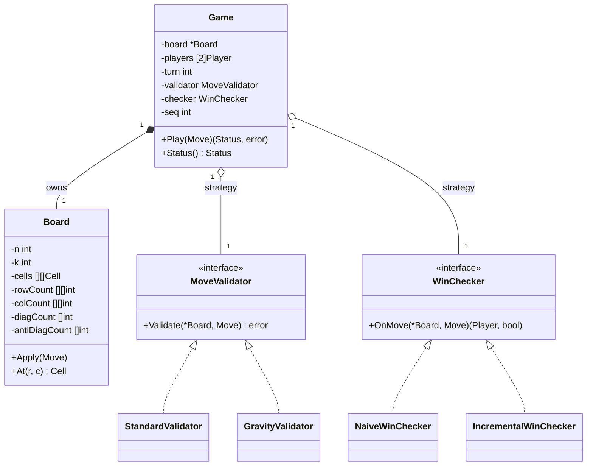

The **two arrows out of `Game`** into two *different* interfaces is the whole design. Where-can-I-place and did-that-placement-win are different questions, asked at different times, that change for different reasons.

### Patterns applied + alternatives rejected

| Pattern | Where | Why this over alternatives |
|---|---|---|
| Strategy (×2) | `MoveValidator`, `WinChecker` | Validation axis (gravity, bounds) and win axis (K-in-a-row, line shapes) change independently. Two seams, never one. |
| Aggregate Root | `Game` is the only public seam | All state mutation flows through `Game.Play`; counters can't drift from cells because outsiders can't touch `Board` directly. |
| Value Object | `Move`, `Cell` | Immutable inputs/states make win-check referentially testable. |
| Open/Closed | Connect-4 = new `MoveValidator`; Gomoku = same incremental checker with bigger `K` | New game = new file + wiring; zero edits to `Game` / `Board`. |

**Rejected patterns:**
- **Hardcoded win patterns** — for N×N there are `2N + 2` lines containing K-windows each. Enumeration is O(N²) per check before scanning. Reject in favor of counters.
- **Observer for "game won" events** — only one listener; plain return value beats event plumbing.
- **Visitor over `Cell` types** — only one cell type.
- **State pattern for turn (`XTurn` / `OTurn`)** — a single `turn int` toggled `1 - turn` is two characters.

### Code skeleton (Go)

Skeleton lives at [`labs/lld-projects/L05-tic-tac-toe/`](../labs/lld-projects/L05-tic-tac-toe/) — `Board` with the row/col/diag counter arrays, the two strategy seams (`MoveValidator`, `WinChecker`), and `Game.Play` orchestrating turn → validate → apply → check. The counter-mutating `Board.Apply` and the `IncrementalWinChecker.OnMove` are the two bodies that earn their keep; the Deep dive unpacks why.

### Deep dive 1: Win-check optimization — O(N²) naive scan vs O(1) incremental counters

**1. Why does this mechanism exist?**

A junior writes `checkWin()` that, after every move, walks every row, every column, and both diagonals. That is `4` lines × `N` cells = `4N` reads per move; the move sequence is at most `N²` moves; the total work over a game is `O(N³)`. For N=3 (classic tic-tac-toe) this is 108 reads. For Gomoku at N=15 it is 13,500. For an online K-in-a-row server at N=64 it is ~1M reads *per game*. The naive impl scales as the cube of the board side; the design intent ("keep the win-check efficient as N grows") explicitly forbids it.

The insight: a row can only have `N` X's if X just played in it **and** that row already had `N-1` X's. The win condition is a **monotone counter** — never decreases, only ever increments by `1`. So we keep counters per (player, row), (player, col), (player, diag), (player, anti-diag) and **read four integers** after each `Apply`. That's O(1) per move, O(N²) over the whole game, and crucially **independent of N inside a single move**.

**2. Walk it concretely.**

Board: 4×4, K=3. Three moves on row 1:

```
Initial:  rowCount=[0,0,0,0]  colCount=[0,0,0,0]  diag=0  antiDiag=0

Move 1: X→(1,1)
  rowCount[1]++  → [0,1,0,0]
  colCount[1]++  → [0,1,0,0]
  r==c (1==1)    → diag++ → 1
  Check: None == K(=3). No win.

Move 2: X→(1,2)
  rowCount[1]++  → [0,2,0,0]
  colCount[2]++  → [0,1,1,0]
  Check: rowCount[1]=2 < K. No win.

Move 3: X→(1,3)
  rowCount[1]++  → [0,3,0,0]   ← hits K=3
  colCount[3]++  → [0,1,1,1]
  Check: rowCount[1] == K → WIN.
```

Three moves, three increments per move on average, four reads on each `OnMove`. No scan of the row's cells ever happened.

**The K<N wrinkle.** When `K < N`, "rowCount[player][r] == K" is *not* enough — three X's in row 1 might be at columns 0, 2, 3 (not contiguous). So for windowed wins we keep, per `(player, row)`, the **length of the current run ending at the most recent move's column**. Each move updates four such runs. Still `O(1)` per move; the constant is 4 reads + 4 writes. Reset to `1` when a non-`p` cell breaks the run.

**3. The cost you're accepting.**

| Property gained | Cost paid |
|---|---|
| O(1) win-check per move (four counter reads) | O(P · N) extra memory: P players × N rows + N cols + 2 diags ≈ `4PN` ints. |
| Each move costs 4 fixed `int++` regardless of N | Counter logic lives in `Board.Apply`; bugs in maintenance are *silent* until a wrong winner is reported. Mitigation: ship `NaiveWinChecker` as oracle in tests. |
| Trivially extends to K<N via per-line run length | Diagonal indexing is fiddly (`2N-1` diagonals on each side); off-by-one bugs cluster here. |
| Cache-friendly: counters live in a contiguous `[]int`, hot in L1 across moves | Counter arrays are mutable state; undo needs an explicit reverse op or a snapshot. |

**Cache-line teach-in.** `[]int` in Go is 8 bytes/entry; a row of 64 counters is 512 bytes = 8 cache lines. `Board.Apply` touches one entry in each of four arrays. Four cache lines touched per move. At N≤64 this is well within L1; at N=10⁴ you switch to a hash map keyed by `(player, row)` so the working set tracks the *played* lines.

**4. Failure modes the interviewer will drill into.**

| Question | What goes wrong | Mitigation |
|---|---|---|
| Counters drift from cells (a bug, a partial rollback, a future "undo" op) | Win reported on a board that doesn't actually have a win | Property test: after each move, assert `sum(rowCount[p][r] for r) == count(p in cells)`. Tie counter mutation to `Board.Apply` only. |
| K < N and a player has K marks in a row but **not contiguous** | Naive `rowCount == K` reports a false win | Switch to per-line *run-length* counters. |
| Two diagonals overlap at the center (odd N): center move hits both | Both `diag` and `antiDiag` increment correctly; easy to miscode as `else if` | Use two independent `if`s, never `else if`. |
| Integer overflow on `int` counter | Impossible at human scale; worth saying for an N=2³¹ toy board | Use `int32`; document max N at compile time. |
| Undo last move | `Apply` is monotone — counters increase only | Add `Board.Unapply(m)` that decrements the same four positions. |

**5. How to derive it from first principles.**

1. Enumerate the win condition: at least one row, column, or diagonal has K consecutive marks of one player.
2. Observe: this condition can only *become* true on the move that places the K-th mark in such a line.
3. So we don't need to *re-evaluate* the whole board; we only need to check the **lines passing through the just-played cell**.
4. The lines through `(r, c)` are: row `r`, col `c`, main diag (iff `r == c`), anti-diag (iff `r + c == n-1`). At most four lines per move.
5. For K = N: the line has a winner iff it is *full of that player*. A counter per (player, line) suffices: increment on `Apply`, compare to `N` on `OnMove`. O(1).
6. For K < N: "full" → "contiguous run of length K". Maintain a per-line run-length counter. Still O(1) per move.
7. Total work over a game: `N²` moves × O(1) per check = **O(N²) total** — and that lower bound is unavoidable.
8. The naive scan does the *same* O(N²) total work, but pays it as O(N) per move × N² moves = O(N³).

**Adversarial input that triggers the naive worst case.** A 4×4 board with K=3 where players alternate in a pattern that never wins until the last cell. At N=64 the naive impl does 4096 × 4 × 64 = ~1M reads; the incremental impl does 4096 × 8 = 32K ops.

**6. Where this shows up in production.**

- **Stockfish — incremental evaluation.** The chess engine maintains a running evaluation score that mutates by *delta* on each move instead of recomputing. Stockfish's `do_move` updates ~5 small accumulators in O(1).
- **Lichess — incremental Zobrist hashing.** A board's 64-bit hash is XOR'd with a random key per piece-square on each move, and XOR'd again on undo. Same family as our counters: monotone, reversible, derivable in O(1) from the previous state.
- **Reddit r/place 2022 (16M pixel grid).** The canvas is too large to re-render on each tile mutation; Reddit maintains per-tile dirty flags and a tile-aggregate counter that mutates by ±1 on each user place. Reported peak: 160k writes/s with O(1) per write.

### Deep dive 2: Open-Closed extension to Connect-4 / Gomoku without rewriting the engine

The cost of adding Connect-4 is a function of (`engine_coupling` × `move_validation_axis` × `win_check_axis`) — three axes the design has isolated.

**1. Why does this mechanism exist?**

Tic-tac-toe, Connect-4, and Gomoku share **the same engine**: a board of cells, alternating turns, a move that marks a cell, a check that decides win/draw. They differ on exactly two axes:

- **Move validation.** Tic-tac-toe: any empty cell. Connect-4: only cells where the cell below is filled (or row is the bottom) — *gravity*. Gomoku: any empty cell.
- **Win condition.** Tic-tac-toe: K = N. Connect-4: K = 4 (windowed). Gomoku: K = 5 (windowed).

If `Game` hardcoded either axis, adding Connect-4 would mean editing `Game.Play` — the OCP violation. By extracting both into strategies, **Connect-4 is one new file** (`GravityValidator`) and a constructor parameter (`K = 4`).

**2. Walk it concretely.**

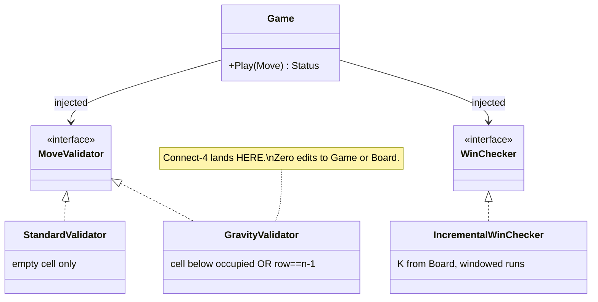

Concrete walk: Connect-4 column-3 drop on an otherwise-empty 7×6 board.

```
Player calls Game.Play(Move{Row: 5, Col: 3, By: 1})
  → Game.validator.Validate = GravityValidator.Validate:
      Check r==5 (bottom row): pass — no support needed.
  → Board.Apply: cells[5][3]=1, rowCount[1][5]++, colCount[1][3]++.
  → IncrementalWinChecker.OnMove with K=4:
      run[1][row=5] = 1; run[1][col=3] = 1
      None == 4. No win. Status = InProgress.
```

Same `Game.Play`, same `Board.Apply`, same `IncrementalWinChecker`. The only Connect-4-specific code is `GravityValidator.Validate`:

```go
func (GravityValidator) Validate(b *Board, m Move) error {
    if b.cells[m.Row][m.Col] != 0 { return errors.New("cell occupied") }
    if m.Row == b.n-1 { return nil }
    if b.cells[m.Row+1][m.Col] == 0 { return errors.New("no support") }
    return nil
}
```

Gomoku: zero new code. Wire `NewBoard(15, 5, 2)` + `StandardValidator{}` + `IncrementalWinChecker{}`.

**3. The cost you're accepting.**

| Property gained | Cost paid |
|---|---|
| Adding Connect-4 = 1 file + constructor wiring | Caller must compute `Move.Row` from gravity rule *before* calling `Play` — the UI knows about gravity, not the engine. |
| Adding Gomoku = 0 files; pure configuration (N=15, K=5) | `IncrementalWinChecker` must support both `K==N` and `K<N` branches. |
| All three games share `Game`, `Board`, `Move`, `WinChecker` | Shared code = shared bugs; a regression in `Board.Apply` breaks all three. |
| New variants compose via new validators / new checkers | Strategy proliferation: the wiring matrix gets noisy. A `GameKind` enum that builds the right combo is a reasonable add. |

**4. Failure modes the interviewer will drill into.**

| Question | What goes wrong | Mitigation |
|---|---|---|
| "Where does the AI player live?" | Embedding minimax in `Game` couples engine to search | New port: `PlayerStrategy interface { ChooseMove(*Board) Move }`. |
| "Connect-4 columns: player picks col, engine picks row — where?" | If `Game.Play` computes row, it now knows about gravity | Caller (UI / `PlayerStrategy`) computes the row. |
| "Misère tic-tac-toe (loser is who gets 3 in a row)" | Win-check returns winner; misère wants the *opposite* | New `WinChecker`: `MisereChecker{Inner WinChecker}` decorator. |
| "What if K can change mid-game (handicap)?" | `K` is on `Board`; changing it is a hidden state mutation | Move `K` into the `WinChecker` config. |
| "Hex board (Catan-style adjacency)" | Diagonals are different; row/col counters wrong shape | Replace `IncrementalWinChecker` with `HexWinChecker` keeping counters on the 3 hex axes. |

**5. How to derive it from first principles.**

1. List the variants: tic-tac-toe (3×3, K=3), Connect-4 (7×6, K=4, gravity), Gomoku (15×15, K=5).
2. Find what changes: (a) board shape, (b) where you can place, (c) what counts as a win.
3. Find what doesn't: turn alternation, board-as-grid, "place a mark," "did that placement win?"
4. **Apply Open/Closed:** the unchanging spine (`Game.Play` loop) stays; each changing axis goes behind an interface.
5. Identify the seams: `MoveValidator` for axis (b); `WinChecker` for axis (c). Board shape is a parameter.
6. Verify the seams are *independent*: Connect-4 = new validator + standard checker; misère tic-tac-toe = standard validator + new checker. ✅
7. Verify Liskov: every `MoveValidator` returns `nil` for legal moves and a non-nil error otherwise. Every `WinChecker` returns `(winner, true)` xor `(0, false)`.
8. Verify the *engine* knows nothing game-specific. Grep `Game.Play`: no string literal, no enum case, no `if`.

**Derive-don't-assert on "engine knows nothing".** Mechanism: `Game` holds two interfaces and a `*Board`. Upside: any game expressible in (validator, win-checker, board shape) plugs in without touching `Game`. Downside: rare games that need *engine-level* changes (e.g., **chess** with castling = move that mutates *two* cells) don't fit; you'd need a richer `Move` and a new validator contract.

**6. Where this shows up in production.**

- **chess.com — pluggable variants engine.** Standard chess, Chess960, King of the Hill, 3-Check — all share the same board representation; only the *win condition* and the *move validator* differ. A new variant ships as a config + two strategy impls.
- **Lichess — variants.** Their `Variant` trait in Scala has exactly two abstract methods that diverge per variant — `validMoves` and `winner`.
- **Catan online (Colonist.io)** — Open/Closed rule plugins for expansions; same engine spine.

### Concurrency model

Single-player local: trivial. `Game.Play` is synchronous; no shared state with anyone; the caller's UI is the only writer.

Online multiplayer is where the design earns its `Seq` field on `Move`:

```mermaid
sequenceDiagram
    participant P1 as Player 1 (Client)
    participant SVR as Game Server
    participant P2 as Player 2 (Client)
    P1->>SVR: Move{Row:0, Col:0, By:1, Seq:1}
    SVR->>SVR: turnLock.Lock(); validate seq==expected; Play
    SVR-->>P1: ok, state{turn:2, seq:2}
    SVR-->>P2: state{turn:2, seq:2}
    P2->>SVR: Move{Row:1, Col:1, By:2, Seq:1}
    SVR->>SVR: reject — seq mismatch (expected 2)
    SVR-->>P2: err{expected_seq:2}
```

**Mechanisms:**
- **Turn lock.** `Game.Play` wrapped in `sync.Mutex`. Upside: simple, correct. Downside: server throughput per game capped — fine because one game has ≤2 movers.
- **Sequence number.** `Move.Seq` must match `Game.seq`. Defends against duplicate, stale, replayed submissions.

### Extension points

| Extension | Where it lands | What doesn't change |
|---|---|---|
| Connect-4 | New `GravityValidator`; `K=4` config | `Game`, `Board`, `WinChecker`, `Move` |
| Gomoku (15×15, K=5) | Pure config: `NewBoard(15, 5, 2)` + standard strategies | Everything |
| Undo last move | New `Board.Unapply(m)`; store move history in `Game` | Strategies, win-check contract |
| AI player (minimax) | New port `PlayerStrategy`; `MinimaxPlayer` impl | `Game.Play`, `Board.Apply` |
| Online multiplayer | New transport layer; `Move.Seq` enforced server-side; turn-lock around `Play` | Engine internals; `Board` |
| Misère | `MisereChecker{Inner WinChecker}` decorator | All other components |
| Variable board shapes (hex, 3D) | New `Adjacency` strategy + replacement `WinChecker` | `Game` loop, `Move` shape |

### SOLID self-audit

| Principle | Obeyed? | Why |
|---|---|---|
| Single Responsibility | ✅ | `Game` orchestrates turns; `Board` owns cells+counters; `MoveValidator` validates; `WinChecker` checks. |
| Open/Closed | ✅ | Connect-4 = new validator; misère = new checker decorator; Gomoku = config only. |
| Liskov | ✅ | Every `MoveValidator` returns `nil`-or-error and never mutates board; every `WinChecker` returns `(winner,true)` xor `(0,false)`. |
| Interface Segregation | ✅ | `MoveValidator` is 1-method; `WinChecker` is 1-method. |
| Dependency Inversion | ✅ | `Game` depends on two interfaces, not concrete impls. |

### Where this shows up in production

- **chess.com / Lichess** — variant engines split rules into validator + checker, exactly this design at chess scale.
- **Stockfish** — incremental evaluation (counters mutate by delta per move) is the same algorithm-shape as our row/col/diag counters.
- **Catan online (Colonist.io)** — Open/Closed rule plugins for expansions; same engine spine.

### Common follow-ups

1. **Make it Connect-4 (gravity)** — new `GravityValidator`; `Game` and `Board` unchanged; `K=4` constructor param. Caller computes the row from the chosen column.
2. **Add Gomoku (15×15, 5-in-a-row)** — no new code: `NewBoard(15, 5, 2)` + `StandardValidator{}` + `IncrementalWinChecker{}`.
3. **AI opponent (minimax)** — define `PlayerStrategy interface`. `HumanPlayer` reads from an input channel; `MinimaxPlayer` runs game-tree search using a *cloned* `IncrementalWinChecker` to evaluate leaves.
4. **Undo / time-travel debugging** — `Board.Unapply(m)` decrements the four counters and clears the cell; `Game` stores a `[]Move` history.
5. **Networked multiplayer with anti-cheat** — server is the only `Game` holder; clients submit `Move{Seq}` over the wire; server validates and broadcasts the new state.

### Diagnostic questions

1. **Why are `MoveValidator` and `WinChecker` separate interfaces?** — wrong: "they could be one `RulesEngine`." Wrong because Connect-4 changes validation only; misère changes win only.
2. **Why does `Board` own the counter arrays, not `WinChecker`?** — wrong: "put counters in the checker." Wrong because the counters must update on *every* move, and only `Board.Apply` happens on every move.
3. **Why is the win-check O(1) per move, not O(N) per move?** — wrong: "we only scan the line that the move touched." That's O(N) per move = O(N³) per game. Right: **incremental counters**.
4. **What changes to support Connect-4?** — wrong: "rewrite `Game.Play` to drop pieces." Right: new `GravityValidator`; engine, board, checker unchanged.
5. **Why does `Move` carry a `Seq` number?** — wrong: "for logging." Right: it defends online multiplayer against duplicate / stale / replayed submissions.

---

## [2026-06-04] L04 · Vending machine · **Amazon** · Atlassian · Universal

- **State pattern over the transaction lifecycle** (`Idle` → `CoinAccepted` → `ItemSelected` → `Dispensing` → `Idle`) — every illegal transition is rejected by the *current* state object, not by an `if` cascade.
- **Strategy for change-making** — `GreedyChangeMaker` is the fast path for canonical denominations ({1,5,10,25}), `DPChangeMaker` is the correct path for {1,3,4}-style adversarial sets.
- **Single-threaded by construction** — one customer, one coin slot, one dispense bay. The whole machine is a single event-loop owning its inventory map; no mutex, no race.

### Problem (as asked)

> Design a vending machine. Coins/notes in, item dispensed, change out. Handle out-of-stock, insufficient funds, cancel mid-transaction. Pure state machine.

**Clarifying questions to ask back:**
1. **Payment surface** — coins/notes only, or also card/NFC? (Assume *coins only* for v1.)
2. **Denomination set** — fixed US or configurable per locale? (Assume *configurable* — this is what forces DP over greedy.)
3. **Concurrency** — one customer at a time? (Assume *single bay, single customer*.)
4. **Failure semantics on jam mid-dispense** — refund, retry, or `OutOfService`? (Assume *refund + OutOfService* at airports; *retry* in offices.)
5. **Inventory persistence** — must inventory survive a power cycle? (Assume *yes* — write-through to a small key-value file.)

### Requirements teardown

| Functional | Non-functional |
|---|---|
| Accept coins in any order; track running balance in cents (integer, never float) | Single-threaded event loop — no race conditions by construction |
| List items + prices; reject selection if balance < price or stock = 0 | Dispense + change-return latency < 2s p99 (mechanical-bound) |
| Dispense item and return correct change (minimum coin count) | Algorithm for change is *swappable* |
| Cancel mid-transaction returns full balance as coins | Inventory persisted write-through |

### Actor & entity inventory

| Entity | Responsibility (single sentence) |
|---|---|
| `VendingMachine` | Aggregate root: owns inventory, current balance, current `State`, and the `ChangeMaker`. |
| `State` | Behavioral interface (`OnCoin` / `OnSelect` / `OnDispense` / `OnCancel`); each concrete state decides which transitions are legal *for itself*. |
| `IdleState` / `CoinAcceptedState` / `ItemSelectedState` / `DispensingState` | The four concrete states. |
| `Inventory` | Map of `ItemID → (price, stockCount)`; reservations are atomic with the state transition into `ItemSelected`. |
| `ChangeMaker` | Strategy interface: given an amount in cents and available denominations, return a coin slice. |
| `GreedyChangeMaker` / `DPChangeMaker` | Two concrete strategies; greedy is O(D), DP is O(N·target). |
| `Coin` | Value object with a `ValueCents int` field — **integers, not floats**. |
| `Ledger` | Append-only log of `(timestamp, event, balanceCents)` — survives a crash. |

### Class diagram

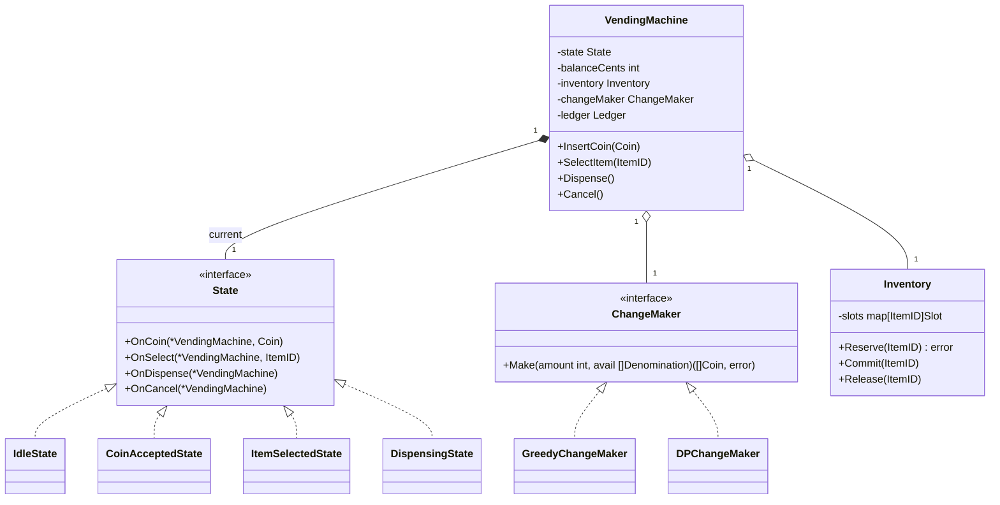

The **aggregate boundary** is `VendingMachine`. Nothing reaches in and mutates `balanceCents` directly. The four inputs — coin, select, dispense, cancel — are the *only* public surface, each dispatched to the current state. Same shape as Stripe's `PaymentIntent`.

### Patterns applied + alternatives rejected

| Pattern | Where | Why this over alternatives |
|---|---|---|
| **State** | `VendingMachine.state` + 4 concrete states | Each state object's methods *are* the transition table. Upside: illegal transitions become method calls that no-op or error. Downside: 4 small files instead of 1 fat `switch`. |
| **Strategy** | `ChangeMaker` interface | Algorithm pluggable per machine config. Upside: greedy in US, DP in Switzerland — no recompile. Downside: extra interface boundary. |
| **Memento (light)** | `Ledger` snapshot of `(state, balance)` before each transition | Power-loss recovery replays the ledger. Upside: durable. Downside: every transition does a write. |

**Rejected patterns:**
- **Singleton machine** — wrecks testability.
- **Observer for coin events** — only one subscriber (the state machine).
- **Command pattern for inputs** — over-engineered; hardware doesn't support undo.

### Code skeleton (Go)

Skeleton lives at [`labs/lld-projects/L04-vending-machine/`](../labs/lld-projects/L04-vending-machine/) — `VendingMachine` aggregate, the four `State` impls (`IdleState`, `CoinAcceptedState`, `ItemSelectedState`, `DispensingState`), and the `ChangeMaker` strategy (`GreedyChangeMaker` vs `DPChangeMaker`). Each state's method table *is* the legal-transition table; the Deep dive walks why.

### Deep dive 1 — The transaction state machine

**1. Why does this mechanism exist?**

The naïve implementation is a single `Dispense(itemID)` method with five flags: `hasCoin`, `selected`, `dispensing`, `cancelling`, `outOfService`. Two months later someone adds `RefundingState` and forgets one of the guards — now you can select an item *while a refund is in progress*, double-decrement inventory, and the cashier finds a missing Snickers at end of shift. The State pattern's mechanism: **the current state object's method table *is* the legal-transition table.** Adding `RefundingState` means adding one class; no existing code changes. Upside: open/closed satisfied, illegal transitions impossible. Downside: indirection — harder to follow than a flat switch.

**2. Walk it concretely.**

Customer wants a $1.25 Snickers. Has a quarter, a $1 bill.

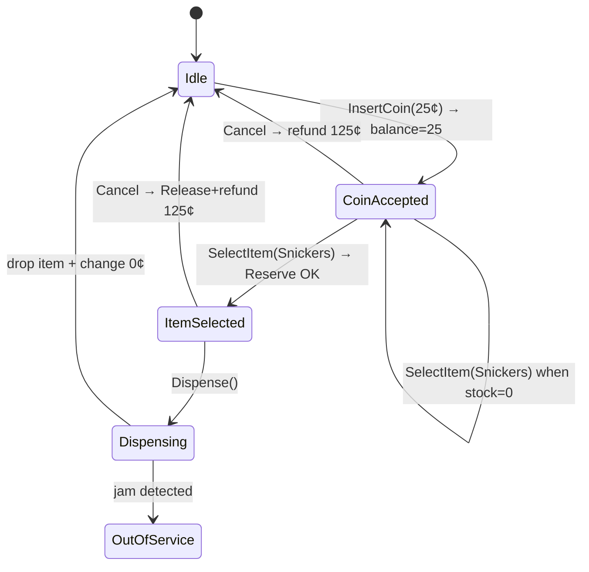

Concretely: `IdleState.OnCoin(m, 25¢)` → `m.balanceCents = 25`, transitions to `CoinAcceptedState`. `CoinAcceptedState.OnCoin(m, 100¢)` → `balance = 125`, stays. `OnSelect(Snickers)` → checks `125 ≥ 125` and `stock=4>0`, calls `Reserve` (stock→3), transitions to `ItemSelectedState`. `OnDispense()` triggers motor; on success, `Inventory.Commit`, back to `IdleState`.

**3. The cost you're accepting.**

| Property gained | Cost paid |
|---|---|
| Illegal transitions impossible — `IdleState.OnDispense` is literally a no-op | 4 small files instead of one 60-line switch |
| Adding `RefundingState` doesn't touch existing states (Open/Closed) | State objects share zero data |
| Each state unit-testable in isolation with a stub machine | Step-debugging requires you to know which state is current |
| `m.state = &X{}` is the **only** way state changes — grep is sufficient for an audit | Allocation per transition |

**4. Failure modes the interviewer will drill into.**

| Failure | What goes wrong | Mitigation |
|---|---|---|
| Q1: Power loss in `Dispensing` — did the item drop or not? | Customer's $1.25 is gone, Snickers may or may not have fallen | Write `(state, balance, selectedID)` to flash *before* energizing the motor; on reboot, replay |
| Q2: Coin jam mid-insert — sensor pulses twice | `balanceCents` over-counts | Debounce at sensor + reconcile with coin-box weight every 10 transactions |
| Q3: Customer slams Cancel during `Dispensing` | Mechanical drop already in motion | `DispensingState.OnCancel` is a no-op |
| Q4: `Reserve` succeeds but `Dispense` motor fails | Inventory says stock=3, physical machine still has 4 | `Commit` only *after* drop sensor fires; on motor-fail, `Release` + refund + `OutOfService` |
| Q5: Two coins inserted in the same 10ms tick | Race if you misimplement with goroutines | Single goroutine consumes the coin-sensor channel |

**5. How to derive it from first principles.**

1. Enumerate the *inputs*: coin, select, dispense, cancel. Four.
2. Enumerate the *phases*: nothing paid, partly paid, item chosen, item dropping. Four.
3. Cross-product: 16 cells in a transition table. Most are no-ops.
4. Two encoding choices: (a) one fat function with a 16-arm switch, or (b) one object per state with 4 methods.
5. Choose (b) when phases grow (add `Refunding`, `OutOfService`) and inputs stay fixed.
6. Vending-machine inputs are stable; phases grow. So (b) wins.
7. Make `State` an interface with one method per input.
8. The machine owns a single `state State` field. Every public method delegates. The state mutates `m.state` to transition. There is no other way to change state.

**6. Where this shows up in production.**

- **Stripe `PaymentIntent`** — explicit state machine: `requires_payment_method` → `requires_confirmation` → `requires_action` → `processing` → `succeeded` / `canceled`. ~9 documented states.
- **Linux process state machine** (`task_struct.state`): `TASK_RUNNING` / `TASK_INTERRUPTIBLE` / `TASK_UNINTERRUPTIBLE` / `TASK_STOPPED` / `TASK_ZOMBIE`.
- **Amazon Go store** — state machine over shopper journey; receipt = final transition.

### Deep dive 2 — Change-making: greedy vs DP

**1. Why does this mechanism exist?**

Mechanism (cost-of-service framing): *this change policy is a function of (denomination-set × inventory × customer-trust)*. The textbook trick "greedy: always pick the largest coin ≤ remaining" works for US coins {1, 5, 10, 25, 100} — but a Swiss machine sees {1, 2, 5, 10, 20, 50} Rappen. Greedy can be **wrong** on arbitrary sets. Upside of DP: provably optimal for any denomination set. Downside: O(N · target) time, O(target) space.

**2. Walk it concretely.**

Denominations `{1, 3, 4}`, target `6`. Greedy picks `4` (remaining 2), then `1`, then `1` → **3 coins**. DP finds `[3, 3]` → **2 coins**.

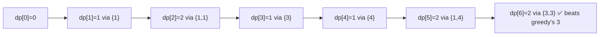

Recurrence: `dp[i] = 1 + min(dp[i−d])` for each denomination `d ≤ i`. For `i=6`: candidates are `dp[5]+1 = 3`, `dp[3]+1 = 2`, `dp[2]+1 = 3`. Minimum is 2.

**3. The cost you're accepting.**

| Property gained | Cost paid |
|---|---|
| Optimal coin count on **any** denomination set | O(N · target) work where greedy is O(N) |
| Easy to extend: limited-supply denominations → augment DP with count constraint | DP table allocation per call |
| Backpointer reconstruction gives the *actual* coin list | Reconstruction is a second O(target) pass |
| Provably correct — by induction on `i` | Cannot stream the answer |

**4. Failure modes the interviewer will drill into.**

| Question | Wrong answer | Right answer |
|---|---|---|
| "Greedy works for US coins, so just use greedy" | Ship greedy; locale change to Switzerland and the machine over-pays | Greedy is correct iff the denomination set is **canonical**; test by exhaustive search up to `2 × max(d)`. |
| "What if no exact change is possible?" | Refuse the sale | Two policies: (a) refuse + refund (airport), (b) dispense + log shortfall (office). |
| "DP recursive — won't it stack-overflow?" | Yes | Iterative bottom-up — no recursion. |
| "Float cents for the algorithm?" | Use float64 | Integer cents only. `0.1 + 0.2 ≠ 0.3` in IEEE-754. |
| "Customer inserts $100 bill, item is 75¢" | DP runs on target=9925, still fast | Real failure is running out of change. Mitigation: refuse bills above $5. |

**5. How to derive it from first principles.**

1. Problem: given coin set `D` and target `T`, find subset of `D` (with repetition) summing to `T` with min cardinality.
2. Observation: any optimal solution for `T` ends with *some* coin `d ∈ D`; removing it leaves an optimal solution for `T−d`.
3. Recurrence: `opt(T) = 1 + min_{d ∈ D, d ≤ T} opt(T−d)`. Base: `opt(0) = 0`.
4. Naïve recursion: exponential — sub-problems repeat.
5. Memoize: each `opt(i)` for `i ∈ [0, T]` computed once. Bottom-up array `dp[0..T]`.
6. Big-O derivation: outer loop `T` iterations; inner loop `|D|` work per cell. Total: `O(T · |D|)` time, `O(T)` space.
7. Reconstruction: store `parent[i] = d` whenever `dp[i]` is updated. Trace `T → T − parent[T] → ... → 0`.
8. When is greedy enough? Iff the denomination matroid is canonical. Test once at config time; cache the verdict.

**6. Where this shows up in production.**

- **Coca-Cola Freestyle dispensers** — pick a minimum number of syrup cartridges to hit a target flavor blend; same recurrence shape. ~140 flavors over ~46 cartridges.
- **Stripe Connect payouts** — splitting a payout across multiple bank-transfer denominations, each with a per-transfer fee. Same recurrence.
- **`apt`/`dnf` package solvers** — SAT/PBO solvers; libsolv falls back to Pseudo-Boolean optimizer when greedy fails.

### Concurrency model

This problem is **single-threaded** and that is a defensible call. The mechanism: one physical machine has one coin slot, one keypad, one dispense bay; the inputs arrive *serially* from hardware-interrupt → debounced channel → one consumer goroutine. Upside: zero mutex, zero race. Downside: if you misread the spec as "design a vending *service*" instead of "design a vending *machine*", you ship a single-threaded server and crater throughput.

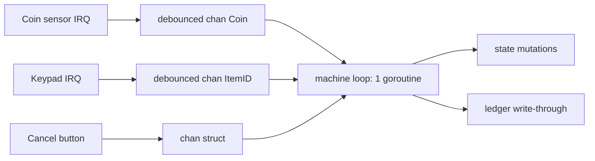

**What changes when you need N machines, central inventory?** The state machine stays *per-machine*. Inventory becomes a shared service: machines `Reserve(itemID)` against a central ledger with `CAS` on stock count. Concurrency model swaps from "single goroutine" to "per-machine goroutine + shared inventory client".

### Extension points

| Extension | Where it lands | What doesn't change |
|---|---|---|
| **Card payments** | New `PaymentMethod` interface; add `CardAuthorizingState` between `ItemSelected` and `Dispensing` | `ChangeMaker`, `Inventory`, `IdleState`, `DispensingState` |
| **Coin-jam mid-dispense recovery** | New `OutOfServiceState`; failure path transitions there | `IdleState`, `Inventory.Reserve` semantics, `ChangeMaker` |
| **Multi-machine central inventory** | Inventory becomes remote service; `Reserve` returns lease with TTL | `State` interface, all 4 concrete states, `ChangeMaker` |
| **Limited-supply change denominations** | Augment `DPChangeMaker` with per-denomination available count: `dp[i][counts]` | `State` machine, `Inventory`, public API |
| **Audit + per-item revenue reporting** | `Ledger` already exists; add a daily roll-up consumer | Everything; the ledger is the seam |

### SOLID self-audit

| Principle | Did we obey? | Why / why not |
|---|---|---|
| Single Responsibility | ✅ | `State` owns transitions, `Inventory` owns stock, `ChangeMaker` owns the algorithm, `Ledger` owns durability |
| Open/Closed | ✅ | New states and new `ChangeMaker` impls slot in without touching `VendingMachine` |
| Liskov | ✅ | Every `State` impl honors the contract; no-ops are valid behavior |
| Interface Segregation | ✅ | `State` is 4 methods, `ChangeMaker` is 1 |
| Dependency Inversion | ✅ | `VendingMachine` depends on `ChangeMaker` interface, not on impls |

### Where this shows up in production

- **Stripe `PaymentIntent` lifecycle** — 9-state machine, same shape.
- **Amazon Go** — state machine over shopper actions, receipt = final transition.
- **Coca-Cola Freestyle** — state machine for dispense + DP-style optimization for syrup-cartridge selection.
- **Square POS** — checkout flow state machine.
- **Linux `make`** — DAG of build-target states.

### Common follow-ups

1. **Add card payments — how does the state machine extend?** Add `CardAuthorizingState` between `ItemSelected` and `Dispensing`; on tap, call the PSP. On `auth_succeeded` → `DispensingState`; on `auth_failed` → back to `ItemSelected`.
2. **Coin jam mid-dispense — how do you recover?** Ledger writes `(Dispensing, balance, itemID)` *before* energizing the motor. On no-confirm within 2s, transition to `OutOfServiceState`. Airport: full refund + lock slot; office: retry + page maintenance.
3. **Multiple machines, central inventory — what changes?** `Inventory` becomes RPC client with `Reserve(itemID) (Lease, error)`. Leases TTL out. State machine and `ChangeMaker` unchanged.
4. **Promo codes / coupons** — add a `DiscountStrategy` to the price-lookup path; `CoinAcceptedState.OnSelect` consults it.
5. **Audit + tax reporting** — daily consumer rolls up the ledger by item, produces CSV.

### Diagnostic questions

1. **"Why is `IdleState.OnDispense` a no-op instead of an error?"** — wrong: "because the user never does it"; right: states are *closed* under inputs — the legal-transition table says so, and an error would force every caller to handle a meaningless exception.
2. **"You used DP for change. When is greedy enough?"** — wrong: "greedy is always fine for coins"; right: iff the set is canonical — verifiable by exhaustive search up to `2·max(D)` at config time.
3. **"Why integer cents and not float dollars?"** — wrong: "rounding"; right: IEEE-754 binary64 can't represent 0.1 exactly; over thousands of transactions the rolling error breaks audit.
4. **"How do you handle two coins inserted nanoseconds apart?"** — wrong: "mutex around `balanceCents`" (introduces the race you didn't have); right: single consumer goroutine over a debounced sensor channel.
5. **"You said `Reserve` then `Commit` — why both?"** — wrong: "to be safe"; right: the motor can fail between selection and drop; `Reserve` decrements atomically with the state transition, `Commit` finalizes only when the drop sensor confirms.

---

## [2026-05-23] L01 · Parking lot system · **Amazon** · Microsoft · Atlassian

- Two **independent** Strategy interfaces: `SpotAllocator` (layout-axis) and `PricingPolicy` (business-axis). They must not be one class.
- `ParkingLot` is the **aggregate root** (LDDD Ch.2-3); `Floor`, `Spot`, `Ticket` are inside the boundary. External world only touches the root.
- Single-process, single-threaded by spec. State lives in memory behind one mutex; persistence is a `TicketRepo` seam, not a design pillar.

### Problem (as asked)

> Design a parking lot system. Multiple floors, multiple spot types (compact/regular/large/electric-with-charger). Customers enter via a gate (ticket), park, and pay on exit. Make it extensible to add new spot types and pricing strategies.

**Clarifying questions to ask back:**
1. **Scope** — Is reservation in-scope, or only walk-in? (Assume walk-in only; reservation is a follow-up extension.)
2. **Scale** — How many spots and gates? (Assume ≤5000 spots, ≤20 gates per lot; this kills the "shard the spot index" tangent.)
3. **Concurrency** — Two cars race for the last compact spot — atomic? (Assume single-process, mutex-protected allocator; distributed locking is a Multi-lot follow-up.)
4. **Extensibility** — What's expected to change most: spot types, pricing, or vehicle types? (Pricing changes weekly, spot types yearly. Drives our pattern budget.)
5. **Persistence** — Survive a crash with active tickets? (Assume yes — durable ticket store; in-memory spot occupancy can be rebuilt from open tickets at startup.)

### Requirements teardown

| Functional | Non-functional |
|---|---|
| Issue ticket at entry gate, given a vehicle | Allocation O(log N) or better — no full scan per car |
| Park vehicle into a compatible spot | Pricing changes deployable without recompiling allocator |
| Compute fee at exit, accept payment | Ticket survives process restart |
| Release spot on exit | New spot type added in ≤1 file + 1 enum row |
| Report occupancy by floor/type | Test pricing without standing up a real lot |

### Actor & entity inventory

| Entity | Responsibility (single sentence) |
|---|---|
| `ParkingLot` | Aggregate root: owns floors, allocator, pricing, ticket repo; only public API. |
| `Floor` | Owns its `Spot`s; knows its level number; nothing about pricing. |
| `Spot` | Holds spot ID, type, occupancy, and the vehicle currently parked. |
| `Vehicle` | Value object: license plate + `VehicleType` (motorcycle/car/truck/EV). |
| `Ticket` | Issued at entry; immutable except for `paidAt`/`exitAt`; carries entry time + spot ID. |
| `SpotAllocator` | Strategy: picks a spot for a vehicle (or returns "lot full for this type"). |
| `PricingPolicy` | Strategy: turns (`entryAt`, `exitAt`, `spotType`) into a `Money` amount. |
| `TicketRepo` | Port: persists open/closed tickets; in-memory + SQL impls. |

### Class diagram

```
                              ┌────────────────────────┐
                              │     ParkingLot         │  ◄── aggregate root
                              │  (only public seam)    │
                              └─┬────┬─────┬─────┬─────┘
              owns N            │    │     │     │   uses 1
        ┌───────────────────────┘    │     │     └────────────────────┐
        ▼                            │     │                          ▼
   ┌──────────┐                      │     │              ┌──────────────────────┐
   │  Floor   │  owns N spots        │     │              │   TicketRepo (port)  │
   └────┬─────┘                      │     │              └──────────────────────┘
        │ owns N                     │     │                  impls: InMem | SQL
        ▼                            │     │
   ┌──────────┐                      │     │
   │   Spot   │ ─── parked ───►      │     │   ┌─────────────────────────────┐
   │  type:   │     Vehicle          │     └──►│   PricingPolicy (interface) │
   │  R/C/L/E │                      │         │   FlatRate │ Tiered │ Surge │
   └──────────┘                      ▼         └─────────────────────────────┘
                          ┌─────────────────────────┐
                          │ SpotAllocator (iface)   │
                          │ NearestFirst │ FirstFit │
                          │ TypeAwareLook            │
                          └─────────────────────────┘
```

Two arrows out of `ParkingLot` to two different interfaces — that's the design's whole soul. Allocator changes when **layout** changes. Pricing changes when **management** changes. They never co-vary, so they must not share a class.

### Patterns applied + alternatives rejected

| Pattern | Where | Why this over alternatives |
|---|---|---|
| Strategy (×2) | `SpotAllocator`, `PricingPolicy` | Both change independently for different reasons — separate interfaces, not "one big Policy class" |
| Factory Method | `Vehicle` → required `SpotType` set | Centralizes the "EV fits in EV-with-charger OR regular" compatibility rule |
| Aggregate Root (DDD) | `ParkingLot` is the only public seam | All mutation flows through it → invariants enforceable in one place |
| Repository | `TicketRepo` port | Lets us unit-test allocation without a DB; SQL impl can be swapped in |

**Rejected:**
- **Singleton `ParkingLot`** — kills testability (can't have two lots in one test), kills multi-lot operator extension. Pass it as a value; let DI containers manage lifetime.
- **Visitor for pricing per vehicle type** — pricing varies on time + spot type, not vehicle identity. Visitor would force a method per `Vehicle` subclass for no reason.
- **Observer for "spot freed" events** — there's only one listener (the allocator's free-list). Direct method call is fine; observer is overkill until we add multiple listeners.
- **Chain of Responsibility for "find spot of any compatible type"** — looks tempting (`EV → Regular → Compact`), but it's just a fallback list. Encode as a slice in `Vehicle.compatibleSpotTypes()`. Save CoR for *actual* request-pipeline problems.

### Code skeleton (Go)

Skeleton lives at [`labs/lld-projects/L01-parking-lot/`](../labs/lld-projects/L01-parking-lot/) — domain primitives (`Vehicle`, `Spot`, `Ticket`), the two strategy seams (`SpotAllocator`, `PricingPolicy`) plus the `TicketRepo` port, and the `ParkingLot` aggregate root with `Entry` / `Exit`. The compensating release on `tickets.Save` failure (a saga-in-miniature) is the body worth reading; see the Insight below.

`★ Insight ─────────────────────────────────────`
- The `ParkingLot.Entry` method's compensating release on `tickets.Save` failure is the **saga-in-miniature**: allocator and ticket store are two resources without a 2PC. We allocate first because it can fail cheaply (no-spot); we save second because writing then un-writing is the safer compensation direction.
- `Vehicle.CompatibleSpots()` returns a *preference list*, not a single type. This is the death of Chain-of-Responsibility for this problem — a slice + a `for` loop in the allocator reads better than 3 chained handlers.
- The `clock func() time.Time` field looks like Go-flavored ceremony, but it's what lets `PricingPolicy` tests run without `time.Sleep`. Injectable clocks are the most under-used DI seam in interview code.
`─────────────────────────────────────────────────`

### Deep dive 1: Spot allocation strategy — `NearestFirst` vs `FirstFit` vs `TypeAwareLook`

**1. Why does this mechanism exist?**

The lot has thousands of spots across multiple floors with multiple compatibility classes. The naive answer — "scan all spots, return the first free one" — is O(N) per entry and produces terrible spatial outcomes (cars cluster on the bottom floor; the top fills only at peak). At 1 entry/sec and 5000 spots, the scan itself is fine; the **business** outcome (walk distance, EV-charger contention, energy-cost of pushing cars up six floors via ramp) is what's bad. So allocation is a real choice with real consequences, and different lots want different choices. That's exactly the Strategy pattern's domicile: an algorithm that *callers don't change* but that *swaps out* in deployment.

Why not just hardcode `FirstFit`? Because the moment marketing decides EVs should be on the ground floor near the entrance (to be visible), the algorithm changes — and you don't want to grep `Allocate` across the codebase. Why not Visitor over `Spot` types? Because allocation is a *cross-spot* decision (compare candidates), not a *per-spot* one — Visitor handles single-object traversal, not multi-object selection. Strategy fits; Visitor doesn't.

**2. Walk it concretely.**

```
Lot: 3 floors, 100 spots each. Vehicle: EV arriving at gate G1 (ground floor, north side).

State:
  Floor 1: 30 Compact (all taken), 60 Regular (45 taken), 10 Electric (8 taken, 2 free: E1-01, E1-37)
  Floor 2: 30 Compact (20 free), 60 Regular (40 free), 10 Electric (5 free)
  Floor 3: same as Floor 2

Vehicle.CompatibleSpots() = [Electric, Regular, Large]

NearestFirst (gate is at Floor 1 / spot index 0):
  Iterate compatibility list:
    SpotType=Electric: find free spot with min |index - 0|
      E1-01: distance 1
      E1-37: distance 37
      Floor 2 electric: distance 100 + offset
    Winner: E1-01.  Score = 1.  RETURN.

FirstFit (scan in id order):
  Iterate compatibility list:
    SpotType=Electric, first free in id order: E1-01.  RETURN.

TypeAwareLook (LOOK-style sweep with type priority):
  Maintain a sweep pointer per floor. Last pointer at Floor 1 index 28.
  Scan forward for Electric: E1-37 (since E1-01 is *behind* the pointer).
  RETURN E1-37. Sweep pointer → 38.

Same vehicle, very different outcomes:
  NearestFirst → driver walks 1 spot.
  FirstFit     → driver walks 1 spot (lucky here; pathological at peak).
  TypeAwareLook → driver walks 37 spots, BUT distributes wear evenly across chargers.
```

**3. The cost you're accepting.**

| Property gained | Cost paid |
|---|---|
| `NearestFirst`: shortest walk, best UX | O(N) scan per allocation unless indexed; biases wear/charger usage toward gate-side spots |
| `FirstFit`: O(1) with a free-list per type | No spatial intelligence — cars cluster wherever IDs start; bad for sprawling lots |
| `TypeAwareLook`: even wear, fair charger rotation | Worst UX (drivers walk further); requires per-floor sweep-pointer state, harder to reason about |
| All three: pluggable | Strategy-call overhead (1 interface dispatch per entry) — irrelevant at 1 entry/sec |

**4. Failure modes the interviewer will drill into.**

| Question | What goes wrong | Mitigation |
|---|---|---|
| Q1: 2 EVs arrive simultaneously, 1 electric spot left | Both `Allocate` calls return the same spot | Mutex on the allocator (or on the lot); allocate-and-mark-taken in one atomic step |
| Q2: Lot is full for EV but Regular is free — does allocator fall back? | Naive impl returns ErrLotFull immediately | `CompatibleSpots()` is a preference *list*; allocator iterates the list, only fails when all classes empty |
| Q3: All cars want ground floor — top floor never fills | Spatial bias of `NearestFirst` | Weighted `NearestFirst` with idle-time penalty; or rotate gate "anchor" hourly |
| Q4: Restart — in-memory `Taken` flags lost | Spot state inconsistent with active tickets | On startup: `tickets.OpenTickets()` → re-mark spots `Taken`. Spot state is *derived*, ticket store is source-of-truth |
| Q5: Allocator picks spot, ticket save fails | Spot stranded "Taken" forever | Compensating `Release` in caller (see `Entry` skeleton); or single transaction across allocator + ticket store |

**5. How to derive it from first principles.**

1. **What changes?** Layout (yearly), gate placement (renovation), EV-charger placement (incrementally). All slow, but all real. Algorithm callers (`Entry`) don't change.
2. **Apply Open/Closed**: the part that changes (algorithm) goes behind an interface; the part that doesn't (caller) depends on the interface.
3. **What does the interface need?** Input: a `Vehicle`. Output: a `*Spot` (or error). Hidden state: spot occupancy. → `Allocate(v) (*Spot, error)`.
4. **What about freeing?** Mirrors allocate: `Release(spotID)`. Two methods, narrow interface — passes Interface Segregation.
5. **Where does compatibility live?** *Not* in the allocator. The vehicle knows what fits in what — `Vehicle.CompatibleSpots()`. Allocator iterates the list; it doesn't know vehicle taxonomy.
6. **How is "nearest" measured?** A distance function `dist(gate, spot)`. Constructor-injected — `NewNearestFirst(gateLoc Location)`. Now `NearestFirst` is testable with synthetic geometries.
7. **What's the data structure?** For O(log N): per-`SpotType` sorted index keyed by `dist(gate, spot)`. For O(1) FirstFit: per-type doubly-linked free-list. Choose per-strategy, not globally — Strategy lets each impl pick its own.

**6. Where this shows up in production.**

- **Linux page allocator (buddy system)** — same shape: a free-list per *order* (size class), with fallback to splitting a larger block when the target size is empty. Our "iterate compatibility list" is the buddy allocator's "if order-N empty, split order-N+1." The compatibility list = a hand-tuned order hierarchy.
- **Kubernetes scheduler scoring framework** — separate `Filter` plugins (which spots are usable?) and `Score` plugins (which one is best?) — exactly our split between `Vehicle.CompatibleSpots()` (filter) and `Allocator.Allocate()` (score). Filter is cheap, score expensive; same separation here.
- **Postgres `RelationGetBufferForTuple`** — when inserting a tuple, Postgres tries (1) the relation's "target block," (2) the free-space map, (3) extends the relation. Three-stage fallback — same pattern as our `[Electric, Regular, Large]` preference list.

---

### Deep dive 2: Pricing strategy — flat vs tiered vs surge, and why the seam is a `time.Time` pair, not a `Ticket`

**1. Why does this mechanism exist?**

Pricing is the most volatile axis of any parking system. The lot's *layout* is poured concrete; the *price* is a marketing decision that the CFO will change quarterly, and may A/B test daily. Hardcoding `fee = hours * 5` couples a software change to a business change — the worst kind of coupling. So pricing goes behind a strategy interface and lives in its own file. The hard question isn't whether to have the seam — it's **what crosses it**.

A junior gives `Quote(t *Ticket) Money`. That's wrong: it makes the pricing module depend on `Ticket`, which depends on `Plate`, `SpotID`, `EntryAt`, `ExitAt`, half the domain. Now pricing rules can't be unit-tested without constructing a whole `Ticket`. The fix: the *signature* of `Quote` is the smallest tuple the policy actually needs — `(entry, exit time.Time, spotType SpotType) Money`. Three primitives. No domain coupling. Now `FlatRatePricing{HourlyCents: 500}.Quote(...)` is a one-liner test.

**2. Walk it concretely.**

```
Entry: 2026-05-23 09:15:00 (Saturday)
Exit:  2026-05-23 12:45:00
Duration: 3h 30min
SpotType: Regular

FlatRate (hourly, rounded up):
  ceil(3.5) = 4 hours × 500¢ = 2000¢ = $20.00

Tiered:
  First 1h:  free      → 0¢
  Next 2h:  300¢/h    → 600¢
  Beyond:   500¢/h    → ceil(0.5)=1 hour × 500¢ = 500¢
  Total: 1100¢ = $11.00

Surge:
  Base: FlatRate quote = 2000¢
  Occupancy at exit: 87% → multiplier = 1.5
  Surge: 2000 × 1.5 = 3000¢ = $30.00

Three policies, same inputs, three legal answers. The caller (`Exit`) does not know which.
```

**3. The cost you're accepting.**

| Property gained | Cost paid |
|---|---|
| Pricing deployable without recompiling allocator | Two new files per new policy (impl + tests); minor friction |
| Unit-testable in isolation (no `Ticket`, no DB) | Caller must supply the right inputs; bugs at the boundary |
| A/B test by swapping the policy at gate selection | Auditability harder — "why was this car charged $30?" needs policy version logged on the ticket |
| Composable (e.g., `Surge{Inner: Tiered{}}`) | Decorator stacking can produce surprising totals; needs a `Explain()` method for support |

**4. Failure modes the interviewer will drill into.**

| Question | What goes wrong | Mitigation |
|---|---|---|
| Q1: Clock skew — entry and exit on different machines | Negative duration → negative fee | Server-side timestamps only; reject `exit < entry` at the boundary |
| Q2: Policy changes between entry and exit | Customer entered under tiered, exits under surge | Policy version is part of the `Ticket` at entry; `Exit` resolves that policy, not "current" |
| Q3: DST transition during a long park | 23-hour or 25-hour day → off-by-1h fee | Use UTC + `time.Duration`, never local-time hour arithmetic |
| Q4: Free-grace-period exploit | Customers exit and re-enter every 59 min for free | Pricing operates on the ticket; re-entry creates a new ticket; rate-limit re-entry by plate |
| Q5: Surge policy needs lot occupancy — does it have it? | `Quote` signature doesn't include occupancy | Constructor-inject an `OccupancyProvider` into `SurgePolicy`; keep `Quote` signature stable across policies |

**5. How to derive it from first principles.**

1. **Identify the change axis.** Pricing changes monthly; allocation changes yearly. Two axes → two strategies, never one.
2. **Apply Single Responsibility.** A `PricingPolicy` does one thing: take time + spot type, return money. It does not write to a DB, does not log, does not know about `Ticket`.
3. **Find the minimal input.** What does *every* pricing rule need? Entry time, exit time, spot type. Anything else (vehicle, plate, ticket ID) is the *caller's* problem, not pricing's.
4. **Reject `Quote(*Ticket)`.** It couples pricing to domain; pulls in transitive dependencies; fights testing.
5. **Make policies composable via decoration.** `type SurgePricing struct { Inner PricingPolicy; Occ OccupancyProvider }` — surge wraps any inner policy. Open/Closed: add discount policies without touching surge.
6. **Persist the policy ID with each ticket.** Pricing is mutable; tickets are the audit trail. `Ticket.PolicyID = "tiered-v3"`. On `Exit`, resolve `policyRegistry[t.PolicyID]`, not "current." Without this, a CFO-initiated price change retroactively rebills active tickets.
7. **Test by table.** `policy.Quote` is referentially transparent (clock-injected). One Go test, one table, twenty cases. Pricing bugs are 90% of refunds in real lots — table tests are not optional.

**6. Where this shows up in production.**

- **AWS pricing engine (EC2 spot, RDS)** — published prices are a `PricingPolicy` interface at scale: on-demand, reserved, spot, savings-plans. Same workload, four prices. AWS persists the policy at *resource-create time* (Reserved Instance purchase locks rate) — same lesson as our `Ticket.PolicyID`.
- **Stripe Billing — `BillingScheme`** — has `per_unit` and `tiered` schemes baked into the API. Their `tiered` mirrors our tiered pricing exactly: an array of `{up_to, unit_amount, flat_amount}` rows. Worth reading their docs *as a class diagram* — it's a textbook Strategy.
- **Uber surge pricing** — surge multiplier is a *separate* signal from base fare. Same composition: base policy × surge multiplier, with the surge value snapshotted at ride-request time (not at completion) — i.e., they bind the rate at *entry*, not *exit*. Worth noting that our `Ticket.PolicyID` is the same architectural choice, made for the same reason: prevent retroactive surprises.

---

### Concurrency model

The spec sets `concurrency_required: false`, but the interviewer **will** ask. Stance: single-process, single mutex on `ParkingLot`, all public methods serialize.

```
   Entry req         Exit req         Report req
       │                │                  │
       ▼                ▼                  ▼
   ┌──────────────────────────────────────────┐
   │           ParkingLot.mu                  │
   │  (one sync.Mutex; coarse, sufficient)    │
   └──────────────────────────────────────────┘
                       │
        ┌──────────────┼──────────────┐
        ▼              ▼              ▼
   SpotAllocator   TicketRepo    PricingPolicy
   (in-memory)     (DB or mem)   (pure func)
```

**Why coarse-lock is fine here:** 1 entry/sec × ~1ms critical section = 0.1% lock utilization. Read-write split or per-floor locks are premature optimization until measured contention exceeds 30% — and at that point the right answer is sharding the *lot*, not splitting the lock.

**What would force a redesign:** 100+ gates × 100 entries/sec (airport-scale) → per-floor lock, lock-free free-list per spot type, or move allocator behind a single goroutine with a request channel (CSP).

### Extension points

| Extension | Where it lands | What doesn't change |
|---|---|---|
| Monthly subscribers (skip payment) | New `PricingPolicy`: `SubscriberPricing{Inner, IsSubscriber}` decorating any inner policy; returns `0` if subscribed | Allocator, ticket flow, entry/exit API |
| EV charging fee | New `PricingPolicy` decorator: `ChargingFee{Inner, Rate}` — adds $/kWh based on `SpotElectric` | Allocator unchanged; spot type already exists |
| Reservation | New API on `ParkingLot.Reserve(v, window)`; allocator gains `Hold(spot, until)` | Pricing untouched (already time-based) |
| Multi-lot operator (50 lots) | New aggregate above `ParkingLot`: `LotNetwork`; cross-lot allocation via a `LotRouter` strategy | Per-lot internals unchanged; this is the *seam between aggregates*, exactly LDDD Ch.3 |
| New spot type (e.g., oversized RV) | Add `SpotOversized` enum + row in `Vehicle.CompatibleSpots()` | Allocator interface unchanged; pricing rules might need a new row, but interface stays |

### SOLID self-audit

| Principle | Obeyed? | Why |
|---|---|---|
| Single Responsibility | ✅ | `SpotAllocator` selects; `PricingPolicy` priced; `TicketRepo` persists. No method does two of these. |
| Open/Closed | ✅ | New allocator, new pricing, new spot type — all add files; no `if vehicleType == ...` to edit. |
| Liskov | ✅ | Every `PricingPolicy` impl honors `Quote(entry, exit, type) Money` — no policy demands extra fields. |
| Interface Segregation | ✅ | `SpotAllocator` is 2 methods; `PricingPolicy` is 1; `TicketRepo` is 3. None bloated. |
| Dependency Inversion | ✅ | `ParkingLot` depends on three interfaces, no concrete impls. Constructor wiring is the only place impls appear. |

### Where this shows up in production

- **Stripe Billing — `BillingScheme`** — same `PricingPolicy` shape, productized.
- **Linux buddy allocator** — same compatibility-list-with-fallback shape as our allocator.
- **Kubernetes scheduler framework** — same Filter+Score split as `CompatibleSpots()` + `Allocate()`.

### Common follow-ups

1. **Add EV charging** — new `ChargingFee` decorator wrapping any inner `PricingPolicy`; `SpotElectric` already exists; no allocator change.
2. **Monthly subscribers who skip payment** — `SubscriberPricing` decorator returning `0` for subscribed plates; identity check at entry. The ticket *still* gets created (audit trail); only the fee is zero.
3. **Multi-lot operator: 50 lots across a city** — new `LotNetwork` aggregate above `ParkingLot`; routing strategy picks lot before allocator picks spot. Per-lot internals unchanged. **This is the right seam** — don't try to make one mega-`ParkingLot` with floor-as-lot.
4. **Lost ticket** — `ParkingLot.Recover(plate) (*Ticket, error)` queries `TicketRepo` by plate among `OpenTickets()`; charge a flat "lost ticket" fee via a `LostTicketPricing` policy.
5. **Reservation** — Allocator gains `Hold(spotID, until)`; pricing already takes `entry, exit`, so a reservation is just an `entry` in the future.

### Diagnostic questions

1. **Why two Strategy interfaces, not one `Policy` interface?** — Wrong: one interface ⇒ allocation and pricing co-vary in code ⇒ pricing changes risk breaking allocator. They change for different reasons. SRP demands the split.
2. **Why does `Vehicle` know its compatible spots, not the allocator?** — Wrong: allocator-knows ⇒ every new vehicle type edits every allocator impl. Vehicle-knows ⇒ each impl just iterates a list.
3. **Why is `Ticket.PolicyID` persisted at entry?** — Wrong answer ("for logging"): it's because pricing is mutable; tickets must lock the rate at entry time or you retroactively rebill.
4. **Where does spot occupancy live on restart?** — Wrong: in-memory only. Right: it's *derived* from `tickets.OpenTickets()`. Spots are state; tickets are the source-of-truth event log.
5. **Why isn't there a `ParkingLotSingleton`?** — Wrong answer ("for simplicity"): kills testing (no two lots in one test), kills multi-lot extension, hides dependencies. Pass it; don't globalize it.

---
