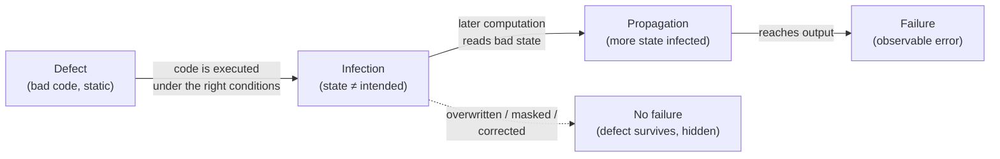

# WPF Notes

_Entries follow the template at `Notes/TEMPLATE.md`. Append-only. **Newest entry at top**, immediately after this header._

---

## [2026-06-07] Defect → infection → failure · pp.12–28 · Ch.1 §1.1 → §1.5

- The 4-stage causality model: defect, infection, propagation, failure — and why "no failures ≠ no defects"
- TRAFFIC: the seven debugging steps, walked end-to-end on the `shell_sort` / `argc` bug
- Debugging as search in space × time; the six automated techniques that shrink the search box

### History — "why does this exist?"

The vocabulary itself is the contribution. For 50 years "bug" conflated three different things — the bad code, the bad state, and the bad output — which made debugging advice unfalsifiable ("find the bug" — *which* bug?). The word's origin is literal: a **moth in relay #70 of the Harvard Mark II, September 9, 1947**, taped into the logbook ("first actual case of bug being found"). **Dijkstra (1972)** supplied the field's hardest constraint — *testing shows the presence of defects, never their absence* — and **Zeller (this book, 2005)** built the precise causal chain on top: defect → infection → failure, with debugging defined as isolating the **infection chain** back to its root. That definition is what made *automated* debugging (delta debugging, ASKIGOR, statistical fault localization) possible: you can't automate a search until you've defined what you're searching for.

### Intuition — "this is like…"

An infection chain is a **bad config push propagating through a CDN**. The defect is the wrong line in the config repo (static, harmless until deployed). The infection is the first edge node that loads it — state is now wrong but no user has noticed. Propagation is node after node picking it up, *except* some nodes mask it (a default kicks in, a cache serves stale-but-correct data) — exactly like an infection being overwritten before it reaches output. The failure is the moment a user gets a 502. Postmortems work backwards from the 502 through the propagation graph to the commit — that is TRAFFIC, and "which nodes were healthy at 14:02?" is Zeller's *separate sane from infected*.

### Mechanics

#### The four-stage causality model

Every arrow is **conditional** — that's the whole epistemology of testing in one diagram:

| Stage transition | Can fail to happen when… | Consequence |
|---|---|---|
| defect → infection | defective line never executed, or executed with benign inputs | coverage ≠ correctness |
| infection → propagation | wrong value overwritten or masked before use | flaky "works on my machine" bugs |
| propagation → failure | infected state never reaches observable output | **Dijkstra's curse**: green tests, latent defect |

A *program state* = all variable values + the program counter. Debugging is a search over a grid of (variables × time) for one transition: the moment a sane state (✔) produces an infected one (✘). The grid is hostile — GCC mid-compilation holds **~44,000 variables with ~42,000 inter-references**, and a run has millions of states. Two principles make it tractable:

1. **Separate sane from infected** — binary-search in *time*: find any state you can certify sane, any you can certify infected; the defect lies between.
2. **Separate relevant from irrelevant** — prune in *space*: a value can only derive from the small set of earlier values it reads (its dependences). Everything else is provably innocent.

Principle 2 is why modular code is debuggable at all: minimizing information flow between units shrinks the dependence fan-in per value. Encapsulation is a *debugging* feature before it's a design feature.

#### TRAFFIC — the seven steps

| Step | Action | Effort |
|---|---|---|
| **T**rack | file it in the problem DB — failures that aren't recorded get lost | bookkeeping |
| **R**eproduce | re-trigger deterministically; hard for nondeterministic/long-running programs | varies wildly |
| **A**utomate | turn it into a minimal, self-running test case | mechanical |
| **F**ind origins | trace the failing value backwards through dependences | ← the real work |
| **F**ocus | pick likeliest origins: known infections, anomalies, code smells | ← starts here |
| **I**solate | pin the sane→infected transition | ← and here |
| **C**orrect | fix, then *re-run the test to prove causality* | easy once understood |

The three middle-F/I steps consume nearly all debugging time — the rest is process discipline.

#### Worked example — the `sample` program, end to end

`./sample 9 7 8` → `7 8 9` ✓ but `./sample 11 14` → `0 11` ✗ (14 vanished, 0 appeared).

The defect, one line: `shell_sort(a, argc)` — but `argc` counts the program name too, so the array of 2 elements is sorted as if it had 3.

| # | Chain stage | Concrete event |
|---|---|---|
| 1 | defect | `shell_sort(a, argc)` should be `argc - 1` |
| 2 | infection | callee sees `size=3`; `a[] = [11, 14, 0]` — `a[2]` is unallocated heap garbage that *happens* to be 0 |
| 3 | propagation | sort swaps the phantom 0 into `a[0]` → `[0, 11, 14]` |
| 4 | failure | loop prints only `argc−1 = 2` elements: `0 11` |

The isolation move that cracked it: `shell_sort()` touches no globals, so its output is fully determined by its arguments — **observe once at the call boundary** (`fprintf` of `a[]` and `size` on entry) and the infection is caught crossing the interface. One observation point, placed where the dependence structure is narrowest. That's principle 2 doing real work.

And why did `9 7 8` pass? Same defect, same out-of-bounds read — but `a[3]`'s garbage was *larger* than the real elements, never got swapped in, and the infection died before output. The masked-infection edge in the flowchart, observed in the wild.

#### The automated-technique map (§1.5 — each gets its own chapter)

| Technique | Shrinks which axis | One-line mechanism | On `sample` |
|---|---|---|---|
| Simplified input (delta debugging) | input space | bisect the *difference* between passing & failing inputs | both `11` and `14` needed; `11` alone passes |
| Program slicing | space | keep only statements the failing value transitively depends on | `a[0]` ← `a[2]`, `size` |
| Observing state (debugger) | space+time, manually | breakpoint, inspect full state, no recompile | watch `a[]` at call entry |
| Watching state | time | trap the exact write that changes a value | catch the swap writing 0 → `a[0]` |
| Assertions / memory checkers | space (certifies regions sane) | machine-checked pre/post-conditions & invariants | Valgrind-style tool flags the `a[2]` read instantly |
| Anomaly detection | candidate lines | diff coverage/behavior of passing vs failing runs | the swap lines execute *only* in the failing run |
| Cause–effect chains (delta debugging on states) | whole chain | swap state fragments between runs to prove causality | ASKIGOR: "argc was 3 → a[2] was 0 → output wrong" |

### If you were the debugger…

You see `Output: 0 11`. Before reading any code — what does the *shape* of the wrong output already tell you? The list is sorted and has the right length, so the sort loop and print loop are probably fine; an element was *replaced*, not dropped, which smells like the working set was wrong before sorting began. You've localized to "between argv parsing and the sort call" from the failure alone. Zeller's point: every observable property of the failure prunes the search box before you open an editor.

Second: the fix replaced `argc` with `argc - 1` — how do you know that was *the* defect and not a coincidental mask (like `9 7 8` passing)? Only by the last TRAFFIC step: re-run the failing reproduction and watch the failure vanish. Correction is the experiment that *proves* the diagnosis; a fix you can't falsify is a superstition. This is why "can't reproduce → can't claim fixed" is process, not pedantry.

### Where this shows up in real systems

- **`git bisect` is "separate sane from infected" applied to commit history** — binary search in time with the repo as the state axis; `git bisect run ./test.sh` is the Automate step making the oracle mechanical. Delta debugging generalizes the same bisection to inputs and program states.
- **ASan/MSan/Valgrind industrialize the memory-assertion row**: the `a[2]` uninitialized read that Zeller catches with reasoning, MSan flags on first execution with a stack trace — the tool certifies the sane/infected boundary at every memory access, for the cost of ~2–3× slowdown.
- **rr and Antithesis attack the Reproduce step** — record-and-replay (rr) makes a nondeterministic failure perfectly repeatable, then *reverse execution* literally walks the infection chain backwards (`reverse-watchpoint` on the bad value = "watching state" with time running in the useful direction).
- **Sentry/Jira pipelines are the Track step at scale**, and Figure 1.10's defect-density heatmap over Eclipse packages is the ancestor of modern bug-prediction: route QA to the components with the worst fix-per-KLOC history.

### Diagnostic questions

1. **A test suite runs every line of the program and passes. Defect-free?** — "Yes, full coverage" fails twice over: execution under benign conditions may not infect, and infections may be masked before output. Coverage bounds neither.
2. **Why is `argc` the defect but `a[0] == 0` the infection — what rule assigns the labels?** — If you call `a[0]=0` "the bug," you'll patch symptoms (e.g., filter zeros from output) instead of severing the chain at its root; defect is *code*, infection is *state*.
3. **`./sample 9 7 8` works. A teammate concludes the earlier failure was "flaky." What actually happened?** — The infection occurred *both* times; in the passing run it was masked (garbage `a[3]` too large to swap in). Nondeterminism in the mask, not in the defect.
4. **Where would you place a single `fprintf` to split the `sample` search space most evenly, and why is the `shell_sort` boundary optimal?** — "Anywhere in the sort" misses the structural argument: the function reads no globals, so its entry is a complete description of everything that can influence its output — maximal information per observation.
5. **Your fix makes the failing test pass. What two things must still be true before you close the ticket?** — The original *reproduction* (not just the unit test) no longer fails, and you can articulate the full chain defect→infection→failure; otherwise you may have re-masked the infection rather than removed the defect.

---
