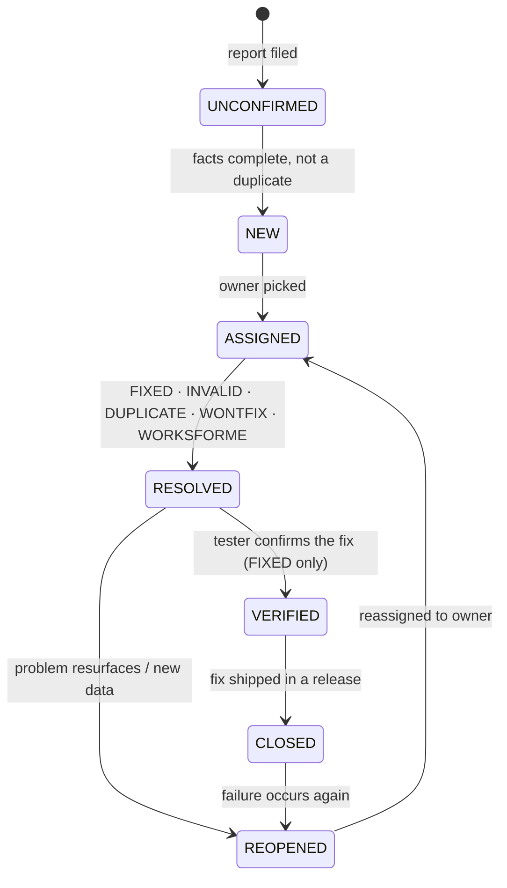
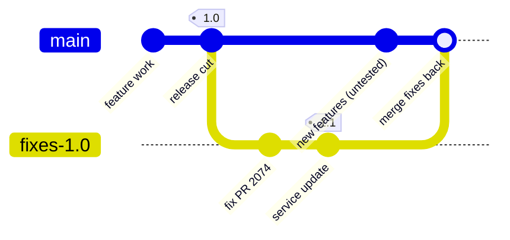
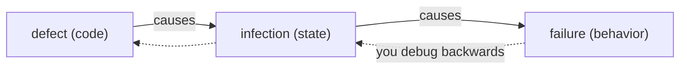
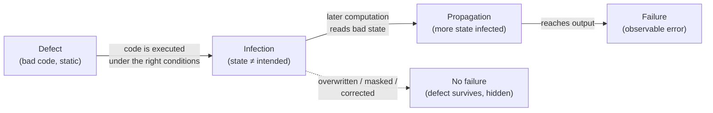

# WPF Notes

_Entries follow the template at `Notes/TEMPLATE.md`. Append-only. **Newest entry at top**, immediately after this header._

---

## [2026-06-11] Bug life cycle & fix hygiene · pp.43–56 · Ch.2 §2.4–§2.13

- Severity vs priority — two axes, two owners; priority = f(severity, likelihood, users, damage)
- The BUGZILLA state machine UNCONFIRMED → CLOSED, walked end-to-end with PR 2074
- Duplicates, release tags & fix branches, and the rule *"test cases make problem reports obsolete"*

### History — "why does this exist?"
BUGZILLA shipped with the Mozilla open-sourcing in 1998 (Terry Weissman's rewrite of Netscape's internal tracker) and replaced the email-and-spreadsheet chaos that passed for bug management. Scale forced process: by September 2003 Mozilla's database held ~8,300 UNCONFIRMED reports waiting for triage. Zeller's chapter codifies the workflow that every modern tracker — Jira, Linear, GitHub Issues — still implements with renamed states and trimmed transitions.

### Intuition — "this is like…"
The life cycle is a finite state machine over a ticket, structurally identical to a pull-request flow: opened (UNCONFIRMED) → triaged as real (NEW) → reviewer assigned (ASSIGNED) → merged or declined (RESOLVED + resolution) → CI green (VERIFIED) → released (CLOSED). The **resolution** field is the FSM's exit code — FIXED is only one of five ways a bug can terminate, the same way "merged" is only one way a PR ends.

### Mechanics

#### 1. Severity — impact of the problem on development/release

| Severity | Meaning |
|---|---|
| **Blocker** | blocks development and/or testing — the "showstopper" |
| **Critical** | crashes, data loss, severe memory leak |
| **Major** | major loss of function — **including an unmet requirement** |
| **Normal** | the standard problem |
| **Minor** | minor loss of function; easy workaround exists |
| **Trivial** | cosmetic — typos, misaligned text |
| **Enhancement** | not a failure at all; a desired feature |

Wording ladder the book sets up: **problem** (neutral: "questionable property of the run") → **failure** (judged incorrect behavior) → **feature** ("it's not a bug…"). The trap: a *missing requirement* is not an enhancement — it's a major problem. Ship gate: no blocker/critical/major open, all requirements met; at a fixed release date, disable the broken optional features instead.

#### 2. Priority ≠ severity

```text
priority = f(severity, likelihood, #users affected, potential damage)
```

| Attribute | Set by | Answers |
|---|---|---|
| Severity | reporter / triage | "how bad is the impact?" — property of the **failure** |
| Priority | management / SCCB | "when do we work on it?" — property of the **business** |

- **Mechanism:** severity is observable from the report; priority needs exposure data the reporter doesn't have.
- **Consequence:** a *blocker* in an unreleased alpha can rank below a *major* in a product running on a million desktops.
- The **SCCB** (software change control board — developers + testers + configuration managers) owns priorities, assignment, and closing.

#### 3. The life cycle



Adapt freely: no independent QA → skip VERIFIED; fixes applied on-site → RESOLVED and CLOSED collapse into one.

#### 4. PR 2074, end to end

| # | Actor | Action | State after |
|---|---|---|---|
| 1 | Olaf (user) | program crashes, calls support | — |
| 2 | Sunny (support) | files report: repro steps, config, severity *normal* | UNCONFIRMED |
| 3 | Violet (dev) | checks: valid, not a duplicate | NEW |
| 4 | Mr. Poe (mgmt) | assigns to Violet | ASSIGNED |
| 5 | Violet | cannot reproduce, documents attempts | RESOLVED / WORKSFORME |
| 6 | Sunny | requests more data from Olaf | REOPENED → ASSIGNED |
| 7 | Violet | new data → reproduces → fixes | RESOLVED / FIXED |
| 8 | Klaus (tester) | reviews fix, OKs for production | VERIFIED |
| 9 | release ships | fix delivered to Olaf | CLOSED |

WORKSFORME is not a dead end — it's a structured request for more facts, with the audit trail intact.

#### 5. Duplicates and the simplification tension

One defect → many reports: a browser that crashes on dropdowns yields "page X crashed", "page Y crashed", … Each report wants **maximum facts** (any might matter for reproduction); duplicate detection wants **minimum facts** (similarity must be visible). The resolution is *simplification* — strip reports to relevant facts (formalized in ch.5). Database hygiene: declare reports obsolete (never-fix, old + occurred once, old + internal-only) and hide them from default searches — thousands of stale open bugs are a morale and maintenance tax, not a storage one.

#### 6. Versions, tags, and fix branches



- **Tag every release** — you must be able to recreate *every source and every tool version* that produced the shipped binary, not just the binary.
- **Trunk = features, branch = fixes only.** A user's crash gets fixed on the release branch and shipped as 1.1 — without dragging along untested trunk features.
- **Link both directions:** tracker comment `Problem fixed in RELEASE_1_1_BRANCH`; commit message `Fix: null pointer could cause crash (PR 2074)`. Modern descendants automate it: GitHub's `Fixes #123` closes the issue at merge; TRAC was the early integrated version.

#### 7. Tests vs problem reports

The rule: **test cases make problem reports obsolete.** If a problem surfaces during development, don't file it — write a failing test that exposes it. Derivation:

| Reason | Mechanism |
|---|---|
| flooding | test outcomes occur orders of magnitude more often than field reports — storing them drowns real problems |
| redundancy | automated tests re-derive the outcome for any version at a button press; a database row is a stale cache of that |
| overhead | a bug you can fix right now needs no ticket — the test *is* the durable record |

The tracker keeps what can't be code yet: ideas, feature requests. The moment implementation starts, write the failing test and close the entry.

### If you were the SCCB chair…
Two bugs on the table: a *blocker* in next month's alpha (12 internal testers affected) and a *major* data-corruption in the shipped release (200k users). Severity says alpha first; priority math — likelihood × users × damage — says shipped product first, by a mile. The book's point: if you let reporters' severity labels drive the work queue, you've delegated release strategy to whoever files tickets loudest.

### Cross-language view
*(n/a — process topic, no code form; the code-shaped artifact is the commit-message convention in §6.)*

### Where this shows up in real systems
- **GitHub Issues** collapsed the FSM to open/closed plus "closed as not planned" (= WONTFIX) and a duplicate label; **Jira/Linear** keep configurable multi-state workflows — both are instances of Zeller's "adapt states to your process."
- **Postgres** development runs the §6 branch model verbatim: `REL_17_STABLE` receives only back-patched fixes; features land on `master`; minor releases (17.1, 17.2) are cut from the stable branch.
- **Sentry** fingerprints crash stack traces and groups duplicates at ingestion — the automated answer to Mozilla's 8,300-report triage swamp, doing "simplification" by machine.

### Diagnostic questions
1. A reporter marks their bug *blocker*. Does it jump the queue? *(wrong: yes → priority is set separately by the SCCB from likelihood, user count, damage)*
2. A bug can't be reproduced — terminal state? *(wrong: CLOSED or INVALID → RESOLVED/WORKSFORME, deliberately reopenable when new data arrives)*
3. Your own failing test from this morning — where is it recorded? *(wrong: the tracker → in the test suite; test cases make problem reports obsolete)*
4. Why do fixes go to a branch instead of trunk? *(wrong: convention → so stable users get the fix without receiving untested trunk features)*
5. What must a release tag let you recreate? *(wrong: the shipped binary → the full configuration: every source file and every tool, at exact versions)*

---

## [2026-06-10] TRAFFIC & the anatomy of a bug report · pp.29–42 · Ch.1 §1.6 → Ch.2 §2.3

- Vocabulary tightened: **defect → infection → failure**, and why "bug" is a bad word
- **TRAFFIC**: the seven-step debugging loop, and where the time actually goes
- What a good **problem report** contains, and why a problem *database* beats a problem *list*

### History — "why does this exist?"
"Bug" is folklore — a moth in a relay (Hopper, 1947), but the term predates computers (Edison used it in 1878 for hardware faults). Zeller's complaint (*Why Programs Fail*, 2005) is that "bug" conflates **cause and symptom** and quietly absolves the author ("it crept in"). Dijkstra pushed *error*/*fault* in the 1980s precisely to **put blame on the programmer**. Zeller splits the difference with neutral, precise terms and a repeatable process, because before this the industry spent — by its own surveys — 50–75% of development cost on debugging with no shared method.

### Intuition — "this is like…"
The defect→infection→failure chain is an **epidemiology** model, and TRAFFIC is contact tracing run *backwards*. You observe the failure (the patient is sick), then trace the infection (the bad state) back along data/control dependences to **patient zero** — the defect in the code. A bug tracker like Bugzilla is the **CDN access log** of this process: without it you can't answer "is this outbreak new, or a known one we already have a patch for?"

### Mechanics
**The vocabulary, made precise** (this is the spine of the whole book):

| Term | What it is | Where you see it |
|---|---|---|
| **Defect** | incorrect *code* (IEEE: "fault") | a line you can point at |
| **Infection** | incorrect *state* | a variable holding a wrong value at runtime |
| **Failure** | observable wrong *behavior* | the crash, the wrong output |
| **Flaw** | a defect with no single location | architecture-level — "be truly alarmed" |

The causal chain — and the debugging order is the **reverse** of the causal order:



Crucially: **not every defect infects, and not every infection fails** (dead code, or a wrong value that gets overwritten before it's observed). But every failure traces back to *some* infection, back to *some* defect.

**TRAFFIC — the seven-step loop:**

| Step | Action | Chapter |
|---|---|---|
| **T**rack | log it in a problem database | 2 |
| **R**eproduce | make the failure happen on demand | 4 |
| **A**utomate | reduce to a minimal, scripted test case | 3, 5 |
| **F**ind origins | follow dependences back from failure | 7, 9 |
| **F**ocus | rank suspects: assertions, anomalies, code smells | 8, 10, 11 |
| **I**solate | scientific method → build the infection chain | 6 |
| **C**orrect | remove the defect, **verify the fix** | 15 |

> **Where the time goes:** the **find→focus→isolate** middle of the loop is "by far the most time consuming." Correcting is usually trivial — *unless* the defect is a flaw needing redesign. Optimize tooling for locating, not for patching.

**Anatomy of a good problem report** (Saarland study of 156 Apache/Eclipse/Mozilla devs — what devs want vs. what users give *mismatches*):

| Rank | Fact | Why it matters |
|---|---|---|
| 1 | **steps to reproduce** | "if it can't be reproduced, it won't be fixed" |
| 2 | **stack trace / logs** | jumps straight to the active frames at crash |
| 3 | observed behavior | often re-implies the repro steps |
| 4 | expected behavior | usually just the negation of observed |
| — | product version, OS, hardware | secondary — "most bugs appear on all platforms" |

A real stack trace is the gold: the OS hands you the live call chain at the moment of death —

```
Thread 0 Crashed:
0  libSystem.B.dylib   mach_msg_trap + 10
2  CoreFoundation       CFRunLoopRunSpecific + 1790
9  AppKit               -[NSApplication run] + 795
11 com.apple.Preview    start + 54
```

**List vs. database.** A single "problem list" doc fails three ways: one editor at a time, lost history, doesn't scale to hundreds of issues. A **problem database** (Bugzilla) fixes all three — but it's a *developer* tool: raw user reports must be distilled and classified before entry. And automated talkback dialogs (core dumps, logs) raise a real **privacy** cost — the user must be able to see and disable what's collected.

### Where this shows up in real systems
- **Sentry / Crashlytics** are talkback-at-scale: they auto-capture stack trace + environment + breadcrumbs, then *dedupe* against known issues — exactly the "is this outbreak new?" query a problem database answers.
- **`git bisect`** is the **Isolate** step mechanized: binary-search the commit history to pin the defect's introduction — Zeller's "scientific method" loop in tooling form.
- **Minimal reproducible examples** demanded on Stack Overflow / GitHub issues are the **Automate** step pushed onto the reporter; *delta debugging* (ch. 5) automates that reduction.

### Diagnostic questions
1. A `printf("Helo World")` typo passes all tests — defect, infection, or failure? — "failure" is wrong: it's a **defect** that never *infects* (no test observes that output), so no failure.
2. Why debug in the reverse order of the causal chain? — "you don't" misses that you only ever *observe* the failure; the defect is hidden upstream.
3. Which TRAFFIC step eats the most time? — "Correct" is the classic wrong guess; locating (find/focus/isolate) dominates.
4. A user sends a 2 GB core dump and "your program crashed" — what's missing? — "nothing" ignores that the #1 dev-wanted fact, *steps to reproduce*, is absent.
5. Why is a "flaw" worse than a "defect"? — "it isn't" misses that a flaw has no single location, so correction means redesign.

---

## [2026-06-07] Defect → infection → failure · pp.12–28 · Ch.1 §1.1 → §1.5

- The 4-stage causality model: defect, infection, propagation, failure — and why "no failures ≠ no defects"
- TRAFFIC: the seven debugging steps, walked end-to-end on the `shell_sort` / `argc` bug
- Debugging as search in space × time; the six automated techniques that shrink the search box

### History — "why does this exist?"

The vocabulary itself is the contribution. For 50 years "bug" conflated three different things — the bad code, the bad state, and the bad output — which made debugging advice unfalsifiable ("find the bug" — *which* bug?). The word's origin is literal: a **moth in relay #70 of the Harvard Mark II, September 9, 1947**, taped into the logbook ("first actual case of bug being found"). **Dijkstra (1972)** supplied the field's hardest constraint — *testing shows the presence of defects, never their absence* — and **Zeller (this book, 2005)** built the precise causal chain on top: defect → infection → failure, with debugging defined as isolating the **infection chain** back to its root. That definition is what made *automated* debugging (delta debugging, ASKIGOR, statistical fault localization) possible: you can't automate a search until you've defined what you're searching for.

### Intuition — "this is like…"

An infection chain is a **bad config push propagating through a CDN**. The defect is the wrong line in the config repo (static, harmless until deployed). The infection is the first edge node that loads it — state is now wrong but no user has noticed. Propagation is node after node picking it up, *except* some nodes mask it (a default kicks in, a cache serves stale-but-correct data) — exactly like an infection being overwritten before it reaches output. The failure is the moment a user gets a 502. Postmortems work backwards from the 502 through the propagation graph to the commit — that is TRAFFIC, and "which nodes were healthy at 14:02?" is Zeller's *separate sane from infected*.

### Mechanics

#### The four-stage causality model



Every arrow is **conditional** — that's the whole epistemology of testing in one diagram:

| Stage transition | Can fail to happen when… | Consequence |
|---|---|---|
| defect → infection | defective line never executed, or executed with benign inputs | coverage ≠ correctness |
| infection → propagation | wrong value overwritten or masked before use | flaky "works on my machine" bugs |
| propagation → failure | infected state never reaches observable output | **Dijkstra's curse**: green tests, latent defect |

A *program state* = all variable values + the program counter. Debugging is a search over a grid of (variables × time) for one transition: the moment a sane state (✔) produces an infected one (✘). The grid is hostile — GCC mid-compilation holds **~44,000 variables with ~42,000 inter-references**, and a run has millions of states. Two principles make it tractable:

1. **Separate sane from infected** — binary-search in *time*: find any state you can certify sane, any you can certify infected; the defect lies between.
2. **Separate relevant from irrelevant** — prune in *space*: a value can only derive from the small set of earlier values it reads (its dependences). Everything else is provably innocent.

Principle 2 is why modular code is debuggable at all: minimizing information flow between units shrinks the dependence fan-in per value. Encapsulation is a *debugging* feature before it's a design feature.

#### TRAFFIC — the seven steps

| Step | Action | Effort |
|---|---|---|
| **T**rack | file it in the problem DB — failures that aren't recorded get lost | bookkeeping |
| **R**eproduce | re-trigger deterministically; hard for nondeterministic/long-running programs | varies wildly |
| **A**utomate | turn it into a minimal, self-running test case | mechanical |
| **F**ind origins | trace the failing value backwards through dependences | ← the real work |
| **F**ocus | pick likeliest origins: known infections, anomalies, code smells | ← starts here |
| **I**solate | pin the sane→infected transition | ← and here |
| **C**orrect | fix, then *re-run the test to prove causality* | easy once understood |

The three middle-F/I steps consume nearly all debugging time — the rest is process discipline.

#### Worked example — the `sample` program, end to end

`./sample 9 7 8` → `7 8 9` ✓ but `./sample 11 14` → `0 11` ✗ (14 vanished, 0 appeared).

The defect, one line: `shell_sort(a, argc)` — but `argc` counts the program name too, so the array of 2 elements is sorted as if it had 3.

| # | Chain stage | Concrete event |
|---|---|---|
| 1 | defect | `shell_sort(a, argc)` should be `argc - 1` |
| 2 | infection | callee sees `size=3`; `a[] = [11, 14, 0]` — `a[2]` is unallocated heap garbage that *happens* to be 0 |
| 3 | propagation | sort swaps the phantom 0 into `a[0]` → `[0, 11, 14]` |
| 4 | failure | loop prints only `argc−1 = 2` elements: `0 11` |

The isolation move that cracked it: `shell_sort()` touches no globals, so its output is fully determined by its arguments — **observe once at the call boundary** (`fprintf` of `a[]` and `size` on entry) and the infection is caught crossing the interface. One observation point, placed where the dependence structure is narrowest. That's principle 2 doing real work.

And why did `9 7 8` pass? Same defect, same out-of-bounds read — but `a[3]`'s garbage was *larger* than the real elements, never got swapped in, and the infection died before output. The masked-infection edge in the flowchart, observed in the wild.

#### The automated-technique map (§1.5 — each gets its own chapter)

| Technique | Shrinks which axis | One-line mechanism | On `sample` |
|---|---|---|---|
| Simplified input (delta debugging) | input space | bisect the *difference* between passing & failing inputs | both `11` and `14` needed; `11` alone passes |
| Program slicing | space | keep only statements the failing value transitively depends on | `a[0]` ← `a[2]`, `size` |
| Observing state (debugger) | space+time, manually | breakpoint, inspect full state, no recompile | watch `a[]` at call entry |
| Watching state | time | trap the exact write that changes a value | catch the swap writing 0 → `a[0]` |
| Assertions / memory checkers | space (certifies regions sane) | machine-checked pre/post-conditions & invariants | Valgrind-style tool flags the `a[2]` read instantly |
| Anomaly detection | candidate lines | diff coverage/behavior of passing vs failing runs | the swap lines execute *only* in the failing run |
| Cause–effect chains (delta debugging on states) | whole chain | swap state fragments between runs to prove causality | ASKIGOR: "argc was 3 → a[2] was 0 → output wrong" |

### If you were the debugger…

You see `Output: 0 11`. Before reading any code — what does the *shape* of the wrong output already tell you? The list is sorted and has the right length, so the sort loop and print loop are probably fine; an element was *replaced*, not dropped, which smells like the working set was wrong before sorting began. You've localized to "between argv parsing and the sort call" from the failure alone. Zeller's point: every observable property of the failure prunes the search box before you open an editor.

Second: the fix replaced `argc` with `argc - 1` — how do you know that was *the* defect and not a coincidental mask (like `9 7 8` passing)? Only by the last TRAFFIC step: re-run the failing reproduction and watch the failure vanish. Correction is the experiment that *proves* the diagnosis; a fix you can't falsify is a superstition. This is why "can't reproduce → can't claim fixed" is process, not pedantry.

### Where this shows up in real systems

- **`git bisect` is "separate sane from infected" applied to commit history** — binary search in time with the repo as the state axis; `git bisect run ./test.sh` is the Automate step making the oracle mechanical. Delta debugging generalizes the same bisection to inputs and program states.
- **ASan/MSan/Valgrind industrialize the memory-assertion row**: the `a[2]` uninitialized read that Zeller catches with reasoning, MSan flags on first execution with a stack trace — the tool certifies the sane/infected boundary at every memory access, for the cost of ~2–3× slowdown.
- **rr and Antithesis attack the Reproduce step** — record-and-replay (rr) makes a nondeterministic failure perfectly repeatable, then *reverse execution* literally walks the infection chain backwards (`reverse-watchpoint` on the bad value = "watching state" with time running in the useful direction).
- **Sentry/Jira pipelines are the Track step at scale**, and Figure 1.10's defect-density heatmap over Eclipse packages is the ancestor of modern bug-prediction: route QA to the components with the worst fix-per-KLOC history.

### Diagnostic questions

1. **A test suite runs every line of the program and passes. Defect-free?** — "Yes, full coverage" fails twice over: execution under benign conditions may not infect, and infections may be masked before output. Coverage bounds neither.
2. **Why is `argc` the defect but `a[0] == 0` the infection — what rule assigns the labels?** — If you call `a[0]=0` "the bug," you'll patch symptoms (e.g., filter zeros from output) instead of severing the chain at its root; defect is *code*, infection is *state*.
3. **`./sample 9 7 8` works. A teammate concludes the earlier failure was "flaky." What actually happened?** — The infection occurred *both* times; in the passing run it was masked (garbage `a[3]` too large to swap in). Nondeterminism in the mask, not in the defect.
4. **Where would you place a single `fprintf` to split the `sample` search space most evenly, and why is the `shell_sort` boundary optimal?** — "Anywhere in the sort" misses the structural argument: the function reads no globals, so its entry is a complete description of everything that can influence its output — maximal information per observation.
5. **Your fix makes the failing test pass. What two things must still be true before you close the ticket?** — The original *reproduction* (not just the unit test) no longer fails, and you can articulate the full chain defect→infection→failure; otherwise you may have re-masked the infection rather than removed the defect.

---
