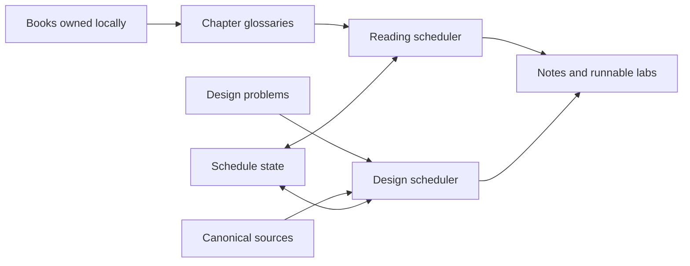

# Systems Learning Lab

A working system for turning systems books and interview prompts into scheduled practice, durable notes, and runnable design labs.

This is not a static reading list. The repository tracks what to study, rotates work across competing subjects, records progress, and connects reading to implementation and system-design practice.



## Repository map

| Path | Purpose |
|---|---|
| `books/` | Legal reading index and local PDF naming convention; PDFs are intentionally untracked |
| `glossaries/` | Machine-readable and Markdown chapter maps used by the reading scheduler |
| `labs/` | Runnable low-level-design exercises and reference implementations |
| `notes/` | Long-form high-level and low-level system-design notes |
| `problems/` | Structured HLD/LLD interview problem catalogs |
| `schedule/` | Reading and design scheduler state |
| `sources/` | Curated papers and engineering-blog references |
| `tools/` | Dependency-free Python schedulers |

## Quick start

Requires Python 3.10 or newer; the schedulers use only the standard library.

```bash
# Inspect the reading rotation and today's slots
python3 tools/scheduler.py status
python3 tools/scheduler.py today

# Inspect the design queues and today's problem
python3 tools/design_scheduler.py status
python3 tools/design_scheduler.py today
```

The `today` and `status` commands above are read-only. Use each command's `--help` output before running state-changing operations such as `tick`, `override`, or `init`.

## Reading material

Book PDFs are not distributed by this repository. Obtain books legally and, if you want local scheduler-adjacent copies, place them under `books/<ALIAS>.pdf`. Git ignores those files. The aliases and titles are documented in [`books/README.md`](books/README.md).

Glossaries contain navigational metadata and personal study structure, not replacement copies of the underlying books.

## Labs

The tracked `labs/` tree contains self-contained LLD exercises. Additional standalone lab repositories may be attached locally, but are intentionally excluded from this public repository.

## License

Original source code and project-authored documentation are released under the [MIT License](LICENSE). Book titles, cited material, trademarks, and other third-party works remain the property of their respective owners; the MIT license grants no rights to those works.
