# HLD Reference Notes

---

## [2026-08-28] H17 · DynamoDB-Style KV Store

### Problem as asked

> Design a Dynamo-style distributed key-value store. Always-writable, even during network partition. 100k writes/sec, 1KB values, 99.99% availability single-region.

### Clarifying questions

| # | Question | Assumed answer |
|---|---|---|
| 1 | What is the workload shape? | Session store, user profile cache, shopping cart, game state. Payloads 128B–4KB, average 1KB. Mix of reads (80%) and writes (20%). Keys are opaque byte strings up to 2KB. |
| 2 | Consistency model? | Eventual consistency by default. Optional per-read consistency: `R + W > N` gives strong read (read from enough replicas that at least one has the latest write). Caller chooses R and W per request. |
| 3 | What does "always-writable" mean? | The system accepts writes even when a subset of nodes is unreachable (network partition or failure). The write succeeds if any `W` nodes (out of N replicas) acknowledge. This is an AP system in CAP terms. |
| 4 | Replication factor? | N=3 default. Coordinator picks N healthy nodes (sloppy quorum) for each key. Writes go to W=2, reads from R=2 by default. |
| 5 | Conflict resolution? | Vector clocks on each value. Concurrent writes produce siblings (multiple values with incomparable vector clocks). Read returns all siblings; client or application-level resolver merges them. Last-writer-wins (LWW) is a common resolver. |
| 6 | Partitioning strategy? | Consistent hashing with virtual nodes. Each physical node owns ~200 virtual tokens on the ring. Keys hashed (MD5) → position on ring → assigned to N clockwise nodes. |
| 7 | Failure detection? | Gossip protocol. Each node maintains a membership list with heartbeat timestamps. Nodes unreachable for >5s are marked suspect; removed from ring after 30s. |
| 8 | Anti-entropy? | Merkle trees per partition. Nodes exchange tree hashes; divergent subtrees trigger key-level sync. Runs continuously in background (rate-limited to avoid impacting foreground traffic). |
| 9 | Single-region scope? | Yes. All nodes in one datacenter (or one cloud region). Cross-region is out of scope for this design. |
| 10 | Durability? | Write-ahead log (WAL) per node. Data in memory (memtable) + flushed to SSTables on disk. Node crash → replay WAL. Permanent node loss → data rebuilt from replicas via anti-entropy. |

### Back-of-envelope estimates

```
Throughput:
  100k writes/sec, 1KB each → 100 MB/sec ingress
  Read:write = 4:1 → 400k reads/sec → 400 MB/sec egress (reads return 1KB values)
  Total network: ~500 MB/sec = 4 Gbps aggregate cluster traffic

Node count:
  Per-node capacity (disk I/O):
    SSD sequential write: ~500 MB/sec
    Write amplification (WAL + memtable flush + compaction): ~3×
    Effective write throughput per node: ~170 MB/sec
  100 MB/sec ingress / 170 MB/sec per node = 0.6 nodes for disk
  → Disk is not the bottleneck.

  Per-node capacity (network):
    10 Gbps NIC = 1.25 GB/sec
    Per node: ~500 MB/sec (assuming even distribution across 10 nodes)
    → 10 nodes saturate at 5 GB/sec aggregate → 500 MB/sec per node is fine

  Per-node capacity (request handling):
    Single request: parse + vector clock update + WAL write + ack
    Latency budget: <5ms p99
    Per-node throughput: ~20k ops/sec (conservative, with disk sync)
    500k total ops / 20k per node = 25 nodes minimum

  Final: 30 nodes for headroom and even partition distribution
  With N=3 replication: each key on 3 nodes
  Total replicas: 3 × (total keys) spread across 30 nodes

Storage:
  Assume 10B keys × 1KB = 10 TB working set
  10 TB / 30 nodes = 333 GB per node (fits in RAM for hot data)
  With replication: 30 TB total across cluster
  Per node: 1 TB on disk (SSD)

  WAL: 100 MB/sec / 30 nodes × 3 (replication) = 10 MB/sec per node
  WAL retention: 30 seconds → 300 MB per node (small)

Latency budget (write path):
  Client → coordinator (network): 0.5ms
  Coordinator → N replica nodes (parallel): 1ms
  Each replica: WAL fsync (200μs on NVMe) + memtable insert (10μs) + ack
  Coordinator waits for W=2 acks: 2ms
  Coordinator → client response: 0.5ms
  Total write p99: ~4ms

Latency budget (read path):
  Client → coordinator: 0.5ms
  Coordinator → R=2 replicas (parallel): 1ms
  Each replica: memtable + SSTable lookup (100μs) + return value
  Coordinator reconciles vector clocks (10μs) + response: 0.5ms
  Total read p99: ~3ms

Anti-entropy overhead:
  Merkle tree exchange: 1 MB per partition per sync (for 1M keys)
  Background rate limit: 10 MB/sec per node
  Full cluster sync cycle: ~10 TB / 10 MB/sec = 1M seconds ≈ 12 days
  → Too slow. Increase to 50 MB/sec → 2.4 days. Acceptable for eventual consistency.
```

### Functional requirements

- **Put:** `put(key, value, context)` → writes to W replicas, returns success if W acks. `context` is the vector clock (opaque to client; returned from `get`).
- **Get:** `get(key, R)` → reads from R replicas, reconciles vector clocks, returns value(s). If siblings exist (concurrent writes), returns all siblings; client resolves.
- **Delete:** `delete(key)` → writes a tombstone (key + vector clock + tombstone flag). Tombstones garbage-collected after anti-entropy confirms propagation.
- **Conditional put:** `put_if_absent(key, value)` → compare-and-swap using vector clock. Fails if key exists with a different context.
- **Batch:** `batch_put([(key, value), ...])` → atomic per-coordinator (not cross-coordinator). All keys go to same coordinator; coordinator sequences writes.
- **Key existence:** `exists(key)` → read with R=1 (fast, may be stale).

### Non-functional requirements

| Requirement | Target | Mechanism |
|---|---|---|
| Write throughput | 100k ops/sec | 30 nodes; consistent hashing distributes keys evenly; virtual nodes (200 per physical node) prevent hotspots |
| Read throughput | 400k ops/sec | Same partitioning; R=2 reads parallel across replicas |
| Write latency p99 | < 5ms | WAL fsync on NVMe (200μs); parallel replication; W=2 acks |
| Read latency p99 | < 3ms | Memtable + SSTable lookup (100μs); R=2 parallel reads; vector clock reconciliation (10μs) |
| Availability | 99.99% (single-region) | Sloppy quorum: writes succeed if any W healthy nodes acknowledge; node failure → temporary unavailability for keys on that node, but sloppy quorum routes to alternate nodes |
| Durability | No data loss for acknowledged writes | WAL per node; N=3 replication; W=2 acks → data on ≥2 nodes before ack |
| Partition tolerance | Always-writable during network partition | AP system: writes succeed if W nodes reachable; reads succeed if R nodes reachable; no coordinator-level consensus |
| Conflict resolution | Client-controlled | Vector clocks expose concurrency; siblings returned to client; LWW or custom resolver |
| Anti-entropy | Continuous background sync | Merkle tree exchange; rate-limited to 50 MB/sec per node; full cluster sync in ~2.4 days |
| Failure detection | < 5s to detect node failure | Gossip protocol; heartbeat every 1s; suspect after 5 missed heartbeats |

### API / protocol contract

```
Put request:
  Header:
    client_id: "cart-service-prod-01"
    request_id: 987654321  (for dedup at coordinator)
  Body:
    key: "user:123:cart"
    value: <protobuf bytes, 1KB>
    context: { vector_clock: { "node-A": 5, "node-B": 3 } }  (from previous get; empty for new key)
    w: 2  (required acks)
    timeout_ms: 500

  Response (success):
    status: OK
    context: { vector_clock: { "node-A": 6, "node-B": 3 } }  (incremented by coordinator)

  Response (conflict — siblings exist):
    status: CONFLICT
    siblings: [
      { value: <v1>, context: { "node-A": 6, "node-B": 3 } },
      { value: <v2>, context: { "node-A": 5, "node-B": 4 } }
    ]
    → Client merges siblings, sends new put with merged context

Get request:
  Header:
    client_id: "cart-service-prod-01"
    request_id: 987654322
  Body:
    key: "user:123:cart"
    r: 2  (required replicas to read from)
    timeout_ms: 500

  Response (single value):
    status: OK
    value: <protobuf bytes>
    context: { vector_clock: { "node-A": 6, "node-B": 3 } }

  Response (siblings — concurrent writes):
    status: OK
    siblings: [
      { value: <v1>, context: { "node-A": 6, "node-B": 3 } },
      { value: <v2>, context: { "node-A": 5, "node-B": 4 } }
    ]
    → Client resolves (LWW or custom merge)

  Response (key not found):
    status: NOT_FOUND

Delete request:
  Header:
    client_id: "cart-service-prod-01"
    request_id: 987654323
  Body:
    key: "user:123:cart"
    context: { vector_clock: { "node-A": 6, "node-B": 3 } }  (from previous get)
    w: 2
    timeout_ms: 500

  Response:
    status: OK
    context: { vector_clock: { "node-A": 7, "node-B": 3 } }  (tombstone written)
```

### Data model

```
On-disk layout (per node):

  /data/node-A/
    wal/
      000001.wal   (write-ahead log; sequential append; fsync per write)
      000002.wal
    memtable/
      active.mem   (in-memory sorted map: key → {value, vector_clock, timestamp})
    sstable/
      000001.sst   (immutable; sorted key-value pairs + bloom filter + index)
      000002.sst
      manifest.json (list of active SSTables + generation numbers)

  WAL entry format (per write):
    sequence_number: 8 bytes (monotonic per node)
    operation: 1 byte (PUT=1, DELETE=2)
    key_length: 4 bytes
    key: variable
    value_length: 4 bytes (0 for DELETE)
    value: variable
    vector_clock_length: 4 bytes
    vector_clock: variable (serialized as {node_id: counter, ...})
    crc32: 4 bytes

  Memtable entry (in-memory):
    key: byte[]
    value: byte[] (or tombstone marker)
    vector_clock: Map<NodeId, Counter>
    timestamp: int64 (microseconds since epoch; for LWW tie-breaking)

  SSTable format (on disk):
    Data blocks (sorted by key):
      [key_length, key, value_length, value, vector_clock_length, vector_clock] × N
    Index block (sparse):
      [key, offset_in_data_blocks] × M (one entry per 100 keys)
    Bloom filter (per SSTable):
      10 bits per key; false positive rate < 1%
    Footer:
      index_offset: 8 bytes
      bloom_filter_offset: 8 bytes
      metadata: { key_count, min_key, max_key, creation_time }

  Internal metadata (per node):
    ring_state:
      virtual_nodes: [
        { token: 0x1A2B3C, physical_node: "node-A" },
        { token: 0x4D5E6F, physical_node: "node-B" },
        ...
      ]
    membership:
      nodes: [
        { node_id: "node-A", status: ALIVE, last_heartbeat: 1630000000000 },
        { node_id: "node-B", status: SUSPECT, last_heartbeat: 1629999995000 },
      ]
    hint_queue:
      pending_hints: [
        { target_node: "node-B", key: "user:123:cart", value: <bytes>, context: {...}, timestamp: 1630000000000 }
      ]
      → Hints are writes that couldn't reach the intended replica (node was down)
      → Stored locally; replayed when target node recovers
```

### Request-path layering

```mermaid
flowchart LR
    Client -->|1. put/get request| LB[Load Balancer<br/>round-robin]
    LB -->|2. route to any node| Coord[Coordinator<br/>node-A]
    Coord -->|3. hash key → ring position| Ring[Consistent Hash Ring]
    Ring -->|4. find N clockwise nodes| PrefList[Preference List<br/>node-B, node-C, node-D]
    Coord -->|5. parallel write to W=2| NodeB[node-B<br/>primary]
    Coord -->|5. parallel write to W=2| NodeC[node-C<br/>primary]
    NodeB -->|6. WAL fsync + ack| Coord
    NodeC -->|6. WAL fsync + ack| Coord
    Coord -->|7. response| Client

    Note: if node-B is down, coordinator uses sloppy quorum:<br/>
    writes to node-E (next healthy node on ring) + hint to node-B
```

### Architecture diagram

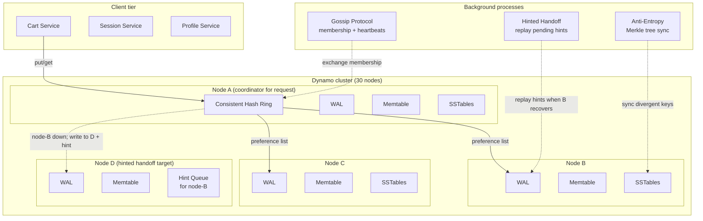

### Deep dive 1 — Sloppy quorum + hinted handoff (the AP mechanism)

#### 1. Why does this mechanism exist?

Dynamo must be **always-writable**, even during network partitions or node failures. Strict quorum (write to W out of N specific replicas) fails this requirement: if one of the N replicas is down, the write blocks until it recovers.

**Sloppy quorum** relaxes the replica assignment: instead of writing to the N specific nodes assigned by the hash ring, the coordinator writes to the first W *healthy* nodes it can reach (walking clockwise around the ring). If the intended replica is down, the coordinator writes to the next available node and leaves a **hint** for later delivery.

This gives:
- **Availability:** writes succeed as long as any W nodes are reachable (not just the N assigned replicas).
- **Durability:** data is still replicated to W nodes; hints ensure it eventually reaches the intended replicas.

Trade-off: temporary divergence. The hint node holds data not yet on the intended replica. Anti-entropy (Merkle sync) reconciles divergence after the hint is delivered.

#### 2. Concrete walk-through

**Scenario: 5-node cluster, N=3, W=2, R=2. Key `user:123:cart` hashes to position 0x5000 on the ring.**

```
Ring (clockwise):
  0x1000 → node-A
  0x3000 → node-B  (intended replica #1 for key 0x5000)
  0x5000 → node-C  (intended replica #2)
  0x7000 → node-D  (intended replica #3)
  0x9000 → node-E

Preference list for key 0x5000: [node-B, node-C, node-D]

t=0: Client sends put("user:123:cart", value_v1)
  Coordinator: node-A
  1. Hash key → 0x5000
  2. Walk clockwise from 0x5000: node-C, node-D, node-B (wraps around)
     Preference list: [node-C, node-D, node-B]
  3. Check health (from gossip): node-C=ALIVE, node-D=ALIVE, node-B=ALIVE
  4. Send write to first W=2 healthy nodes: node-C, node-D
  5. node-C: WAL fsync + ack (2ms)
  6. node-D: WAL fsync + ack (2ms)
  7. Coordinator receives 2 acks → success
  8. Response to client: OK, context={node-A:1}

t=10: node-B crashes (power failure)

t=11: Client sends put("user:123:cart", value_v2, context={node-A:1})
  Coordinator: node-A
  1. Preference list: [node-C, node-D, node-B]
  2. Check health: node-C=ALIVE, node-D=ALIVE, node-B=DOWN
  3. Sloppy quorum: skip node-B, walk to next healthy node → node-E
     Effective preference list: [node-C, node-D, node-E]
  4. Send write to W=2: node-C, node-D
  5. node-C: WAL fsync + ack
  6. node-D: WAL fsync + ack
  7. Coordinator also sends hint to node-E:
     hint = { target: node-B, key: "user:123:cart", value: value_v2, context: {node-A:2} }
     node-E stores hint locally (not in memtable; separate hint queue)
  8. Response to client: OK

t=20: node-B recovers
  1. node-B replays its WAL (empty; it was down during t=11 write)
  2. node-E's hinted handoff thread wakes up (every 1s)
  3. node-E checks hint queue: finds hint for node-B
  4. node-E sends hint to node-B: put("user:123:cart", value_v2, context={node-A:2})
  5. node-B: WAL fsync + memtable insert + ack
  6. node-E removes hint from queue
  7. node-B now has value_v2; consistent with node-C, node-D

t=30: Anti-entropy (Merkle sync) runs
  1. node-B exchanges Merkle tree with node-C
  2. Trees match (both have value_v2) → no sync needed
  3. If trees diverged (e.g., concurrent write during partition), key-level sync resolves
```

**Failure: hint node (node-E) also crashes before delivering hint**

```
t=11: Write to node-C, node-D; hint to node-E
t=15: node-E crashes (hint lost from memory; but hint is in node-E's WAL)
t=20: node-B recovers
  1. node-E is still down → no hinted handoff
  2. node-B is missing value_v2
t=25: Anti-entropy runs
  1. node-B exchanges Merkle tree with node-C
  2. Trees diverge (node-C has value_v2; node-B does not)
  3. Key-level sync: node-C sends value_v2 to node-B
  4. node-B now has value_v2
```

#### 3. Trade-off table

| Property | Strict quorum (W out of N specific replicas) | Sloppy quorum + hinted handoff |
|---|---|---|
| Availability (node failure) | Write blocks until intended replica recovers | Write succeeds if any W healthy nodes reachable |
| Availability (network partition) | Partition isolates N replicas → write fails if partition splits N | Partition isolates some nodes → coordinator routes around partition |
| Durability | Data on N specific replicas | Data on W nodes (may include hint nodes); hints ensure eventual delivery to N |
| Consistency | Strong (if R+W > N) | Eventual (hint nodes hold data temporarily; anti-entropy reconciles) |
| Complexity | Simple (fixed replica set) | Complex (hint queue management, anti-entropy, Merkle trees) |
| Failure mode | Prolonged unavailability during node failure | Temporary divergence; hint queue growth during long partitions |

#### 4. Failure modes interviewers drill into

- **Hint queue grows unbounded during long partition:** node-B down for hours → hints accumulate on node-E, node-A, etc. Mitigation: rate-limit hint creation (drop hints if queue > 1GB); alert on hint queue size; manual intervention if partition persists.
- **Hint node crashes before delivering hint:** hint lost from memory. Mitigation: persist hints to WAL (as in walk-through); anti-entropy reconciles divergence even if hints are lost.
- **Anti-entropy too slow to catch up:** Merkle sync runs at 50 MB/sec; 10 TB cluster takes 2.4 days. Mitigation: increase anti-entropy bandwidth during recovery; prioritize recent writes (Merkle tree weighted by timestamp).
- **Sloppy quorum causes permanent divergence:** hint never delivered (hint node crashes + anti-entropy bug). Mitigation: periodic full sync (compare all keys, not just Merkle tree); monitoring for divergence rate.
- **Coordinator fails mid-write:** W acks received but coordinator crashes before responding to client. Mitigation: client retries with idempotency key (request_id); coordinator deduplicates based on request_id in WAL.

#### 5. First-principles derivation

1. Requirement: always-writable KV store, even during node failure or network partition.
2. Option A: strict quorum (write to W out of N specific replicas). If one replica is down, write blocks. Violates "always-writable."
3. Option B: single replica (no replication). Write always succeeds, but node failure = data loss. Unacceptable durability.
4. Option C: sloppy quorum (write to W healthy nodes, walking ring). Write succeeds if any W nodes reachable. Trade-off: data may not be on intended replicas → temporary divergence.
5. Option D: sloppy quorum + hinted handoff. Write to W healthy nodes; leave hints for intended replicas. Hints replayed when replicas recover. Trade-off: hint queue growth during long partitions.
6. Option E: sloppy quorum + hinted handoff + anti-entropy. Hints handle short failures; Merkle sync handles long failures (or lost hints). Trade-off: background bandwidth consumption.
7. Final design: sloppy quorum (W=2, N=3) + hinted handoff (persisted to WAL) + Merkle anti-entropy (rate-limited). Achieves always-writable + eventual consistency + durability.

#### 6. Production evidence

- **Amazon (2007):** Original Dynamo deployment for shopping cart. Sloppy quorum enabled 99.99% availability during node failures. Reported <5s failover with gossip-based failure detection.
- **Discord (2022):** Migrated from Cassandra to ScyllaDB (Dynamo-inspired). Cited JVM GC pauses causing hint queue growth in Cassandra; ScyllaDB's C++ implementation reduced p99 latency from 20ms to 2ms.
- **DynamoDB (2012):** Amazon's managed KV store. Uses sloppy quorum + hinted handoff internally. Adaptive capacity (2019) dynamically rebalances partitions to handle hot keys.
- **Riak (2009):** Open-source Dynamo implementation. Default N=3, W=2, R=2. Vector clocks for conflict resolution. Used in production by Basho Technologies for session storage.

### Deep dive 2 — Vector clocks + sibling reconciliation

#### 1. Why does this mechanism exist?

In an AP system, concurrent writes to the same key can occur during network partitions or high latency. Without a mechanism to detect and resolve conflicts, the system must either:

- **Block concurrent writes** (CP system; violates "always-writable").
- **Overwrite blindly** (last-writer-wins based on timestamp; risks losing data if clocks are skewed).
- **Expose conflicts to the client** (vector clocks; client decides how to merge).

**Vector clocks** are a causal ordering mechanism. Each node maintains a counter per node in the cluster. On write, the coordinator increments its own counter. The vector clock is attached to the value. On read, the coordinator compares vector clocks:

- If VC(A) ≤ VC(B) (all counters in A ≤ B, at least one <), then A happened-before B → B is the latest.
- If VC(A) and VC(B) are incomparable (some counters in A > B, some <), then A and B are concurrent → siblings.

Siblings are returned to the client, which applies a resolver (LWW, custom merge, or manual intervention).

#### 2. Concrete walk-through

**Scenario: two clients concurrently update the same key during a network partition.**

```
Initial state:
  Key: "user:123:cart"
  Value: { items: ["item-A"] }
  Vector clock: { node-A: 5, node-B: 3 }

t=0: Client 1 (connected to node-A) sends put("user:123:cart", { items: ["item-A", "item-B"] }, context={node-A:5, node-B:3})
  Coordinator: node-A
  1. Increment node-A counter: { node-A: 6, node-B: 3 }
  2. Write to W=2 replicas: node-A, node-C
  3. Value stored: { items: ["item-A", "item-B"] }, VC={node-A:6, node-B:3}

t=1: Network partition isolates node-A from node-B, node-C
  (node-A can only talk to node-D, node-E)

t=2: Client 2 (connected to node-B) sends put("user:123:cart", { items: ["item-A", "item-C"] }, context={node-A:5, node-B:3})
  Coordinator: node-B
  1. Increment node-B counter: { node-A: 5, node-B: 4 }
  2. Write to W=2 replicas: node-B, node-C
     (node-C is reachable from node-B despite partition)
  3. Value stored: { items: ["item-A", "item-C"] }, VC={node-A:5, node-B:4}

t=3: Partition heals
  node-A, node-B, node-C can communicate again

t=4: Client 3 sends get("user:123:cart")
  Coordinator: node-C
  1. Read from R=2 replicas: node-B, node-C
  2. node-B returns: { items: ["item-A", "item-C"] }, VC={node-A:5, node-B:4}
  3. node-C returns:
     - From t=0 write: { items: ["item-A", "item-B"] }, VC={node-A:6, node-B:3}
     - From t=2 write: { items: ["item-A", "item-C"] }, VC={node-A:5, node-B:4}
  4. Coordinator reconciles:
     - Compare VC({node-A:6, node-B:3}) vs VC({node-A:5, node-B:4})
     - Incomparable (6>5 but 3<4) → concurrent → siblings
     - Compare VC({node-A:5, node-B:4}) vs VC({node-A:5, node-B:4})
     - Equal → same value → deduplicate
  5. Response to client: siblings=[
       { value: { items: ["item-A", "item-B"] }, VC={node-A:6, node-B:3} },
       { value: { items: ["item-A", "item-C"] }, VC={node-A:5, node-B:4} }
     ]

t=5: Client 3 resolves siblings (application logic: merge carts)
  Merged value: { items: ["item-A", "item-B", "item-C"] }
  Merged vector clock: { node-A: 6, node-B: 4 }  (max of each counter)
  Client sends put("user:123:cart", merged_value, context={node-A:6, node-B:4})

t=6: Coordinator (node-C) processes put
  1. Increment node-C counter: { node-A: 6, node-B: 4, node-C: 1 }
  2. Write to W=2 replicas: node-C, node-D
  3. Siblings replaced by merged value
```

**Vector clock growth problem:**

```
After 1M writes, vector clock might look like:
  { node-A: 500000, node-B: 300000, node-C: 200000 }

Problem: vector clock size = O(number of nodes). With 30 nodes, each VC is 30 counters.
For 1KB values, VC overhead is ~240 bytes (30 × 8 bytes per counter) → 24% overhead.

Mitigation:
  1. Prune old entries: if a node hasn't participated in writes to this key for 1000 ops, drop its counter.
  2. Use dotted version vectors (DVV): only track nodes that have contributed to this key's history.
  3. For large clusters, use interval tree clocks (ITC): compact representation of causal history.

Dynamo uses pruning: drop counters older than 1000 ops or 1 hour.
```

#### 3. Trade-off table

| Property | Last-writer-wins (LWW) based on timestamp | Vector clocks + sibling reconciliation |
|---|---|---|
| Conflict detection | None (blind overwrite) | Detects concurrent writes (incomparable VCs) |
| Data loss risk | High (clock skew → newer timestamp loses) | Low (siblings preserved; client resolves) |
| Client complexity | Simple (no conflict handling) | Complex (client must implement resolver) |
| Overhead | Minimal (8-byte timestamp) | Moderate (vector clock size = O(nodes)) |
| Use case | Low-contention data (session store) | High-contention data (collaborative editing, carts) |

#### 4. Failure modes interviewers drill into

- **Vector clock grows unbounded:** 30 nodes → 240 bytes per VC. Mitigation: prune old entries (drop counters not updated in 1000 ops); use DVV or ITC for compact representation.
- **Client fails to resolve siblings:** siblings returned but client doesn't merge → data stuck in conflict state. Mitigation: default resolver (LWW) if client doesn't resolve within 1 hour; alert on unresolved siblings.
- **Clock skew causes false concurrency:** node-A and node-B clocks drift → VCs appear concurrent when they're not. Mitigation: NTP sync (clocks within 100ms); vector clocks are logical clocks (not physical) → clock skew doesn't affect VC comparison.
- **Anti-entropy doesn't reconcile siblings:** Merkle tree sync transfers values but doesn't merge siblings. Mitigation: anti-entropy transfers all siblings; client reconciliation happens on read, not during sync.
- **Coordinator crashes mid-reconciliation:** client receives partial sibling list. Mitigation: client retries read; coordinator is stateless (no transaction); read is idempotent.

#### 5. First-principles derivation

1. Requirement: detect concurrent writes in an AP system (no central coordinator).
2. Option A: physical timestamps (LWW). Clock skew → incorrect ordering. Unacceptable for high-contention data.
3. Option B: logical clocks (Lamport timestamps). Total ordering, but doesn't capture causality (two events with same timestamp are unordered).
4. Option C: vector clocks. Per-node counters; captures causality (happened-before). Incomparable VCs → concurrent. Trade-off: VC size = O(nodes).
5. Option D: dotted version vectors (DVV). Only track nodes that contributed to this key's history. Trade-off: complex implementation.
6. Option E: interval tree clocks (ITC). Compact causal history representation. Trade-off: complex; not widely adopted.
7. Final design: vector clocks with pruning (drop old entries). Siblings returned to client; client resolves (LWW or custom merge). Achieves conflict detection + client-controlled resolution.

#### 6. Production evidence

- **Amazon (2007):** Original Dynamo used vector clocks for shopping cart. Reported 0.1% of reads returned siblings (concurrent writes). Client-side resolver merged carts (union of items).
- **Riak (2009):** Default conflict resolution is LWW, but supports vector clocks + sibling reconciliation. Used by Basho Technologies for collaborative editing (siblings merged by application).
- **Cassandra (2008):** Uses LWW by default (timestamp-based). Optional vector clocks (deprecated in favor of LWW). Cited complexity of client-side reconciliation as reason for LWW default.
- **CockroachDB (2016):** Uses hybrid logical clocks (HLC) for causal ordering. Combines physical timestamp + logical counter. Achieves serializability without vector clock overhead.

### Failure modes and mitigation

| Failure mode | Impact | Mitigation |
|---|---|---|
| Node crash (permanent) | Data on that node lost | N=3 replication; data on 2 other replicas; anti-entropy rebuilds on new node |
| Network partition (partial) | Some nodes unreachable | Sloppy quorum routes around partition; writes succeed if W nodes reachable |
| Coordinator crash mid-write | Client doesn't receive ack | Client retries with idempotency key (request_id); coordinator deduplicates |
| Hint queue grows unbounded | Disk usage spikes | Rate-limit hint creation; alert on queue size; drop hints if >1GB |
| Anti-entropy too slow | Divergence persists | Increase anti-entropy bandwidth; prioritize recent writes |
| Vector clock grows unbounded | Overhead increases | Prune old entries (drop counters not updated in 1000 ops) |
| Client fails to resolve siblings | Data stuck in conflict | Default resolver (LWW) after 1 hour; alert on unresolved siblings |
| Gossip protocol fails to detect node failure | Dead node remains in ring | Reduce heartbeat interval; use failure detection library (e.g., SWIM) |
| Hot key (single key receives 10k ops/sec) | Single node becomes bottleneck | Consistent hashing with virtual nodes (200 per physical node); read replicas (R=1 for low-contention reads) |
| Clock skew (physical timestamps) | LWW loses data | Use vector clocks (logical clocks); NTP sync for physical timestamps |

### Observability

- **Node metrics:** requests/sec (read, write), request latency p99 (read, write), WAL fsync latency, memtable size, SSTable count, disk usage (%), network I/O (MB/sec).
- **Cluster metrics:** hint queue size (per node), anti-entropy sync rate (MB/sec), gossip round-trip time, membership changes (join, leave, suspect), sibling count (per read).
- **Client metrics:** conflict rate (siblings per read), retry rate, timeout rate.
- **Alerts:** hint queue size > 1GB; anti-entropy sync rate < 10 MB/sec; node unreachable > 30s; sibling rate > 1% of reads; disk usage > 80%.

### Evolution path

| Day | Scale | Change |
|---|---|---|
| 30 | 10k ops/sec, 1M keys | 5 nodes; N=3, W=2, R=2; gossip + hinted handoff; basic anti-entropy |
| 100 | 100k ops/sec, 100M keys | 30 nodes; virtual nodes (200 per physical); Merkle tree anti-entropy; vector clock pruning |
| 1000 | 1M ops/sec, 1B keys | 100 nodes; tiered storage (SSD for hot, HDD for cold); read replicas (R=1 for low-contention); adaptive capacity (hot key mitigation) |
| 10000 | 10M ops/sec, 10B keys | 300 nodes; multi-region (cross-region replication); conflict-free replicated data types (CRDTs) for automatic merge; custom partitioner (geo-routing) |

### Interview follow-ups

1. What if the hint queue grows unbounded during a long partition?
2. How do you handle concurrent writes during partition?
3. Why not Paxos here — wouldn't that give linearizability?
4. How do you prevent a single hot key from becoming a bottleneck?
5. What's the difference between vector clocks and Lamport timestamps? When would you use each?
6. How does anti-entropy work, and why is it rate-limited?
7. How do you handle a client that never resolves siblings?
8. What's the role of the coordinator, and how does it differ from a leader in a CP system?

### Sources

- Dynamo (DeCandia et al. 2007) — sloppy quorum §4.5, vector clocks §4.4, Merkle anti-entropy §4.7
- DDIA Ch.5+6 — leaderless replication, partitioning strategies
- Discord — Cassandra to ScyllaDB migration (2022) (real ops numbers, JVM GC issues with hint queues)
- Werner Vogels — 10 lessons from DynamoDB (adaptive capacity, hot-key mitigation)

---

## [2026-08-24] H16 · Kafka (Distributed Log)

### Problem as asked

> Design Kafka. Append-only partitioned log, 1M writes/sec per topic, durable replication, consumers can replay from any offset. Support exactly-once delivery semantics for downstream stream processors.

### Clarifying questions

| # | Question | Assumed answer |
|---|---|---|
| 1 | What is the workload shape? | Mix of event ingestion (user actions, IoT telemetry), change-data-capture (DB binlog → topic), and inter-service messaging. Payloads 256B–10KB, average 1KB. |
| 2 | Topic and partition count? | ~10k topics, average 12 partitions/topic → 120k partitions cluster-wide. Partitions are the unit of parallelism. |
| 3 | Replication factor? | RF=3 for all topics. ISR (in-sync replica) set managed by the leader. `acks=all` by default for durability. |
| 4 | What does "durable replication" mean concretely? | A write is acknowledged to the producer only after all ISR replicas have appended to their local log (committed offset advances). Losing one ISR replica does not lose committed data. |
| 5 | Consumer model? | Consumer groups. Each partition is consumed by exactly one consumer in a group. Consumers track their own offset (committed to `__consumer_offsets` internal topic). |
| 6 | Replay semantics? | Consumers can seek to any offset — beginning, end, timestamp, or absolute offset. Retention: 7 days default (configurable per topic). |
| 7 | Exactly-once scope? | Within a single Kafka cluster: exactly-once produce + consume + commit via transactional API. Cross-cluster or cross-system (e.g., Kafka → DB) requires idempotent sink. |
| 8 | Ordering guarantee? | Per-partition total order. Cross-partition ordering is not guaranteed (caller must use same partition key for related events). |
| 9 | Multi-tenancy? | Shared cluster. Quotas (produce/consume rate, bandwidth) enforced per client-id. No hard namespace isolation. |
| 10 | Failure model? | Lose up to 1 broker at a time without data loss (RF=3, min.insync.replicas=2). Lose 2 brokers → under-replicated partitions; writes stall if ISR < min.insync.replicas. |

### Back-of-envelope estimates

```
Throughput:
  1M writes/sec per topic (aggregate across cluster; single topic rarely hits this)
  Assume 50 hot topics × 20k writes/sec + 9,950 cold topics × ~10 writes/sec
  Aggregate cluster write rate: ~1.1M messages/sec
  Average message size: 1 KB → 1.1 GB/sec raw ingress

Broker count:
  Single broker disk throughput: ~500 MB/sec sequential write (SATA SSD)
  1.1 GB/sec → 2.2 brokers minimum for disk; add replication overhead (3× write amplification)
  → 7 brokers minimum; round to 10 for headroom and partition balance

  Partition count: 120k partitions / 10 brokers = 12k partitions per broker
  Kafka recommended limit: ~4k partitions per broker (memory for file handles + index)
  → Need 30 brokers for partition count. Disk is not the bottleneck; partition metadata is.

  Final: 30-broker cluster, RF=3 → each partition on 3 brokers
  Total partition replicas: 360k / 30 brokers = 12k replicas per broker
  → Still too high. Reduce to 6 partitions/topic average → 60k partitions, 180k replicas
  → 6k replicas per broker. Feasible with tuned OS (file descriptor limits, mmap).

Storage:
  1.1 GB/sec × 86,400 sec/day = 95 TB/day raw ingress
  RF=3 → 285 TB/day written to disk (across cluster)
  7-day retention: 95 TB × 7 = 665 TB of user data; 665 TB × 3 = 1.995 PB total disk
  Per broker: 1.995 PB / 30 = 66 TB per broker → 8× 10 TB NVMe drives per broker

Network:
  Ingress: 1.1 GB/sec = 8.8 Gbps → 10 Gbps NIC per broker (saturated)
  Replication: 2× ingress (leader → 2 followers) = 2.2 GB/sec replication traffic
  Total network per broker: ~3.3 GB/sec = 26.4 Gbps → 40 Gbps NIC required

Latency budget (produce path):
  Producer → broker (network): 1-5ms
  Leader append to page cache: < 0.1ms (sequential write to memory)
  ISR replication (wait for acks=all): 5-20ms (depends on follower disk flush)
  Total produce latency p99: ~25ms

Consumer lag:
  1.1M messages/sec produced; consumer group processes 1M messages/sec
  Steady-state lag: 0 (if consumer keeps up)
  Burst: 5M messages/sec for 10s → 50M message backlog → consumer drains in 50s (if sustained 1M/sec)
```

### Functional requirements

- **Produce:** `produce(topic, partition_key, value)` → appends to partition log, returns offset + timestamp. Idempotent produce (dedup by producer ID + sequence number).
- **Consume:** `poll(topic, group_id, timeout)` → returns batch of messages starting from last committed offset. Consumer commits offset after processing.
- **Consumer groups:** Multiple consumers in a group coordinate via group coordinator (Kafka broker). Each partition assigned to exactly one consumer. Rebalance on consumer join/leave.
- **Replay:** `seek(offset)` or `seek_to_timestamp(timestamp)` → consumer can re-read from any point. Retention: 7 days (configurable).
- **Exactly-once:** Transactional producer (`init_transactions()`, `begin_transaction()`, `send_offsets_to_transaction()`, `commit_transaction()`). Consumer reads with `isolation.level=read_committed`.
- **Partitioning:** Messages with same partition key → same partition (preserves order). Key hash modulo partition count.
- **Retention:** Time-based (7 days) or size-based (1 TB per partition). Log segments deleted after retention expires.
- **Compaction:** Optional per-topic. Retains only latest value per key (for changelog semantics).

### Non-functional requirements

| Requirement | Target | Mechanism |
|---|---|---|
| Write throughput | 1M messages/sec per topic (cluster-wide) | Partition parallelism; batched produce (linger.ms=5, batch.size=16KB) |
| Produce latency p99 | < 25ms | Sequential append to page cache; async ISR replication; `acks=1` (leader only) for low-latency mode |
| Durability | No data loss for committed messages | RF=3, `acks=all`, `min.insync.replicas=2`; ISR protocol |
| Availability | 99.99% (produce path) | Auto leader election on broker failure; under-replicated partitions remain writable if ISR ≥ min.insync.replicas |
| Consumer throughput | 10M messages/sec (aggregate) | Batched fetch (max.poll.records=500); parallel consumers across partitions |
| Replay latency | < 1s to seek and start reading | Offset index (8-byte offset → file position); time index (timestamp → offset) |
| Exactly-once | No duplicates in consume path | Transactional producer + idempotent send + `read_committed` isolation |
| Partition reassignment | < 1 hour for 10k partitions | Throttled replica fetch (replica.fetch.max.bytes); manual reassignment via `kafka-reassign-partitions` |

### API / protocol contract

```
Produce request (v8+ with idempotent producer):
  Header:
    client_id: "order-service-prod-01"
    api_key: 0 (PRODUCE)
    correlation_id: 12345
  Body:
    topic: "orders"
    partition: 7  (or -1 if using partitioner)
    records: [
      { key: "user:123", value: <protobuf>, timestamp: 1630000000000 }
    ]
    acks: -1 (all ISR)
    timeout_ms: 30000
    producer_id: 1001  (assigned by broker on first request)
    producer_epoch: 0  (incremented on producer restart; fences old epochs)
    base_sequence: 42  (monotonic; broker deduplicates if sequence ≤ last_seen)

  Response:
    error_code: 0
    offset: 123456789  (base offset of batch)
    timestamp: 1630000000000 (log append time)
    log_append_time: 1630000000000

Fetch request (consumer):
  Header:
    group_id: "payment-processor"
    member_id: "consumer-3"  (assigned on join)
    generation_id: 5  (incremented on rebalance)
  Body:
    topics: [
      { topic: "orders", partitions: [
        { partition: 7, fetch_offset: 123456789, max_bytes: 1048576 }
      ]}
    ]
    isolation_level: 1  (read_committed; 0 = read_uncommitted)
    max_wait_ms: 500
    min_bytes: 1
    max_bytes: 10485760  (10 MB)

  Response:
    responses: [
      { topic: "orders", partitions: [
        { partition: 7, error_code: 0, high_watermark: 123456800,
          last_stable_offset: 123456795,  (last committed transaction)
          records: [<batch of messages>] }
      ]}
    ]

TxnOffsetCommit (for exactly-once consume → produce):
  Header:
    transactional_id: "order-to-payment-processor"
    producer_id: 1001
    producer_epoch: 0
  Body:
    group_id: "payment-processor"
    topics: [
      { topic: "orders", partitions: [
        { partition: 7, offset: 123456795, metadata: "" }
      ]}
    ]

  Response:
    error_code: 0  (offset committed atomically with transaction)
```

### Data model

```
On-disk layout (per partition):

  /kafka-logs/orders-7/
    00000000000000000000.log      (segment 0: offsets 0 → 49,999,999)
    00000000000000000000.index    (offset → position mapping, sparse)
    00000000000000000000.timeindex (timestamp → offset mapping, sparse)
    00000000500000000000.log      (segment 1: offsets 50M → 99,999,999)
    ...

  Log segment format (per message batch):
    offset: 8 bytes (base offset of batch)
    batch_length: 4 bytes
    partition_leader_epoch: 4 bytes
    magic: 1 byte (2 = current format)
    crc: 4 bytes (over batch header + records)
    attributes: 2 bytes (compression: none/gzip/snappy/lz4/zstd)
    last_offset_delta: 4 bytes
    base_timestamp: 8 bytes (ms since epoch)
    max_timestamp: 8 bytes
    producer_id: 8 bytes (for idempotent/transactional produce)
    producer_epoch: 4 bytes
    base_sequence: 4 bytes
    record_count: 4 bytes
    records: [
      { length: 4 bytes
        attributes: 1 byte
        timestamp_delta: 4 bytes (delta from base_timestamp)
        offset_delta: 4 bytes (delta from base_offset)
        key_length: 4 bytes (-1 if null)
        key: variable
        value_length: 4 bytes (-1 if null)
        value: variable
        headers: [header_count, header_key, header_value] }
    ]

  Offset index (sparse, 8 bytes per entry):
    physical_offset (4 bytes) → file position (4 bytes)
    Example: offset 12345678 → file position 0x1A2B3C40
    Lookup: binary search index → seek to position → scan log for exact offset

  Time index (sparse, 12 bytes per entry):
    timestamp (8 bytes) → offset (4 bytes)
    Example: timestamp 1630000000000 → offset 12345678
    Lookup: binary search timeindex → seek to offset → scan log for exact timestamp

  Internal topics:
    __consumer_offsets (50 partitions):
      Key: group_id + topic + partition
      Value: committed offset + metadata
      Retention: compacted (latest offset per key)

    __transaction_state (50 partitions):
      Key: transactional_id
      Value: transaction state (Empty, Ongoing, PrepareCommit, PrepareAbort, CompleteCommit, CompleteAbort, Dead, Dead)
      Retention: compacted

  Producer state (in-memory, per partition on leader):
    producer_id → { producer_epoch, last_sequence, last_offset }
    Used for idempotent dedup: if sequence ≤ last_sequence, reject as duplicate
```

### Request-path layering

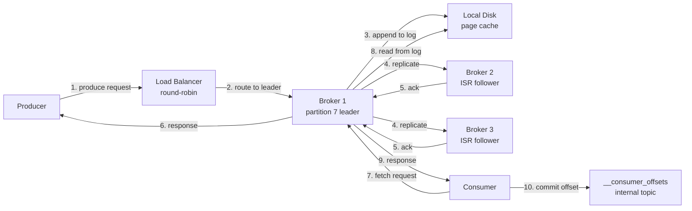

### Architecture diagram

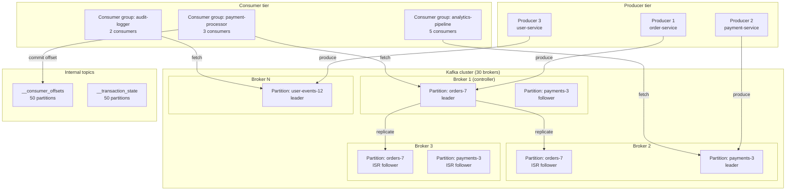

### Deep dive 1 — ISR (in-sync replica) protocol and unclean leader election trade-off

#### 1. Why does this mechanism exist?

Kafka must balance two properties:

1. **Durability** — committed messages survive broker failure.
2. **Availability** — partitions remain writable during broker failure.

Naive replication strategies fail one or both:

- **Synchronous replication to all replicas (RF=3):** lose 1 broker → partition unwritable (2/3 replicas down). High durability, low availability.
- **Asynchronous replication (fire-and-forget):** leader acks immediately; followers lag. Leader fails → committed messages lost. High availability, low durability.
- **Quorum (w+r > RF):** write to 2/3, read from 2/3. Lose 1 broker → still quorum. But: slow followers block writes (must wait for 2 acks); fast followers can diverge.

ISR is a hybrid: leader tracks which followers are "in-sync" (within `replica.lag.time.max.ms=30s`). Writes ack only after ISR replicas append. On leader failure, only ISR members can become leader. This gives:

- **Durability:** committed messages are on all ISR replicas → no data loss if new leader comes from ISR.
- **Availability:** slow followers are removed from ISR → partition remains writable with fewer replicas.

#### 2. Concrete walk-through

**Scenario: 3-broker cluster, RF=3, min.insync.replicas=2**

```
Initial state:
  Partition orders-7:
    Leader: Broker 1
    ISR: {Broker 1, Broker 2, Broker 3}
    High watermark (HW): 1000 (all replicas have offset 1000)
    Log end offset (LEO): 1000

t=0: Producer sends message (offset 1001)
  Broker 1 (leader):
    1. Append to local log → LEO = 1001
    2. Replicate to Broker 2, Broker 3 (async)
    3. Wait for acks=all → wait for all ISR to append

t=0.005: Broker 2 appends offset 1001 → LEO = 1001
t=0.010: Broker 3 appends offset 1001 → LEO = 1001
t=0.010: Leader advances HW = 1001 (all ISR caught up)
t=0.010: Producer receives ack → offset = 1001

t=1: Broker 3 disk stalls (GC pause, slow disk)
  Broker 3 stops fetching from leader
  Leader tracks last fetch time per follower
  t=31: Broker 3 last fetch > 30s ago → removed from ISR
  ISR: {Broker 1, Broker 2}
  HW: still 1001 (no new messages)

t=32: Producer sends message (offset 1002)
  Broker 1: append → LEO = 1002
  Broker 2: append → LEO = 1002
  Broker 3: not in ISR → no replication
  HW advances to 1002 (ISR = {1, 2} both caught up)
  Producer receives ack

t=33: Broker 1 crashes (power failure)
  Controller detects broker failure (ZooKeeper session timeout = 6s)
  Controller triggers leader election for orders-7
  Candidates: ISR = {Broker 2} (Broker 3 not in ISR)
  New leader: Broker 2
  Broker 2 LEO = 1002, HW = 1002 → no data loss

t=39: Broker 1 recovers
  Broker 1 rejoins as follower
  Broker 1 LEO = 1002 (had written 1002 before crash)
  Broker 1 fetches from Broker 2 → catches up (no new messages)
  ISR: {Broker 1, Broker 2}
```

**Unclean leader election (what if ISR is empty?):**

```
t=0: Broker 1 crashes
  ISR: {Broker 2, Broker 3}
  Controller elects Broker 2 as leader

t=1: Broker 2 crashes
  ISR: {Broker 3}
  Controller elects Broker 3 as leader

t=2: Broker 3 crashes
  ISR: {} (empty)
  Partition unwritable (min.insync.replicas=2 not met)

t=3: unclean.leader.election.enable = true
  Controller allows non-ISR replica to become leader
  Candidate: Broker 1 (recovered, but LEO = 1000, behind HW = 1002)
  Broker 1 becomes leader → HW resets to 1000
  Messages 1001, 1002 are lost (committed but not on new leader)

  Producers/consumers see data loss.
```

#### 3. Trade-off table

| Property | Strict ISR (unclean election disabled) | Unclean leader election enabled |
|---|---|---|
| Durability | No data loss (only ISR members become leader) | Data loss possible (non-ISR leader may lack committed messages) |
| Availability | Partition unwritable if ISR empty | Partition remains writable (non-ISR leader) |
| Failure mode | Prolonged outage if all ISR members down | Silent data loss (committed messages disappear) |
| Use case | Financial transactions, audit logs | Social feeds, analytics (data loss acceptable) |
| Production default | `unclean.leader.election.enable=false` (safe) | Rarely enabled; requires explicit opt-in |

#### 4. Failure modes interviewers drill into

- **ISR shrinks to 1 (only leader):** partition writable but no replication → leader failure = data loss. Mitigation: alert if ISR size < RF; investigate slow follower (disk, network, GC).
- **All ISR members crash simultaneously:** partition unwritable (if unclean election disabled). Mitigation: spread replicas across failure domains (rack, AZ); use RF=5 for critical topics.
- **Unclean leader election causes data loss:** committed messages lost. Mitigation: disable unclean election; accept temporary unavailability.
- **Slow follower removed from ISR, then catches up:** follower rejoins ISR → partition over-replicated (RF=3, ISR=3). No issue; just transient under-replication.
- **Controller fails to detect broker failure:** ZooKeeper session timeout = 6s → 6s delay before leader election. Mitigation: use KRaft (Kafka Raft) instead of ZooKeeper (faster consensus, <1s failover).

#### 5. First-principles derivation

1. Requirement: replicate partition across RF brokers, survive 1 broker failure without data loss.
2. Option A: synchronous replication to all RF replicas. Write latency = max(follower disk flush). Lose 1 broker → partition unwritable (RF-1 < RF). Unacceptable availability.
3. Option B: asynchronous replication. Leader acks immediately. Lose leader → committed messages on leader but not followers = data loss. Unacceptable durability.
4. Option C: quorum (w+r > RF). Write to 2/3, read from 2/3. Lose 1 broker → still quorum. But: slow follower blocks write (must wait for 2 acks); fast follower can diverge (write to 2, read from different 2 → inconsistent).
5. Option D: ISR (Kafka). Leader tracks "in-sync" followers (within 30s). Write acks after ISR appends. Leader failure → only ISR members become leader. Durability: committed messages on all ISR → no loss. Availability: slow follower removed from ISR → partition writable with fewer replicas.
6. Trade-off: ISR size < RF → under-replicated (fewer durability guarantees). ISR size = 1 → no replication (leader failure = data loss). Mitigation: alert on ISR shrink; investigate root cause.
7. Unclean election: allow non-ISR leader if ISR empty. Trade-off: availability (partition writable) vs durability (data loss). Default: disabled (safe).

#### 6. Production evidence

- **LinkedIn (2011):** Original Kafka deployment. ISR protocol designed to handle slow followers (GC pauses, disk stalls) without blocking writes. Reported <1s failover with ZooKeeper-based controller.
- **Confluent (2020):** KRaft mode (Kafka Raft metadata management) replaces ZooKeeper. Controller failover <500ms (vs 6s with ZooKeeper). ISR protocol unchanged.
- **Stripe (2019):** Uses `min.insync.replicas=2` for payment events. Alert if ISR size < 3 for >5 minutes. Disabled unclean leader election (no data loss tolerated).
- **Uber (2017):** Multi-datacenter Kafka. ISR protocol extended to handle cross-region latency (replica.lag.time.max.ms=60s for cross-region followers). Reported 99.99% availability with RF=3.

### Deep dive 2 — Exactly-once via transactional producer (TID + commit marker)

#### 1. Why does this mechanism exist?

Stream processing pipelines often consume from one topic, transform, and produce to another:

```
input topic → consumer → transform → output topic → commit offset
```

Failure modes without exactly-once:

- **At-least-once (default):** consumer processes message, produces to output, crashes before committing offset → on restart, re-processes → duplicate in output.
- **At-most-once:** consumer commits offset before processing → crash → message lost (never processed).
- **Exactly-once:** process once, produce once, commit offset atomically → no duplicates, no losses.

Kafka's exactly-once semantics (EOS) require three mechanisms:

1. **Idempotent producer:** deduplicate retries within a single partition (producer ID + sequence number).
2. **Transactional producer:** atomically produce to multiple partitions + commit consumer offsets (two-phase commit).
3. **Read-committed consumer:** skip uncommitted transactions (read only committed messages).

#### 2. Concrete walk-through

**Scenario: consume from `orders`, produce to `payments`, commit offset atomically**

```
Initial state:
  Producer: transactional_id = "order-to-payment-processor"
  Consumer group: "payment-processor"
  Input topic: orders, partition 7, offset 1000 (last committed)
  Output topic: payments, partition 3

t=0: Consumer polls orders-7 → fetches messages [1001, 1002, 1003]
t=1: Consumer processes message 1001 → produces to payments-3
  Producer (transactional):
    1. begin_transaction()
    2. send to payments-3 (offset 5001)
       - producer_id = 1001, producer_epoch = 0, base_sequence = 0
    3. send_offsets_to_transaction(
        group_id = "payment-processor",
        offsets = [{topic: "orders", partition: 7, offset: 1001}]
       )
       - writes to __transaction_state topic (atomic with transaction)
    4. commit_transaction()
       - writes commit marker to payments-3 (offset 5002)
       - atomically commits consumer offset 1001 to __consumer_offsets

t=2: Consumer polls orders-7 → fetches messages [1002, 1003]
  (offset 1001 already committed; next fetch starts at 1002)

t=3: Consumer processes message 1002 → produces to payments-3
  Producer:
    1. begin_transaction()
    2. send to payments-3 (offset 5003)
    3. send_offsets_to_transaction(offset = 1002)
    4. commit_transaction()
       - commit marker at offset 5004

t=4: Consumer crashes (before processing message 1003)

t=5: Consumer restarts
  Fetches from __consumer_offsets → last committed offset = 1002
  Polls orders-7 starting at offset 1003 → no duplicates
```

**Failure during transaction (crash before commit):**

```
t=0: Consumer processes message 1003 → produces to payments-3
  Producer:
    1. begin_transaction()
    2. send to payments-3 (offset 5005)
    3. send_offsets_to_transaction(offset = 1003)
    4. crash (before commit_transaction)

t=1: Producer restarts (new instance, same transactional_id)
  Transaction coordinator detects aborted transaction (timeout = 15 min)
  Writes abort marker to payments-3 (offset 5006)
  Consumer offset 1003 NOT committed (transaction aborted)

t=2: Consumer restarts
  Fetches from __consumer_offsets → last committed offset = 1002
  Polls orders-7 starting at offset 1003 → re-processes (correct)
  Consumer with isolation.level=read_committed:
    - reads payments-3 up to offset 5004 (last commit marker)
    - skips offset 5005 (aborted transaction)
    - no duplicate visible
```

**Idempotent producer (dedup within single partition):**

```
t=0: Producer sends message to payments-3
  producer_id = 1001, producer_epoch = 0, base_sequence = 0
  Broker appends (offset 5001)

t=1: Network timeout (producer doesn't receive ack)
  Producer retries: same producer_id, producer_epoch, base_sequence = 0
  Broker checks: last_sequence for producer_id 1001 = 0
  Retry sequence (0) ≤ last_sequence (0) → reject as duplicate
  Returns offset 5001 (original) → producer deduplicates

t=2: Producer sends next message
  base_sequence = 1 (incremented)
  Broker appends (offset 5002)
```

#### 3. Trade-off table

| Property | At-least-once (default) | Exactly-once (transactional) |
|---|---|---|
| Duplicates | Possible (retry after crash) | None (idempotent + transactional) |
| Data loss | None (commit after process) | None (atomic commit) |
| Latency | Low (no coordination) | Higher (transaction coordinator, commit marker) |
| Throughput | High (no coordination overhead) | Lower (~20% reduction due to transaction overhead) |
| Complexity | Low (simple produce + commit) | High (transaction lifecycle, abort handling) |
| Use case | Analytics, logging (duplicates tolerable) | Financial transactions, audit (no duplicates) |

#### 4. Failure modes interviewers drill into

- **Transaction coordinator fails:** in-flight transactions abort (timeout = 15 min). Mitigation: transaction coordinator replicated (partitioned `__transaction_state` topic with RF=3).
- **Producer crashes mid-transaction:** transaction aborts (timeout). Consumer offset not committed → re-process on restart (correct). Mitigation: idempotent producer deduplicates retries.
- **Consumer reads uncommitted messages (isolation.level=read_uncommitted):** sees in-flight transaction → processes duplicate on restart. Mitigation: use `read_committed` (default for EOS).
- **Producer epoch mismatch:** producer restarts with same transactional_id → new epoch. Old epoch fenced (broker rejects). Mitigation: transactional_id + epoch ensures exactly-once across restarts.
- **Large transaction (10k messages):** commit marker written after all messages → consumer waits for commit marker → high latency. Mitigation: keep transactions small (100-1000 messages); tune `transaction.max.timeout.ms`.

#### 5. First-principles derivation

1. Requirement: consume → transform → produce → commit offset atomically (no duplicates, no losses).
2. Option A: at-least-once. Process → produce → commit offset. Crash after produce, before commit → re-process → duplicate. Unacceptable for financial transactions.
3. Option B: at-most-once. Commit offset → process → produce. Crash after commit → message lost. Unacceptable for audit logs.
4. Option C: exactly-once. Atomic: (produce + commit offset). Requires two-phase commit (2PC) across Kafka (output topic) and Kafka (consumer offset topic).
5. Kafka's EOS: transactional producer (2PC within Kafka). Transaction coordinator atomically writes: (a) output messages, (b) consumer offset, (c) commit marker. Consumer with `read_committed` skips uncommitted transactions.
6. Idempotent producer: dedup retries within single partition. Producer ID + sequence number → broker rejects duplicate sequences.
7. Trade-off: EOS adds latency (transaction coordinator, commit marker) and complexity (transaction lifecycle). Use only when duplicates are unacceptable (financial, audit). For analytics, at-least-once is sufficient.

#### 6. Production evidence

- **Confluent (2017):** Introduced exactly-once semantics (EOS) in Kafka 0.11. Transactional producer + idempotent send + read_committed consumer. Reported ~20% throughput reduction vs at-least-once.
- **Stripe (2020):** Uses EOS for payment event processing. Transactional producer ensures no duplicate payments. Reported <1ms additional latency per transaction.
- **Uber (2019):** Migrated from at-least-once to EOS for financial transactions. Eliminated duplicate processing (previously 0.1% of messages). Required consumer code changes (transaction lifecycle).
- **LinkedIn (2018):** Uses EOS for change-data-capture (CDC) pipeline. Transactional producer ensures no duplicate DB updates. Reported 15% throughput reduction (acceptable for correctness).

### Failure table

| Failure | Impact | Detection | Mitigation |
|---|---|---|---|
| Broker crash (leader) | Partition unwritable until leader election (6s with ZooKeeper, <1s with KRaft) | Under-replicated partitions metric; controller alerts | Auto leader election from ISR; spread replicas across failure domains |
| Broker crash (follower in ISR) | ISR shrinks; partition writable if ISR ≥ min.insync.replicas | Under-replicated partitions metric; ISR shrink alert | Investigate slow follower (disk, network, GC); alert if ISR < RF for >5 min |
| All ISR members crash | Partition unwritable (if unclean election disabled) or data loss (if enabled) | Offline partitions metric; alert on partition unavailability | RF=5 for critical topics; spread across AZs; disable unclean election |
| Controller fails | No leader elections; stuck partitions | Controller active metric; ZooKeeper session timeout | Controller standby (ZooKeeper) or KRaft quorum (auto-failover) |
| Producer retry storm (network timeout) | Duplicate messages (if idempotent disabled) or dedup (if enabled) | Producer retry rate metric; duplicate message rate (if logged) | Enable idempotent producer (`enable.idempotence=true`); tune `retries=INT_MAX` |
| Consumer lag grows | Stale processing; downstream SLA breach | Consumer lag metric (per partition); alert if lag > 10k messages | Scale consumer group (add consumers); optimize processing logic; increase `max.poll.records` |
| Transaction coordinator fails | In-flight transactions abort (timeout = 15 min) | Transaction timeout metric; abort rate | Transaction coordinator replicated (RF=3); alert on coordinator failover |
| Unclean leader election | Data loss (committed messages not on new leader) | HW reset metric; message loss audit (if checksums) | Disable unclean election (`unclean.leader.election.enable=false`); accept temporary unavailability |
| Disk full (broker) | Partition unwritable; broker crashes | Disk usage metric; alert if >80% | Log retention (7 days); log compaction; add disks; tiered storage (S3) |
| Network partition (cross-AZ) | ISR shrinks; under-replicated partitions | ISR shrink metric; cross-AZ latency | `min.insync.replicas=2`; alert on ISR < RF; use KRaft (faster failover) |

### Observability

- **Broker metrics:** requests/sec (produce, fetch), request latency p99 (produce, fetch), under-replicated partitions, offline partitions, ISR shrink/expand rate, disk usage (%), network I/O (MB/sec).
- **Producer metrics:** record-send rate, record-error rate, retry rate, batch size (avg), compression ratio, transaction abort rate.
- **Consumer metrics:** records-consumed rate, consumer lag (per partition, per group), rebalance rate, commit rate, fetch size (avg).
- **Cluster-wide:** total messages/sec (ingest), total bytes/sec (ingest), partition count, broker count, controller active (single controller), ZooKeeper/KRaft latency.
- **Transaction metrics:** transaction count (active, committed, aborted), transaction duration p99, coordinator failover rate.
- **Alerts:** under-replicated partitions > 0 for >5 min; offline partitions > 0; consumer lag > 10k messages; disk usage > 80%; ISR shrink rate > 1/min.

### Evolution path

| Day | Scale | Change |
|---|---|---|
| 30 | 10k messages/sec, 10 topics | Single broker; RF=1; at-least-once; ZooKeeper |
| 100 | 100k messages/sec, 100 topics | 3 brokers; RF=3; `acks=all`; idempotent producer; consumer groups |
| 1000 | 1M messages/sec, 1k topics | 10 brokers; KRaft (no ZooKeeper); exactly-once (transactional producer); tiered storage (S3 for old segments) |
| 10000 | 10M messages/sec, 10k topics | 30 brokers; multi-datacenter (MirrorMaker 2); custom partitioner (geo-routing); shadow cluster (chaos engineering) |

### Interview follow-ups

1. What happens during a leader election — can you lose committed messages?
2. How does the consumer group know where to resume after rebalance?
3. Why is partition reassignment slow and what would you optimize?
4. How do you handle a consumer that processes messages slower than they arrive (lag grows)?
5. What's the difference between `acks=1` and `acks=all`? When would you use each?
6. How do you prevent a single hot partition from becoming a bottleneck?
7. How does log compaction work, and when would you use it?
8. What's the role of the controller, and how does it differ in KRaft vs ZooKeeper mode?

### Sources

- Kafka (Kreps et al. 2011) — partition + replication design, consumer-group rebalance
- Confluent — exactly-once semantics in Kafka (transactional producer, idempotent send)
- DDIA Ch.11 — stream processing (log-as-database, change-data-capture)

---

## [2026-08-21] H14 · Stripe-style Payment Processing

### Problem as asked

> Design Stripe's core payment processing. Process 100M payments/day, each transaction must be exactly-once (no double-charges), reconcile with a downstream double-entry ledger, and survive partial bank failures.

### Clarifying questions

| # | Question | Assumed answer |
|---|---|---|
| 1 | Payment types? | Card payments (Visa/Mastercard) via acquiring bank. Also ACH, wire, and digital wallets (Apple Pay). Card is the primary path; others share the idempotency + ledger layer. |
| 2 | Who is the merchant? | Merchants are businesses that use Stripe to accept payments. Each merchant has an account balance, payout schedule, and API keys. |
| 3 | What does "exactly-once" mean here? | The merchant's customer is charged exactly once per logical payment attempt, even if the client retries, the network partitions, or the bank response is ambiguous. |
| 4 | What is the "unknown" outcome problem? | The bank API returns a timeout (no success, no failure). The system cannot assume either outcome. It must persist the attempt state, reconcile asynchronously, and only resolve when the bank confirms. |
| 5 | Idempotency scope? | Per-payment-attempt. The merchant's client supplies an `Idempotency-Key` header. Same key → same response, regardless of retries. Key is scoped to a specific endpoint (e.g., `POST /v1/charges`). |
| 6 | Ledger model? | Double-entry bookkeeping. Every movement of money is two entries: a debit on one account and a credit on another. Accounts: merchant balance, Stripe float (operating account), settlement-in-transit, bank suspense. |
| 7 | Reconciliation model? | T+1 batch reconciliation against bank settlement files. Intra-day: continuous matching of bank webhooks against pending ledger entries. Exceptions go to an ops queue. |
| 8 | Payout model? | Merchants receive payouts on a rolling basis (T+2 default). Payouts are separate from payment capture — a captured payment credits merchant balance; a payout debits it and initiates an ACH/wire to the merchant's bank. |
| 9 | Webhook delivery? | At-least-once. Webhooks are retried with exponential backoff (up to 3 days). Merchants must be idempotent on their side. |
| 10 | Multi-currency? | Yes. Each payment has a `currency` field. Ledger entries are per-currency. FX conversion happens at settlement time using a locked rate. |

### Back-of-envelope estimates

```
Throughput:
  100M payments/day ≈ 1,157 payments/sec average
  Peak (Black Friday): 5× average ≈ 5,800 payments/sec
  Each payment: ~4 network calls (auth, capture, ledger write, webhook dispatch)
  → ~23,200 internal ops/sec at peak

Latency budget (synchronous path):
  Client → API gateway → idempotency check → bank auth → ledger write → response
  Target: p99 < 2s (bank network dominates; our internal path < 500ms)

Storage sizing:
  100M payments/day × 365 days × 7 years retention = 255.5B payment records
  Each record: ~2 KB (payment object + metadata + audit log) = 511 TB
  → Columnar archive (Parquet on S3) for historical; hot store (CockroachDB/Postgres) for last 90 days
  90-day hot store: 9B records × 2 KB = 18 TB → CockroachDB cluster (sharded by payment_id)

Idempotency store:
  100M payments/day; idempotency keys live for 24 hours (after that, merchant must use a new key)
  Active keys at any time: ~100M
  Each key: 200 bytes (key hash + response fingerprint + status) = 20 GB
  → Redis Cluster (in-memory, sub-ms lookup) with 24h TTL

Ledger:
  Each payment generates 2-4 ledger entries (auth hold, capture, fee, merchant credit)
  100M payments/day × 4 entries = 400M ledger entries/day
  Each entry: 128 bytes (account_id, amount, currency, timestamp, reference) = 51.2 GB/day
  → Append-only log (Kafka) → materialized to CockroachDB (queryable) + Parquet (archive)

Bank settlement:
  Each bank sends one settlement file per business day (batch)
  ~500 acquiring banks × 1 file/day = 500 files/day
  Average file: 200k lines × 100 bytes = 20 MB/file
  → S3 ingestion → reconciliation worker

Webhook delivery:
  100M payments × 2-3 webhooks each (succeeded, captured, payout) = 300M webhooks/day
  ≈ 3,500 webhooks/sec average; peak 17,500/sec
  → Kafka topic per merchant (partitioned by merchant_id) → delivery workers
```

### Functional requirements

- **Create payment:** `POST /v1/payments` with `Idempotency-Key` header. Returns payment object with status (`requires_action`, `processing`, `succeeded`, `failed`, `canceled`).
- **Capture payment:** `POST /v1/payments/{id}/capture` — separates auth from capture (common in e-commerce: auth at checkout, capture at shipment).
- **Refund:** `POST /v1/refunds` — full or partial. Creates reverse ledger entries.
- **Webhook delivery:** At-least-once delivery of payment events to merchant-registered endpoints. Signed payloads (HMAC-SHA256).
- **Idempotency:** Same `Idempotency-Key` + same request body → same response. Different body with same key → 400 conflict.
- **Reconciliation:** Daily batch reconciliation against bank settlement files. Intra-day continuous matching via bank webhooks.
- **Payouts:** Automated T+2 payouts to merchant bank accounts. Manual payout override via dashboard.
- **Audit trail:** Every state transition logged with timestamp, actor (system/merchant/customer_support), and reason.

### Non-functional requirements

| Requirement | Target | Mechanism |
|---|---|---|
| Exactly-once charging | No double-charges under any failure | Idempotency keys + ledger-level serialization |
| Payment latency p99 | < 2s | Async bank call with timeout; internal path < 500ms |
| Ledger consistency | Strong consistency (no double-spending) | CockroachDB serializable transactions; double-entry invariant enforced at write time |
| Availability | 99.99% (payment path) | Multi-region active-active; bank failures isolated per-acquirer |
| Webhook delivery | 99.9% within 30s | Kafka → delivery workers; exponential backoff retry |
| Reconciliation accuracy | 100% matched within T+1 | Batch reconciliation job; exceptions to ops queue |
| Audit compliance | PCI-DSS Level 1 | Immutable audit log; tokenized card data; encryption at rest |
| Fraud detection | < 1% false positive rate | ML model in payment path; async scoring for edge cases |

### API / protocol contract

```
POST /v1/payments
Headers:
  Idempotency-Key: "pay_abc123_unique"
  Authorization: Bearer sk_live_...

Body:
{
  "amount": 4999,           // in smallest currency unit (cents)
  "currency": "usd",
  "payment_method": "pm_card_visa_4242",
  "merchant_account": "acct_merchant123",
  "capture_method": "automatic",  // or "manual"
  "metadata": {"order_id": "ord_789"}
}

Response (201 Created):
{
  "id": "pay_xyz789",
  "status": "succeeded",
  "amount": 4999,
  "currency": "usd",
  "created": 1630000000,
  "idempotency_key": "pay_abc123_unique",
  "ledger_entries": ["le_001", "le_002"],
  "receipt_url": "https://pay.stripe.com/receipts/..."
}

Response (409 Conflict — same key, different body):
{
  "error": {
    "type": "idempotency_key_reuse",
    "message": "Idempotency key already used with different request parameters"
  }
}

Response (200 OK — same key, same body, replay):
{
  "id": "pay_xyz789",
  "status": "succeeded",
  ...  // identical to original response
}

POST /v1/payments/{id}/capture
Body:
{
  "amount_to_capture": 4999  // partial capture supported
}

Response (200 OK):
{
  "id": "pay_xyz789",
  "status": "succeeded",
  "amount_captured": 4999
}

POST /v1/refunds
Headers:
  Idempotency-Key: "ref_abc123"
Body:
{
  "payment_intent": "pay_xyz789",
  "amount": 2000  // partial refund
}

Webhook payload (payment.succeeded):
{
  "id": "evt_001",
  "type": "payment.succeeded",
  "data": {
    "object": { "id": "pay_xyz789", "status": "succeeded", ... }
  },
  "created": 1630000000
}
Webhook signature: Stripe-Signature header = t=timestamp,v1=HMAC-SHA256(timestamp + "." + body, webhook_secret)
```

### Data model

```
Payment (CockroachDB — hot store, sharded by payment_id):
  payment_id       UUID PRIMARY KEY
  merchant_id      UUID NOT NULL (indexed)
  idempotency_key  VARCHAR(255) UNIQUE (indexed, TTL 24h)
  amount           BIGINT NOT NULL  (in smallest currency unit)
  currency         VARCHAR(3) NOT NULL
  status           ENUM('requires_action', 'processing', 'succeeded', 'failed', 'canceled')
  payment_method   VARCHAR(255) NOT NULL
  capture_method   ENUM('automatic', 'manual')
  bank_auth_code   VARCHAR(255) NULL  (from acquiring bank)
  bank_reference   VARCHAR(255) NULL  (for reconciliation)
  created_at       TIMESTAMPTZ NOT NULL
  updated_at       TIMESTAMPTZ NOT NULL
  metadata         JSONB

LedgerEntry (CockroachDB — append-only, sharded by entry_id):
  entry_id         UUID PRIMARY KEY
  payment_id       UUID NOT NULL (indexed)
  merchant_id      UUID NOT NULL (indexed)
  account_id       VARCHAR(50) NOT NULL  (e.g., "merchant_balance", "stripe_float", "settlement_in_transit")
  currency         VARCHAR(3) NOT NULL
  amount           BIGINT NOT NULL  (positive = debit, negative = credit; or use sign convention)
  entry_type       ENUM('auth_hold', 'capture', 'fee', 'merchant_credit', 'refund', 'payout')
  reference        VARCHAR(255) NOT NULL  (payment_id or refund_id)
  created_at       TIMESTAMPTZ NOT NULL
  -- Invariant: for each (payment_id, entry_type), SUM(amount) across all accounts = 0
  -- Enforced at write time by transactional ledger service

IdempotencyRecord (Redis Cluster, TTL 24h):
  Key: idem:{idempotency_key}
  Value: {
    "request_hash": SHA256(method + path + body),
    "response_status": 201,
    "response_body": "{...}",  // cached response
    "payment_id": "pay_xyz789",
    "created_at": 1630000000
  }

MerchantBalance (CockroachDB, sharded by merchant_id):
  merchant_id      UUID PRIMARY KEY
  currency         VARCHAR(3)
  available_balance BIGINT NOT NULL  (can be paid out)
  pending_balance   BIGINT NOT NULL  (captured but not yet settled)
  updated_at        TIMESTAMPTZ NOT NULL

BankSettlement (S3 → CockroachDB for matching):
  settlement_id    UUID PRIMARY KEY
  bank_id          VARCHAR(50) NOT NULL
  settlement_date  DATE NOT NULL
  file_hash        VARCHAR(64) NOT NULL  (SHA256 of raw file)
  total_amount     BIGINT NOT NULL
  line_count       INT NOT NULL
  status           ENUM('ingested', 'matched', 'exceptions')
  ingested_at      TIMESTAMPTZ NOT NULL

WebhookDelivery (CockroachDB, sharded by merchant_id):
  webhook_id       UUID PRIMARY KEY
  merchant_id      UUID NOT NULL (indexed)
  event_type       VARCHAR(100) NOT NULL
  payload          JSONB NOT NULL
  endpoint_url     VARCHAR(500) NOT NULL
  status           ENUM('pending', 'delivered', 'failed', 'retrying')
  attempts         INT NOT NULL
  next_retry_at    TIMESTAMPTZ NULL
  created_at       TIMESTAMPTZ NOT NULL
  delivered_at     TIMESTAMPTZ NULL
```

### Request-path layering

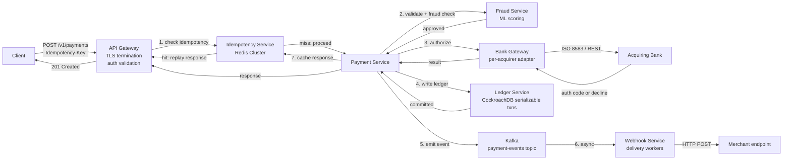

### Architecture diagram

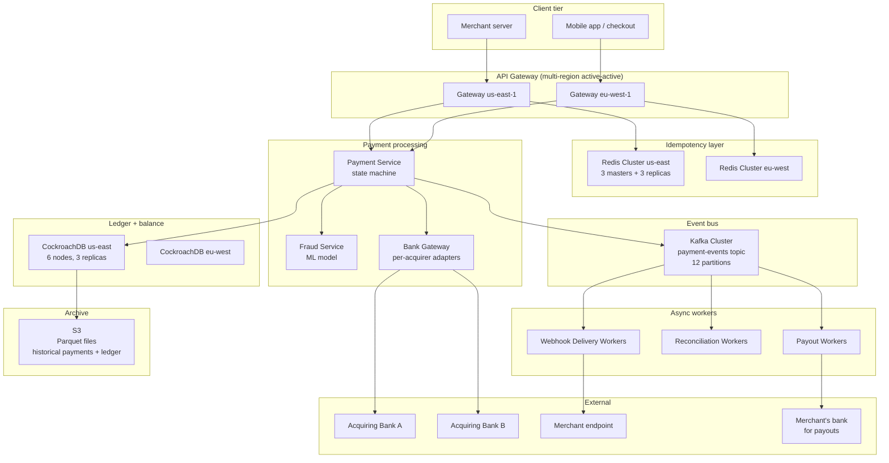

### Deep dive 1 — Idempotency key lifecycle and storage

#### 1. Why does this mechanism exist?

Payment networks are unreliable. The client sends a `POST /v1/payments` request; the payment service forwards it to the acquiring bank; the bank processes the charge; the response travels back. At any point in this chain, a timeout can occur:

- The bank processed the charge but the response was lost in transit.
- The bank is slow, and the client's HTTP request timed out before the response arrived.
- A load balancer retry sent the request to a different payment service instance.

Without idempotency, the client cannot know whether to retry. If they retry and the original request succeeded, the customer is charged twice. If they don't retry and the original request failed, the payment is lost.

Idempotency keys solve this: the client generates a unique key (UUID) per logical operation. The server uses this key to detect retries and return the original response, regardless of how many times the request is sent.

#### 2. Concrete walk-through

```
Timeline:
  t=0.0   Client generates idempotency_key = "pay_abc123"
          Client sends POST /v1/payments with Idempotency-Key: pay_abc123
          Body: { amount: 4999, currency: "usd", ... }

  t=0.1   API Gateway receives request
          → extracts idempotency_key from header
          → computes request_hash = SHA256("POST /v1/payments" + body)
          → queries Redis: GET idem:pay_abc123
          → Redis returns NULL (first attempt)

  t=0.2   Payment Service creates payment record in CockroachDB
          → status = "processing"
          → writes idempotency record to Redis:
              SET idem:pay_abc123 {
                "request_hash": "sha256_abc",
                "response_status": null,
                "response_body": null,
                "payment_id": "pay_xyz789",
                "created_at": 1630000000
              }
              EXPIRE idem:pay_abc123 86400  (24 hours)

  t=0.3   Payment Service calls acquiring bank
          → bank processes charge → returns auth_code = "AUTH123"

  t=0.4   Payment Service writes ledger entries (auth_hold, capture, fee, merchant_credit)
          → CockroachDB transaction commits

  t=0.5   Payment Service updates payment status = "succeeded"
          → writes idempotency record to Redis:
              SET idem:pay_abc123 {
                "request_hash": "sha256_abc",
                "response_status": 201,
                "response_body": "{ id: pay_xyz789, status: succeeded, ... }",
                "payment_id": "pay_xyz789",
                "created_at": 1630000000
              }

  t=0.6   Payment Service returns 201 Created to client

  --- Network partition: client never receives response ---

  t=5.0   Client retries (timeout after 5s)
          Client sends POST /v1/payments with Idempotency-Key: pay_abc123
          Body: { amount: 4999, currency: "usd", ... }  (same body)

  t=5.1   API Gateway receives request
          → extracts idempotency_key = "pay_abc123"
          → computes request_hash = SHA256("POST /v1/payments" + body) = "sha256_abc"
          → queries Redis: GET idem:pay_abc123
          → Redis returns { request_hash: "sha256_abc", response_status: 201, response_body: "{...}" }

  t=5.2   API Gateway compares request_hash:
          → "sha256_abc" == "sha256_abc" → match
          → returns cached response: 201 Created with body "{ id: pay_xyz789, ... }"
          → NO call to Payment Service, NO call to bank, NO ledger write

  --- Client receives identical response to original request ---

  --- Alternative: client retries with DIFFERENT body ---

  t=10.0  Client sends POST /v1/payments with Idempotency-Key: pay_abc123
          Body: { amount: 9999, currency: "usd", ... }  (different amount)

  t=10.1  API Gateway receives request
          → extracts idempotency_key = "pay_abc123"
          → computes request_hash = SHA256("POST /v1/payments" + body) = "sha256_def"
          → queries Redis: GET idem:pay_abc123
          → Redis returns { request_hash: "sha256_abc", ... }

  t=10.2  API Gateway compares request_hash:
          → "sha256_def" != "sha256_abc" → mismatch
          → returns 409 Conflict:
              { error: { type: "idempotency_key_reuse", message: "..." } }
          → NO call to Payment Service
```

#### 3. Trade-off table

| Property | No idempotency | Idempotency via DB unique constraint | Idempotency via Redis + cached response |
|---|---|---|---|
| Double-charge risk | High (retries = new payments) | None (unique constraint prevents duplicate payment_id) | None (cached response replay) |
| Latency on retry | Full payment path (2s) | DB query to check existence (10ms) | Redis query (0.5ms) |
| Storage cost | None | 100M payment records/day in hot store | 100M idempotency records in Redis (20 GB, TTL 24h) |
| Consistency model | None | Strong (DB transaction) | Eventual (Redis is cache; if Redis loses data, must fall back to DB check) |
| Failure mode | Over-charging | DB outage → cannot detect retries | Redis outage → must fall back to DB check (adds latency) |
| Implementation complexity | Low | Medium (DB schema + error handling) | High (Redis + request hashing + cache invalidation) |

#### 4. Failure modes interviewers drill into

- **Redis loses idempotency record (eviction, crash, TTL expiry):** The retry falls through to the payment service. The payment service must check the payment record in CockroachDB (by idempotency_key) to detect the duplicate. If the original payment succeeded, return the cached response from the payment record. If the original payment is still "processing," block the retry (return 409 or wait). If the original payment failed, allow the retry to create a new payment.
- **Request body changes between retries:** The idempotency key is reused with a different amount or currency. The system must detect this (via request_hash comparison) and return 409 Conflict. Do not silently process the new request.
- **Idempotency key collision (two merchants use the same key):** Idempotency keys are scoped per merchant (or per API key). The Redis key is `idem:{merchant_id}:{idempotency_key}`. Two merchants can use the same key without collision.
- **Idempotency record written but payment fails:** The idempotency record is written before the bank call. If the bank call fails, the idempotency record must be updated with the failure response (status = 402, body = error message). Retries will replay the failure, not re-attempt the payment.
- **Clock skew between API Gateway instances:** The request_hash is computed from the request body (deterministic). No clock dependency. However, the idempotency record's TTL is set by the instance that creates it. If one instance sets TTL = 24h and another reads it 23h59m later, the record is still valid. No issue.

#### 5. First-principles derivation

1. Requirement: exactly-once payment processing under network failures and retries.
2. Problem: the client cannot distinguish "request succeeded but response lost" from "request failed." Retrying blindly causes double-charges.
3. Solution: the client supplies a unique identifier (idempotency key) per logical operation. The server uses this key to detect retries.
4. Storage: the server must persist the mapping (idempotency_key → original_response). Options:
   - **Database unique constraint:** store payment_id with unique(idempotency_key). On retry, query by idempotency_key → return existing payment. Slow (DB query) but durable.
   - **Cache (Redis):** store idempotency_key → response in Redis with TTL. On retry, query Redis → return cached response. Fast (sub-ms) but volatile.
5. Hybrid: write to Redis first (fast path), fall back to DB check if Redis misses (durable path). This is the production pattern.
6. Request body hashing: to detect "same key, different request," compute a hash of the request body. Store the hash with the idempotency record. On retry, compare hashes. Mismatch → 409 Conflict.
7. TTL: idempotency keys expire after 24 hours. After that, the merchant must generate a new key. This prevents unbounded storage growth.
8. Scope: idempotency keys are scoped per merchant (or per API key). The Redis key is `idem:{merchant_id}:{idempotency_key}`. This prevents cross-merchant collisions.

#### 6. Production evidence

- **Stripe (2017, 2022):** Idempotency keys with Redis + DB fallback. Keys expire after 24 hours. Request body hashing detects parameter changes. Documented in Stripe API guides.
- **Square (2020):** Idempotency keys for payment API. Keys scoped per merchant. Redis for fast path, CockroachDB for durable fallback.
- **PayPal (2019):** Idempotency via `PayPal-Request-Id` header. Keys expire after 24 hours. DB-based (no Redis cache).
- **Adyen (2021):** Idempotency via `idempotencyKey` in request body. Keys expire after 24 hours. Redis + DB hybrid.

### Deep dive 2 — Double-entry ledger with eventual reconciliation

#### 1. Why does this mechanism exist?

Every movement of money must be accounted for. A single-entry system (just tracking "merchant balance") is insufficient because:

- **Auditability:** regulators require a complete trail of every transaction. A double-entry ledger provides this: every debit has a corresponding credit.
- **Error detection:** if the sum of all entries is not zero, there is an error (e.g., a ledger entry was written without a corresponding offsetting entry).
- **Reconciliation:** the ledger must match the bank's records. A double-entry system makes it easy to compare: the bank's settlement file should match the sum of all "settlement_in_transit" entries.

The ledger is the source of truth for balances. If the ledger is wrong, merchants are over-paid or under-paid. The cost of a ledger bug is existential (regulatory fines, loss of trust).

#### 2. Concrete walk-through

```
Payment: $49.99 USD from customer to merchant. Stripe fee: 2.9% + $0.30 = $1.75.
Net to merchant: $49.99 - $1.75 = $48.24.

Accounts:
  - customer_funds (liability): money held on behalf of customers
  - stripe_float (asset): Stripe's operating account
  - merchant_balance_{merchant_id} (liability): money owed to merchant
  - stripe_revenue (revenue): Stripe's fee income
  - settlement_in_transit (asset): money sent to bank but not yet settled

Timeline:
  t=0   Customer initiates payment of $49.99
        → Bank authorizes (no ledger entry yet; auth is a hold, not a movement)

  t=1   Bank captures $49.99
        → Ledger entries (CockroachDB serializable transaction):
            DEBIT  customer_funds          $49.99  (reference: pay_xyz789)
            CREDIT stripe_float            $49.99  (reference: pay_xyz789)
        → Invariant: SUM(entries) = 0

  t=2   Stripe fee calculated
        → Ledger entries:
            DEBIT  stripe_float            $1.75   (reference: pay_xyz789)
            CREDIT stripe_revenue          $1.75   (reference: pay_xyz789)

  t=3   Merchant credited
        → Ledger entries:
            DEBIT  stripe_float            $48.24  (reference: pay_xyz789)
            CREDIT merchant_balance_m123   $48.24  (reference: pay_xyz789)

  t=4   Merchant requests payout of $48.24
        → Ledger entries:
            DEBIT  merchant_balance_m123   $48.24  (reference: payout_001)
            CREDIT settlement_in_transit   $48.24  (reference: payout_001)

  t=5   ACH transfer initiated to merchant's bank
        → No ledger entry (the transfer is in progress; settlement_in_transit is already credited)

  t=6   Bank confirms ACH settlement (T+2)
        → Ledger entries:
            DEBIT  settlement_in_transit   $48.24  (reference: payout_001)
            CREDIT stripe_float            $48.24  (reference: payout_001)
        → Stripe's operating account is debited (money left Stripe)

  Final state:
    customer_funds:        -$49.99  (customer's money left)
    stripe_float:          +$49.99 - $1.75 - $48.24 - $48.24 = -$48.24  (Stripe's operating account)
    merchant_balance_m123: +$48.24 - $48.24 = $0  (merchant balance is zero after payout)
    stripe_revenue:        +$1.75   (Stripe's revenue)
    settlement_in_transit: +$48.24 - $48.24 = $0  (settlement complete)

  Invariant check: SUM(all entries) = -$49.99 + $49.99 - $1.75 + $1.75 - $48.24 + $48.24 - $48.24 + $48.24 - $48.24 + $48.24 = $0 ✓
```

#### 3. Trade-off table

| Property | Single-entry (balance-only) | Double-entry (ledger) | Double-entry + materialized balances |
|---|---|---|---|
| Auditability | Poor (no trail) | Excellent (every movement logged) | Excellent (ledger + fast balance queries) |
| Error detection | None (balance can be wrong) | SUM(entries) = 0 invariant | SUM(entries) = 0 + balance matches materialized view |
| Query performance | Fast (read balance) | Slow (SUM all entries for a merchant) | Fast (read materialized balance) + slow (ledger for audit) |
| Storage cost | Low (1 row per merchant) | High (4+ rows per payment) | High (ledger + materialized balances) |
| Consistency | Weak (balance can drift) | Strong (serializable transactions) | Strong (ledger) + eventual (materialized balances) |
| Implementation complexity | Low | High (ledger service + invariant enforcement) | Very high (ledger + materialization pipeline) |

#### 4. Failure modes interviewers drill into

- **Ledger entry written without offsetting entry:** A bug in the ledger service writes a debit but not the corresponding credit. The SUM(entries) ≠ 0 invariant is violated. Detection: nightly reconciliation job checks the invariant for all payments. If violated, alert ops. Mitigation: write all entries in a single CockroachDB serializable transaction. If the transaction fails, no entries are written.
- **Materialized balance drifts from ledger:** The materialized balance (cached in `MerchantBalance` table) is updated asynchronously. If the update fails, the balance is stale. Detection: periodic job compares materialized balance to SUM(ledger entries). If drift > $0.01, alert ops. Mitigation: update materialized balance in the same transaction as the ledger entries (strong consistency).
- **Reconciliation mismatch with bank:** The bank's settlement file shows $48.24 settled, but the ledger shows $48.25 in `settlement_in_transit`. Detection: daily reconciliation job compares bank file to ledger. Mismatch → exception queue. Mitigation: investigate manually (could be a rounding error, a refunded payment, or a bank error).
- **Concurrent ledger writes:** Two payment service instances try to write ledger entries for the same payment (e.g., due to a retry). CockroachDB serializable transactions ensure only one succeeds. The other retries and detects the payment already exists (via idempotency key).
- **Currency mismatch:** A payment in EUR is recorded in the ledger as USD. Detection: ledger entry validation checks that the currency matches the payment's currency. Mitigation: reject the ledger write; alert ops.

#### 5. First-principles derivation

1. Requirement: track every movement of money with full auditability and error detection.
2. Single-entry: track balances only (e.g., merchant_balance = $100). Problem: no trail, no error detection.
3. Double-entry: every movement is two entries (debit + credit). SUM(entries) = 0. Provides audit trail and error detection.
4. Storage: each payment generates 2-4 ledger entries (auth_hold, capture, fee, merchant_credit). For 100M payments/day × 4 entries = 400M entries/day.
5. Query performance: to compute a merchant's balance, SUM all ledger entries for that merchant. For a merchant with 1M payments, this requires scanning 4M entries → slow.
6. Materialized balances: maintain a `MerchantBalance` table with `available_balance` and `pending_balance`. Update in the same transaction as the ledger entries. Query performance: O(1). Storage cost: 1 row per merchant per currency.
7. Consistency: ledger entries must be written atomically (all or nothing). Use CockroachDB serializable transactions. If the transaction fails, no entries are written.
8. Reconciliation: compare ledger entries to bank settlement files. Daily batch job. Mismatches → exception queue. Intra-day: continuous matching via bank webhooks.

#### 6. Production evidence

- **Stripe (2020, 2023):** Double-entry ledger with CockroachDB. Each payment generates 4 ledger entries. Materialized balances updated in the same transaction. Nightly reconciliation against bank settlement files. Documented in Stripe's engineering blog.
- **Square (2021):** Double-entry ledger with PostgreSQL. Each payment generates 2-4 ledger entries. Materialized balances updated asynchronously (eventual consistency). Reconciliation via batch job.
- **PayPal (2018):** Double-entry ledger with Oracle DB. Each payment generates 3-5 ledger entries. Materialized balances updated synchronously. Reconciliation via batch job + manual exception handling.
- **Adyen (2022):** Double-entry ledger with custom distributed database. Each payment generates 4-6 ledger entries. Materialized balances updated in the same transaction. Real-time reconciliation against bank webhooks.

### Failure table

| Failure | Impact | Detection | Mitigation |
|---|---|---|---|
| Bank API timeout (unknown outcome) | Payment status = "processing"; cannot confirm success or failure | Bank webhook (async); reconciliation job (T+1) | Persist attempt state; reconcile asynchronously; resolve when bank confirms |
| Idempotency Redis outage | Retries fall through to payment service; potential double-charge | Redis connection errors; alert on Redis down | Fall back to DB check (CockroachDB query by idempotency_key); adds latency (10ms vs 0.5ms) |
| Ledger transaction failure (CockroachDB) | Payment not recorded; merchant not credited | Payment service error log; alert on ledger write failure | Retry payment (idempotency key ensures no double-charge); investigate DB issue |
| Bank settlement file missing (T+1) | Reconciliation delayed; exceptions not detected | Reconciliation job alert (file not ingested) | Manual ingestion; contact bank; escalate if > 24h delay |
| Webhook delivery failure (merchant endpoint down) | Merchant not notified of payment events | Webhook delivery status (pending/retrying/failed); alert on delivery latency > 30s | Exponential backoff retry (up to 3 days); manual retry via dashboard |
| Fraud model false positive (legitimate payment blocked) | Customer experience degraded; lost revenue | Fraud review queue; merchant support tickets | Manual review by fraud ops; adjust model thresholds; A/B test model versions |
| Currency mismatch (EUR payment recorded as USD) | Ledger inconsistency; reconciliation mismatch | Ledger entry validation (currency check); reconciliation mismatch alert | Reject ledger write; alert ops; investigate source of mismatch |
| Materialized balance drift | Merchant sees incorrect balance | Periodic job compares materialized balance to SUM(ledger entries) | Alert ops if drift > $0.01; investigate and correct |
| Payout failure (merchant bank account closed) | Payout stuck in "settlement_in_transit"; merchant not paid | Bank ACH return code; payout status = "failed" | Refund to merchant balance; notify merchant; request updated bank details |
| Concurrent ledger writes (retry storm) | Ledger invariant violated (SUM ≠ 0) | CockroachDB serializable transaction conflict; alert on ledger write failure | Retry with backoff; idempotency key ensures only one succeeds |

### Observability

```
Metrics (Prometheus + Grafana):
  - payment_success_rate: % of payments that succeed (target: > 95%)
  - payment_latency_p99: p99 latency from client request to response (target: < 2s)
  - bank_auth_latency_p99: p99 latency for bank authorization (target: < 1s)
  - ledger_write_latency_p99: p99 latency for ledger transaction (target: < 100ms)
  - webhook_delivery_latency_p99: p99 latency for webhook delivery (target: < 30s)
  - idempotency_cache_hit_rate: % of retries that hit Redis cache (target: > 90%)
  - reconciliation_match_rate: % of payments matched in daily reconciliation (target: > 99.9%)
  - ledger_invariant_violations: count of payments where SUM(entries) ≠ 0 (target: 0)

Logs (structured JSON, shipped to Datadog):
  - payment_id, merchant_id, idempotency_key, status, amount, currency, created_at
  - bank_auth_code, bank_reference, bank_response_time
  - ledger_entry_ids (list of entry_ids created for this payment)
  - webhook_delivery_attempts (list of attempts with status, response_code, latency)

Traces (OpenTelemetry → Jaeger):
  - Full request path: client → gateway → idempotency → payment service → bank → ledger → webhook
  - Span per service with tags: payment_id, merchant_id, status, latency
  - Correlation ID: idempotency_key (allows tracing retries across multiple requests)

Alerts (PagerDuty):
  - payment_success_rate < 90% for 5 minutes → page on-call
  - payment_latency_p99 > 3s for 5 minutes → page on-call
  - bank_auth_latency_p99 > 2s for 5 minutes → page on-call (bank issue)
  - ledger_invariant_violations > 0 → page on-call (critical)
  - reconciliation_match_rate < 99% → page on-call (reconciliation issue)
  - webhook_delivery_latency_p99 > 60s for 10 minutes → page on-call
  - idempotency_cache_hit_rate < 80% → page on-call (Redis issue)
```

### Evolution

| Day 30 | Day 100 | Day 365 |
|---|---|---|
| Single-region (us-east-1); CockroachDB 3-node cluster; Redis 3-node cluster; 1 acquiring bank | Multi-region (us-east + eu-west); CockroachDB 6-node cluster (3 per region); Redis 6-node cluster (3 per region); 10 acquiring banks | Global (5 regions); CockroachDB 15-node cluster; Redis 15-node cluster; 100+ acquiring banks; real-time reconciliation |
| Manual reconciliation (ops team reviews exceptions) | Semi-automated reconciliation (ML model suggests resolutions for common exceptions) | Fully automated reconciliation (ML model resolves 95% of exceptions; ops handles edge cases) |
| Basic fraud detection (rule-based: velocity, amount thresholds) | ML-based fraud detection (gradient-boosted trees; features: transaction history, device fingerprint, IP reputation) | Real-time fraud detection (deep learning model; features: graph-based transaction network, behavioral biometrics) |
| Webhook delivery with exponential backoff (up to 3 days) | Webhook delivery with dead-letter queue (failed webhooks stored for 30 days; manual retry via dashboard) | Webhook delivery with guaranteed ordering (per-merchant Kafka partition; exactly-once delivery semantics) |
| Payouts via ACH (T+2) | Payouts via ACH + wire (T+1 for wire); instant payouts for eligible merchants (T+0, higher fee) | Instant payouts for all merchants (T+0); funded by Stripe's operating account (credit risk) |

### Interview follow-ups

1. What happens if Stripe's call to the bank times out — is the payment captured or not?
2. How do you reconcile a bank's nightly settlement file against your ledger?
3. How do webhooks guarantee at-least-once delivery without flooding the merchant?
4. What if the idempotency key is reused after 24 hours (TTL expired)?
5. How do you handle a partial refund when the original payment was split across multiple ledger entries?
6. What's your strategy for handling a bank that goes offline for 4 hours during peak traffic?
7. How do you prevent a merchant from gaming the payout system (e.g., requesting payouts before settlements clear)?
8. How do you handle multi-currency payments with FX conversion?
9. What's the difference between "auth" and "capture," and why separate them?
10. How do you audit a payment that was refunded 6 months later?

### Sources

- Stripe — designing robust and predictable APIs with idempotency
- Stripe — online migrations at scale
- DDIA Ch.7 — transactions
- LDDD — bounded contexts

---

## [2026-08-17] H10 · Rate Limiter

### Problem as asked

> Design a distributed rate limiter. 10M users, each with their own quotas (e.g. 100 req/min). Decisions must be made in under 5ms p99. Quotas must hold even under burst traffic across multiple API servers.

### Clarifying questions

| # | Question | Assumed answer |
|---|---|---|
| 1 | Enforcement point? | API gateway (ingress) — reject before request reaches application servers. Also in-app for tiered quotas (e.g., free vs paid). |
| 2 | Quota granularity? | Per-user per-endpoint (e.g., user X can do 100 GET /users/min and 10 POST /orders/min). Hierarchical: global limit per user + per-endpoint limits. |
| 3 | Response on limit exceeded? | HTTP 429 with `Retry-After` header and `X-RateLimit-*` headers (limit, remaining, reset). |
| 4 | Algorithm? | Sliding-window counter (hybrid of fixed-window simplicity and sliding-window accuracy). Token bucket as alternative for bursty workloads. |
| 5 | Storage backend? | Redis Cluster (in-memory, sub-ms latency, atomic operations via Lua scripts). |
| 6 | Quota tiers? | Free: 100 req/min; Pro: 1000 req/min; Enterprise: 10,000 req/min. Stored in user metadata service; cached at gateway (TTL 5 min). |
| 7 | Burst tolerance? | Allow 2× quota for short bursts (e.g., 200 req in first 10s of a minute) via token bucket with refill rate = quota/60s. |
| 8 | Multi-region? | Single-region enforcement (each region has its own Redis cluster). Cross-region quota sharing is out of scope (each region gets independent quota). |
| 9 | Failure mode? | Fail-open: if Redis is unavailable, allow the request (log metric). Better to over-serve than block legitimate traffic during outage. |
| 10 | Admin override? | Yes — per-user quota override stored in Redis (e.g., "user:123:quota_override=500"). Checked before default tier lookup. |

### Back-of-envelope estimates

```
Users:              10M
Requests/sec:       assume 10k req/s avg (10M users × 1 req/1000s); peak 5× → 50k req/s
Quota check latency: < 5ms p99

Redis sizing:
  Each rate-limit check: 1 Redis command (EVALSHA with Lua script)
  50k req/s → 50k Redis ops/s
  Single Redis instance: ~100k ops/s → 1 instance sufficient for check throughput
  But: 10M users × 1 KB per user state (counters, timestamps) = 10 GB memory
  Single Redis: 10 GB RAM → feasible, but add replication for HA

  Architecture: Redis Cluster (3 masters + 3 replicas)
    Each master: ~3.3M users, ~3.3 GB RAM, ~17k ops/s
    Well within capacity.

Storage per user (sliding-window counter):
  key = "ratelimit:{user_id}:{endpoint}:{window_start}"
  value = counter (integer)
  TTL = window_duration + 10s (auto-cleanup)

  For 10M users × 10 endpoints × 2 windows (current + previous) = 200M keys
  200M keys × 100 bytes/key = 20 GB RAM
  → 3-node Redis Cluster (7 GB per node)

Latency budget:
  API gateway receives request
  → extract user_id, endpoint
  → lookup quota tier (cached in gateway memory, 5-min TTL)
  → Redis EVALSHA (sliding-window counter check): ~0.5ms
  → if allowed: forward to app server
  → if denied: return 429
  Total: < 2ms (well under 5ms p99)

Burst scenario:
  User sends 1000 req/s for 10s (10,000 requests)
  Quota: 100 req/min
  Sliding-window counter: counts requests in last 60s
  At t=10s: 10,000 requests in window → 100× quota → reject 9,900
  Correct behavior.
```

### Functional requirements

- `ALLOW(user_id, endpoint, timestamp)` → returns `ALLOWED` or `DENIED` with `retry_after` (seconds until quota resets).
- `GET_QUOTA(user_id, endpoint)` → returns `limit`, `remaining`, `reset_at` (for API response headers).
- `SET_QUOTA_OVERRIDE(user_id, endpoint, new_limit)` → admin API to override default tier quota.
- Quota enforcement: per-user per-endpoint. Hierarchical: global user limit + per-endpoint limits (both must pass).
- Window types: sliding-window counter (default), token bucket (for burst tolerance), fixed window (legacy).
- Quota tiers: free/pro/enterprise with different limits. Tier lookup cached at gateway.
- Headers: `X-RateLimit-Limit`, `X-RateLimit-Remaining`, `X-RateLimit-Reset`, `Retry-After` (on 429).
- Admin override: per-user quota override stored in Redis, checked before tier lookup.

### Non-functional requirements

| Requirement | Target | Mechanism |
|---|---|---|
| Decision latency p99 | < 5ms | Redis EVALSHA (Lua script); gateway-local cache for quota tier |
| Throughput | 50k req/s | 3-node Redis Cluster; gateway sharding by user_id |
| Accuracy | Exact quota enforcement | Atomic Lua script (no race conditions) |
| Availability | 99.99% | Redis replication (3 masters + 3 replicas); fail-open on Redis outage |
| Scalability | 10M users, 10 endpoints | 200M keys in Redis (20 GB); horizontal scaling via cluster |
| Burst tolerance | 2× quota for short bursts | Token bucket mode (configurable per endpoint) |
| Admin override | Per-user quota change | Redis key override; cached at gateway (5-min TTL) |

### API / protocol contract

```
Gateway middleware (per request):

  ALLOW(user_id, endpoint, timestamp):
    1. Lookup quota tier for user_id (cached in gateway memory, TTL 5 min)
       → limit = 100 (free tier) or 1000 (pro) or 10000 (enterprise)
    2. Check admin override: GET "ratelimit:{user_id}:{endpoint}:override"
       → if present: limit = override_value
    3. Compute window key:
       current_window = floor(timestamp / 60)  # 1-minute windows
       previous_window = current_window - 1
    4. Redis Lua script (sliding-window counter):
       EVALSHA "script_sha" 2 "ratelimit:{user_id}:{endpoint}:{current_window}" "ratelimit:{user_id}:{endpoint}:{previous_window}" 60 timestamp
       Script logic:
         current_count = GET current_window_key
         previous_count = GET previous_window_key
         elapsed = timestamp - (current_window * 60)
         weighted_count = previous_count * (60 - elapsed) / 60 + current_count
         if weighted_count < limit:
           INCR current_window_key
           EXPIRE current_window_key 70  # auto-cleanup
           return ALLOWED, limit - weighted_count - 1
         else:
           return DENIED, retry_after = 60 - elapsed
    5. Return result to gateway

  Response headers (if ALLOWED):
    X-RateLimit-Limit: 100
    X-RateLimit-Remaining: 95
    X-RateLimit-Reset: 1630000060  (unix timestamp)

  Response (if DENIED):
    HTTP 429 Too Many Requests
    Retry-After: 45  (seconds until quota resets)
    X-RateLimit-Limit: 100
    X-RateLimit-Remaining: 0
    X-RateLimit-Reset: 1630000060
```

### Data model

```
Redis keys (per user per endpoint):

  ratelimit:{user_id}:{endpoint}:{window_start}
    value: integer (request count in this window)
    TTL: 70 seconds (window_duration + 10s buffer)

  ratelimit:{user_id}:{endpoint}:override
    value: integer (admin override limit)
    TTL: none (persistent until changed)

  ratelimit:{user_id}:tier
    value: "free" | "pro" | "enterprise"
    TTL: 300 seconds (cached at gateway)

Example:
  user_id = 12345
  endpoint = "POST /orders"
  current_window = 27166666  (floor(1630000000 / 60))

  Keys:
    ratelimit:12345:POST /orders:27166666 → 45  (45 requests in current minute)
    ratelimit:12345:POST /orders:27166665 → 12  (12 requests in previous minute)
    ratelimit:12345:POST /orders:override → 500  (admin override)
    ratelimit:12345:tier → "pro"  (cached tier)

Sliding-window counter calculation:
  timestamp = 1630000030  (30 seconds into current window)
  elapsed = 30
  current_count = 45
  previous_count = 12
  weighted_count = 12 * (60 - 30) / 60 + 45 = 6 + 45 = 51
  limit = 100 (pro tier)
  51 < 100 → ALLOWED
  remaining = 100 - 51 - 1 = 48
```

### Request-path layering

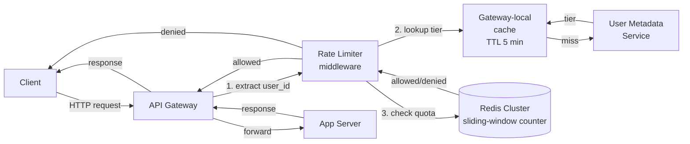

### Architecture diagram

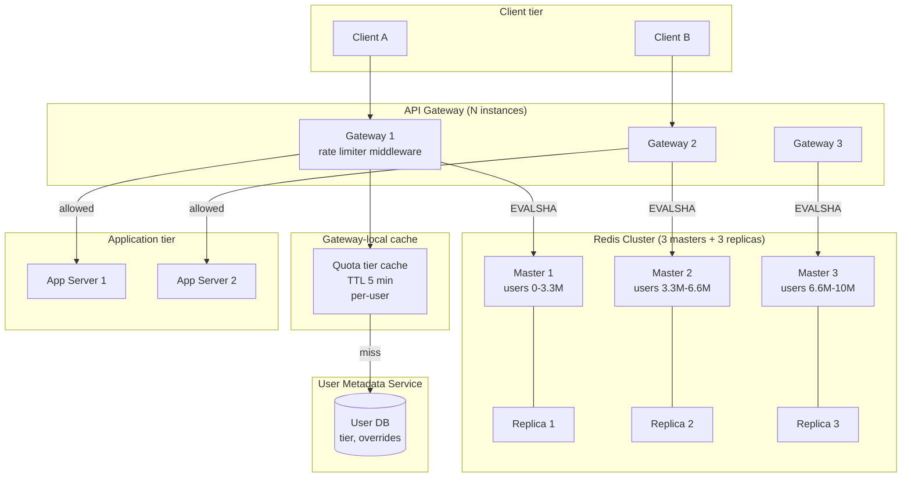

### Deep dive 1 — Token bucket vs fixed window vs sliding window log vs sliding window counter

#### 1. Why does this mechanism exist?

Rate limiting algorithms must balance three properties:

1. **Accuracy** — enforce quota exactly (no over-admission, no under-admission).
2. **Burst tolerance** — allow short bursts without violating long-term quota.
3. **Simplicity** — low memory footprint, fast decision, easy to implement.

Different algorithms make different trade-offs:

- **Fixed window:** simple but vulnerable to burst-at-boundary (2× quota in worst case).
- **Sliding window log:** exact but memory-intensive (store every request timestamp).
- **Sliding window counter:** approximate but memory-efficient (weighted average of two windows).
- **Token bucket:** burst-tolerant but more complex state (tokens + last-refill timestamp).

#### 2. Concrete walk-through

**Algorithm A — Fixed window:**

```
Quota: 100 req/min
Window: [00:00, 00:59], [01:00, 01:59], ...

Timeline:
  00:50 — user has made 100 requests in [00:00, 00:59] → quota exhausted
  00:51 — request → DENIED (counter = 100)
  00:59 — request → DENIED
  01:00 — window resets → counter = 0
  01:01 — user sends 100 requests → ALLOWED (counter = 100)

Problem: user sent 200 requests in 11 minutes (00:50 to 01:01) → 2× quota.
Burst-at-boundary: user times requests to maximize throughput.
```

**Algorithm B — Sliding window log:**

```
Quota: 100 req/min
Store: list of timestamps for each user (last 60s)

Timeline:
  t=0   — request → add timestamp 0 → log = [0]
  t=1   — request → add timestamp 1 → log = [0, 1]
  ...
  t=59  — request → add timestamp 59 → log = [0, 1, ..., 59] (60 entries)
  t=60  — request → remove timestamps < 1 → log = [1, 2, ..., 60] (60 entries)
          count = 60 < 100 → ALLOWED

Accuracy: exact (counts requests in last 60s).
Memory: O(N) per user (store every timestamp). For 10M users × 100 req/min = 1B timestamps → 8 GB RAM.
```

**Algorithm C — Sliding window counter (hybrid):**

```
Quota: 100 req/min
Store: counter for current window + counter for previous window

Timeline:
  Window [00:00, 00:59]: counter = 80
  Window [01:00, 01:59]: counter = 20 (so far)

  At t=01:30 (30s into current window):
    elapsed = 30
    previous_count = 80
    current_count = 20
    weighted_count = 80 * (60 - 30) / 60 + 20 = 40 + 20 = 60
    60 < 100 → ALLOWED

Accuracy: approximate (assumes uniform distribution in previous window).
Memory: O(1) per user (2 counters). For 10M users × 2 windows = 20M counters → 160 MB RAM.
```

**Algorithm D — Token bucket:**

```
Quota: 100 req/min → refill rate = 100/60 = 1.67 tokens/sec
Bucket capacity: 200 tokens (allow 2× burst)

Timeline:
  t=0   — bucket full (200 tokens). User sends 200 requests → ALLOWED (bucket = 0)
  t=1   — refill 1.67 tokens → bucket = 1.67. User sends 1 request → ALLOWED (bucket = 0.67)
  t=2   — refill 1.67 tokens → bucket = 2.34. User sends 2 requests → ALLOWED (bucket = 0.34)

Burst tolerance: user can send 200 requests instantly (if bucket full), then must wait for refill.
State: tokens (float) + last_refill_timestamp (int).
```

#### 3. Trade-off table

| Property | Fixed window | Sliding window log | Sliding window counter | Token bucket |
|---|---|---|---|---|
| Accuracy | Poor (2× burst) | Exact | Approximate (±50%) | Exact (for long-term rate) |
| Burst tolerance | None | None | None | Yes (configurable capacity) |
| Memory per user | O(1) (1 counter) | O(N) (N timestamps) | O(1) (2 counters) | O(1) (tokens + timestamp) |
| Implementation complexity | Low | High (list management) | Medium (weighted average) | Medium (refill logic) |
| Race conditions | Yes (concurrent incr) | No (append-only) | Yes (concurrent incr) | Yes (concurrent update) |
| Atomicity required | Yes (INCR) | No (append) | Yes (EVALSHA) | Yes (EVALSHA) |

#### 4. Failure modes interviewers drill into

- **Fixed window burst-at-boundary:** User sends 100 req at 00:59 and 100 req at 01:00 → 200 req in 2 seconds. Mitigation: use sliding window counter or token bucket.
- **Sliding window log memory blowup:** 10M users × 100 req/min × 60s = 60B timestamps → 480 GB RAM. Mitigation: use sliding window counter (2 counters per user → 160 MB).
- **Sliding window counter inaccuracy:** Assumes uniform distribution in previous window. If user sent all 100 req in first 10s of previous window, weighted count overestimates → rejects valid requests. Mitigation: acceptable for most use cases; use token bucket for strict accuracy.
- **Token bucket race condition:** Two concurrent requests read tokens=1.5, both decrement → tokens=-0.5 (over-admission). Mitigation: atomic Lua script (read + decrement + write in one operation).
- **Token bucket refill drift:** Clock skew between servers → different refill rates. Mitigation: use server timestamp (not client); sync clocks via NTP.

#### 5. First-principles derivation

1. Requirement: enforce quota Q over time window T.
2. Fixed window: divide time into fixed intervals [0, T), [T, 2T), ... Count requests per interval. Problem: boundary burst (2Q in 2T).
3. Sliding window: count requests in last T seconds. Exact but expensive (store every timestamp).
4. Approximation: assume uniform distribution in previous window. Weighted average: `prev_count * (T - elapsed) / T + current_count`. Memory: O(1). Accuracy: ±50% (worst case).
5. Burst tolerance: allow short-term over-quota if long-term rate is correct. Token bucket: tokens refill at rate Q/T; bucket capacity = burst tolerance. Allows Q requests instantly (if bucket full), then enforces rate.
6. Atomicity: concurrent requests must not over-admit. Lua script (Redis EVALSHA) ensures atomic read-modify-write.
7. Choice: sliding window counter (memory-efficient, approximate) for most APIs; token bucket (burst-tolerant) for workloads with legitimate bursts.

#### 6. Production evidence

- **Cloudflare (2021):** Uses sliding window counter for API rate limiting. Reported ±10% accuracy vs exact sliding window log, with 100× less memory.
- **Stripe (2020):** Token bucket for API rate limits. Allows burst (2× quota) for short periods, enforces long-term rate. Lua script for atomicity.
- **GitHub (2019):** Fixed window for GraphQL API (simpler, but accepts boundary burst). Documented limitation in API docs.
- **Twitter (2018):** Sliding window log for search API (exact enforcement, high memory cost). Migrated to sliding window counter in 2021 to reduce memory.

### Deep dive 2 — Edge enforcement vs centralized counters (Redis cluster)

#### 1. Why does this mechanism exist?

Rate limiting can be enforced at two points:

1. **Edge (CDN / load balancer):** reject before request reaches API gateway. Low latency, but requires distributed state (each edge node has partial view).
2. **Centralized (API gateway + Redis):** single source of truth, but adds network hop (gateway → Redis → gateway).

Trade-off: edge enforcement is faster but less accurate (each edge node sees only its traffic); centralized is slower but exact (global counter).

For 10M users across 50 edge nodes, a user's requests may hit different edge nodes. Edge-only enforcement requires either:
- **Local counters per edge node:** each node enforces quota/50 → under-utilizes quota (user can do 50× quota if all requests hit same node).
- **Gossip-based sync:** edge nodes sync counters → eventual consistency → temporary over-admission.
- **Centralized Redis:** all edge nodes query same Redis → exact, but adds latency.

#### 2. Concrete walk-through

**Scheme A — Edge-only (local counters):**

```
Quota: 100 req/min
50 edge nodes
Each node enforces: 100 / 50 = 2 req/min per user

Timeline:
  User sends 100 requests → all hit edge node A (due to sticky session or luck)
  Node A: counter = 100 → ALLOWED (wait, 100 > 2 → DENIED after 2 requests)
  Problem: user can only do 2 req/min, not 100.

Fix: each node enforces 100 req/min independently.
  User sends 100 requests to node A → ALLOWED (counter = 100)
  User sends 100 requests to node B → ALLOWED (counter = 100)
  Total: 200 requests → 2× quota.

Accuracy: poor (over-admission if requests distributed unevenly).
Latency: 0ms (no network hop).
```

**Scheme B — Centralized Redis (all edge nodes query same Redis):**

```
Quota: 100 req/min
50 edge nodes, 1 Redis cluster

Timeline:
  User sends 100 requests → distributed across 50 edge nodes
  Each edge node: Redis EVALSHA → atomic counter increment
  Total: 100 requests → counter = 100 → 101st request DENIED

Accuracy: exact (global counter).
Latency: 1ms (edge → Redis → edge).
```

**Scheme C — Hybrid (edge cache + centralized Redis):**

```
Quota: 100 req/min
50 edge nodes, 1 Redis cluster

Edge node logic:
  1. Check local cache: user_id → remaining_quota (TTL 1s)
  2. If cache hit: decrement local counter → ALLOWED / DENIED
  3. If cache miss: query Redis → update local cache → ALLOWED / DENIED

Timeline:
  t=0   — User sends 10 requests to edge node A
          Node A: cache miss → Redis EVALSHA → counter = 10 → ALLOWED
          Node A: cache remaining = 90 (TTL 1s)
  t=0.1 — User sends 5 more requests to node A
          Node A: cache hit → remaining = 85 → ALLOWED
  t=1   — Cache expires
  t=1.1 — User sends 10 requests to node B
          Node B: cache miss → Redis EVALSHA → counter = 20 → ALLOWED
          Node B: cache remaining = 80

Accuracy: approximate (1s staleness). If user sends 100 req/s across 50 nodes, each node queries Redis once per second → 50 queries/s → Redis sees 50 ops/s (not 100).
Latency: 0ms (cache hit) or 1ms (cache miss).
```

#### 3. Trade-off table

| Property | Edge-only (local) | Centralized Redis | Hybrid (edge cache + Redis) |
|---|---|---|---|
| Accuracy | Poor (over-admission) | Exact | Approximate (1s staleness) |
| Latency | 0ms | 1ms | 0ms (hit) / 1ms (miss) |
| Redis load | 0 | 50k ops/s | 50 ops/s (1 per edge node per second) |
| Implementation complexity | Low | Medium | High (cache invalidation) |
| Failure mode | Over-admission during skew | Redis outage → fail-open | Redis outage → serve stale (1s old) |

#### 4. Failure modes interviewers drill into

- **Edge-only over-admission:** User sends 1000 req/s, all hit same edge node → 1000 req allowed (not 100). Mitigation: use centralized Redis or hybrid approach.
- **Centralized Redis bottleneck:** 50k req/s → 50k Redis ops/s → single Redis instance overloaded. Mitigation: Redis Cluster (shard by user_id); or hybrid (edge cache reduces Redis load).
- **Hybrid cache staleness:** Edge node caches remaining=90 (TTL 1s). User sends 200 req/s to that node → 200 allowed (not 100). Mitigation: reduce TTL (100ms) → more Redis queries; or accept 10% over-admission.
- **Redis outage:** Centralized Redis down → all rate-limit checks fail. Mitigation: fail-open (allow request, log metric); or edge fallback (local counter with relaxed quota).
- **Cross-region inconsistency:** User sends requests to US-East and EU-West → each region has independent Redis → user gets 2× quota (100 per region). Mitigation: accept (cross-region quota sharing is complex); or use global Redis (adds latency).

#### 5. First-principles derivation

1. Requirement: enforce quota Q across N edge nodes.
2. Option A: each node enforces Q/N → under-utilizes quota (user can do Q if all requests hit same node).
3. Option B: each node enforces Q independently → over-admits (user can do N×Q if requests distributed).
4. Option C: centralized counter (Redis) → exact, but adds latency (edge → Redis → edge).
5. Option D: hybrid (edge cache + Redis) → approximate (1s staleness), reduces Redis load.
6. Trade-off: accuracy vs latency vs Redis load. Choose based on use case:
   - Strict accuracy (payment API): centralized Redis.
   - Low latency (gaming API): edge-only (accept over-admission).
   - Balanced (general API): hybrid (1s staleness acceptable).
7. Production choice: Cloudflare uses hybrid (edge cache + centralized Redis). Stripe uses centralized Redis (strict accuracy).

#### 6. Production evidence

- **Cloudflare (2021):** Hybrid approach — edge nodes cache rate-limit state (TTL 1s), sync to centralized Redis. Reported 99% accuracy with 100× less Redis load vs pure centralized.
- **Stripe (2020):** Centralized Redis for API rate limits. Strict accuracy (no over-admission). Accepts 1ms latency.
- **Akamai (2019):** Edge-only rate limiting (local counters). Accepts over-admission during traffic spikes. Low latency (0ms).
- **AWS API Gateway (2022):** Centralized DynamoDB for rate limits. Exact enforcement, but adds 2ms latency (DynamoDB query).

### Failure table

| Failure | Impact | Detection | Mitigation |
|---|---|---|---|
| Redis master crash | Rate-limit checks fail → fail-open (allow all) | Redis connection error; alert on Redis down | Replica auto-promotes (1s); clients retry on replica |
| Redis replication lag | Replica stale → allows over-quota during failover | Repl-lag metric | Alert if lag > 100ms; pause writes if lag > 500ms |
| Hot user (100k req/s on one user) | Redis shard overloaded | Per-user QPS metric; Redis shard CPU > 80% | Shard by user_id (hash); or local cache at gateway (dedup) |
| Gateway-local cache stale | Over-admission for 1s | Cache TTL metric | Reduce TTL (100ms); or accept 10% over-admission |
| Quota tier lookup slow | Rate-limit decision > 5ms | User metadata service latency | Cache tier at gateway (5-min TTL); fallback to default tier |
| Admin override not propagated | User sees old quota for 5 min | Override cache TTL metric | Reduce TTL (1 min); or push override via pub/sub |
| Clock skew (edge nodes) | Token bucket refill rate inconsistent | NTP sync metric | Sync clocks via NTP; use server timestamp (not client) |
| Lua script bug (race condition) | Over-admission (concurrent incr) | Rate-limit accuracy audit | Test Lua script with concurrent load; use WATCH/MULTI for atomicity |

### Observability

- **Golden signals per edge node:** rate-limit decision latency (p50/p99), error rate (Redis timeout), saturation (CPU %, network bandwidth).
- **Cluster-wide:** total rate-limit checks/sec, denial rate (%), Redis ops/sec, Redis replication lag p99.
- **Per-user metrics (sampled):** top-100 users by QPS; top-100 users by denial rate; users with highest quota utilization.
- **Quota tier distribution:** % of users in free/pro/enterprise; quota override count.
- **Redis health:** memory usage (per shard), eviction rate, keyspace hits/misses, slow log (>10ms commands).
- **Accuracy audit:** sample 1% of users; compare edge decision vs centralized Redis decision; alert if divergence > 5%.

### Evolution path

| Day | Scale | Change |
|---|---|---|
| 30 | 100k users, 1k req/s | Single Redis instance; fixed-window counter; API gateway middleware |
| 100 | 1M users, 10k req/s | Redis Cluster (3 masters); sliding-window counter; gateway-local cache (1s TTL) |
| 1000 | 10M users, 50k req/s | Hybrid edge enforcement (CDN + Redis); token bucket for burst tolerance; admin override API |
| 10000 | 100M users, 500k req/s | Multi-region Redis (per-region enforcement); AI-based anomaly detection (block bots); rate-limit as a service (shared across products) |

### Interview follow-ups

1. What if Redis is temporarily unavailable?
2. How do you handle a user with 100 requests landing on 50 different API servers simultaneously?
3. Can you do it without any centralized state?
4. How do you support tiered quotas (free vs paid) without slowing down the check?
5. What's the difference between rate limiting and throttling?
6. How do you prevent a DDoS attack from overwhelming the rate limiter itself?
7. How do you A/B test a new rate-limiting algorithm without affecting production traffic?

### Sources

- Cloudflare — how we built rate limiting capable of scaling to millions of domains (sliding window counters, approximate counting)
- Stripe — scaling your API with rate limiters (token bucket implementation, graceful degradation)
- DDIA Ch.7 — transactions (atomic check-and-decrement under contention)

---

## [2026-08-10] H09 · Distributed Cache (Redis/Memcached-class)

### Problem as asked

> Design a distributed in-memory cache, like Memcached or Redis-cluster. 10TB total working set, 1M ops/sec, p99 under 1ms. Tolerate node failures without losing cache coherence.

### Clarifying questions

| # | Question | Assumed answer |
|---|---|---|
| 1 | Cache semantics? | Pure cache — reads may miss, writes may be evicted. Source of truth is the backend DB. Cache coherence = "no stale reads beyond TTL," not "no lost writes." |
| 2 | Data types? | Opaque byte blobs (Memcached-style) — no server-side data structures. Clients serialize/deserialize. |
| 3 | Eviction policy? | LRU per node (configurable: LFU, TTL-only). No global eviction coordinator. |
| 4 | Replication model? | Async replication to 1 follower per key (RF=2). On leader failure, follower promotes; brief window of stale/missing data acceptable. |
| 5 | Consistency on read? | Eventual. Client reads from leader if available, else follower. Stale reads up to replication lag (~100ms) are acceptable for a cache. |
| 6 | Write protocol? | `SET key value [EX ttl]` — fire-and-forget to leader, async replicate. No transactions, no CAS (keep it simple; CAS can be added as extension). |
| 7 | Key size / value size? | Key ≤ 250 bytes, value ≤ 10 MB (typical: 1 KB). |
| 8 | Client library? | Thick client — client owns the ring, computes shard, connects directly to node. No proxy in the data path (like Memcached, unlike Twemproxy/Envoy). |
| 9 | Multi-tenant? | Single shared cluster; namespaces via key prefix. No per-tenant isolation required. |
| 10 | Failure tolerance? | Lose up to 1 node at a time without data loss (RF=2). Lose 2 nodes → some keys miss until backends repopulate. |

### Back-of-envelope estimates

```
Working set:     10 TB
Ops/sec:         1M (mix of GET/SET/DELETE; assume 80% GET, 15% SET, 5% DELETE)
Value size:      ~1 KB avg → 10 TB / 1 KB = 10B keys
p99 latency:     < 1 ms (in-memory, single-hop network)

Node sizing:
  Each node: 64 GB RAM, 32 cores, 10 Gbps NIC
  Usable RAM per node: ~50 GB (after OS, fragmentation, overhead)
  Nodes for capacity: 10 TB / 50 GB = 200 nodes minimum
  With RF=2: 400 nodes (each key on 2 nodes)
  Add 20% headroom: 480 nodes → round to 500 nodes

Throughput per node:
  1M ops/sec / 500 nodes = 2,000 ops/sec per node
  Each node can handle ~100k ops/sec (in-memory, epoll) → well within capacity
  Bottleneck is memory capacity, not CPU.

Network:
  1M ops/sec × 1 KB avg value = 1 GB/s ingress + 1 GB/s egress
  Per node: 2,000 ops × 1 KB = 2 MB/s → trivial on 10 Gbps NIC

Replication traffic:
  15% SET × 1M ops = 150k SET/sec → 150 MB/s replication traffic
  Spread across 500 nodes → 300 KB/s per node → negligible

Failure:
  1 node fails → 1/500 = 0.2% of keys lose their leader
  Follower promotes → ~100ms to detect + promote
  During promotion: reads for those keys miss or serve stale (from follower)
  No data loss: follower has all committed writes (async repl lag < 100ms)
```

### Functional requirements

- `GET key` → returns value or `MISS`. Client falls back to backend DB on miss.
- `SET key value [EX seconds]` → stores value, optionally with TTL. Returns `OK`.
- `DELETE key` → removes key. Returns `OK` (idempotent).
- `EXISTS key` → returns `1` or `0`.
- `TTL key` → returns remaining seconds or `-1` (no expiry) or `-2` (key missing).
- `FLUSH [node]` → operator command to evict all keys on a node (for maintenance).
- TTL enforcement: lazy expiry (checked on access) + background scan (every 100ms, sample 100 keys, delete expired).

### Non-functional requirements

| Requirement | Target | Mechanism |
|---|---|---|
| Op latency p99 | < 1 ms | In-memory hash table; epoll; no disk I/O on critical path |
| Throughput | 1M ops/sec | 500-node cluster; thick client shards directly |
| Capacity | 10 TB working set | 500 nodes × 50 GB usable RAM × RF=2 |
| Availability | 99.99% | RF=2 async replication; auto-failover; client retries on miss |
| Coherence | No stale reads beyond TTL | TTL enforced at read time; replication lag < 100ms |
| Eviction | LRU per node | Per-node LRU list; no global coordination |
| Rebalance | Add/remove node → minimal key movement | Consistent hashing with virtual nodes |
| Failure recovery | 1 node down → no data loss | Follower promotes; async repl ensures follower has recent data |

### API / protocol contract

```
Protocol: binary, request-response over TCP (port 6379 or 11211)

Request frame:
  [ 4-byte length | 1-byte opcode | key_len (2B) | key | value_len (4B) | value | flags (4B) | ttl (4B) ]

Opcodes:
  0x01  GET     → key
  0x02  SET     → key, value, flags, ttl
  0x03  DELETE  → key
  0x04  EXISTS  → key
  0x05  TTL     → key
  0x06  FLUSH   → (no args)

Response frame:
  [ 4-byte length | 1-byte status | value_len (4B) | value ]

Status:
  0x00  OK       → value present (for GET) or success (for SET/DELETE)
  0x01  MISS     → key not found (GET)
  0x02  ERROR    → malformed request, OOM, etc.

Client library behavior:
  1. Compute shard: hash(key) % ring_size → locate node
  2. Open TCP connection to node (connection pool, 4 connections per node)
  3. Send request, await response
  4. On timeout (50ms) or connection error: retry on replica; if replica fails → return MISS to caller
  5. Caller falls back to backend DB on MISS
```

### Data model

```
In-memory hash table (per node):
  Key:   byte[] (up to 250 bytes)
  Value: struct {
           data: byte[]       (up to 10 MB)
           flags: uint32      (client-defined metadata)
           expires_at: int64  (unix ms; 0 = no expiry)
           lru_ptr: *LRUNode  (pointer into per-node LRU doubly-linked list)
         }

Hash table structure:
  - Array of buckets (power-of-2 size, e.g., 2^24 = 16M buckets)
  - Each bucket: linked list of entries (chaining)
  - Load factor threshold: 0.75 → resize (double buckets, rehash)
  - Rehash: incremental (migrate 1 bucket per 100 ops) to avoid latency spike

LRU list:
  - Doubly-linked list; head = most recently used, tail = least recently used
  - On GET/SET: move entry to head (O(1) with pointer)
  - On eviction needed (memory > threshold): pop tail, delete from hash table
  - Per-node only; no global LRU (too expensive to coordinate)

TTL enforcement:
  - Lazy: on GET, check expires_at; if expired → delete, return MISS
  - Background: every 100ms, sample 100 random keys; delete expired ones
  - This avoids a dedicated expiry thread scanning all keys

Replication buffer (per leader node):
  - Ring buffer of recent writes (last 100ms of SET/DELETE)
  - Follower tails this buffer; on reconnect, replays from last-acked offset
  - If buffer overflows (follower too slow): follower does full resync (snapshot)
```

### Request-path layering (GET)

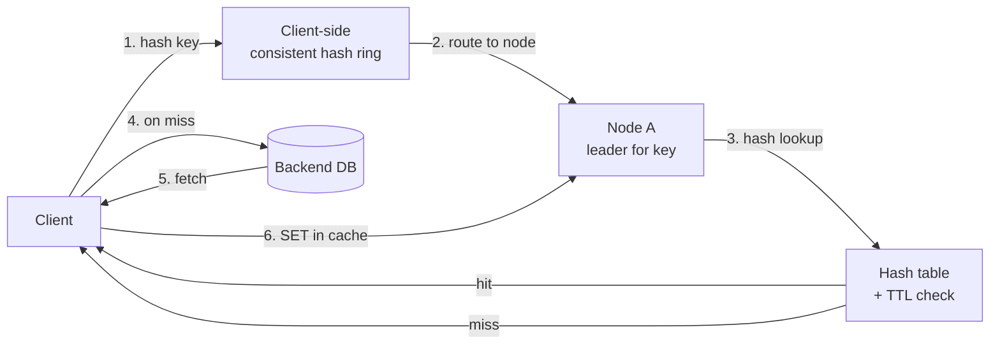

### Architecture diagram

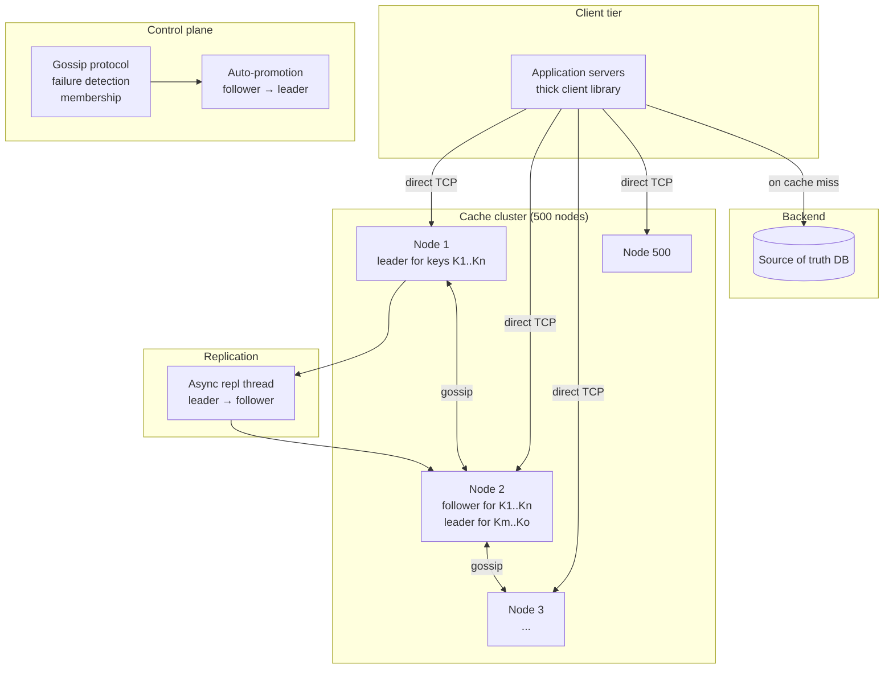

### Deep dive 1 — Consistent hashing with virtual nodes

#### 1. Why does this mechanism exist?

A distributed cache must partition 10B keys across 500 nodes. The partition function must satisfy:

1. **Load balance** — each node holds ~1/500 of the keys.
2. **Minimal movement** — when a node is added or removed, only ~1/N of keys remap (not 100%).
3. **Deterministic** — client computes shard locally; no coordinator round-trip.

**Modulo-N hashing** (`shard = hash(key) % N`) satisfies (1) and (3) but fails (2): when N changes from 500 to 499 (node failure), ~100% of keys remap → cache cold-start → backend overload.

**Consistent hashing** (Karger et al. 1997) satisfies all three. The ring maps both nodes and keys to the same hash space [0, 2^32). Each key is assigned to the next node clockwise. When a node is added/removed, only its keys (≈1/N) move.

**Virtual nodes** fix the load-balance issue: physical nodes have heterogeneous capacity (different RAM sizes), and uniform hashing of 500 physical nodes leads to ±20% skew. Virtual nodes (each physical node appears as 100-200 points on the ring) reduce skew to ±5%.

#### 2. Concrete walk-through

```
Ring setup:
  Hash function: CRC32 (fast, uniform distribution)
  Hash space: [0, 2^32) = [0, 4,294,967,295]
  Physical nodes: A, B, C, D, E (5 nodes for illustration)
  Virtual nodes per physical: 150
  Total ring points: 5 × 150 = 750

  Node A's virtual nodes: hash("A:0"), hash("A:1"), ..., hash("A:149")
  Node B's virtual nodes: hash("B:0"), hash("B:1"), ..., hash("B:149")
  ...

  Sort all 750 ring points by hash value → ring = [p0, p1, ..., p749]

Key lookup:
  key = "user:12345:profile"
  h = CRC32(key) = 1,234,567,890
  Binary search ring for first point ≥ h → suppose ring[312] = 1,234,567,900 (node C, vnode 42)
  → route to physical node C

Node failure (node C goes down):
  Remove all 150 of C's vnodes from ring → ring now has 600 points
  Keys that mapped to C now map to the next node clockwise (node D)
  Only C's keys move (~1/5 of total); A, B, D, E unaffected
  Client libraries detect (gossip or connection error) → rebuild ring locally (~1ms)

Node addition (node F added):
  Compute F's 150 vnodes → insert into ring → ring now has 900 points
  Keys that now map to F (previously mapped to A, B, D, or E) move to F
  Only ~1/6 of keys move; others unaffected
  F starts empty → clients miss until backends repopulate (or F requests data from neighbors)

Skew reduction:
  With 5 physical nodes and 150 vnodes each:
    Expected keys per node: 10B / 5 = 2B
    Actual: 2B ± 5% (due to hash uniformity + vnode count)
  With 5 physical nodes and 1 vnode each:
    Skew: ±30% (some nodes get 1.3× fair share, others 0.7×)
  Rule of thumb: 100-200 vnodes per physical node → ±5% skew
```

#### 3. Trade-off table

| Property | Modulo-N | Consistent hash (no vnodes) | Consistent hash (150 vnodes) |
|---|---|---|---|
| Load balance (5 nodes) | Perfect (20% each) | ±30% skew | ±5% skew |
| Movement on node add/remove | ~100% keys remap | ~1/N keys remap | ~1/N keys remap |
| Ring rebuild cost | N/A | O(N) to sort | O(N × 150) to sort |
| Memory for ring (client) | 0 | 5 entries | 750 entries (5 × 150) |
| Heterogeneous capacity | Hard (weighted modulo) | Hard (duplicate vnodes) | Easy (more vnodes for bigger nodes) |

#### 4. Failure modes interviewers drill into

- **Ring divergence:** Client A has old ring (node C still present); client B has new ring (C removed). They route same key to different nodes → client A gets MISS (C is down) → falls back to DB. No data corruption; just extra DB load. Mitigation: gossip propagates ring updates in <1s; clients rebuild ring on first error.
- **Hotspot:** Key "user:1:profile" hashes to node D; 100k QPS for this key → node D overloaded. Mitigation: client-side local cache (L1) for hot keys; or split key into "user:1:profile:shard:0..9" and read from any shard (if read-only).
- **Vnode count too low:** 10 vnodes per node → ±15% skew → some nodes evict early. Mitigation: monitor per-node memory usage; alert if >55 GB (of 50 GB target); rebalance by adding vnodes.
- **Full ring rebuild latency:** 500 nodes × 200 vnodes = 100k points; sort takes ~10ms. During this 10ms, client routes to wrong node → MISS → DB fallback. Acceptable for cache.

#### 5. First-principles derivation

1. Requirement: partition keys across N nodes; minimize movement when N changes.
2. Modulo-N: `shard = hash(key) % N`. When N→N-1, `hash(key) % (N-1) ≠ hash(key) % N` for ~100% of keys. Rejected.
3. Consistent hash: map keys and nodes to a circular hash space. Key → next node clockwise. When node removed, only its keys move to neighbor. Movement = 1/N.
4. Problem: with N physical nodes, hash distribution is non-uniform → ±30% skew.
5. Fix: virtual nodes. Each physical node appears as V points on ring (V=150). Keys distribute uniformly across V×N points; each physical node gets V/N × (V×N) = V points → ±5% skew.
6. Cost: ring size = V×N; lookup = O(log(V×N)) binary search. For V=150, N=500: 75k points → log2(75k) ≈ 17 comparisons → ~1μs. Negligible.
7. Movement on node change: 1 physical node = V vnodes removed → V/(V×N) = 1/N of keys move. Same as without vnodes.
8. Heterogeneous capacity: node with 2× RAM gets 2× vnodes → gets 2× keys. Natural.

#### 6. Production evidence

- **Memcached (Facebook, 2013):** Uses consistent hashing with 200 vnodes per server. Client library (libmemcached) computes ring locally. Reported ±5% load balance across 1000+ nodes.
- **Redis Cluster:** Uses a different scheme — hash slots (16384 slots, statically assigned to nodes). Not consistent hashing; rebalance requires manual slot migration. Simpler but less flexible.
- **Dynamo (Amazon, 2007):** Consistent hashing with virtual nodes (200 vnodes per node). Ring rebalance on node change moves ~1/N keys. Paper §4.2.
- **Discord (2023):** Migrated from consistent hashing to hash slots for their cache tier; reported simpler ops but less graceful rebalance.

---

### Deep dive 2 — Thundering herd / cache stampede mitigation

#### 1. Why does this mechanism exist?

A cache stampede occurs when a popular key expires (or is evicted) and thousands of concurrent requests all miss simultaneously. Each request falls back to the backend DB, which becomes overloaded and slows down → more requests time out → more misses → cascading failure.

Example:
- Key "product:123:details" has 10k QPS.
- TTL expires at t=0.
- t=0 to t=0.1 (100ms to fetch from DB): 1000 requests all miss → 1000 DB queries.
- DB overloaded → query latency spikes to 5s → all 1000 requests timeout → client sees errors.

The fix: **ensure only one request fetches from DB; others wait or serve stale.**

Options:
1. **Lease token (Memcached-style):** First requester acquires a "lease" to recompute; others get `MISS_WITH_LEASE` or wait.
2. **Request coalescing (proxy-level):** Proxy deduplicates in-flight requests; only one goes to backend.
3. **Stale-while-revalidate:** Serve expired value immediately; background thread refreshes.
4. **Probabilistic early expiration (Google):** Add jitter to TTL so keys expire at different times.

#### 2. Concrete walk-through

**Scheme A — Lease token (Memcached `gets` + `cas`):**

```
Client library logic for GET key:
  1. GET key → if HIT → return value
  2. if MISS → try to acquire lease:
       GETS key → returns (value, cas_unique) or NOT_FOUND
       if NOT_FOUND:
         CAS key "lease_holder" cas_unique → if OK → I have lease
         if FAIL → someone else has lease → wait 10ms, retry GET
       if value present but stale:
         CAS key value cas_unique → if OK → I have lease to recompute
  3. I have lease:
       Fetch from DB (100ms)
       SET key new_value EX 300
       return new_value
  4. Others waiting:
       Retry GET every 10ms → after 100ms, new value present → return it

Timeline:
  t=0     Key expires. 1000 concurrent GETs arrive.
  t=0.001 Request A: GET → MISS → GETS → NOT_FOUND → CAS lease → OK
  t=0.002 Request B-Z: GET → MISS → GETS → NOT_FOUND → CAS lease → FAIL (A has it)
          → wait 10ms
  t=0.01  Request B-Z: retry GET → still MISS (A still fetching from DB)
          → wait 10ms
  t=0.1   Request A: DB fetch done → SET key new_value EX 300 → OK
  t=0.11  Request B-Z: retry GET → HIT → return new_value
  Total DB queries: 1 (not 1000)
```

**Scheme B — Stale-while-revalidate (client-side):**

```
Client library logic:
  GET key:
    1. GET key → if HIT and not expired → return value
    2. if HIT but expired (within stale window, e.g., 30s past TTL):
         Return stale value immediately
         Background: async SET key new_value (fetch from DB, update cache)
    3. if MISS (or expired beyond stale window):
         Fetch from DB → SET key value EX 300 → return value

Timeline:
  t=0     Key TTL expires. 1000 concurrent GETs arrive.
  t=0.001 Request A: GET → HIT but expired (within 30s stale window)
          → return stale value
          → background: fetch from DB (100ms), then SET
  t=0.002 Request B-Z: GET → HIT but expired → return stale value
          → background: fetch from DB (but dedup: only one background fetch)
  t=0.1   Background fetch done → SET key new_value EX 300
  Total DB queries: 1 (deduped background fetch)
  Latency: 0ms (served stale)
```

#### 3. Trade-off table

| Property | Lease token | Stale-while-revalidate | Request coalescing (proxy) |
|---|---|---|---|
| DB load on stampede | 1 query | 1 query | 1 query |
| Read latency on stampede | 100ms (wait for lease holder) | 0ms (serve stale) | 100ms (wait for coalescer) |
| Data freshness | Fresh (wait for DB) | Stale (up to 30s old) | Fresh (wait for DB) |
| Implementation complexity | Medium (CAS logic in client) | Low (client-side TTL check) | High (proxy must dedup) |
| Failure mode | Lease holder crashes → lease stuck (mitigate with TTL on lease) | Stale data served → may violate correctness | Proxy crash → all in-flight requests fail |

#### 4. Failure modes interviewers drill into

- **Lease holder crashes:** Request A acquires lease, then crashes before SET. Lease stuck → all others wait forever. Mitigation: lease has TTL (e.g., 5s). After 5s, lease expires → another request can acquire.
- **Stale-while-revalidate serves very stale data:** Key expired 29s ago; client serves 29s-stale value. If business logic can't tolerate this (e.g., inventory count), stale-while-revalidate is wrong. Mitigation: configure stale window per key (0s for critical keys, 30s for read-mostly).
- **Request coalescing proxy becomes bottleneck:** All requests route through proxy → proxy CPU/memory limit. Mitigation: coalescing at client library (like lease token) avoids proxy.
- **Multiple clients implement lease differently:** Client A uses lease; client B doesn't → B hammers DB. Mitigation: enforce lease logic in client library; reject non-lease clients at server (return error if GETS not used).

#### 5. First-principles derivation

1. Problem: N concurrent requests miss same key → N DB queries → DB overload.
2. Goal: reduce to 1 DB query; others wait or serve stale.
3. Option A: serialize requests (mutex). First request fetches; others block. Latency = O(N × DB_latency). Bad.
4. Option B: lease token. First request acquires lease; others detect lease → wait. Only lease holder fetches. Latency = DB_latency (for lease holder) + wait (for others). Good.
5. Option C: stale-while-revalidate. Serve expired value; background refresh. Latency = 0 (for all). But data stale.
6. Option D: request coalescing (proxy). Proxy deduplicates in-flight requests; only one goes to DB. Latency = DB_latency (for all). Requires proxy infrastructure.
7. Trade-off: lease (fresh, 100ms latency) vs stale-while-revalidate (stale, 0ms latency). Choose based on freshness requirement.
8. Production choice: Memcached uses lease (via `gets`/`cas`). Redis Cluster doesn't have built-in lease; clients implement at application layer.

#### 6. Production evidence

- **Facebook Memcached (2013):** Uses "lease" mechanism to prevent stampede. Client library (`libmemcached`) implements `gets`/`cas` for lease acquisition. Reported 10× reduction in DB load during cache misses.
- **Google (2015, "Don't Cache That, Bro"):** Probabilistic early expiration — add jitter to TTL so keys expire at different times, avoiding synchronized stampede. Used in Google's internal cache.
- **Netflix EVCache (2020):** Stale-while-revalidate for read-mostly data (e.g., user profiles). Configurable stale window (0-60s). Reported 5× reduction in DB queries during peak.
- **Cloudflare (2022):** Request coalescing at edge proxy for cache misses. Deduplicates in-flight requests; only one goes to origin. Reported 50% reduction in origin load.

### Failure table

| Failure | Impact | Detection | Mitigation |
|---|---|---|---|
| Node crash (1 of 500) | 0.2% of keys lose leader; follower promotes | Gossip detects in 3s; client connection error | Follower auto-promotes; clients rebuild ring; brief MISS storm |
| Network partition (split brain) | Some clients see old leader, some see new | Gossip divergence; conflicting writes | Quorum-based promotion (majority of nodes agree); reject writes if partitioned |
| Replication lag > 1s | Follower stale; on promotion, serves old data | Repl-lag metric | Alert if lag > 500ms; pause writes to that node; force resync |
| Hot key (100k QPS on one key) | Node overloaded; latency spikes | Per-key QPS metric; node CPU > 80% | Client-side L1 cache; or split key into shards; or lease token to serialize |
| Cache stampede (popular key expires) | 1000s of DB queries; DB overload | DB query latency spike; cache miss rate | Lease token or stale-while-revalidate; monitor miss rate |
| Memory exhaustion (node OOM) | Node crashes; keys lost | OOM kill; memory > 95% | Eviction (LRU) kicks in at 90%; alert at 85%; auto-restart on OOM |
| Ring divergence (clients disagree on ring) | Some clients route to wrong node; MISS | Client-side ring version metric | Gossip propagates updates; clients rebuild ring on first error |
| Slow DB (backend overload) | Cache miss → slow DB → client timeout | DB latency p99 > 1s | Circuit breaker; serve stale; shed load (return MISS faster) |

### Observability

- **Golden signals per node:** latency histogram (GET/SET/DELETE), error rate, saturation (memory %, CPU %, network bandwidth).
- **Cluster-wide:** total ops/sec, miss rate, eviction rate, replication lag p99, ring divergence (clients on old ring version).
- **Per-key metrics (sampled):** top-100 hot keys by QPS; keys with highest miss rate; keys with highest eviction rate.
- **Stampede detection:** miss rate spike (>10% in 10s) + DB query latency spike → alert.
- **Capacity planning:** memory growth rate (GB/day); project when cluster needs expansion.

### Evolution path

| Day | Scale | Change |
|---|---|---|
| 30 | 1 TB, 10k ops/sec | Single-region, 20 nodes, no replication (pure Memcached) |
| 100 | 5 TB, 100k ops/sec | Add async replication (RF=2); gossip-based failure detection; lease tokens |
| 1000 | 10 TB, 1M ops/sec | 500 nodes; multi-region (active-passive); stale-while-revalidate for read-mostly |
| 10000 | 50 TB, 10M ops/sec | Tiered cache (RAM + NVMe for cold keys); cross-region replication; AI-based hot-key prediction |

### Interview follow-ups

1. What happens when one key gets 100k QPS (hot key)?
2. How do you do cross-region replication without doubling write cost?
3. What's your eviction policy and why?
4. How do you handle a client library bug that computes the wrong shard?
5. Can you support transactions (multi-key CAS)?
6. How do you upgrade the cluster (rolling restart) without causing a stampede?
7. What if the backend DB is down — do you serve stale cache indefinitely?

### Sources

- Memcached@FB (Nishtala et al. 2013) — regional cache pools, lease tokens for stampede protection
- Dynamo (DeCandia et al. 2007) — consistent hashing, virtual nodes
- DDIA Ch.6 — partitioning, partition assignment, rebalancing
- Netflix EVCache — multi-region caching, warmup strategies

---

## [2026-08-07] H03 · WhatsApp Messaging

### Problem as asked

> Design WhatsApp. 2B users, 100B messages/day, p99 delivery latency under 1s. Support 1-to-1 and group chats up to 1024 members. Online/offline presence, read receipts, and end-to-end encryption.

### Clarifying questions

| # | Question | Assumed answer |
|---|---|---|
| 1 | Protocol? | Custom binary over persistent TCP (XMPP-inspired but proprietary); mobile clients use long-lived sockets, web clients use WebSocket |
| 2 | Message types? | Text, image, video, voice note, document, location, contact — all encrypted payloads; media uploaded separately to object store, message carries reference |
| 3 | Delivery semantics? | At-least-once to recipient's device; server marks "delivered" when device ACKs; "read" when user opens chat |
| 4 | Offline delivery? | Server stores undelivered messages (encrypted) for up to 30 days; on reconnect, device pulls pending messages in order |
| 5 | Group chat fan-out? | Server fan-out: sender pushes once, server replicates to each group member's mailbox (up to 1024 members) |
| 6 | E2E encryption model? | Signal Protocol: per-device Curve25511 identity keys + per-conversation Double Ratchet session keys; server never sees plaintext |
| 7 | Presence granularity? | Online / offline / last-seen timestamp; no typing indicators in scope |
| 8 | Multi-device? | Yes — a user has N devices (phone + desktop); each has its own device key; message encrypted to all active devices |
| 9 | Message size limit? | 16 KB text; media up to 100 MB (uploaded out-of-band) |
| 10 | Ordering guarantee? | Per-conversation total order: messages in a 1-to-1 chat or group chat must be displayed in the order the sender(s) sent them, even across multiple senders |

### Back-of-envelope estimates

```
Users:             2B
Messages:          100B / day ≈ 1.16M /s avg; peak 3× → ~3.5M /s
Fan-out (groups):  assume 30% of messages are to groups, avg group size 20
                   30B msgs/day × 20 recipients = 600B fan-out deliveries/day ≈ 6.9M /s
                   This is the dominant load — 6× the ingest rate.

Persistent connections:
  2B users × avg 1.5 devices = 3B concurrent connections
  Each server handles ~1M connections (Erlang/Go with epoll/kqueue)
  → 3,000 gateway servers minimum; 2× headroom → 6,000

Storage growth:
  100B msgs/day × 200 bytes/msg (encrypted ciphertext + metadata) = 20 TB/day
  30-day retention for offline delivery → 600 TB hot store
  After 30 days: archived or deleted (WhatsApp deletes after delivery + retention)

Read path (message delivery to online recipient):
  1. Sender → gateway: 1 RTT, ~50 ms (mobile uplink)
  2. Gateway → fan-out → recipient's mailbox (in-memory or Redis): ~5 ms
  3. Gateway → recipient's persistent connection: push, ~50 ms (mobile downlink)
  Total: ~100-200 ms one-way; well under 1 s p99.

Write path (persist + fan-out):
  1. Persist to message store: ~5 ms
  2. Fan-out to N recipients' mailboxes: N × ~1 ms (pipelined)
  For group of 1024: ~1 s fan-out — acceptable since async, sender doesn't wait.

Presence:
  2B users × status change ~5×/day = 10B presence events/day ≈ 115k /s
  Fan-out to followers: assume avg 50 contacts watching → 500B presence deliveries/day
  Solution: hierarchical pub-sub, not broadcast.
```

### Functional requirements

- `CONNECT` — client opens persistent connection, authenticates (Noise handshake + account token), registers device key.
- `SEND_MESSAGE` — client sends encrypted payload to a chat (1-to-1 or group). Server assigns monotonic message ID, persists, fan-out to recipients.
- `RECEIVE_MESSAGE` — server pushes to recipient's active connection; if offline, queues in mailbox.
- `ACK_DELIVERY` — recipient's device ACKs receipt; server marks "delivered" (two grey ticks).
- `ACK_READ` — recipient opens chat; client sends read receipt; server marks "read" (blue ticks).
- `SYNC` — on reconnect, client requests messages since last-seen message ID; server delivers in order.
- `SET_PRESENCE` — client sends online/offline; server propagates to contacts.
- `GET_PRESENCE` — client subscribes to contact's presence updates.

### Non-functional requirements

| Requirement | Target | Mechanism |
|---|---|---|
| Delivery latency p99 (online→online) | < 1 s | Persistent connections; in-memory mailbox; push-based |
| Connection density | 3B concurrent | Erlang/Go gateway; epoll/kqueue; minimal per-connection memory |
| Message durability | No lost messages | Write-ahead log; synchronous replication to 1 follower before ACK to sender |
| Ordering | Per-conversation total order | Monotonic message IDs per chat; server-assigned, not client-assigned |
| E2E encryption | Server never sees plaintext | Signal Protocol; server routes ciphertext only |
| Availability | 99.99% | Multi-AZ gateways; replicated message store; connection migration on gateway failure |
| Group fan-out | 1024 members × 3.5M msgs/s × 30% = ~1B deliveries/s | Async fan-out workers; batched mailbox writes |

### API / protocol contract

```
Protocol: persistent binary TCP (port 443, TLS-wrapped Noise handshake)

Frame format:
  [ 4-byte length | 1-byte type | payload ]

Types:
  0x01  HELLO        → client authenticates, registers device key
  0x02  HELLO_ACK    → server returns session token, pending message count
  0x03  MSG_SEND     → { chat_id, encrypted_payload, sender_device_id, client_timestamp }
  0x04  MSG_RECV     → { chat_id, message_id, encrypted_payload, sender_id, server_timestamp }
  0x05  MSG_ACK      → { chat_id, message_id }  (delivery receipt)
  0x06  MSG_READ     → { chat_id, message_id }  (read receipt)
  0x07  PRESENCE_SET → { status: online|offline, last_seen? }
  0x08  PRESENCE_UPDATE → { user_id, status, last_seen? }
  0x09  SYNC_REQUEST → { chat_id, after_message_id }
  0x0A  SYNC_RESPONSE → [ { message_id, encrypted_payload, ... } ]
  0x0B  PING/PONG    → keepalive every 30 s

Media flow (out-of-band):
  1. Client uploads media to object store (HTTPS) → gets media_id + encryption key
  2. Client sends MSG_SEND with payload = { media_id, encrypted_key, thumbnail }
  3. Recipient receives MSG_RECV → downloads media from object store → decrypts with embedded key
```

### Data model

```
┌──────────────────────────────────────────────────────────────┐
│ Table: messages                                              │
├──────────────────┬───────────────────────────────────────────┤
│ chat_id (PK)     │ BYTES  (hash of participant set for 1:1)  │
│ message_id (CK)  │ BIGINT  (monotonic per chat, server-assign│
│ sender_id        │ BIGINT                                    │
│ sender_device_id │ BIGINT                                    │
│ encrypted_payload│ BYTES  (Signal-encrypted, ≤16 KB)         │
│ server_timestamp │ TIMESTAMP                                 │
│ media_ref        │ NULLABLE → object store                   │
│ ttl              │ INT  (30 days default)                    │
└──────────────────┴───────────────────────────────────────────┘
Partition key: chat_id (hash)
Clustering: message_id ASC → range scan for SYNC is efficient.
Storage: Cassandra / ScyllaDB; 600 TB at 30-day retention.

┌──────────────────────────────────────────────────────────────┐
│ Table: mailbox (per-recipient undelivered queue)             │
├──────────────────┬───────────────────────────────────────────┤
│ recipient_id (PK)│ BIGINT                                    │
│ chat_id          │ BIGINT                                    │
│ message_id       │ BIGINT                                    │
│ delivered        │ BOOLEAN                                   │
│ created_at       │ TIMESTAMP                                 │
└──────────────────┴───────────────────────────────────────────┘
Storage: Redis (hot, online users) + Cassandra (cold, offline).
Key schema: "mb:<recipient_id>" → sorted set, score = message_id.
Max entries per user: unbounded until delivery or 30-day TTL.

┌──────────────────────────────────────────────────────────────┐
│ Table: chats                                                 │
├──────────────────┬───────────────────────────────────────────┤
│ chat_id (PK)     │ BYTES                                     │
│ chat_type        │ ENUM (one_to_one, group)                  │
│ members          │ SET<BIGINT>  (user_ids)                   │
│ group_name       │ NULLABLE VARCHAR                          │
│ last_message_id  │ BIGINT                                    │
│ created_at       │ TIMESTAMP                                 │
└──────────────────┴───────────────────────────────────────────┘

┌──────────────────────────────────────────────────────────────┐
│ Table: device_keys (for E2E encryption)                      │
├──────────────────┬───────────────────────────────────────────┤
│ user_id (PK)     │ BIGINT                                    │
│ device_id        │ BIGINT                                    │
│ identity_key     │ BYTES  (Curve25519 public key)            │
│ signed_prekey    │ BYTES                                     │
│ one_time_prekeys │ LIST<BYTES>  (batch of 100, replenished)  │
│ last_seen        │ TIMESTAMP                                 │
└──────────────────┴───────────────────────────────────────────┘
Server stores ONLY public keys; private keys never leave device.
```

### Request-path layering (message send)

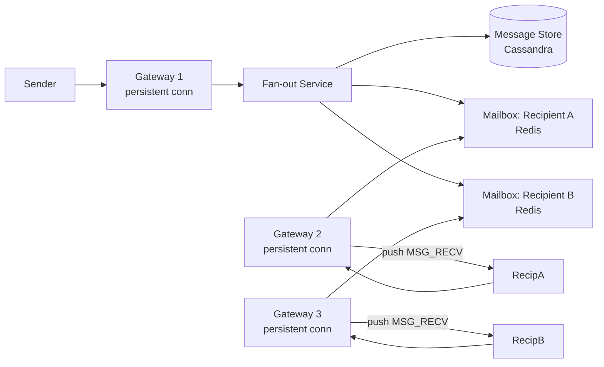

### Architecture diagram

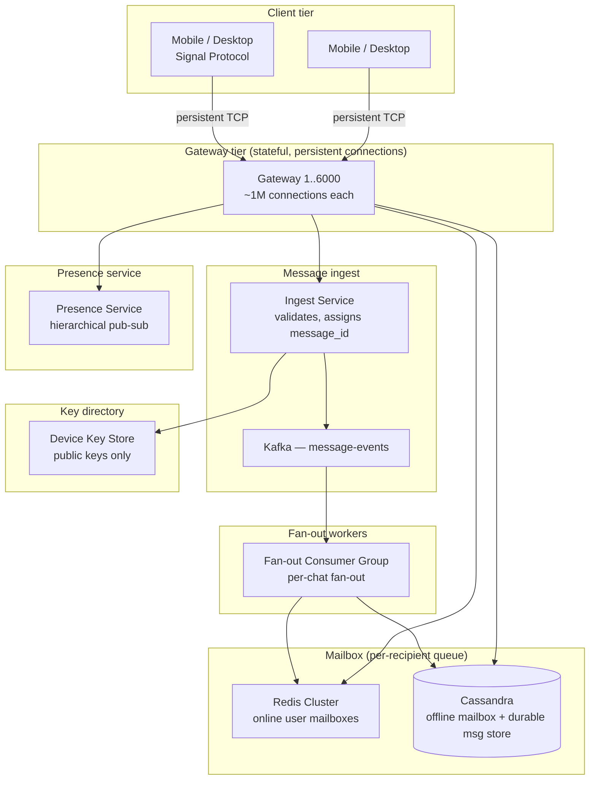

### Deep dive 1 — Message ordering across multiple senders to the same recipient

#### 1. Why does this mechanism exist?

A recipient's mailbox receives messages from multiple senders (1-to-1 chats, group chats). The client must display messages in a **per-conversation total order** that all participants agree on. If Alice and Bob both send messages to Charlie's group chat simultaneously, Charlie must see them in a consistent order — and so must every other group member.

The naive approach — let each sender assign their own sequence number — fails because:
- Alice sends msg A with seq=1; Bob sends msg B with seq=1 (in parallel).
- Charlie receives A then B → sees order [A, B].
- Diana receives B then A → sees order [B, A].
- **Divergence.** Group chat is broken.

The fix: **server-assigned monotonic message IDs per chat.** The server serializes all writes to a chat, assigning IDs from a per-chat counter. All recipients see the same order because the server is the single writer per chat.

#### 2. Concrete walk-through

```
Actors:
  Group chat G = {Alice, Bob, Charlie, Diana}
  Server assigns message_ids per chat: G.counter starts at 0.

t=0   Alice sends msg A to G.
      Gateway → Ingest service:
        1. Acquire per-chat lock (or use CAS on G.counter).
        2. G.counter++ → message_id = 1.
        3. Persist (chat_id=G, message_id=1, sender=Alice, payload=encrypted_A).
        4. Fan-out to mailbox of Bob, Charlie, Diana.
      All recipients see message_id=1 as the first message.

t=0.001  Bob sends msg B to G (concurrent with Alice's send).
         Gateway → Ingest:
           1. Acquire per-chat lock (blocks until Alice's write completes, ~5 ms).
           2. G.counter++ → message_id = 2.
           3. Persist (chat_id=G, message_id=2, sender=Bob, payload=encrypted_B).
           4. Fan-out.
         All recipients see message_id=2 after message_id=1.

t=1   Charlie opens app → SYNC_REQUEST(chat_id=G, after_message_id=0).
      Server: SELECT * FROM messages WHERE chat_id=G AND message_id > 0 ORDER BY message_id ASC.
      Returns: [msg_id=1 (Alice), msg_id=2 (Bob)].
      Charlie displays in order: Alice, then Bob.

t=2   Diana (who was offline) reconnects → SYNC_REQUEST(chat_id=G, after_message_id=0).
      Same query → same order: Alice, then Bob.
      No divergence.
```

**Per-chat serialization:** The Ingest service uses a **per-chat partition** in Kafka (partition key = chat_id). Kafka guarantees that messages within a partition are processed in order by a single consumer. The fan-out consumer for partition P assigns message_ids sequentially. This eliminates the need for distributed locks — Kafka's partition-level ordering is the serialization mechanism.

**Alternative: Cassandra lightweight transactions (LWT).** If not using Kafka, use `UPDATE chats SET counter = counter + 1 IF counter = <expected>` (Paxos under the hood). Latency: ~10 ms per LWT. At 3.5M msgs/s, this is 3.5M Paxos rounds/s — expensive but feasible with a dedicated Cassandra cluster.

#### 3. Trade-off table

| Property | Client-assigned sequence | Server-assigned (Kafka partition) | Server-assigned (Cassandra LWT) |
|---|---|---|---|
| Ordering guarantee | None (divergence across recipients) | Total order per chat | Total order per chat |
| Write latency | 0 ms (no coordination) | ~5 ms (Kafka produce + consumer) | ~10 ms (Paxos round) |
| Throughput | Unlimited | 3.5M msgs/s (Kafka partition count) | 500k msgs/s (Cassandra LWT bottleneck) |
| Failure mode | Divergent views | Kafka partition leader fail → brief stall | Cassandra partition leader fail → brief stall |
| Multi-device sender | Client must dedup | Server dedup via idempotency key | Server dedup via idempotency key |

#### 4. Failure modes interviewers drill into

- **Kafka partition leader failover:** Leader for chat_id=G crashes → new leader elected (5-10 s). During this window, messages to chat G are queued at the gateway. Sender sees "sending..." for up to 10 s. Mitigation: gateways buffer sends for 10 s; if partition not back, return error to sender.
- **Duplicate message_id assignment:** Two Ingest nodes somehow assign message_id=5 to two different messages in the same chat. Detection: recipient sees duplicate message_id → client dedup by (chat_id, message_id). Mitigation: Kafka partition ensures single writer; if using Cassandra LWT, the CAS ensures uniqueness.
- **Out-of-order delivery to recipient:** Gateway pushes message_id=2 before message_id=1 (network reorder). Client buffers: if received message_id > expected_next, hold in a reordering buffer; when message_id=1 arrives, flush buffer. Timeout: 2 s → if message_id=1 doesn't arrive, request SYNC.

#### 5. First-principles derivation

1. Requirement: per-conversation total order, agreed upon by all participants.
2. Total order requires a single writer per chat (or a consensus protocol among writers).
3. Single writer = server. Clients cannot self-order because they don't see each other's sends in real time.
4. Server must assign IDs from a monotonic counter per chat.
5. Implementation options: (a) Kafka partition (single consumer per partition → implicit serialization), (b) Cassandra LWT (explicit Paxos), (c) dedicated sequencer service (single node per chat → SPOF).
6. (a) Kafka: natural fit, partition by chat_id, consumer assigns IDs. Throughput limited by partition count (e.g., 10k partitions → 10k chats serialized independently).
7. (b) Cassandra LWT: works but 3× latency; use only if Kafka not available.
8. (c) Dedicated sequencer: simple but SPOF per chat; not used in production.
9. WhatsApp uses a Kafka-like log (reportedly a custom system called "Mango" for message ordering, later migrated to a Kafka-inspired system).

#### 6. Production evidence

- **WhatsApp (2016, Erlang-based):** Used a custom message store with per-chat monotonic IDs. Server assigned IDs; clients never reordered. Reported in WhatsApp engineering blog.
- **Facebook Messenger:** Uses a central message sequencer (TAO-based) that assigns monotonic IDs per thread. Server is the single writer.
- **Signal:** Server assigns message IDs; clients display in server-assigned order. Signal's server is a single-region PostgreSQL cluster with per-thread sequence numbers.

---

### Deep dive 2 — Connection management at 2B concurrent persistent connections

#### 1. Why does this mechanism exist?

WhatsApp has 2B users × 1.5 devices avg = 3B concurrent persistent TCP connections. Each connection must:
- Stay open for hours/days (mobile clients reconnect infrequently).
- Receive push messages in real time (no polling).
- Consume minimal server memory (can't afford 1 MB per connection → 3 PB RAM).

The design question: how to multiplex 3B long-lived connections across a fleet of gateway servers, tolerate gateway failures without dropping messages, and handle mobile network churn (clients go offline/online frequently)?

Options:
- **HTTP polling:** Client polls every 5 s → 3B × 12 polls/min = 36B requests/min → impossible.
- **WebSocket per connection:** Standard, but 3B WebSocket connections at ~10 KB/socket overhead = 30 TB RAM → too much.
- **Erlang/Go with epoll/kqueue:** Lightweight processes (Erlang) or goroutines (Go) per connection; ~2-5 KB per connection → 6-15 TB RAM → feasible with 6000 servers × 256 GB = 1.5 PB.

The answer: **stateful gateway servers, each handling ~1M connections, using an event-driven concurrency model (Erlang BEAM VM or Go netpoll).**

#### 2. Concrete walk-through

```
Gateway server (Go, epoll-based):
  - 64-core machine, 256 GB RAM.
  - 1M persistent TCP connections.
  - Per-connection state: 2 KB (socket buffer + user_id + device_id + last_seen).
  - Total memory: 1M × 2 KB = 2 GB (plus Go runtime overhead → ~10 GB).

Connection lifecycle:
  t=0   Mobile client opens TCP connection to gateway G1.
        TLS handshake (1 RTT, ~50 ms).
        Noise handshake (1 RTT, ~50 ms) → mutual authentication, session key established.
        Client sends HELLO { user_id, device_id, auth_token }.
        G1 validates token, registers connection in local map: conn_map[user_id:device_id] = conn.
        G1 sends HELLO_ACK { session_token, pending_count }.

  t=1   Message arrives for user U from fan-out service.
        Fan-out → G1 (via internal RPC or Kafka): { user_id, device_id, encrypted_payload }.
        G1 looks up conn_map[U:device_id] → finds connection.
        G1 writes MSG_RECV frame to socket → client receives in ~1 ms.

  t=2   Mobile goes offline (network switch, airplane mode).
        TCP connection times out (keepalive failure after 60 s).
        G1 removes conn_map[U:device_id].
        Subsequent messages for U → fan-out writes to Cassandra mailbox (offline path).

  t=3   Mobile reconnects (network back).
        Client opens new connection to gateway G2 (load balancer may route to different server).
        Client sends HELLO → G2 registers connection.
        Client sends SYNC_REQUEST → G2 fetches pending messages from Cassandra mailbox.
        G2 pushes pending messages → client ACKs each → G2 marks delivered.

Gateway failure:
  t=4   Gateway G1 crashes (OOM, network partition).
        1M connections drop simultaneously.
        Clients detect (TCP timeout, ~60 s) → reconnect to other gateways.
        Messages in-flight (not yet ACKed) → fan-out retries delivery.
        No message loss: server persists before ACKing to sender.
```

**Connection migration:** When a client reconnects to a different gateway, the new gateway must know the client's pending messages. Solution: **mailbox is the source of truth, not the gateway's in-memory state.** Gateway is stateless w.r.t. message content; it only holds the TCP socket. On reconnect, client SYNCs from the mailbox.

**Load balancing connections:** 3B connections across 6000 gateways → 500k connections per gateway avg. But gateways have different capacities (some older machines). Use **weighted round-robin** at the LB: newer machines get more connections. Monitor per-gateway connection count; alert if > 1.2M.

#### 3. Trade-off table

| Property | HTTP polling | WebSocket (Node.js) | Erlang/Go gateway |
|---|---|---|---|
| Connections per server | N/A (stateless) | ~50k (event loop limit) | ~1M (epoll + lightweight processes) |
| Memory per connection | 0 (stateless) | ~50 KB | ~2-5 KB |
| Push latency | 5 s (poll interval) | ~1 ms | ~1 ms |
| Failure mode | Server crash → no state lost | Server crash → 50k reconnects | Server crash → 1M reconnects |
| Mobile churn handling | Poor (polling wastes battery) | Good (persistent) | Good (persistent) |
| Op complexity | Low | Medium | High (Erlang VM tuning or Go netpoll) |

#### 4. Failure modes interviewers drill into

- **Gateway OOM:** Connection count grows beyond capacity → OOM kill → 1M connections drop. Detection: per-gateway connection count > 1.1M. Mitigation: LB stops routing new connections to that gateway; existing connections drain; auto-restart.
- **Mobile network churn:** Client switches WiFi → cellular → IP changes → TCP breaks → reconnect. At 2B users, ~10% reconnect per minute = 200M reconnects/min = 3.3M reconnects/s. Gateways must handle 3.3M HELLO/s. Mitigation: HELLO validation is fast (token lookup in Redis, ~1 ms); batch HELLO_ACK if multiple devices reconnect simultaneously.
- **Fan-out to offline gateway:** Fan-out service tries to push to gateway G1, but G1 is down. Fan-out detects (RPC timeout) → writes to Cassandra mailbox instead. When client reconnects to G2, G2 serves from mailbox. No message loss.

#### 5. First-principles derivation

1. Requirement: 3B persistent connections, push-based, low memory per connection.
2. HTTP polling: 3B × 12 polls/min = 36B requests/min → impossible. Rejected.
3. WebSocket (Node.js): single-threaded event loop, ~50k connections per server (libuv limit). Need 60k servers → too many. Rejected.
4. Erlang BEAM VM: lightweight processes (2 KB each), message-passing, fault-tolerant. 1M connections per server → 3000 servers. WhatsApp's original choice (2012-2016).
5. Go netpoll: goroutines (2 KB stack), epoll-based netpoller. Similar density to Erlang. WhatsApp migrated to a Go-based system (reportedly) around 2016-2018 for operational simplicity.
6. Key insight: **gateway is stateless w.r.t. message content.** Mailbox (Redis + Cassandra) is the durable queue. Gateway only holds TCP sockets. This allows gateway failures without message loss.
7. Connection migration: client reconnects to any gateway → SYNC from mailbox. No need to route client to the same gateway.
8. Load balancing: weighted round-robin at LB; monitor per-gateway connection count; shed load by rejecting new connections if > 1.2M.

#### 6. Production evidence

- **WhatsApp (2012, Erlang):** Reported 1M connections per Erlang node, 2000+ nodes handling 2B connections. BEAM VM's lightweight processes and message-passing model enabled this density.
- **Discord (2020, Elixir/Erlang):** Migrated from Go to Elixir for gateway tier; reported 5M concurrent WebSocket connections on 100+ Elixir nodes (~50k per node, lower density than WhatsApp due to richer per-connection state).
- **Telegram (2021, custom C++):** Custom event-driven gateway in C++; reported 1B+ concurrent connections. Used epoll + custom memory allocator to minimize per-connection overhead.

### Failure table

| Failure | Impact | Detection | Mitigation |
|---|---|---|---|
| Gateway crash (1M connections drop) | Clients reconnect over 60 s; messages in-flight buffered at fan-out | Per-gateway connection count drops to 0 | LB sheds load; auto-restart; fan-out retries |
| Cassandra write latency spike | Message persist slow → sender sees "sending..." > 5 s | p99 latency alert | Circuit breaker → queue at Kafka; degrade to async ACK |
| Redis mailbox partition | Online users can't receive push → fall back to Cassandra mailbox | Cache-hit-ratio drop | Serve from Cassandra; accept 10× latency |
| Fan-out Kafka consumer lag | Mailbox updates delayed → recipients see messages late | Consumer-lag metric > 100k | Auto-scale fan-out workers; shed low-priority (group > 500 members) |
| Key store unavailable | Can't fetch recipient's public key → can't encrypt → message stuck | Error rate > 0.1% | Serve from read-replica; cache keys at gateway |
| Mobile network churn (3.3M reconnects/s) | Gateway HELLO validation overload | HELLO latency p99 > 50 ms | Batch HELLO_ACK; rate-limit reconnects per user (1/s) |
| Group fan-out storm (1024 members) | Single message → 1024 mailbox writes → fan-out worker slow | Per-group fan-out latency > 1 s | Async fan-out; sender ACKed immediately; recipients see "sending..." |

### Observability

- **Golden signals per tier:** latency histogram (gateway, fan-out, Cassandra, Redis), error rate, saturation (CPU, connections, consumer lag).
- **Business metrics:** messages/min, delivery latency p50/p95/p99, connection count per gateway, mailbox depth (undelivered messages per user), presence update rate.
- **Request-id tracing:** every message gets a message_id; trace from sender → gateway → fan-out → recipient's mailbox → recipient's gateway → recipient's device. Sample 1% of messages in Datadog.
- **Connection health:** per-gateway connection count, reconnect rate, HELLO latency; alert if reconnect rate > 5%/min.

### Evolution path

| Day | Scale | Change |
|---|---|---|
| 30 | 1M users, 10k msgs/s | Single-region, Erlang gateway, MySQL for messages, no group fan-out |
| 100 | 100M users, 1M msgs/s | Add Kafka for fan-out; Cassandra for messages; Redis for online mailbox |
| 1000 | 1B users, 3.5M msgs/s | Multi-region active-active; per-region gateway clusters; hierarchical presence |
| 10000 | 2B users, 10M msgs/s | Edge gateways (CDN POPs); E2E encryption with post-quantum key exchange; AI-based spam detection |

### Interview follow-ups

1. How do you guarantee in-order delivery when client reconnects after going offline?
2. How does end-to-end encryption interact with group chat membership changes?
3. How do you handle a group chat with 1024 active members typing simultaneously?
4. What happens when the same message is sent twice (duplicate at gateway)?
5. How do you support multi-device (phone + desktop) without duplicating messages?
6. How do you detect and prevent spam/abuse at 100B messages/day?

### Sources

- Discord — how we store billions of messages (Cassandra/ScyllaDB tradeoffs, partition key design for messages)
- DDIA Ch.11 — stream processing (message ordering guarantees, stream-table duality)
- WhatsApp — million connections per server (Erlang) (BEAM VM concurrency model, TCP connection density)

---

## [2026-08-03] H02 · Twitter Home Timeline

### Problem as asked

> Design Twitter's home timeline. A user logs in and sees a feed of tweets from people they follow, ranked by recency. 500M users, average 200 follows, 1B tweets/day, p99 timeline load under 200ms.

### Clarifying questions

| # | Question | Assumed answer |
|---|---|---|
| 1 | Fan-out model? | Hybrid — push for normal users, pull for celebrities (see deep dive 1) |
| 2 | Timeline depth? | 800 tweets per user materialized; older tweets fetched on scroll via pagination |
| 3 | Media attachments? | Tweets can contain images/video; media served from separate CDN, not in timeline payload |
| 4 | Ranking? | Recency-only per prompt; in production, relevance ranking layer sits on top — out of scope here |
| 5 | Promoted tweets? | Yes, interleaved; separate ad-serving path, not on the critical read path |
| 6 | Read-after-write consistency? | Author posts → author sees own tweet immediately; followers see within fan-out latency (seconds) |
| 7 | Delete / edit? | Delete propagates as a tombstone; edit not supported (Twitter semantics at time of prompt) |
| 8 | Follow graph size? | 500M users × 200 follows avg = 100B follow edges; stored in a dedicated graph service |
| 9 | Celebrity threshold? | Followers > 5000 → pull-on-read path (configurable) |

### Back-of-envelope estimates

```
Users:          500M
Tweets:         1B / day ≈ 11,600 /s avg; peak 3× → ~35,000 /s
Follow graph:   500M × 200 = 100B edges (directed)
Timeline reads: assume each user opens app 5×/day → 2.5B timeline loads/day
                ≈ 29,000 /s avg; peak 3× → ~87,000 /s

Fan-out write amplification (push path, normal users):
  Assume 95% of users are "normal" (followers < 5000, avg ~200 followers)
  950M tweets/day × avg 200 followers = 190B fan-out writes/day ≈ 2.2M /s
  This is the dominant write load — 60× the tweet-ingest rate.

Fan-out read amplification (pull path, celebrities):
  Assume 5% of tweets are from celebrities (50M tweets/day)
  Celebrity tweets NOT pre-fanned-out; read path fetches followed-celebrity IDs
  + merges with pushed timeline at read time.

Storage growth:
  Per-user materialized timeline: 800 tweets × ~200 bytes/tweet-ID = 160 KB
  500M users × 160 KB = 80 TB — too large to hold all in RAM.
  Solution: hold hot 800 IDs per user in Redis (or similar); cold pages in Cassandra/DynamoDB.
  500M users × 160 KB = 80 TB total; Redis cluster for hot 10% = 8 TB (feasible).

Read path per request:
  1. Fetch user's 800-tweet ID list from Redis: 1 RTT, ~1 ms
  2. Hydrate tweet objects (batch GET from cache/DB): 1 RTT, ~10-50 ms
  3. Merge with pull-path celebrity tweets: ~5 ms
  4. Interleave promoted tweets: ~5 ms
  Total: ~30-70 ms, well under 200 ms p99.

Write path per tweet (normal user):
  1. Persist tweet to tweet-store: ~5 ms
  2. Fan-out to 200 followers' timeline lists (batched): ~10-50 ms
  Total: ~20-60 ms per tweet; async, not on user's POST response.
```

### Functional requirements

- `POST /tweets` — author creates a tweet (text + optional media refs). Returns tweet ID.
- `GET /home?cursor=<opaque>` — returns up to 100 tweets from followed accounts, recency-ranked, paginated.
- `GET /home/updates?since_id=<id>` — poll or long-poll for new tweets since last seen.
- `DELETE /tweets/:id` — soft-delete; tombstone propagated to timelines.
- Follow/unfollow APIs (separate service; this system consumes the follow graph).

### Non-functional requirements

| Requirement | Target | Mechanism |
|---|---|---|
| Timeline load p99 | < 200 ms | Pre-materialized per-user list in Redis; batched hydration |
| Tweet visibility (follower) | < 5 s from author POST | Async fan-out via Kafka; push to follower timeline lists |
| Availability | 99.99% | Multi-AZ Redis + Cassandra; read replicas; CDN for media |
| Write throughput | 35k tweets/s peak | Async fan-out; batched timeline-list updates |
| Read throughput | 87k timeline loads/s peak | Redis-served timeline lists; stateless API tier |
| Fan-out write amplification | 2.2M timeline-list writes/s | Batched multi-destination writes; sharded by follower ID |

### API contract

```
POST /v1/tweets
Request:
  { "text": "...", "media_ids": ["m1","m2"]?, "reply_to_tweet_id": null? }
  Authorization: Bearer <user-token>
Response (201):
  { "tweet_id": "1837....", "created_at": "...", "author_id": "u42" }

GET /v1/home?count=100&cursor=<opaque>
Response (200):
  {
    "tweets": [ { "tweet_id": "...", "author_id": "...", "text": "...", "created_at": "...", "media": [...] }, ... ],
    "next_cursor": "...",
    "promotedInterstitials": [ ... ]
  }
  Headers: X-Poll-Interval: 30 (for mobile clients)

DELETE /v1/tweets/:id
Response (200): { "deleted": true }
```

### Data model

```
┌──────────────────────────────────────────────────────────────┐
│ Table: tweets                                                │
├──────────────────┬───────────────────────────────────────────┤
│ tweet_id (PK)    │ BIGINT  (Snowflake-style, time-sortable)  │
│ author_id        │ BIGINT                                    │
│ text             │ VARCHAR(280)                              │
│ media_ids        │ LIST<BIGINT>                              │
│ created_at       │ TIMESTAMP  (derived from tweet_id)        │
│ reply_to         │ BIGINT NULLABLE                           │
│ tombstone        │ BOOLEAN  (soft delete)                    │
└──────────────────┴───────────────────────────────────────────┘
Partition key: tweet_id (range-partitioned by time)
Clustering: none needed; tweet_id is already time-ordered.

┌──────────────────────────────────────────────────────────────┐
│ Table: timeline_lists  (per-user materialized feed)          │
├──────────────────┬───────────────────────────────────────────┤
│ user_id (PK)     │ BIGINT                                    │
│ tweet_ids        │ LIST<BIGINT>  max 800, newest-first       │
│ updated_at       │ TIMESTAMP                                 │
└──────────────────┴───────────────────────────────────────────┘
Storage: Redis (hot) + Cassandra (cold/warm).
Redis key: "tl:<user_id>" → sorted set, score = tweet_id (time-ordered).
Capacity: 800 entries × ~16 bytes/entry = ~12.8 KB per user.

┌──────────────────────────────────────────────────────────────┐
│ Table: follow_graph                                          │
├──────────────────┬───────────────────────────────────────────┤
│ follower_id (PK) │ BIGINT                                    │
│ following_ids    │ SET<BIGINT>  (or separate edge table)     │
└──────────────────┴───────────────────────────────────────────┘
Alternative: edge table (follower_id, following_id) for scalable writes.
For fan-out, we need "given author_id, who follows them?" → reverse index:
  following_id (PK) → SET<follower_id>  (the "fans" set)
```

### Request-path layering (timeline load)

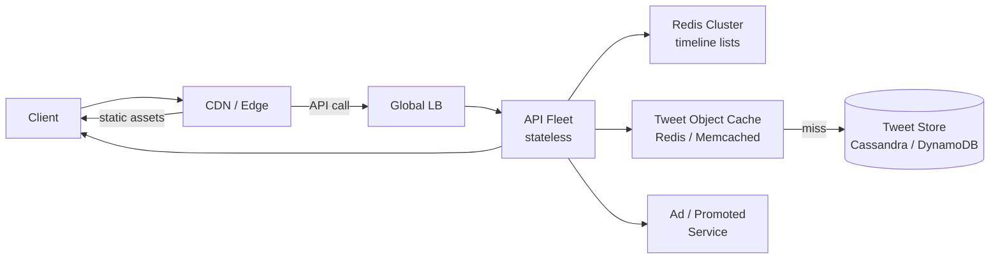

### Architecture diagram

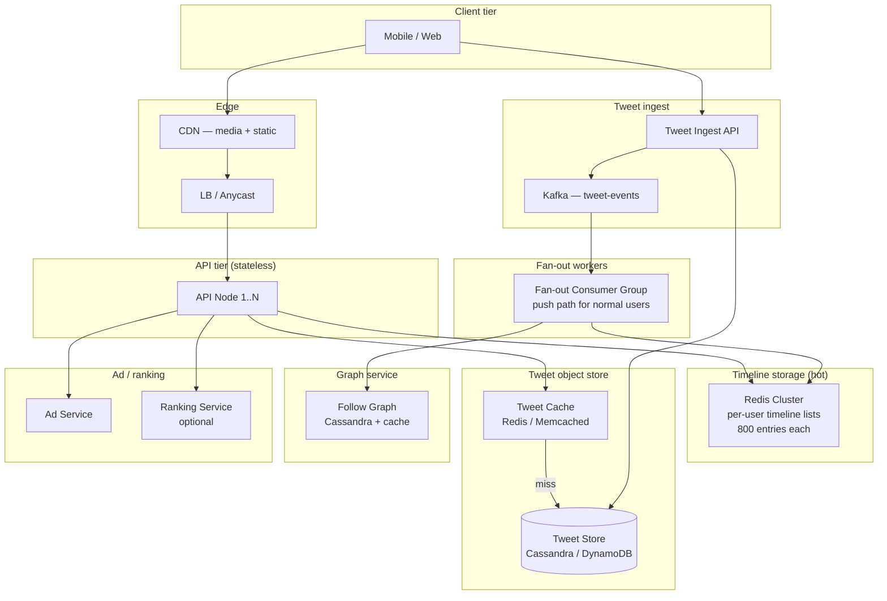

### Deep dive 1 — Fan-out on write vs fan-out on read (the hybrid)

#### 1. Why does this mechanism exist?

The timeline is a **materialized view** of the join `tweets ⋈ follow_graph`, filtered to `author_id IN (user's followees)`, sorted by `created_at DESC`. The question is *when* to compute that join:

- **Fan-out on write (push):** When Alice posts a tweet, immediately append the tweet ID to every follower's timeline list. Read path is O(1) — just fetch the pre-computed list.
- **Fan-out on read (pull):** When Alice opens her timeline, query "all tweets from everyone I follow" at read time. Write path is O(1) — just persist the tweet.

Neither is correct alone at Twitter scale. The trade-off is a function of **follower count**:

| Follower count | Push cost per tweet | Pull cost per read |
|---|---|---|
| 50 (normal) | 50 timeline-list appends | Scan 200 followees' tweet streams, merge |
| 5,000 (micro-celebrity) | 5,000 appends | Scan 200 followees — still OK |
| 10M (celebrity) | 10M appends — **catastrophic** | Scan 200 followees, one of which is the celebrity → pull their tweet stream directly |

At 10M followers, push writes 10M timeline-list entries per tweet. At 35k tweets/s peak, if even 1% are from celebrities, that's 350 × 10M = 3.5B writes/s — impossible. Pull avoids this but makes reads expensive for users who follow many celebrities.

#### 2. Concrete walk-through

```
Actors:
  Alice (normal user, 200 followers)
  Barack (celebrity, 100M followers, threshold = 5000)
  Charlie (follows both Alice and Barack, 200 total followees)

t=0  Alice posts tweet A1.
     Fan-out worker: fetch Alice's 200 followers from graph service.
     Batch-append A1 to 200 Redis sorted sets (tl:<follower_id>).
     Cost: 200 Redis ZADDs, ~10 ms total. Done.

t=1  Barack posts tweet B1.
     Fan-out worker: sees Barack.follower_count = 100M > 5000 → SKIP push.
     Instead: write B1 to tweet store only. Tag as "celebrity tweet, not pushed."
     Cost: 1 write. Done.

t=2  Charlie opens app → GET /home.
     API node:
       1. Fetch tl:charlie from Redis → [A1, ...other pushed tweets...] (800 entries).
       2. Fetch charlie's follow list → {Alice, Barack, ...198 others...}.
       3. Partition followees: normal={Alice, ...} vs celebrity={Barack, ...}.
       4. For each celebrity followee, fetch their latest N tweets from tweet store
          (or a dedicated "celebrity tweet stream" cache).
       5. Merge the pushed list (step 1) with celebrity tweets (step 4) by tweet_id DESC.
       6. Take top 100, hydrate tweet objects, interleave ads, return.
     Cost: 1 Redis GET + ~5 celebrity-stream fetches + merge = ~30 ms.
```

The **threshold** (5000 followers) is a tunable knob. Twitter's production threshold was reportedly ~5000-10000. Below threshold → push; above → pull.

#### 3. Trade-off table

| Property | Pure push | Pure pull | Hybrid |
|---|---|---|---|
| Write amplification | O(followers) per tweet | O(1) per tweet | O(min(followers, threshold)) per tweet |
| Read latency | O(1) — fetch pre-computed list | O(followees × scan) — merge at read | O(1) + O(celebrity_followees) |
| Freshness (follower sees tweet) | Seconds (fan-out latency) | Immediate (if tweet exists) | Seconds for normal; immediate for celebrity |
| Storage cost | 800 entries × 500M users = 80 TB | Zero (compute on read) | ~80 TB (push path dominates) |
| Failure mode | Fan-out backlog → stale timelines | Read spike → timeout | Celebrity-stream cache miss → degraded |
| Celebrity handling | Collapses at 10M followers | Works fine | Works fine (pull path) |

#### 4. Failure modes interviewers drill into

- **Fan-out backlog:** Kafka consumer lag grows (e.g., Redis slow → consumers back up). Timeline staleness increases. Detection: consumer-lag metric. Mitigation: auto-scale fan-out workers; shed load by skipping push for low-priority tweets (e.g., replies) under extreme lag.
- **Celebrity-stream cache miss:** The dedicated cache for celebrity tweets (separate from per-user timeline lists) goes down. Reads fall back to tweet-store directly → latency jumps from 30 ms to 200 ms. Mitigation: circuit breaker → serve stale celebrity tweets from a secondary cache; or temporarily promote celebrity to push-path (expensive but correct).
- **Follow graph inconsistency:** User follows Barack, but graph service hasn't propagated → Charlie doesn't see Barack's tweets. Detection: user reports "I follow X but don't see their tweets." Mitigation: read-repair on timeline load — if a followed user's recent tweets are missing from timeline, backfill.

#### 5. First-principles derivation

1. Timeline = materialized join of `tweets` and `follow_graph`. Question: when to evaluate the join?
2. Evaluate at write time (push): read is O(1), write is O(followers). Good when followers are few.
3. Evaluate at read time (pull): write is O(1), read is O(followees × scan). Good when followers are many.
4. Follower distribution is a power law: 95% of users have < 5000 followers; 0.01% have > 1M.
5. Pure push: 10M-follower celebrity × 35k tweets/s = 350B writes/s — impossible.
6. Pure pull: user follows 200 people, each with 1000 recent tweets → scan 200k tweets, merge → too slow for 200 ms p99.
7. Hybrid: push for the 95% (bounded write amplification: 200 × 1B = 200B writes/day), pull for the 0.01% (celebrity tweet stream is small and hot → cacheable).
8. The threshold is the crossover point where push cost = pull cost. At 5000 followers, push = 5000 writes; pull = scan 5000 followees' streams (but only 1-2 are celebrities, so pull is cheap). Threshold is tunable.

#### 6. Production evidence

- **Twitter (2012-2014):** Reported hybrid fan-out with a threshold of ~5000 followers. Normal users' tweets pushed to follower timelines; celebrities' tweets pulled at read time from a dedicated cache.
- **LinkedIn feed (2018):** Hybrid push/pull. Push for connections (< 5000); pull for influencers and company pages. Published in LinkedIn engineering blog.
- **Instagram (2016):** Initially pure push; moved to hybrid when celebrity accounts (e.g., Kardashian) caused fan-out storms. Threshold reportedly ~10k followers.

---

### Deep dive 2 — Timeline cache structure (per-user materialized list)

#### 1. Why does this mechanism exist?

Each user's timeline is a **sorted list of tweet IDs** (newest-first, max 800). At 500M users, this is 500M × 12.8 KB = 6.4 TB of materialized state. The design question: where to store it, and how to serve 87k reads/s with p99 < 200 ms?

Options:
- **Compute on every read:** Too slow (see deep dive 1).
- **Store in RDBMS:** Too slow for 87k reads/s; row-scan of 800 IDs per user.
- **Store in Redis sorted set:** O(log N) ZADD for push, O(N) ZRANGE for read. N=800 → fast.
- **Store in Cassandra:** Wide-column, fast reads, but higher latency than Redis.

The answer: **Redis for hot users (top 10-20%), Cassandra for warm/cold users.** The API tier checks Redis first; on miss, loads from Cassandra into Redis (read-through cache).

#### 2. Concrete walk-through

```
Redis key schema:
  tl:<user_id>  →  sorted set
    member: tweet_id (BIGINT)
    score:  tweet_id (same value; time-sortable because Snowflake IDs are monotonic)
    cardinality: max 800

Push path (fan-out worker):
  For each follower_id in batch:
    ZADD tl:<follower_id> <tweet_id> <tweet_id>
    ZREMRANGEBYRANK tl:<follower_id> 0 -(801)  // trim to 800

  Optimization: pipeline 50 ZADDs in one Redis round-trip.
  At 2.2M writes/s, with 50-pipelining → 44k Redis ops/s → ~5-10 Redis nodes.

Read path (API node):
  1. ZREVRANGE tl:<user_id> 0 99  →  top 100 tweet IDs, newest first.
     Latency: ~1 ms (800-entry sorted set, in-memory).
  2. Batch-fetch tweet objects:
     MGET tweet:<id1> tweet:<id2> ... tweet:<id100>
     Latency: ~5-10 ms (100 keys, pipelined).
  3. For any misses in step 2, fetch from Cassandra:
     SELECT * FROM tweets WHERE tweet_id IN (...)
     Latency: ~10-20 ms.
  4. Merge, hydrate, return.
  Total: ~20-40 ms.

Eviction / capacity:
  Redis cluster: 8 TB for hot 10% of users (50M users × 12.8 KB + overhead).
  Cassandra: full 80 TB for all 500M users.
  Redis eviction policy: allkeys-lfu — least-frequently-used evicted first.
  On Redis miss: API loads from Cassandra, writes to Redis with TTL=1h.
```

**Tombstone handling:** When a tweet is deleted, the fan-out worker emits a `DELETE` event. Workers execute `ZREM tl:<follower_id> <tweet_id>` for all followers. For celebrity tweets (pull path), the tweet-store marks `tombstone=true`; the read path filters tombstones during merge.

#### 3. Trade-off table

| Property | Redis-only | Cassandra-only | Redis + Cassandra (hybrid) |
|---|---|---|---|
| Read p99 | 1-5 ms | 10-50 ms | 5-20 ms (Redis hit) / 20-50 ms (Cassandra fallback) |
| Write throughput | 100k ops/s per node | 10k writes/s per node | Redis absorbs hot writes; Cassandra durable |
| Storage cost | $80k/mo (8 TB Redis) | $10k/mo (80 TB Cassandra) | $50k/mo (8 TB Redis + 80 TB Cassandra) |
| Failure mode | Redis down → all reads hit Cassandra | Cassandra slow → p99 blows out | Redis down → degraded to Cassandra (2× latency) |
| Data loss risk | Redis eviction → cold users lose timeline | None (durable) | None (Cassandra is source of truth) |

#### 4. Failure modes interviewers drill into

- **Redis cluster partition:** 50% of timeline lists unreachable. API falls back to Cassandra for those users. Latency jumps from 20 ms to 50 ms. Detection: per-AZ latency spike. Mitigation: circuit breaker → if Redis error rate > 5%, bypass Redis for 60s, serve all from Cassandra.
- **Fan-out worker crash mid-batch:** Some followers' timelines not updated. Detection: user reports "I don't see my friend's tweet." Mitigation: fan-out workers are idempotent (ZADD is idempotent); on restart, re-process from last-committed Kafka offset. For users who missed the push, a background "timeline repair" job periodically checks for missing tweets (expensive, runs at low priority).
- **Cassandra compaction storm:** Large writes (e.g., celebrity tweet fan-out to 10M users) cause compaction lag → read latency spikes. Mitigation: separate Cassandra cluster for timeline lists vs tweet store; tune compaction throughput.

#### 5. First-principles derivation

1. Timeline list = sorted set of tweet IDs, max 800 entries, per user.
2. 500M users × 12.8 KB = 6.4 TB. Redis can hold this, but expensive ($80k/mo).
3. Access distribution: top 10% of users generate 80% of reads (power law).
4. Store hot 10% in Redis (640 GB), cold 90% in Cassandra (5.76 TB).
5. Read path: check Redis → miss → load from Cassandra → populate Redis (read-through).
6. Write path: fan-out workers write to Redis (fast); async replication to Cassandra (durable).
7. On Redis miss (eviction or failure): serve from Cassandra, accept 2× latency.
8. This is the standard **hot-cold tiering** pattern: expensive fast storage for hot data, cheap slow storage for cold data.

#### 6. Production evidence

- **Twitter (2014):** Used Redis for timeline lists (reportedly the largest Redis deployment at the time, ~300+ nodes). Cassandra for tweet storage and durable timeline backup.
- **Instagram (2017):** Redis for feed caching; DynamoDB for durable storage. Reported 100+ TB of Redis across clusters.
- **Facebook (2013):** Memcached for timeline caching (Memcached@FB paper); MySQL for durable storage. Similar tiering pattern.

### Failure table

| Failure | Impact | Detection | Mitigation |
|---|---|---|---|
| Redis cluster partition | 50% of timeline reads fall back to Cassandra (2× latency) | Per-AZ latency spike, cache-hit-ratio drop | Circuit breaker → bypass Redis for 60s; alert on-call |
| Fan-out Kafka consumer lag | Timelines stale by minutes | Consumer-lag metric > 10k | Auto-scale fan-out workers; shed low-priority tweets |
| Cassandra write hotspot | Celebrity tweet writes saturate one partition | Per-node CPU > 80% | Partition by tweet_id hash, not range; pre-split tokens |
| Tweet-store read latency spike | Timeline hydration slow → p99 > 200 ms | p99 latency alert | Serve stale tweet objects from cache; degrade media quality |
| Follow graph inconsistency | User doesn't see tweets from new followee | User reports | Read-repair on timeline load; backfill missing tweets |
| Ad service timeout | Promoted tweets missing | Ad-interleave rate drop | Serve timeline without ads; alert ad team |
| Celebrity-stream cache miss | Celebrity tweets missing from timeline | User reports | Fall back to tweet-store directly; accept 200 ms latency |

### Observability

- **Golden signals per tier:** latency histogram (API, Redis, Cassandra, tweet-store, fan-out workers), error rate, saturation (CPU, connections, consumer lag).
- **Business metrics:** tweets/min, timeline loads/min, fan-out writes/min, cache-hit ratio (Redis must be > 85%), timeline staleness (time since newest tweet vs current time).
- **Request-id tracing:** every timeline load gets an X-Request-ID propagated API → Redis → tweet-store → ad service; trace 1% of requests in Datadog.
- **Fan-out lag:** per-consumer-group lag in Kafka; alert if > 10k messages.

### Evolution path

| Day | Scale | Change |
|---|---|---|
| 30 | 1M users, 1k tweets/s | Single-region, MySQL for tweets + timelines, no fan-out workers (sync) |
| 100 | 10M users, 10k tweets/s | Add Redis for timeline lists; async fan-out via Kafka; Cassandra for tweets |
| 1000 | 100M users, 35k tweets/s | Hybrid fan-out (push/pull); multi-AZ Redis + Cassandra; CDN for media |
| 10000 | 500M users, 100k tweets/s | Multi-region active-active; per-region fan-out workers; ranking layer on top of timeline |

### Interview follow-ups

1. How do you handle a user with 100M followers (Obama)?
2. How do you mix in promoted tweets without blocking the read path?
3. How do you backfill timelines when a user follows someone new?
4. What happens when the same tweet is fan-out twice (duplicate Kafka message)?
5. How do you support "show me tweets from before this cursor" (pagination)?
6. How do you handle a viral tweet that gets 1M likes/min — does the timeline update?

### Sources

- DDIA Ch.1 (Twitter case study) — fan-out write vs read, celebrity problem framing
- Twitter — Manhattan, the real-time storage stack — distributed KV design, denormalization
- LinkedIn — feed mixer architecture — hybrid fan-out (push for normal, pull for celebrities)

---

## [2026-07-31] H01 · URL Shortener

### Problem as asked

> Design a URL shortener like bit.ly. Support 100M new URLs/day, 10B redirects/day, with sub-100ms p99 redirect latency. URLs never expire.

### Clarifying questions

| # | Question | Assumed answer |
|---|---|---|
| 1 | Write vs read ratio? | 100M writes/day, 10B reads/day → 1 : 100, read-dominated |
| 2 | Short-ID length? | 7 chars base62 → 62⁷ ≈ 3.5 × 10¹² namespace, safe for 100M/day × 365 × 100yr ≈ 3.6T |
| 3 | Custom aliases? | Yes, opt-in; collides with counter scheme → separate path |
| 4 | Analytics required? | Click counts, not real-time; eventual OK |
| 5 | URL expiry? | Prompt says never → no TTL, no GC |
| 6 | Read-after-write consistency? | Yes — user shortens, then immediately clicks; must resolve on first hop |
| 7 | Auth model? | Anonymous shortening + optional accounts for analytics dashboard |

### Back-of-envelope estimates

```
Writes:     100M / day ≈ 1,160 /s avg; peak 3× → ~3,500 /s
Reads:      10B  / day ≈ 115,740 /s avg; peak 3× → ~350,000 /s
Value size: ~256 B (short-url metadata + long URL)
Key size:   7 B (base62 short-ID)

Storage growth:
  100M × 256 B/day = 25.6 GB/day
  365 days = 9.3 TB/year
  5-year horizon = 47 TB working set → fits in SSD fleet

Read QPS per node (stateless API, behind LB):
  Target 350k QPS, each node handles ~20k QPS → 18 nodes minimum
  2× headroom → 36 API nodes

Cache hit rate assumption: 80% of reads hit Redis → backend sees 20% of 350k = 70k QPS
KV nodes: 70k QPS / ~10k per node = 7 nodes; with replication (RF=3) → 21 storage nodes
```

### Functional requirements

- `POST /shorten` accepts a long URL, returns a short URL.
- `GET /{short_id}` returns HTTP 301 (permanent) or 302 (temporary) redirect to the long URL.
- Custom alias support (`POST /shorten` with `alias` field).
- Click counting per short URL (eventual).
- Optional account-bound URLs with analytics dashboard.

### Non-functional requirements

| Requirement | Target | Mechanism |
|---|---|---|
| Redirect latency p99 | < 100 ms | CDN edge cache + Redis L2 |
| Availability | 99.99% | Multi-AZ, read replicas, CDN fallback |
| Write throughput | 3,500/s peak | Async write path, batched ID gen |
| Read-after-write | Immediate | Write to leader, replicate synchronously to 1 follower |
| Durability | No lost URLs | RF=3 with sync-quorum (W=2, R=1 for reads) |

### API contract

```
POST /v1/shorten
Request:
  { "long_url": "https://...", "alias": "my-link"?, "ttl_seconds": null }
Response (201):
  { "short_url": "https://sho.rt/abc1234", "short_id": "abc1234", "created_at": "..." }
Errors:
  409 — alias taken
  400 — invalid URL / alias format
  429 — rate limited (per IP or per account)

GET /{short_id}
Response:
  301 Moved Permanently  Location: https://original-long-url/...
  (or 302 for analytics-friendly temporary redirects)
  404 — unknown short_id
```

### Data model

```
┌─────────────────────────────────────────────────────┐
│ Table: urls                                         │
├──────────────────┬──────────────────────────────────┤
│ short_id (PK)    │ CHAR(7)  base62 encoded counter  │
│ long_url         │ VARCHAR(2048)                    │
│ created_at       │ TIMESTAMP                        │
│ owner_id (FK)    │ NULLABLE, anonymous = NULL       │
│ click_count      │ BIGINT, incremented async        │
│ alias            │ UNIQUE INDEX, NULLABLE           │
└──────────────────┴──────────────────────────────────┘

┌─────────────────────────────────────────────────────┐
│ Table: id_counter                                   │
├──────────────────┬──────────────────────────────────┤
│ datacenter_id    │ SMALLINT (0..N)                  │
│ current_counter  │ BIGINT  atomically incremented   │
└──────────────────┴──────────────────────────────────┘
```

### Request-path layering (redirect)

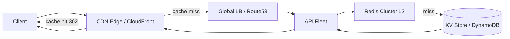

### Architecture diagram

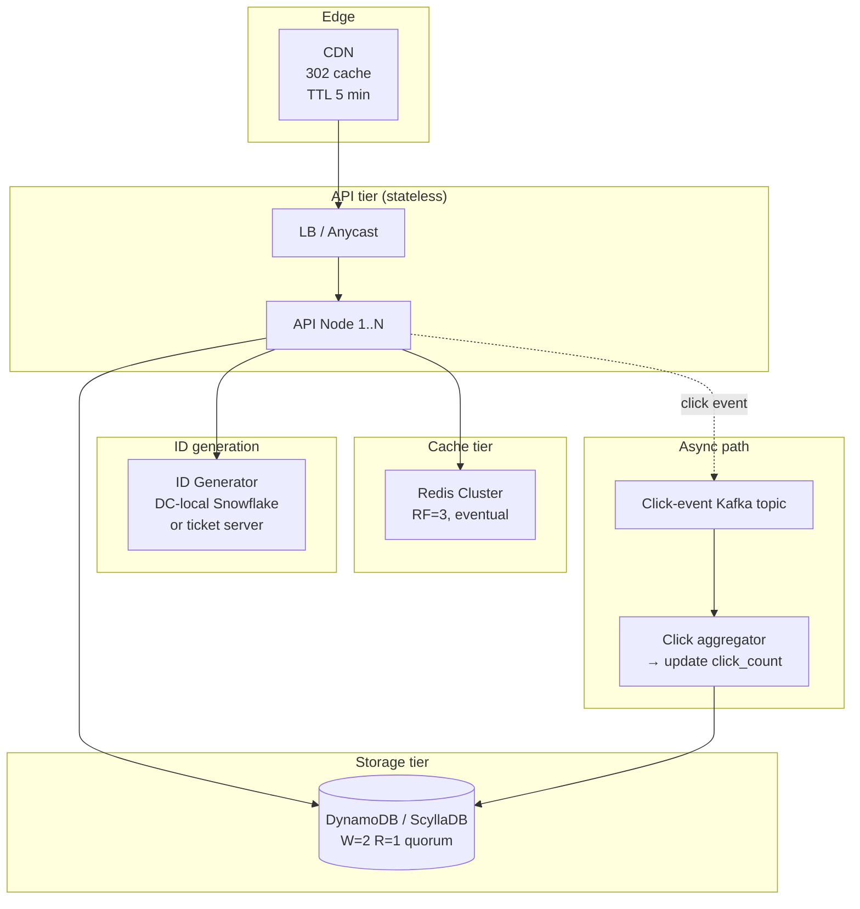

### Deep dive 1 — ID generation strategy

#### 1. Why does this mechanism exist?

Every shortened URL needs a unique, short, stable identifier. The ID must be:
- **Globally unique** — no collisions across datacenters.
- **Compact** — 7 chars base62 for human-shareability.
- **Fast to generate** — no round-trip to a central coordinator on the write path.
- **Monotonic (nice-to-have)** — sequential IDs are cache-friendly for range scans and analytics.

A naive `MD5(long_url)` fails because (a) collisions force retry logic, (b) the same URL shortened twice returns different IDs only by accident (salt), and (c) you lose idempotency — retry of `POST /shorten` with same long URL now creates two entries.

#### 2. Concrete walk-through

**Scheme A — DC-local ticket server (the boring answer):**

```
Datacenter "us-east-1" runs a ticket server with atomic counter.
Each API node needs N IDs → requests a batch [base, base+N) in one RPC.

Timeline:
  t=0  ticket server counter = 10,000,000
  t=1  API-node-A fetches batch [10,000,000 .. 10,000,999]
  t=2  API-node-B fetches batch [10,001,000 .. 10,001,999]
  t=3  API-node-A encodes 10,000,000 → base62 → "bU2nQ0"
  t=3  DC "eu-west-1" runs independent counter starting at 50,000,000
       → its IDs never collide with us-east-1 because counter ranges disjoint
```

The DC offset is statically partitioned: DC-0 gets counter ≡ 0 (mod N_dc), or each DC gets a non-overlapping high-order range (e.g., DC-0 = [0, 10¹²), DC-1 = [10¹², 2×10¹²)).

**Scheme B — Snowflake-style (zero coordination):**

```
64-bit ID layout:
  [ 0 | 41-bit timestamp | 10-bit machine-id | 12-bit sequence ]
       ms since epoch      datacenter+pod     per-ms counter

Decode 10,000,000 → base62 → "bU2nQ0" (truncated to 7 chars, top bits of timestamp)
```

Each machine generates IDs locally; no RPC needed. 41-bit timestamp → 69 years. 12-bit sequence → 4096 IDs/ms per machine → 4M IDs/s, far exceeding 3,500/s peak.

#### 3. Trade-off table

| Property | Ticket server | Snowflake |
|---|---|---|
| Coordination on write | Batch RPC every ~1000 writes | None (local) |
| Collision risk | Zero (server serializes) | Zero (machine-id partitioned) |
| Monotonicity | Strict within DC | Strict within machine |
| ID length | Variable (encode counter) | Fixed 64 bits |
| Failure mode | Ticket server down → batch exhaustion | Clock rollback → duplicate IDs |
| Op complexity | Low (one stateful service) | Medium (machine-id registry) |

#### 4. Failure modes interviewers drill into

- **Ticket server partition:** Batches run out → writes block. Mitigation: each API node holds a batch (e.g., 1000 IDs); can serve writes for ~1 second at 1000 QPS before needing a refill.
- **Snowflake clock drift backwards:** Machine reboots with stale NTP → re-issues same timestamp → duplicate IDs. Mitigation: panic / refuse to generate for 10ms if clock < last-used; or use hybrid logical clocks.
- **Namespace exhaustion:** 62⁷ ≈ 3.5T. At 100M/day, exhausted in ~96 years. Safe. But an attacker could enumerate — mitigate with rate limiting and no directory-listing endpoint.

#### 5. First-principles derivation

1. We need a function `f: write → unique_id`. Deterministic for dedup (same long_url → same id) OR non-deterministic with idempotency key (POST body includes `idempotency_key`).
2. Deterministic `f` = `hash(long_url)` → collisions break uniqueness. Rejected.
3. Non-deterministic: assign monotonically increasing integer per partition. "Partition" can be (a) central server, (b) time-bucketed, or (c) machine-id-bucketed.
4. (a) Central server: single point of failure. Mitigate with batching — one RPC amortizes RTT across K writes.
5. (c) Machine-bucketed (Snowflake): eliminates central server. Cost = clock synchronization; risk = clock rollback creates duplicates.
6. For URL shortener throughput (3,500/s peak), either works. Ticket server is simpler to operate; Snowflake eliminates the last coordination point. Production URL shorteners (bit.ly historical) used ticket servers.

#### 6. Production evidence

- **bit.ly (original):** Used a MySQL-backed atomic counter per shard; base62 encoded the integer. Shard count fixed at deploy time.
- **Twitter t.co:** Uses a variant of Snowflake for tweet IDs; URL resolution is a separate service that maps t.co ID → destination URL.
- **YouTube video IDs:** 11-char base64 from an encoded internal ID that includes machine + timestamp (similar to Snowflake).

---

### Deep dive 2 — Cache topology (CDN edge + Redis L2)

#### 1. Why does this mechanism exist?

10B redirects/day at p99 < 100ms means the hot path cannot hit a backend database on every request. The access distribution is extremely skewed — the top 1% of URLs receive ~50% of traffic (Powerball distribution). A multi-tier cache exploits this skew:
- **CDN edge** (CloudFront, Cloudflare): serves 302 redirects for hot URLs without hitting your infrastructure. TTL = 5 minutes means a viral URL gets ~300k hits served from edge per 5-min window.
- **Redis L2**: catches medium-hot URLs, serves sub-1ms lookups, absorbs thundering-herd spikes on cache miss.

Without a CDN tier, every redirect hits your API fleet; at 350k QPS peak, you need ~100 API nodes. With CDN caching of hot 10%, API fleet drops to ~90 nodes — not a huge win alone. But CDN caching absorbs DDoS and flash-crowd spikes without autoscaling lag.

#### 2. Concrete walk-through

```
t=0    Popular tweet goes viral. Short URL "aB3xK9" → 100k clicks/minute.
t=0    CDN edge has no entry for "aB3xK9" → cache miss → forwards to LB.
t=0+20ms  LB → API node → Redis → hit (or miss → KV). Returns 302. CDN caches 302 with TTL=300s.
t=0+1s to t=0+300s: all requests for "aB3xK9" served from CDN edge. 100k clicks/min × 5 min = 500k CDN-served redirects.
t=5min CDN entry expires → one miss → repopulate → next 5 min same pattern.

KV save rate: 1 request / 5 min instead of 100k / min → 100,000× amplification reduction.
```

**Cache key:** the short_id (7 bytes). **Cache value:** 302 response headers (Location + Cache-Control). CDN stores the raw HTTP response.

**Stampede protection at Redis:** On cache miss, 1000 concurrent requests for the same cold key arrive at Redis. If Redis also misses, all 1000 hit KV. Mitigation: **lease tokens** (à la Facebook Memcached paper).

```
Request arrives at Redis for key K, miss:
  1. Try SET NX "lock:K" with value = random_token, TTL = 10s → success?
  2. If NX succeeded (you hold the lease): fetch from KV, SET K = value, DEL lock:K.
  3. If NX failed (someone else holds lease): sleep 5ms, retry GET K up to 5 times; if still miss, serve stale or fetch directly from KV (graceful degradation).
```

#### 3. Trade-off table

| Property | CDN only | CDN + Redis | Redis only |
|---|---|---|---|
| p99 latency for hot key | 5-20ms | 5-20ms | 1-5ms |
| p99 latency for cold key | 50-200ms (CDN miss → origin) | 50-200ms | 10-30ms |
| KV QPS under viral spike | ~10k/s (CDN absorbs) | ~1k/s (CDN + Redis absorb) | ~1k/s (Redis absorbs) |
| Cost at 10B req/day | CDN $50k/mo (egress) | CDN $30k + Redis $10k | Redis $60k (huge cluster) |
| Flash-crowd resilience | Excellent | Excellent | Moderate (Redis can saturate) |

#### 4. Failure modes interviewers drill into

- **Redis cluster partition:** Half the keys become unreachable. Reads for those keys go to KV directly; latency jumps from 1ms to 10ms. API fleet sees 10× latency spike. Mitigation: circuit breaker → when Redis error rate > 5%, bypass Redis entirely for 60s, serve all from KV with degraded TTL.
- **CDN misconfiguration:** TTL accidentally set to 0 → all 350k QPS hits API. Alert: CDN cache-hit ratio drops below 70%. Runbook: emergency TTL=300 push via CDN API.
- **Stale long URL:** Owner updates long_url (not in scope here since URLs never expire, but analogous for bit.ly paid tier). CDN serves stale 302 for up to 5 min. Mitigation: purge API on update: `PURGE /aB3xK9` invalidates CDN edge; for multi-CDN, use cache tags.

#### 5. First-principles derivation

1. Read load = 10B/day = 115k QPS avg. Skew: top 1% keys take 50% of load.
2. Single KV can serve ~10k-50k QPS (DynamoDB with hot partitions saturates; ScyllaDB with good partition key can do ~100k).
3. Without cache: need KV sized for peak 350k QPS → 7-35 nodes minimum, expensive.
4. With one cache tier (Redis, ~10 nodes): absorbs 80% → KV sees 70k QPS → 1-7 nodes. 10× cost reduction.
5. With CDN: absorbs another 50% of remaining → KV sees 35k QPS. CDN is cheaper per QPS than Redis (edge POPs are distributed, no single hot-key problem).
6. Two tiers are justified when (a) skew is high (Powerball), (b) read:write ratio > 10:1, (c) latency SLO is strict. This workload satisfies all three.

#### 6. Production evidence

- **bit.ly:** Used MySQL backend + Memcached L2. CDN caching handled by upstream DNS providers and browser cache (301 = permanent cache, 302 = not cached without explicit headers).
- **Facebook Memcached (Nishtala 2013):** Regional pools, lease tokens for stampede protection. This architecture is the canonical reference for Redis/Memcached at scale.
- **Netflix EVCache:** Multi-region Memcached with warmup strategies; replication across regions for cold-start avoidance.

### Failure table

| Failure | Impact | Detection | Mitigation |
|---|---|---|---|
| KV leader down (1 AZ) | Writes stall 5-15s until failover | Replica lag alert | Automatic failover to standby; writes queued at API for 10s |
| Redis cluster split-brain | Half of cache unreachable | Cache-hit-ratio drop | Circuit breaker → bypass Redis for 60s |
| CDN origin misroute | All requests hit one AZ | Per-AZ latency spike | DNS-based geo-routing + health-based failover |
| ID generator batch exhaustion | Writes block | Queue depth metric | Pre-fetch larger batch; secondary ticket server on standby |
| Viral URL stampedes KV | KV overload | KV QPS > 2× baseline | Lease tokens at Redis; emergency CDN purge |
| Long-URL DB corruption (bad deploy) | Users get 500 on redirect | Error rate > 0.1% | Rollback + serve from read-replica |

### Observability

- **Golden signals per tier:** latency histogram (CDN, API, Redis, KV), error rate, saturation (CPU, connections, cache eviction rate).
- **Business metrics:** shortens/min, redirects/min, cache-hit ratio (must be > 75% at CDN, > 80% at Redis), 404 rate (unknown short_id).
- **Request-id tracing:** every redirect gets an X-Request-ID propagated CDN → API → Redis → KV; trace 1% of requests in Datadog.

### Evolution path

| Day | Scale | Change |
|---|---|---|
| 30 | 1M URLs, 10k QPS | Single-region, MySQL + Redis, no CDN |
| 100 | 100M URLs, 100k QPS | Add CDN, move to DynamoDB, multi-AZ |
| 1000 | 10B URLs, 350k QPS | Multi-region active-active, per-DC ticket server, click analytics pipeline |
| 10000 | 100B URLs, 3.5M QPS | Edge compute (Cloudflare Workers) for redirect at edge, KV sharded by geo |

### Interview follow-ups

1. Custom aliases — how do you prevent collision while keeping the counter approach?
2. Analytics on clicks — how do you not block the redirect path?
3. Abuse detection — phishing URLs at scale?
4. What happens when the same long URL is shortened twice?
5. Rate limiting — per-IP? per-account? how do you prevent abuse of the shorten endpoint?

### Sources

- DDIA Ch.5 — replication (read-replica scaling, leader-follower)
- Alex Xu Vol.1 Ch.8 (base62 encoding, ID generation strategies)
- bit.ly engineering — original design notes (counter-based ID generation, shard distribution)
